# Project

## 目的

* 独立完成PC端页面布局；
* 熟练使用less预编译语言；
* 熟练使用JQ使用、快速定位查询echarts基本配置；

## 需求及规范

### 功能模块

* 分为三个区域；

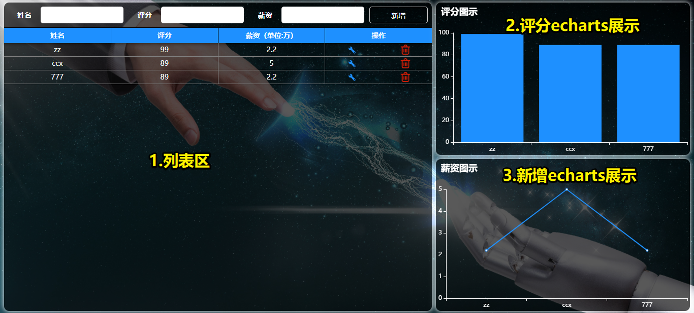

### 业务需求

* 布局：使用less，按照引导最大程度使用flex还原页面布局；
* JS-新增：点击新增按钮，输入为空进行提醒，不能实现新增；

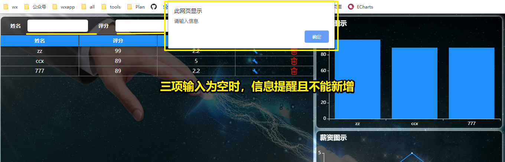

* JS-列表：新增数据显示在第一位；

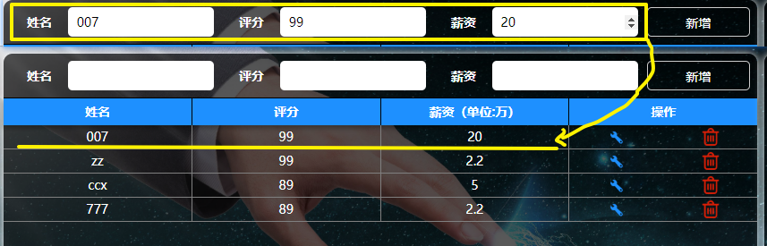

* JS-删除：点击列表中某条数据的删除，删除当前数据；

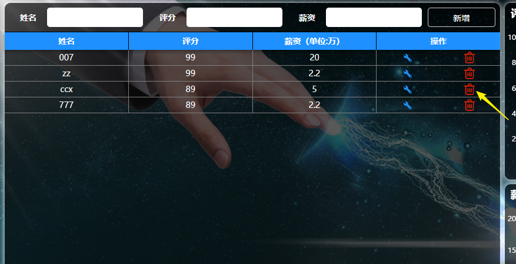

* JS-修改1：点击修改，进入编辑模式，对当前行数据进行修改；

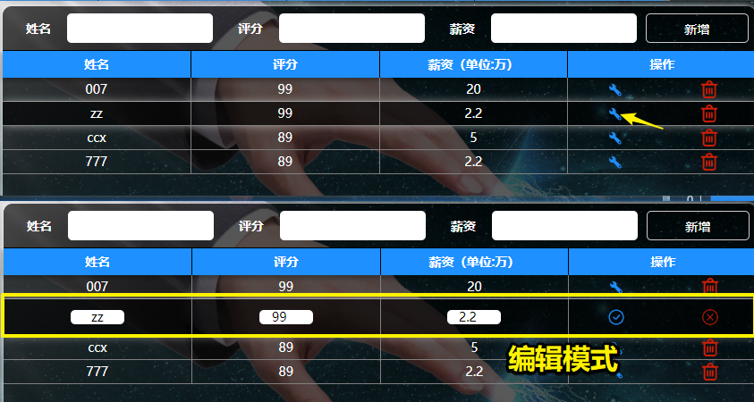

* JS-修改2：修改模式下，不能进行其他属性的操作：新增、删除、修改！（下面图示：编辑第二条数据时，对第四条数据进行删除，不能操作且提醒）

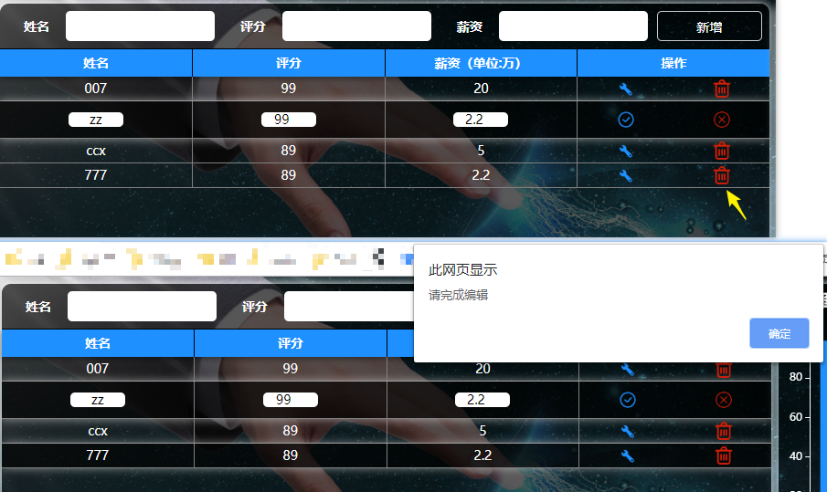

* JS-修改3：修改模式下，对当前数据进行编辑修改，当前3个选项输入有其中一个为空时，点击确定 √ 不能进行提交，且有提醒；

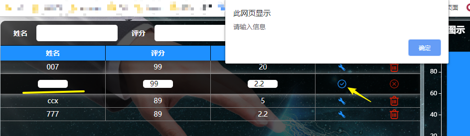

* JS-修改4：修改模式下，对当前数据进行编辑修改，三项数据均由输入且正确，点击确定√，进行数据修改及保存，同时退出编辑模式；

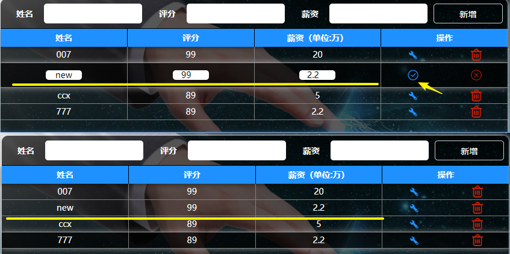

* JS-修改5：修改模式下，对当前数据进行编辑修改，点击取消 ×，同时退出编辑模式；

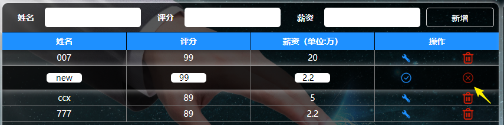

* echarts-评分展示及期望薪资展示：

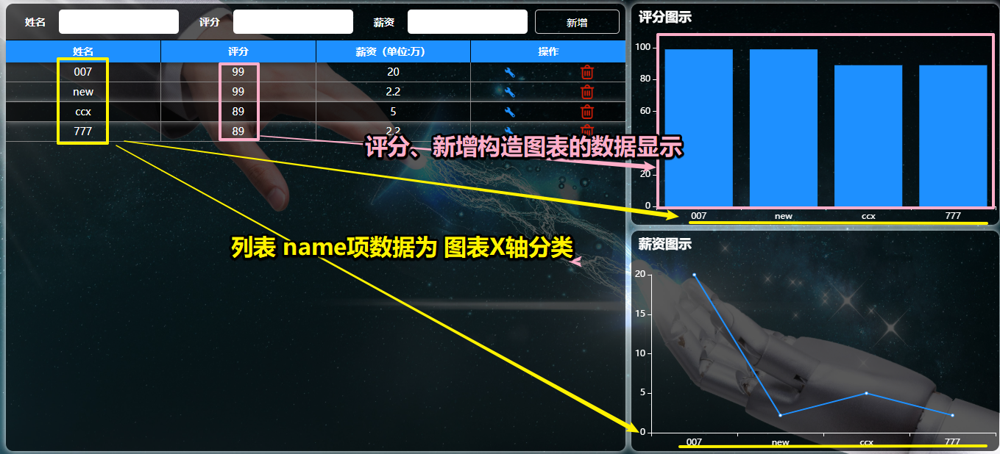

* echarts-随动：左侧列表新增、修改、删除数据后，右侧图表随着变化；

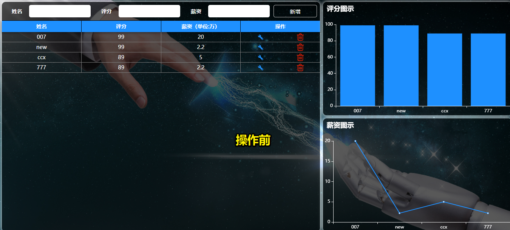

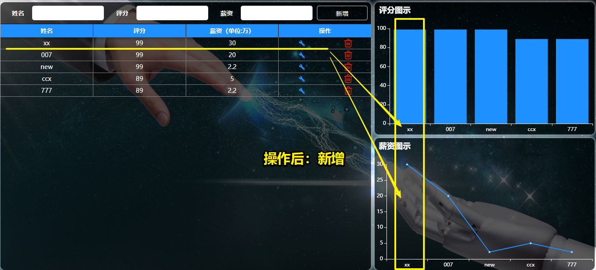

### 布局及技术栈

* 布局：
  * 高度同当前屏幕高度；
  * 最小宽度为1280px;
  * 右侧固定宽度500px，左侧随屏幕可拉伸；
  * 使用less预编译语言写样式；
* JS：
  * 使用JQ进行dom操作；
  * 部分重复代码进行函数封装和配置；

### 目录规范

```css
 project             # 项目目录
    ├── css          # css样式文件夹
    ├── js           # JS文件
    ├── imgs         # 业务图片文件夹
    └── index.html   # 首页
```

### 技术方案参考

#### 布局参考

* 整体布局：
  * 右侧固定宽度500px，左侧随屏幕可拉伸：圣杯布局；
  * 整个页面布局：建议使用flex布局（不考虑PC的兼容性），此次实战没有固定px值测量，大概布局合理就OK；
  * less样式编写：**参考移动端布局less的使用；**

* 修改布局：

  * 涉及到非编辑模式与编辑模式两个状态；建议设置两个状态的类名；默认添加一条数据的**类名**为非编辑模式；点击修改按钮后，**添加准备好的编辑模式的类名**；
  * **非编辑模式DOM结构参考：**

  

  * **编辑模式DOM结构参考：**

    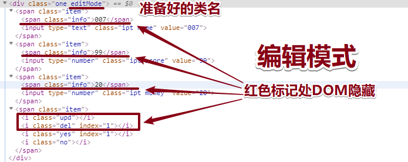

#### JS参考

* 列表：

  * 数据本地化新增、删除功能，**参考JQ阶段的todoLIst案例；**

  * 修改：

    * 点击修改，样式进入修改模式，为给当前点击的父级添加准备好的类名；
    * 修改模式：点击其他数据操作（新增、修改其他、删除其他）不能操作且提醒；可全局设置变量值为false，如点击修改后值变为true，操作其他时判断值为true时，return结束操作且提醒；

    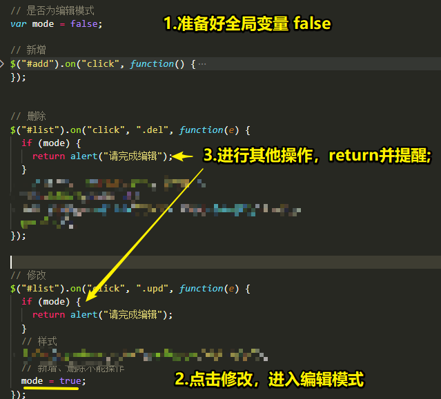

* echarts图表：

  * **配置：参考数据可视化配置学习；**
  * 函数封装说明1：因为右侧图表为柱状图与折线图；可以看到只有数据及表现形式、DOM所在容器不一样，X轴及颜色配置都一样，**所以最好封装为一个函数，也便于和左侧数据联动；**（如下：下图中ecInit为参考函数名，实战时可自己定义）

  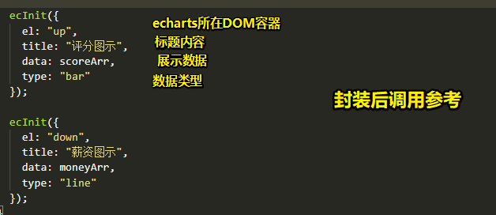

  * 函数封装说明2：其中X轴为公共name数据，从列表寻找中抽取出来，可设置为全局变量；

  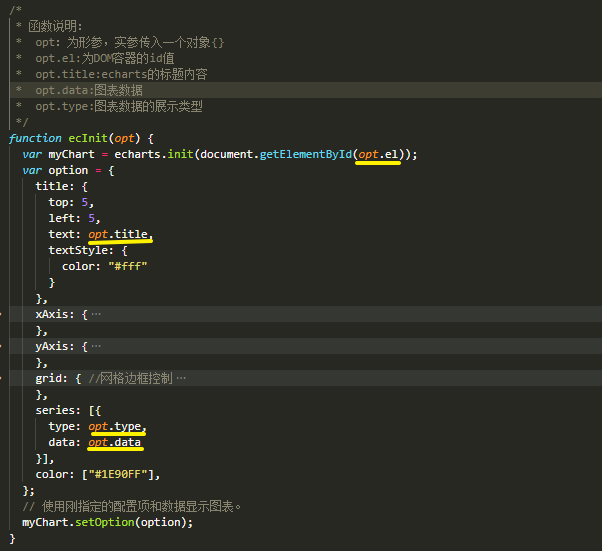


