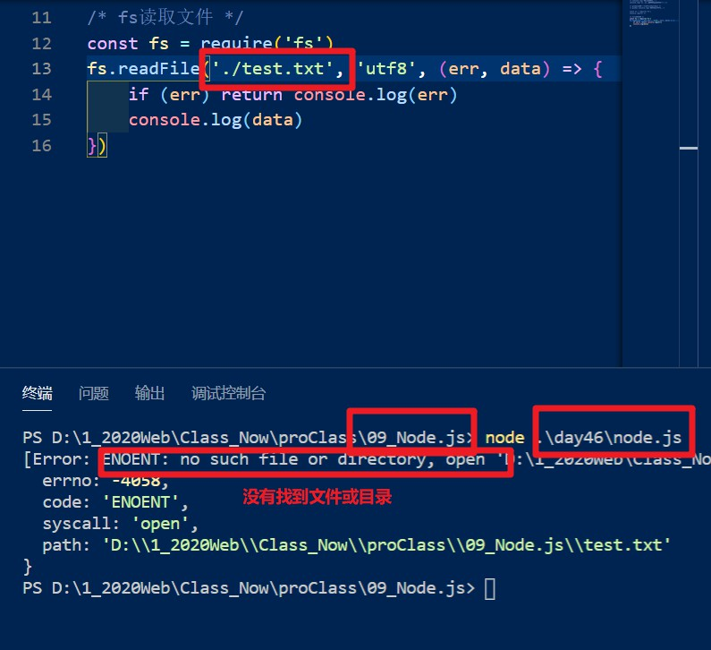
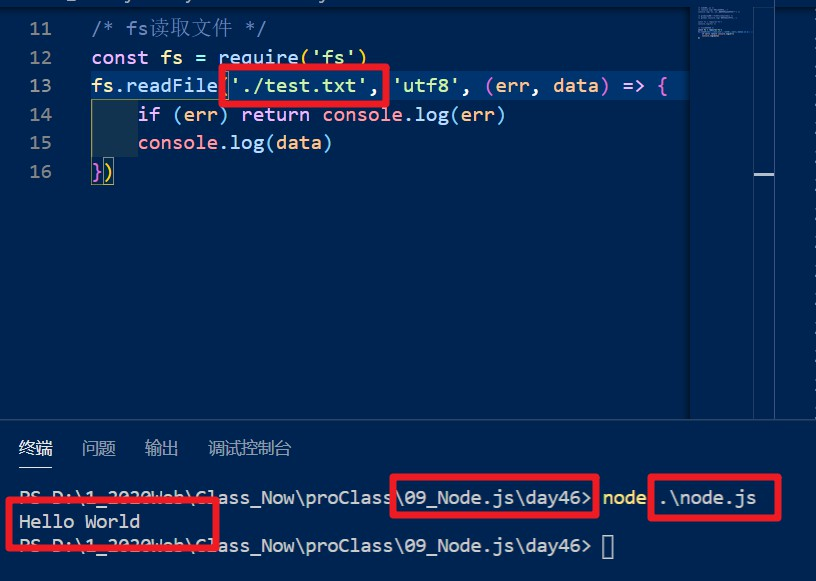

# 1、debugger

> ## `debugger`---在js中实现打断点的功能

# 2、回调函数

> ## A函数的实参是B函数

# 3、闭包

> ## A函数return是B函数

# 4、封装技巧

> ## 1、找到重复代码
>
> ## 2、变化的数据=>形参
>
> ## 3、计算结果考虑外部（调用位置）需要，返回结果

# 5、node运行时的注意点

> ## 读取文件中的相对路径是基于node运行时的路径决定的
>
> - 如图文件路径`.test.txt`时需要当前文件中存在`.test.txt`
> - 即在运行时需要在`day46`文件夹下使用`node`命令才能显示`.test.txt`内容
>
> 
>
> 

