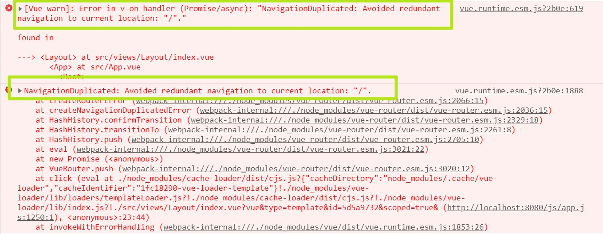

## Promise

### .then 或者 .catch 的参数期望是函数，传入非函数则会发生值穿透

```js
Promise.resolve(1)
  .then(2)
  .then(Promise.resolve(3))
  .then(console.log)
// 运行结果 为 1
```

 ### .then 或 .catch 返回的值不能是 promise 本身，否则会造成死循环

```js
const promise = Promise.resolve()
  .then(() => {
    return promise
  })
promise.catch(console.error)
// TypeError: Chaining cycle detected for promise #<Promise>
```

### promise 每次调用 .then 或者 .catch 都会返回一个新的 promise，从而实现了链式调用

```js
Promise.resolve(1)
  .then((res) => {
    console.log(res)
    return 2
  })
  .catch((err) => {
    return 3
  })
  .then((res) => {
    console.log(res)
  })
/* 
运行结果
   1 
   2 
*/
```

### promise 有 3 种状态：pending、fulfilled 或 rejected。状态改变只能是 pending->fulfilled 或者 pending->rejected，状态一旦改变则不能再变

## vue2项目时路由重复跳转问题



### 类似这种报错说明是路由地址的重复跳转

```js
// 解决办法为在路由模块下增加如下代码
// 重新改写路由对象原型上的push方法
// 上述虽然是爆红但是不影响功能
const originalPush = VueRouter.prototype.push
VueRouter.prototype.push = function push(location) {
  return originalPush.call(this, location).catch(err => err)
}
```

