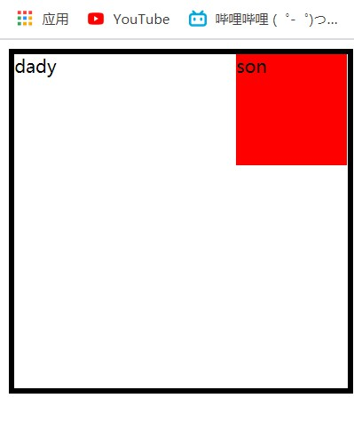
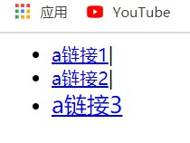
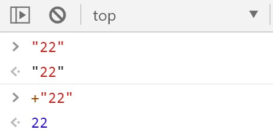

# 写代码中一些需要注意的事情（或者是tips）

## 1.定位时是依据内容（content）移动的（在边框之内）

```html
<html>
<head>
    <style>
        .dady {
            position: relative;
            width: 300px;
            height: 300px;
            border: 5px solid #000;
        }        
        .son {
            position: absolute;
            top: 0;
            right: 0;
            width: 100px;
            height: 100px;
            background-color: red;
        }
    </style>
</head>
<body>
    <div class="dady">
        <div class="son"></div>
    </div>
</body>
</html>
```



---

## 2.结构伪类中

- ```html
  <html>
  <head>
      <style>
          ul li:last-child a {
              font-size: 20px;
          }
      </style>
  </head>
  <body>
      <ul>
          <li><a href="#">a链接1</a><span>|</span></li>
          <li><a href="#">a链接2</a><span>|</span></li>
          <li><a href="#">a链接3</a></li>
      </ul>
  </body>
  </html>
  ========================================================================
  <!-- 上述式子中,以下表示效果相同 --->
  <style>
      ul li:last-child a {
          font-size: 20px;
      }
  </style>
  -----------------------------------------------------------------------
  <style>
      ul li a:last-child {
          font-size: 20px;
      }
  </style>
  
  ```

- 

- 原因：**`在结构伪类中，first-child、last-child、nth-child()均表示：目标元素在父元素的所有子元素的排序的位置，如果目标元素给出的位置不是目标元素排序后的位置，则样式不起作用`**

- 上述例子中，选取的目标元素是最后一个**li**中的**a**元素---**li:last-child a**，而**li a:last-child**表示在**a**的元素中顺序排列之后的最后一个元素，但是由于这个排列中最后的元素不是**a**而是**span**所以**a链接1**和**a链接2**没有被样式影响


---

## 3.line-height

- 在块级元素中，元素不设置高度，行高可以撑开盒子，而行内元素不行


---

## 4.移动端布局---流式布局（百分比布局）

- width多用百分比设置
- 高度多定死
- 小图文字宽高多定死

---


## 5.移动端布局

- 在选择width：100%和自适应方面
  - 如果自身是块级元素，存在自适应特性，移动端布局时不需要设置宽度
  - 如行内块，浮动等不存在上述属性，需要加设宽时可以酌情考虑width：100%

---


## 6.弹性盒子中只有设置换行（flex-wrap：warp；---默认不换行），才能换行

---


## 7.移动端书写时viewport（视口）需要设置完全

---


### 8. 取消链接高亮(移动端)

- ```css
  a{
   -webkit-tap-highlight-color: rgba(0, 0, 0, 0); /* 属性值transparent也可以*/ 
   /*-webkit-私有前缀*/
  }  
  ```

---


### 9.在js中需要number类型的数据可以在数据之前加“+”



