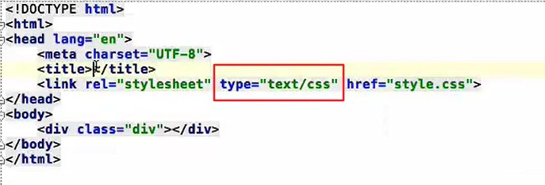
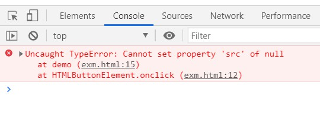
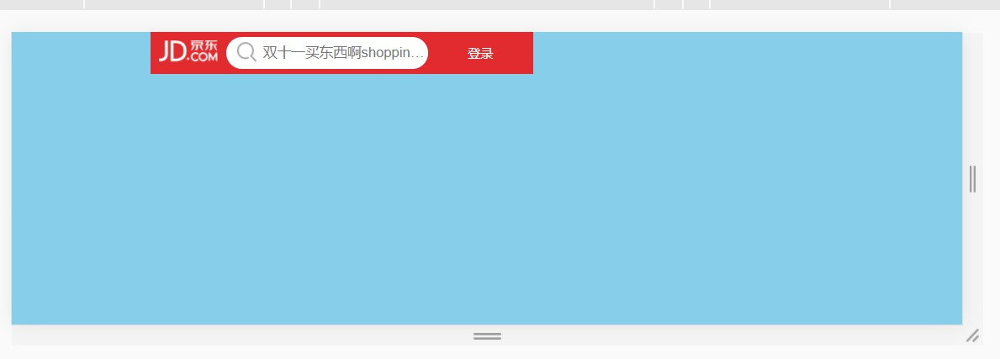
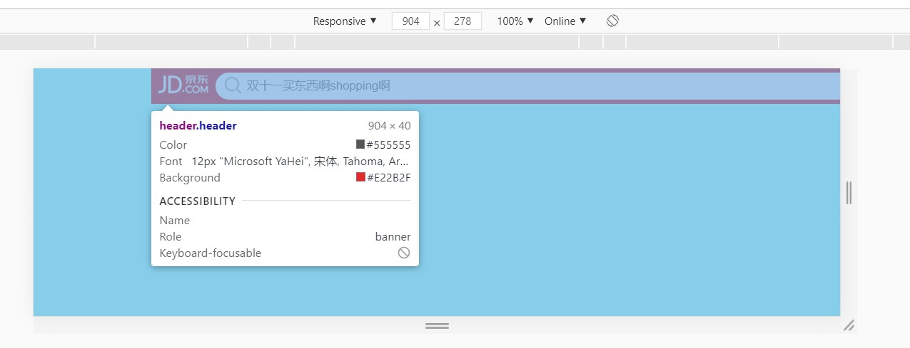
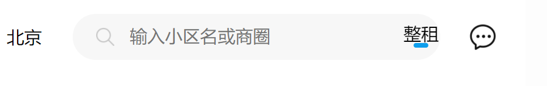
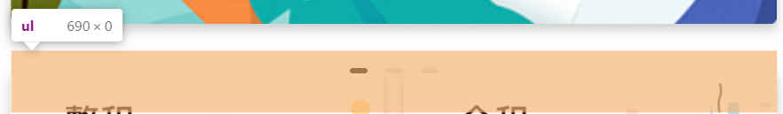

Q1:
```
通栏盒子不设置宽，当浏览器缩小时，出现底部滚动条，拖动滚动条发现通栏的背景不会渲染，而且文字会溢出盒子
```

A1：

```
需要做网页的适配
```

Q2:

```
<link rel="stylesheet" type="text/scc" href="">
其中type属性是啥意思，属性值是啥意思
```



A2:

```
文本类型的css文本
```

Q3：DoM点击事件

```html
<body>
    
    <button onclick="demo()">更换图片</button>
    <script>
        function demo() {
            document.getElementById(pic).src = "./03_静态页面/day03_金山云/images/40.jpg";
        }
    </script>
</body>
```



A3:

```
document.getElementById(pic).src
----pic要加引号。----
document.getElementById(“pic”).src
```

Q4:

```css
.header {
    /* 宽度自适应 */
    position: fixed;
    top: 0px;
    overflow: hidden;
    height: 40px;
    background-color: #e22b2f;
    z-index: 999;
}
---宽度未能达到预期目标-与父元素相同
```



A4:

```
 position: fixed;固定定位后脱标，宽度由内容决定
```

Q5:

```css
.header {
    width: 100%;
    position: fixed;
    top: 0px;
    overflow: hidden;
    height: 40px;
    background-color: #e22b2f;
    z-index: 999;
}
---宽度设置width: 100%;后，一直延伸到浏览器之外
```



A5：

```
 position: fixed;width: 100%;固定定位后盒子宽度和浏览器一致
```

Q6:

```
图片层叠有问题
```



A6:

```
定位元素之间会出现层叠问题，在没有书写z-index: ;属性时后写的定位元素会漂浮在之前的元素之上，通过z-index: ;可以（且只能）修改定位元素的层叠次序。ps：默认层叠值为auto（这也解释了为什么后写的可以漂浮在上）
```

Q7:

```
margin-top，margin-bottom不起作用
```

​      

A7:

```
ul没有高度，margin-top可以生效，是ul和其上img的间距，而margin-bottom则相当于给内部子元素li设置了margin-top，因此出现了塌陷现象（大概）
```

