# 写代码中一些需要注意的事情

## 1.CSS三角的应用

```html
    width: 0;
    height: 0;
    border: 10px solid transparent;
    border-left: 10px solid violet;
```

1. 设置一个`width: 0;height: 0;`的盒子

2. 改变边框`border`属性以达到做成三角形的效果（可以配合定位摆放）

   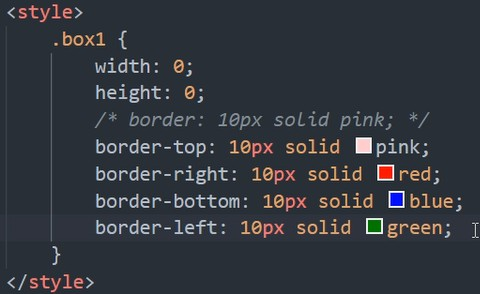

   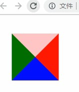
   
   ## 2.单行文本溢出的省略号显示
   
   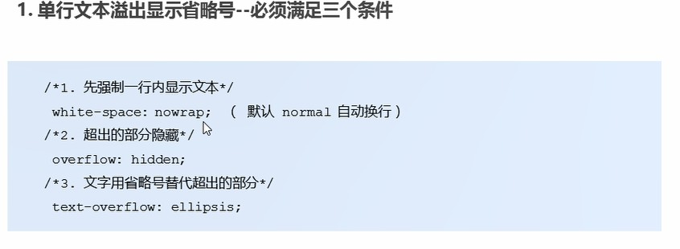

## 3.清除浮动

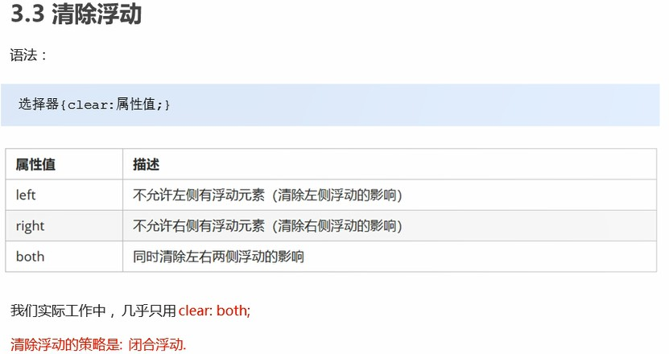

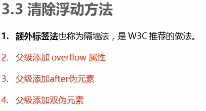

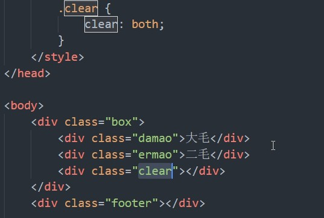

<!-- 这个新增的盒子要求必须是块级元素不能是行内 -->

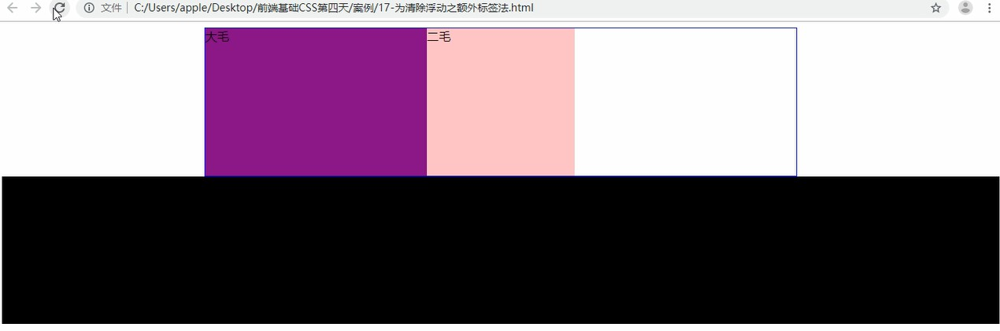

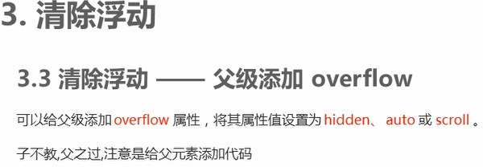

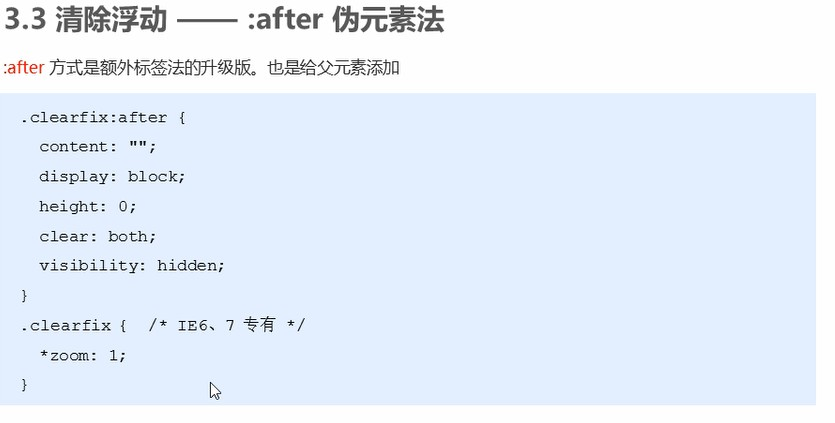

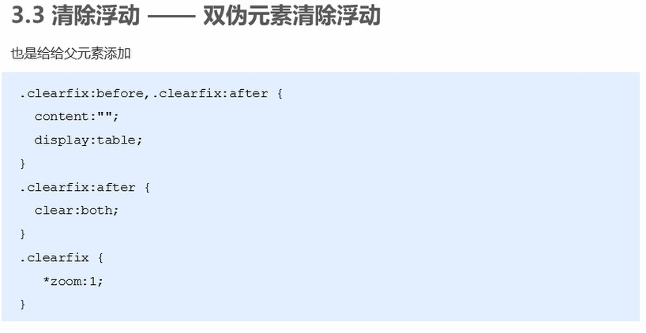

# JS鼠标事件

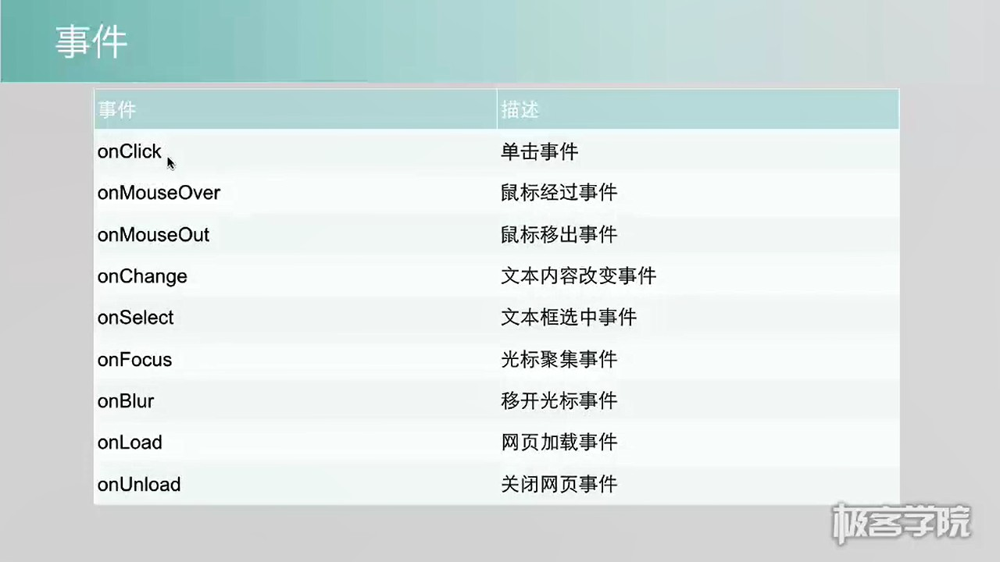