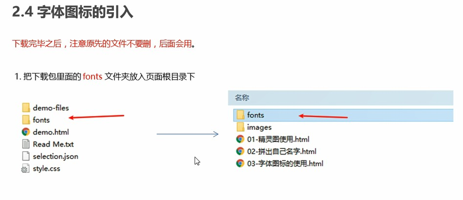
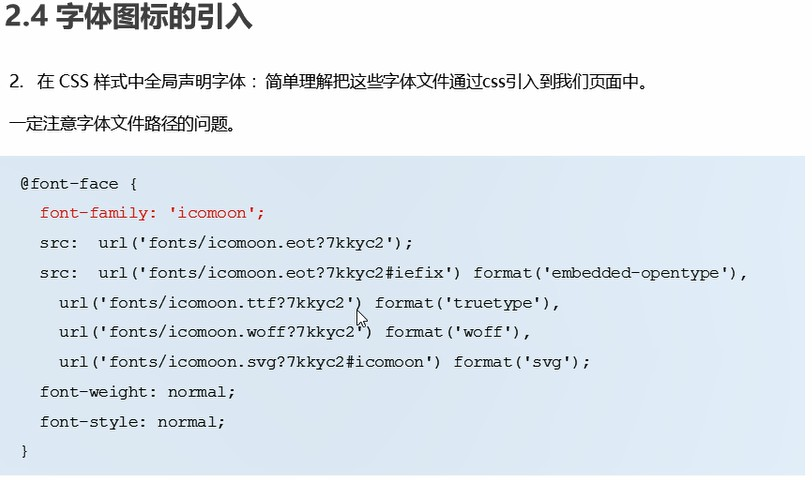
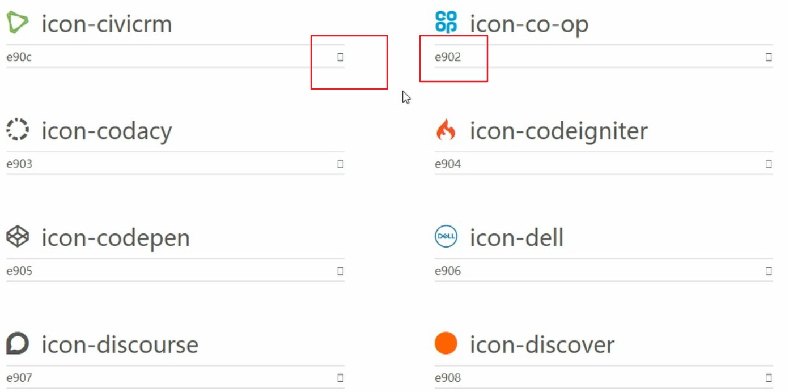
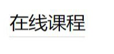

# 写代码中一些需要注意的事情（或者是tips）

## 1.CSS三角的应用

```html
    width: 0;
    height: 0;
    border: 10px solid transparent;
    border-left: 10px solid violet;
```

1. ###设置一个`width: 0;height: 0;`的盒子

2. ###改变边框`border`属性以达到做成三角形的效果（可以配合定位摆放）

   

   

## 2.单行文本溢出的省略号显示


## 3.清除浮动


**<!-- 用于闭合浮动的这个新增的盒子要求必须是块级元素不能是行内 -->**


```html
.clearfix:before,
.clearfix:after{
	content:"";
	display:table;
}
.clearfix:after{
	clear:both;
}
.clearfix{
	*zoom: 1;
}
```


## 4.JS鼠标事件


## 5.字体图标的使用





```html
@font-face {
    /* 字体图标声明 */
    font-family: 'icomoon';
    src: url('../fonts/icomoon.eot?p4ssmb');
    src: url('../fonts/icomoon.eot?p4ssmb#iefix') format('embedded-opentype'), url('../fonts/icomoon.ttf?p4ssmb') format('truetype'), url('../fonts/icomoon.woff?p4ssmb') format('woff'), url('../fonts/icomoon.svg?p4ssmb#icomoon') format('svg');
    font-weight: normal;
    font-style: normal;
    font-display: block;
}
```

1. ###在需要的地方引入font样式

   

2. ###在相应的`css`样式中引入字体样式`font-family: 'icomoon';`**ps：字体样式属性值与字体声明中的字体样式属性值相同**

## 6.浏览默认字体大小16px，最小字体12px（试出来的），整0px时字体消失，负值时样式失效

## 7.background-size: contain;---背景图与盒子大小相等

## 8.图片默认和文字是底线对齐的，通过vertical-align属性可以更改对齐方式

## 9.h1标签有特定用处（特定地方），一般需要时从h2开始用

## 10.共用的标签，例如<p>或者<ul>等添加class，利用类选择器，不容易出现继承导致代码混乱

# 11.文字的下划线效果



1. 用下边框`border-bottom`---但是块级元素h2、h3等需要添加宽度`width`（否则会出现整行的下边框）
2. 