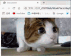
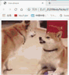

# day01

## 浏览器

1. Chrome--blink内核

1. Firefox--Gecko内核

3. IE--trident

4. safari--Webkit内核

5. Opera--blink内核 


## Web标准

1. html--格式（好比渤儿哥的身子，骨架）

2. css--样式（给渤儿哥化个妆）

3. js--行为（能动起来的渤儿哥）


## html骨架

```html
<html>
   <head>
      <title></title>
   </head>
   <body>
   </body>
</html>
```

## 标签

1. 标签分类
   - 1.同级标签
     - 例如：
      ```html
         <html>
            <head>
               <title></title>
            </head>
            <body>
            </body>
         </html>
      ```
      中`<head></head>&<body></body>`
   - 2.包含标签
     - 例如：
      ```html
         <html>
            <head>
               <title></title>
            </head>
            <body>
            </body>
         </html>
      ```
      中`<head></head>&<title></title>`
   - 3.双标签
     -`<head></head>、<body></body>……` 
   - 4.单标签
     - `<hr>、<br>……`
2. 标签语义化
   - 1.排版标签
      - ```<hr>水平线标签```
         ```html
         <body>
         <p>段落标签</p>
         <p>段落标签</p>
         <p>段落标签</p>
         </body>
         ```
         
      - ```<hr>水平线标签```
         ```html
         <body>
         <p>段落标签</p>
         <hr>
         <p>段落标签</p>
         </body>
         ```
         
      - ```<br>换行标签```
         ```html
         <body>
         <p>段落标签</p>
         <br><hr><br><hr><br>
         <p>段落标签</p>
         </body>
         ```
         
   - 2. 标题标签
      - ```<h1>一级标题</h1>```
      - ```<h2>二级标题</h2>```
      - ```<h3>三级标题</h3>```
      - ```<h4>四级标题</h4>```
      - ```<h5>五级标题</h5>```
      - ```<h6>六级标题</h6>```
         ```html
         <body>
            <h1>一级标题</h1>
            <h2>二级标题</h2>
            <h3>三级标题</h3>
            <h4>四级标题</h4>
            <h5>五级标题</h5>
            <h6>六级标题</h6>
         </body>
         ```
         
   - 3. 文本格式化标签
      - ```<strong>加粗</strong>||<b>加粗</b>```
         ```html
         <body>
            <strong>加粗</strong>
            <b>加粗</b>
         </body>
         ```
         
      - ```<em>倾斜</em>||<i>倾斜</i>```
         ```html
         <body>
            <em>倾斜</em>
            <i>倾斜</i>
         </body>
         ```
         
      - ```<ins>下划线</ins>||<u>下划线</u>```
         ```html
         <body>
            <ins>下划线</ins>
            <u>下划线</u>
         </body>
         ```
         
      - ```<del>删除线</del>||<s>删除线</s>```
         ```html
         <body>
            <del>删除线</del>
            <s>删除线</s>
         </body>
         ```
         

## 标签属性

- 键值对
  
  

## 图片img

1. src=“pathname”
   - 相对路径
      - 上级目录
         
         
      - 上级目录
         
         
      - 下级目录
         
         
   - 绝对路径
      - 下级目录
         
         
2. alt=“文本替换”
   
   
3. title=“图片标题”
   
   

   ---
   原图
   
   
   ---
4. width=“宽度”
   
   
5. height=“高度”
   
   
6. width和height是可以一起设置的，但是容易让图片变形
   
   