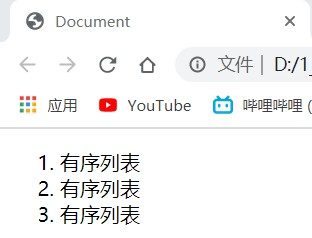
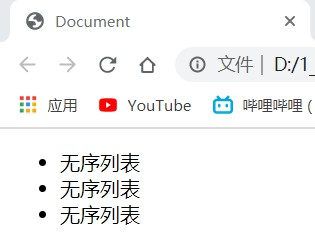
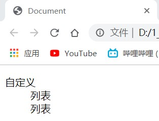
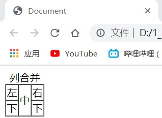
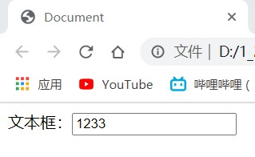
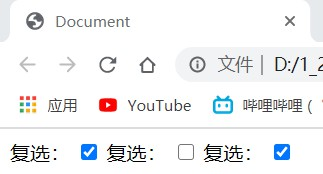
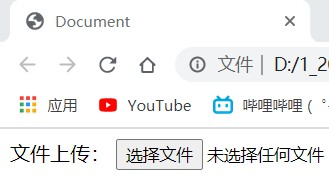

# day02

## 链接标签a

1. 语法：
    ```html
    <a href="" target=""></a>
    ```
2. href--pathname[路径名]
3. target--打开方式
   - _self--自身页面打开
   - _blank--新标签页打开
4. 链接方式
   - 绝对地址跳转
   - 相对地址跳转
   - 锚点跳转（页面内的跳转）
     - 1. 给需要点击的元素添加&lt;a&gt;标签
     - 2. 给跳转目标的标签添加id属性，属性值为自定义的id值
     - 3. 给&lt;a&gt;标签href属性添加属性值，ps：id值前要添加“#”号
        ```html
        <a href="#‘自定义的id值’"></a>
        ```
5. href属性值是空代表刷新，单独的#表示空链接
6. &lt;a&gt;标签内不能在放置&lt;a&gt;标签
7. &lt;a&gt;标签内一旦有元素，则该元素为链接

## 列表

1. 有序列表
   ```html
    <ol>
        <li>有序列表</li>
        <li>有序列表</li>
        <li>有序列表</li>
    </ol>
   ```

    

2. 无序列表
   ```html
    <ul>
        <li>无序列表</li>
        <li>无序列表</li>
        <li>无序列表</li>
    </ul>
   ```

    

3. 自定义列表
   ```html
    <dl>
        <dt>自定义</dt>
        <dd>列表</dd>
        <dd>列表</dd>
    </dl>
   ```

    

## 表格

1. 基本语法
    ```html
    <table>
        <tr>
            <td></td>
        </tr>
    </table>
   ```
2. 属性
    - 1. width---表格宽度
    - 2. height---表格高度
    - 3. border---表格边框
    - 4. align---表格对齐方式：right、center、left
    - 5. cellspacing---单元格间距
    - 6. cellpadding---单元格内边距
3. 结构化
    - 1. caption---表格标题：置于&lt;table&gt;之内第一行&lt;/table&gt;
    ```html
    <table>
        <caption>表格标题</caption>
        <tr>
            <td></td>
        </tr>
    </table>
   ```
    - 2. thead---表格头部区域
    - 3. tbody---表格主体区域
    - 4. tfoot---表格底部区域
4. 单元格合并
   - 1. 行合并
     - i. 选取待合并行的最上层单元格添加rowsapn属性，属性值为合并单元格数目
     - ii. 删除多余单元格
        ```html
        <table border="1" cellspacing="0">
            <caption>行合并</caption>
            <tr>
                <td>左</td>
                <td rowspan="2">中</td>
                <td>右</td>
            </tr>
            <tr>
                <td>下</td>
                <td>下</td>
            </tr>
        </table>
        ```
        
        

   - 2. 列合并
     - i. 选取待合并列的最左侧单元格添加colsapn属性，属性值为合并单元格数目
     - ii. 删除多余单元格
        ```html
        <table border="1" cellspacing="0">
            <caption>列合并</caption>
            <tr>
                <td>左</td>
                <td>中</td>
                <td>右</td>
            </tr>
            <tr>
                <td colspan="3">下</td>
            </tr>
        </table>
        ```

        

## 表单（略）

1. 文本框

```html
<body>
    文本框：<input type="text">
</body>
```



2. 密码

```html
<body>
    密码：<input type="password">
</body>
```


3. 单选框

```html
<body>
    单选：<input type="radio">单选
</body>
```


4. 复选框

```html
<body>
    复选：<input type="checkbox"> 
    复选：<input type="checkbox"> 
    复选：<input type="checkbox">
</body>
```



5. 重置按钮

```html
<body>
    重置按钮：<input type="reset">
</body>
```


6. 提交按钮

```html
<body>
    提交按钮：<input type="submit">
</body>
```


7. 文件上传按钮

```html
<body>
    文件上传：<input type="file">
</body>
```


