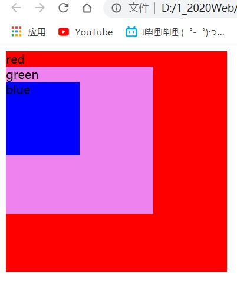

# day04

## css样式书写

1. 行内式

   ```html
   <div style="color: red;"></div>
   <!-- 
   	1.书写在标签的内部
   	2.基本语法为：
   		style=“属性：属性值；属性：属性值；”
   -->
   ```

   JS更改的就是行内式样式

2. 内嵌式

   ```html
   <head>
       <style>
           div{
               color: red;
           }
       </style>
   </head>
   <!-- 
   	1.书写在<head></head>标签的内部
   	2.书写在<style></style>标签的内部
   -->
   ```

3. 外链式

   ```html
   <head>
   	<link rel="stylesheet" href="">
   </head>
   <!-- 
   	1.书写在<head></head>标签的内部
   	2.用link标签包裹
   	3.src=""---pathname
   -->
   ```

## 复合选择器

1. 交集选择器

   ```html
   <html>
   <head>
       <style>
           div {
               width: 100px;
               height: 100px;
               margin-top: 20px;
               background-color: violet;
           }
           
           div.red {
               background-color: red;
           }
       </style>
   </head>
   <body>
       <div class="red">red</div>
       <div class="green">green</div>
       <div class="blue">blue</div>
   </body>
   </html>
   ```

   - ```html
     <!-- 基本语法 -->
     选择器1选择器2｛
     	属性：属性值；
     ｝
     <!--
     	1.两选择器连写
     	2.只有同时满足拥有两个选择器时，才能获得属性值
     -->
     ```

     

2. 并集选择器

   ```html
   <html>
   <head>
       <style>
           div {
               width: 100px;
               height: 100px;
               margin-top: 20px;
               background-color: violet;
           } 
           .red,
           .blue {
               background-color: green;
           }
       </style>
   </head>
   <body>
       <div class="red">red</div>
       <div class="green">green</div>
       <div class="blue">blue</div>
   </body>
   </html>
   ```

   - ```html
     <!-- 基本语法 -->
     选择器1,
     选择器2｛
     	属性：属性值；
     ｝
     <!--
     	1.两选择器需要逗号隔开
     	2.凡是拥有列出的选择器的，都能拿到属性
     -->
     ```

     

3. 后代选择器

   ```html
   <html>
   <head>
       <style>
           .red {
               width: 300px;
               height: 300px;
               background-color: red;
           }       
           .green {
               width: 200px;
               height: 200px;
               background-color: green;
           }       
           .blue {
               width: 100px;
               height: 100px;
               background-color: blue;
           }        
           .red .green .blue {
               background-color: violet;
           }
       </style>
   </head>
   <body>
       <div class="red">red
           <div class="green">green
               <div class="blue">blue</div>
           </div>
       </div>
   </body>
   </html>
   ```

   - 
     ```html
     <!-- 基本语法 -->
     选择器1 选择器2 选择器3｛
     	属性：属性值；
     ｝
     <!--
     	1.选择器存在嵌套关系，且可以不止于一层嵌套关系
     	2.选择器之间用空格隔开
     	3.只有拥有最内层选择器的元素，才能获得属性
     -->
     ```

     

4. 子元素选择器

   ```html
   <html>
   <head>
       <style>
           .red {
               width: 300px;
               height: 300px;
               background-color: red;
           }    
           .green {
               width: 200px;
               height: 200px;
               background-color: green;
           }     
           .blue {
               width: 100px;
               height: 100px;
               background-color: blue;
           }       
           .red>div {
               background-color: violet;
           }
       </style>
   </head>
   <body>
       <div class="red">red
           <div class="green">green
               <div class="blue">blue</div>
           </div>
       </div>
   </body>
   </html>
   ```

   - ```html
     <!-- 基本语法 -->
     选择器1>选择器2｛
     	属性：属性值；
     ｝
     <!--
     	1.选择器存在嵌套关系
     	2.选择器之间用大于号连接
     	3.只选取次一级（儿子元素）的元素赋予属性，再内层之后（孙子元素之后……）不享有该属性
     -->
     ```
   
     

## 文本属性

1. text-decoration

   ```html
   <html>
   <head>
       <style>
           .red {
               text-decoration: none;
           }  
           .green {
               text-decoration: underline;
           }
           .blue {
               text-decoration: line-through;
           }
        /* 还有其它属性值 */   
       </style>
   </head>
   <body>
       <div class="red">.red---正常</div>
       <div class="green">.green---下划线</div>
       <div class="blue">.blue---删除线</div>
   </body>
   </html>
   ```

   

2. text-indent

   ```html
   <html>
   <head>
       <style>
           .red {
               text-indent: 50px;
           }     
           .green {
               text-indent: 2em;
           }      
           .blue {
               text-indent: 3cm;
           }
           /* 
           	1.还有其它属性值
           	2.分为相对单位和绝对单位
           	3.px（像素）cm（厘米）这类属于绝对单位写是多少是多少
           	4.em这类属于相对单位，em就表示当前文本中font-size属性值的大小。
           */
       </style>
   </head>
   <body>
       <div class="red">.red---像素</div>
       <div class="green">.green---‘字’</div>
       <div class="blue">.blue---厘米</div>
   </body>
   </html>
   ```

   

3. text-align

   - 1.属性值分left、center、right
   
   - 2.表示元素内容对齐显示模式，可作用于文字和行内元素
   
     ```html
     <html>
     <head>
         <style>
             .red {
                 width: 300px;
                 height: 20px;
                 border: 1px solid black;
                 text-align: left;
             }        
             .green {
                 width: 300px;
                 height: 20px;
                 border: 1px solid black;
                 text-align: center;
             }       
             .blue {
                 width: 300px;
                 height: 20px;
                 border: 1px solid black;
                 text-align: right;
             }
         </style>
     </head>
     <body>
         <div class="red">.red---左</div>
         <div class="green"><a href="#">.green---中</a></div>
         <div class="blue">.blue---右</div>
     </body>
     </html>
     ```
   
     

## 继承性

1. CSS三大特性之一

2. 子代元素会继承祖先元素的部分CSS样式

3. 会继承包括但不限于

   - color---颜色
   - font系列属性---文字
   - text系列属性---文本
   - ……

   ```html
   <html>
   <head>
       <style>
           .red {
               color: red;
               font-size: 24px;
               text-decoration: line-through;
           }
       </style>
   </head>
   <body>
       <div class="red">.red---上
           <div class="green">.green---中
               <div class="blue">.blue---下</div>
           </div>
       </div>
   </body>
   </html>
   ```

   

   

## 其它

### 盒子模型的居中

- margin：0 auto；
- 可以实现盒子元素的居中显示
- 但是前提是自身具备宽属性

### 颜色取值

- 关键字
  - white---白色
  - black---黑色
  - red---红色
  - green---绿色
  - blue---蓝色
- 十六进制
  - `#数值1数值2数值3数值4数值5数值6`
  - 数值表示十六进制数（0~f）
  - 数值1、2---表示红色数值、数值3、4---表示绿色数值、数值5、6---表示蓝色数值
  - `#ff0000--红色||#00ff00--绿色||#0000ff--蓝色`
  - 当数值1、2相同、数值3、4相同、数值5、6相同可以简写
  - `#f00--红色||#0f0--绿色||#00f--蓝色`
- rgb值
  - `rgb(数值1，数值2，数值3)`
  - 数值表示0~255内任意数字
  - 数值1表示红色，数值2表示绿，数值3表示蓝色
  - rgb（255，0，0）---红色||rgb（0，255，0）---绿色||rgb（0，0，255）---蓝色