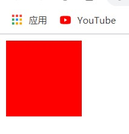

# day05

## CSS三大特性

1. 继承性

   - 子元素会继承就近父元素的部分样式属性
   - width、height不会被继承
   - div虽然不继承宽度，但是具备继承效果，默认宽度和父元素宽度相同

2. 层叠性

   - 选择同元素的，同权重的选择器中，后写样式会覆盖先写样式

     ```html
     <html>
     <head>
         <style>
             div {
                 width: 100px;
                 height: 100px;
                 background-color: violet;
             }       
             div {
                 background-color: red;
             }
         </style>
     </head>
     <body>
         <div></div>
     </body>
     </html>
     ```

     

3. 优先级

   - 权重
     - 继承权重最低
     - 通配符选择器权重`0,0,0,0`
     - 标签选择器`0,0,0,1`
     - 类选择器`0,0,1,0`
     - id选择器`0,1,0,0`
     - 行内样式`1,0,0,0`
     - `!important`
   - 优先级权重分为四组`0,0,0,0`，从左往右优先级依次递减
     - 左边的权重分组优先级绝对大于右边，不论数值
     - 权重分组相同时，数值越高优先级越高
     - `!important`表示提升权重为最优先

## CSS属性--背景（background）

1. background-color

   ```html
   <html>
   <head>
       <style>
           div {
               width: 400px;
               height: 400px;
               /*背景颜色*/
               background-color: violet;
           }
       </style>
   </head>
   <body>
       <div></div>
   </body>
   </html>
   ```

   

2. background-image

   ```html
   <html>
   <head>
       <style>
           div {
               width: 400px;
               height: 400px;
               background-color: violet;
               /*背景图片*/
               background-image: url(./media/冥王星_Pluto.jpg);
           }
       </style>
   </head>
   <body>
       <div></div>
   </body>
   </html>
   ```

   

3. background-repeat

   ```html
   <html>
   <head>
       <style>
           div {
               width: 400px;
               height: 400px;
               background-color: violet;
               background-image: url(./media/冥王星_Pluto.jpg);
               /*背景平铺*/
               background-repeat: repeat;
               /* background-repeat: no-repeat;
               background-repeat: repeat-x;
               background-repeat: repeat-y; */
           }
       </style>
   </head>
   <body>
       <div></div>
   </body>
   </html>
```
   

   
   ```html
   <html>
   <head>
       <style>
           div {
               width: 400px;
               height: 400px;
               background-color: violet;
               background-image: url(./media/冥王星_Pluto.jpg);
               /* background-repeat: repeat; */
               background-repeat: no-repeat;
               /* background-repeat: repeat-x;
               background-repeat: repeat-y; */
           }
       </style>
   </head>
   <body>
       <div></div>
   </body>
   </html>
```
   

   
   ```html
   <html>
   <head>
       <style>
           div {
               width: 400px;
               height: 400px;
               background-color: violet;
               background-image: url(./media/冥王星_Pluto.jpg);
               /* background-repeat: repeat; */
               /* background-repeat: no-repeat; */
               background-repeat: repeat-x;
               /* background-repeat: repeat-y; */
           }
       </style>
   </head>
   <body>
       <div></div>
   </body>
   </html>
```
   
	
   
   ```html
   <html>
   <head>
       <style>
           div {
               width: 400px;
               height: 400px;
               background-color: violet;
               background-image: url(./media/冥王星_Pluto.jpg);
               /* background-repeat: repeat; */
               /* background-repeat: no-repeat; */
               /* background-repeat: repeat-x; */
               background-repeat: repeat-y;
           }
       </style>
   </head>
   <body>
       <div></div>
   </body>
   </html>
```
   
   

4. background-position

   ```html
   <html>
   <head>
       <style>
           div {
               width: 400px;
               height: 400px;
               background-color: violet;
               background-image: url(./media/冥王星_Pluto.jpg);
               /*背景位置*/
               background-repeat: no-repeat;
               /*
               	1.该属性存在x，y两个方向，可以填写具体数字，也可以填写关键词
               	2.x轴向；right、center、left
               	3.y轴向：
               			top
               			center
               			bottom
               */
             /*background-position: 10px 10px;*/
               background-position: right top;
             /*background-position: center center;*/
             /*background-position: left bottom;*/
           }
       </style>
   </head>
   <body>
       <div></div>
   </body>
   </html>
   ```

   

5. background-attachment

   - 背景附着
   - 属性值
     - scroll---背景会随着页面滚动而移动（默认值）
     - fixed---背景在不会随着页面滚动而移动 

## 元素显示方式

1. 块级元素
   - 独占一行
   - 可以设置宽高
   - 宽默认为父元素宽度
   - 内部可以放任意元素
   - ps：`<p></p>`类似p标签这类放置文字的块级元素内部不能再放块级元素
2. 行内元素
   - 可以在一行内显示多个
   - 默认内容大小决定自身属性
   - 不能设置长宽属性
   - ps：`<a></a>`a标签内部不能再放置a标签
3. 行内块元素
   - 可以在一行显示多个
   - 默认大小由自身内容决定
   - 可以设置宽高属性

## line-height

1. line-height---行高

2. 行高 = 上间距 + 内容 +下间距

3. 当行高等于盒子高度时可以实现文字的垂直居中

4. 文字的显示中存在：

   - 顶线
   - 中线
   - 基线
   - 底线

   

## 链接伪类

1. a：link---a标签未点击过的状态
   - 网页点击后会有浏览记录，删除浏览记录才能恢复为未点击状态
2. a：visited---a标签点击之后的状态
3. a：hover---鼠标悬停的状态
4. a：active---鼠标进入点击状态
5. 书写存在先后顺序
   - a：link
   2. a：visited
   - a：hover
   - a：active
6. ：hover可以用在其他标签上