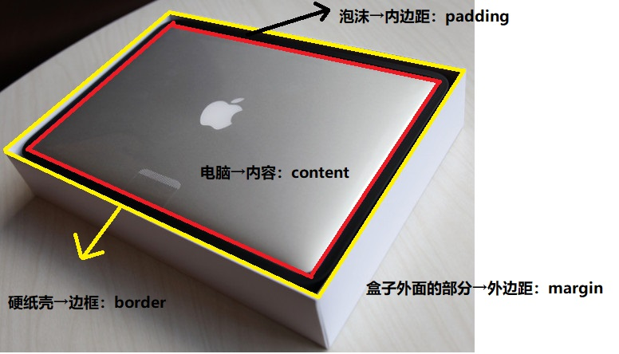
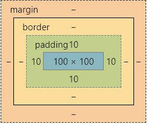
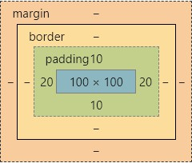
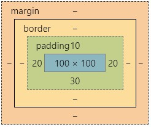
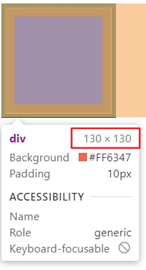
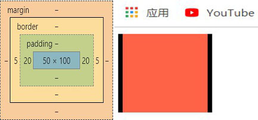
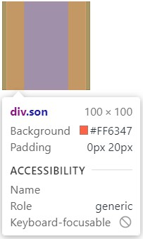

# day06

## 伪类

1. 链接伪类`:hover`
2. `:focus`伪类
   - 获得焦点时可以改变样式

## 行高的补充

1. 受line-height作用的元素
   - **单行**文本
   - 行内元素
   - 行内块元素
2. ps1---img标签
   - 需要添加vertical-align属性实现居中对齐
   - 因为图片默认与文本基线对齐
3. ps2---font的连写
   - font连写属性值包含line-height属性
   - `font:style weight size/line-height family`
   - 所以line-height不能写在font连写属性的上面，会覆盖掉

## 盒模型



1. content---内容

   - css样式中的width、和height属性默认表示内容的宽高

2. border---边框

   - 1. border-width---边框的粗细
     2. 属性值---‘数字’+‘px’
   - 1. border-style---边框样式
     2. 属性值：solid---实线、dashed---虚线、dotted---点线……
   - 1. border-color---边框颜色值
     2. 属性值：关键字（white、red）、#十六进制（#fff）、rgb颜色[rgb（255，255，255）]
   - border连写：width、style、color
   - border单独设置边框
     - border-top---上边框
     - border-right---有边框
     - border-bottom---下边框
     - border---left---左边框

3. padding---内边距

   - 1. 属性值（个数）：

        ```html
        <html>
        <head>
            <style>     
                div {
                    width: 100px;
                    height: 100px;
                    /* 一个值 */
                    padding: 10px;
                    /*表示了上右下左共用一个padding值10px*/
                }
            </style>
        </head>
        <body>
            <div></div>
        </body>
        </html>
        ```

        

        ```html
        <html>
        <head>
            <style>
                div {
                    width: 100px;
                    height: 100px;
                    /* 俩值 */
                    padding: 10px 20px;
                    /*
                    表示了上下共用一个padding值10px
                    表示了右左共用一个padding值20px
                    */
                }
            </style>
        </head>
        <body>
            <div></div>
        </body>
        </html>
        ```

        

        ```html
        <html>
        <head>
            <style>
                div {
                    width: 100px;
                    height: 100px;
                    /* 三个值 */
                    padding: 10px 20px 30px;
                    /*
                    第一个数值是上边距；
                    左右共用第二个上边距；
                    第三个表示下边距
                    */
                }
            </style>
        </head>
        <body>
            <div></div>
        </body>
        </html>
        ```

        

        ```html
        <html>
        <head>
            <style>
                div {
                    width: 100px;
                    height: 100px;
                    /* 四个值 */
                    padding: 10px 20px 30px 40px;
                    /*
                    第一个表示上边距；
                    第二个表示右边距；
                    第三个表示下边距；
                    第四个表示左边距
                    */
                }
            </style>
        </head>
        <body>
            <div></div>
        </body>
        </html>
        ```

        

        ```html
        <!--
        就是说，
        上和下是好基友
        左和右是好姬友
        padding的第一个值给上，第二个值给右，第三个值给下，第四个值给左
        1.如果有四个值，则上下左右各的一个
        2.如果只有三个，那么没有值的左边，就和好姬友右共用一个值
        3.如果只有两个，那么没有值的下和好基友上共用一个值，左边一样
        4.如果只有一个值，那么上下左右共用一个值
        -->
        ```

   - 2. 单独设置边距
        - padding-top---上边距
        - padding-right---右边距
        - padding-bottom---下边距
        - padding-left---左边距

   - 3. 一般情况下，单纯的设置边框和边距是会撑开盒子的

        ```html
        <html>
        <head>
            <style>
                div {
                    width: 100px;
                    height: 100px;
                    background-color: tomato;
                    border: 5px solid #000;
                    padding: 10px;
                }
            </style>
        </head>
        <body>
            <div></div>
        </body>
        </html>
        ```

        

   - 4. 特殊情况时候存在不撑大盒子的情况

        ```html
        <html>
        <head>
            <style>
                .father {
                    width: 100px;
                    height: 100px;
                }        
                .son {
                    height: 100px;
                    background-color: tomato;
                    padding-left: 20px;
                    padding-right: 20px;
                    border-left: 5px solid #000;
                    border-right: 5px solid #000;
                }
            </style>
        </head>
        <body>
            <div class="father">
                <div class="son"></div>
            </div>
        </body>
        </html>
        ```

        
        
        当出现嵌套关系的两个盒子中父元素是**块级元素**且子元素没有设置**width**宽属性时，左右的边距和边框是不会撑大盒子的
        
        

4. 盒子的实际大小 = content + padding +border的数值

   - css3之前需要在盒子大小一定的情况下，需要手动缩小内容大小以确保盒子大小正确

5. CSS3盒子模型

   - css3中新增的box-sizing属性可以解决上述问题
   - box-sizing属性中存在属性值box-border，表示样式中width和height为盒子的实际大小，内容会自动缩减
   - ps：box-sizing的默认属性是box-content表示样式中width和height为内容大小

