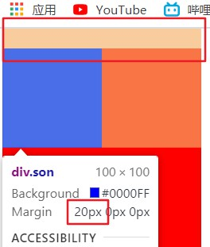
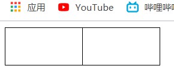

#  day07

## margin

1. 作为盒模型属性---表示外边距

2. 连写---同padding

   - 一个值时表示上右下左

     ```html
     <html>
     <head>
         <style>
             div {
                 width: 100px;
                 height: 100px;
                 margin: 10px;
             }
         </style>
     </head>
     <body>
         <div></div>
     </body>
     </html>
     ```

     

   - 两个值时表示上下、右左

     ```html
     <html>
     <head>
         <style>
             div {
                 width: 100px;
                 height: 100px;
                 margin: 10px 20px;
             }
         </style>
     </head>
     <body>
         <div></div>
     </body>
     </html>
     ```

     

   - 三个值时表示上、右左、下

     ```html
     <html>
     <head>
         <style>
             div {
                 width: 100px;
                 height: 100px;
                 margin: 10px 20px 30px;
             }
         </style>
     </head>
     <body>
         <div></div>
     </body>
     </html>
     ```

     

   - 四个值时表示上、右、下、左

     ```html
     <html>
     <head>
         <style>
             div {
                 width: 100px;
                 height: 100px;
                 margin: 10px 20px 30px 40px;
             }
         </style>
     </head>
     <body>
         <div></div>
     </body>
     </html>
     ```

     

3. 分写

   - margin-top---上边距
   - margin-right---右边距
   - margin-bottom---下边距
   - margin-left---左边距

## margin的特殊现象

1. 外边距合并

   - 上下垂直排列的两个盒子，上盒子有margin-bottom、下盒子有margin-top属性时

     ```html
     <html>
     <head>
         <style>
             div {
                 width: 100px;
                 height: 100px;
             }       
             .top {
                 background-color: red;
                 margin-bottom: 10px;
             }        
             .bottom {
                 background-color: blue;
                 margin-top: 20px;
             }
         </style>
     </head>
     <body>
         <div class="top"></div>
         <div class="bottom"></div>
     </body>
     </html>
     ```

   - 浏览器只会显示外边距大的数值

     

   - 理论上就避免上下边距同时出现的写法，上下排列只写一种。

2. 外边距塌陷

   - 当**块级元素**嵌套时

     ```html
     <html>
     <head>
         <style>
             .father {
                 width: 200px;
                 height: 200px;
                 background-color: red;
             }        
             .son {
                 width: 100px;
                 height: 100px;
                 background-color: blue;
                 margin-top: 20px;
             }
         </style>
     </head>
     <body>
         <div class="father">
             <div class="son"></div>
         </div>
     </body>
     </html>
     ```

   - 子元素出现 margin-top时会出现塌陷现象，父盒子会被带下来

     

   - 解决办法

     - 1.在父元素上添加上边框`例如：border: 1px solid #000;`

       

     - 2.在父元素上添加上内边距`例如：padding-top: 1px;`

     - 3.在父元素上添加`overflow: hidden;`---实质是触发浏览器BFC机制（块级格式化上下文）解决外边距塌陷

     - 4.可以将子元素改为行内块`display: inline-block;`

     - 5.可以给子元素设置浮动`float: left;`

     - ps：如果父元素首行出现文字则不会出现外边距塌陷问题

       

## 边框合并

```html
<html>
<head>
    <style>
        table {
            /* border-collapse: collapse; */
        }      
        td {
            width: 100px;
            height: 50px;
            border: 1px solid #000;
        }
    </style>
</head>
<body>
    <table>
        <tr>
            <td></td>
            <td></td>
        </tr>
    </table>
</body>
</html>
```


```html
<html>
<head>
    <style>
        table {
            border-collapse: collapse;
        }        
        td {
            width: 100px;
            height: 50px;
            border: 1px solid #000;
        }
    </style>
</head>
<body>
    <table>
        <tr>
            <td></td>
            <td></td>
        </tr>
    </table>
</body>
</html>
```



`border-collapse: collapse;`专门用于表格中单元格的边框合并


## CSS圆角边框


```html
<html>
<head>
    <style>
        div {
            width: 100px;
            height: 100px;
            background-color: tomato;
            border-radius: 10px 20px 30px 40px;
        }
    </style>
</head>
<body>
    <div></div>
</body>
</html>
```

`border-radius: 10px 20px 30px 40px;`可以设置弧度角，从左上角开始，左上角、右上角、右下角、左下角，顺时针依次取值，如果没有给出，则和对角线对面的角使用同数值，即`border-radius: 10px 20px 30px;`时左下角未能取到值，则和对角线对面右上角有相同数值


## 浮动

1. 前置知识：标准流
   - 浏览器默认的网页布局方式；呈现为从上往下、从左往右的布局方式
2. 浮动呈现出脱离标准流的特征，可以浮在标准流盒子上方呈现左或右的布局

3. 浮动特点

   - 脱离标准流出现，可以浮动在标准流之上，比标准流高半个级别，或者说是半脱标
     ps：定位可以看做全脱标，比标准流高一个级别

   - 元素得到浮动属性后，自身更新为浮动元素特点
     - 可以在一行显示多个
     - 可以设置宽高
     - 不能用margin：0 auto，text-align：center，等手段实现浮     动元素的居中显示
   - 浮动元素会紧跟在上一个浮动元素之后

   - 浮动元素会影响之后的标准流，但是之前的标准流盒子不能被影响