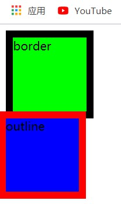
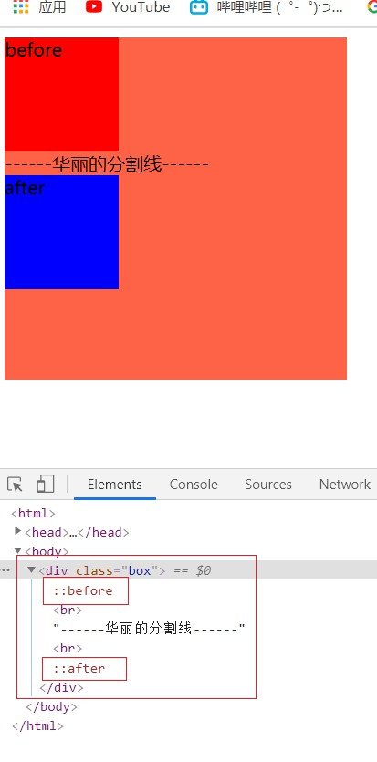
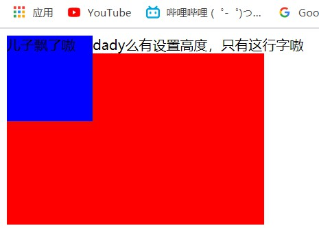
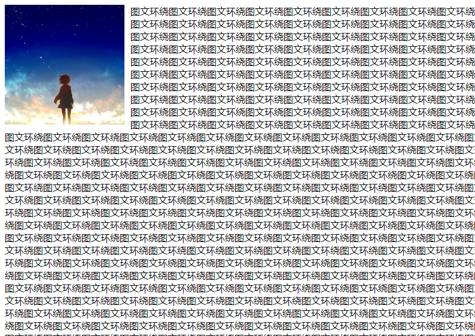
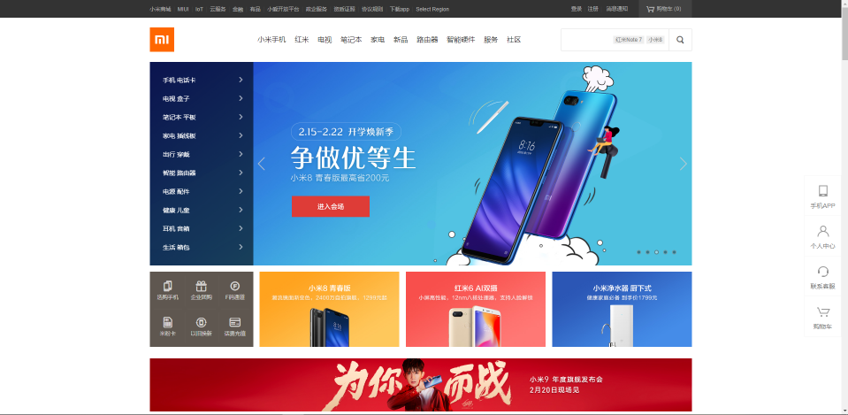
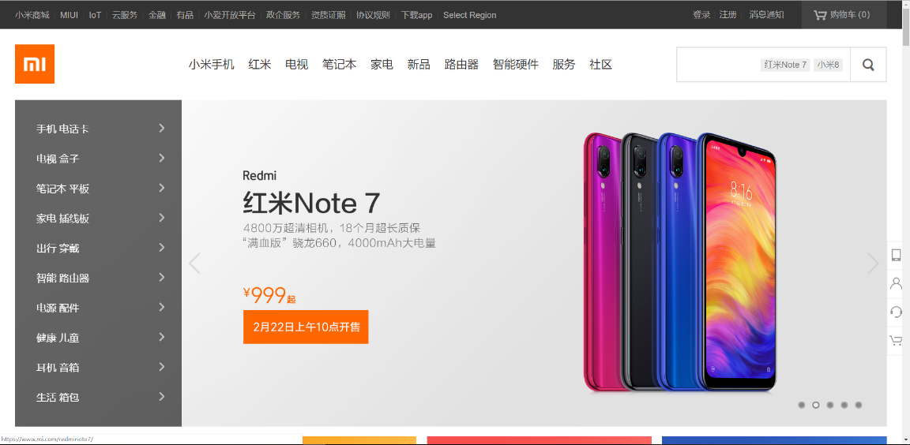
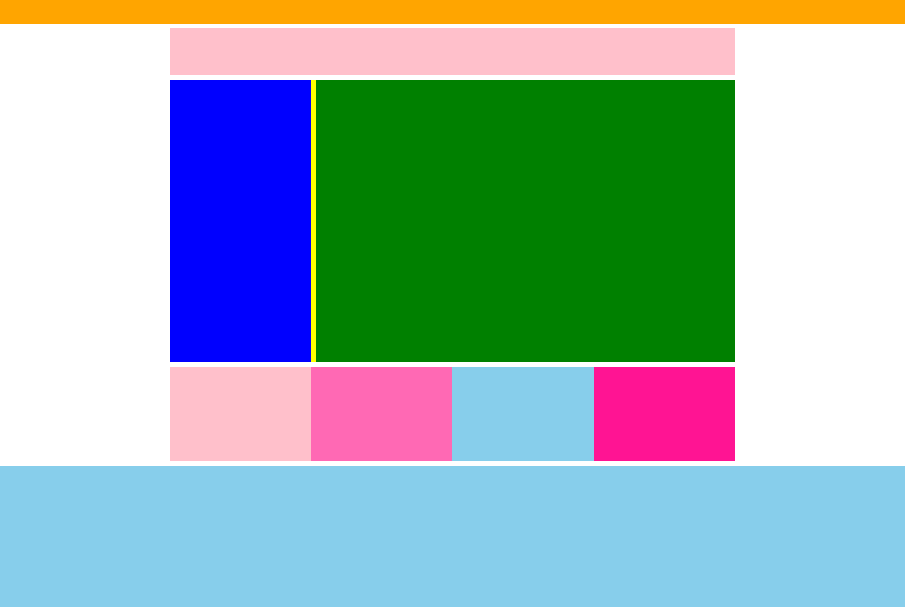

# day08

## tip---outline

- ###轮廓线：

  - 作为样式和border有同样的表现形式,属性值设置也相同

    ```html
    <html>
    <head>
        <style>
            .box1 {
                width: 100px;
                height: 100px;
                background-color: #0f0;
                border: 10px solid #000;
            }
            
            .box2 {
                width: 100px;
                height: 100px;
                background-color: #00f;
                outline: 10px solid #f00;
            }
        </style>
    </head>
    <body>
        <div class="box1">border</div>
        <div class="box2">outline</div>
    </body>
    </html>
    ```

  - 但是`outline`不会影响盒子的大小,出现的轮廓不占位置,而`border`会撑大盒子

    

  - 一般会去除outline`outline-style:none;`

# 伪元素

- ###作为CSS代码形式出现，起到模拟HTML标签的作用

- ###常见伪元素

  - `::before`---在原标签内部，**最前端**，添加一个伪元素

  - ``::after`---在原标签内部，**最后端**，添加一个伪元素

    ```html
    <html>
    <head>
        <style>
            .box {
                width: 300px;
                height: 300px;
                background-color: tomato;
            }       
            .box::before {
                content: 'before';
                display: inline-block;
                width: 100px;
                height: 100px;
                background-color: red;
            }       
            .box::after {
                content: 'after';
                display: inline-block;
                width: 100px;
                height: 100px;
                background-color: blue;
            }
        </style>
    </head>
    <body>
        <div class="box"><br>------华丽的分割线------<br></div>
    </body>
    </html>
    ```

    

  - 其中有两点：

    - **作为伪元素使用必须具加`content:'';`属性**
    - 伪元素默认为**行内元素**

  

# 浮动的扩展

- ###浮动带来的负面影响

  - 浮动元素不会撑开父级容器

    ```html
    <html>
    <head>
        <style>
            .son {
                float: left;
                width: 100px;
                height: 100px;
                background-color: blue;
            }       
            .aunt {
                width: 300px;
                height: 200px;
                background-color: red;
            }
        </style>
    </head>
    <body>
        <div class="father">dady么有设置高度，只有这行字嗷
            <div class="son">儿子飘了嗷</div>
        </div>
        <div class="aunt"></div>
    </body>
    </html>
    ```

    

    

- ###清除浮动，就是清除浮动元素带来的负面影响

  - **方法1：额外标签法**

    - **步骤：**

      1. 在父元素**里面的最后**的添加一个**块级元素**
      2. 给添加的块级元素设置清除浮动的核心代码 `clear:both;`

      **缺点：** 需要在页面中添加额外的标签，让页面的HTML结构变得更加复杂

  - **方法2：单伪元素法**

    - ```html
      /*一般伪元素清除法会使用 .clearfix 这个类名*/
      .clearfix::after {
          /*伪元素必加的属性*/
          content: '';
          /*转换为块级元素*/
          display: block;
          /*清除浮动的核心代码*/
          clear: both;
      
          /*其实有上面三个属性已经可以生效了，但是可能在开发的时候，会有额外的几个属性！！*/
          /*目的：在页面中看不到伪元素*/
          height: 0;
          visibility: hidden;
      }
      
      /* 兼容IE 67 */
      .clearfix {
          *zoom: 1;
      }
      /*伪元素由CSS渲染，不会增加额外的html标签（解决了额外标签法的缺点）*/
      ```

  - **方法3：双伪元素法**

    - ```html
      .clearfix::before,
      .clearfix::after {
          content: "";
          display: table;
      }
      .clearfix::after {
          clear: both;
      }
      /* 兼容 IE 67 */
      .clearfix {
          *zoom: 1;
      }
      ```

    - 上述代码在清除浮动的基础上，还可以解决**margin塌陷的现象**，原因在于display: table;会使得伪元素具备块级元素的特点时，也会触发浏览器BFC（块级格式化上下文）的机制解决**margin塌陷的现象**

    - 单伪元素、双伪元素法的本质都是额外标签法

  - **方法4**：直接给父元素设置 `overflow:hidden;`

    - **但是**overflow：hidden本身存在其他功能。在某些特定场景下使用不了

  - **方法5**：暴力解决---直接给父元素设置高度

    - **但是**不利于后期维护，不推荐

- ### 浮动出现的最初原因

  - 解决文字图片的相互环绕效果（此效果如今任然保留）

    

- ### 浮动的覆盖问题
  - 浮动的元素**可以**覆盖**标准流**中的**块级元素**
  - 浮动的元素**不能**覆盖**行内块元素**（图片**img**标签等）
  - 浮动元素**不能**覆盖**行内元素**（文字等）
  - 浮动的元素**不能**覆盖**文字（图文环绕）**

# 版心

- ###作为网页的主要视觉区存在，具有宽度固定，位置居中的特点

- ###能够解决一些屏幕大小适配的问题

  - **屏幕大能看到主体内容：**

    

  - **屏幕小也能看到主体内容：**

    

  ###因为每台电脑的屏幕不一样大，为了让不同屏幕大小的电脑都能看到页面的主体内容，我们需要把网页的内容约束在版心里。因为主要内容都放在版心中，所以能让更多大小的屏幕完整的看到页面的主体内容。

  **版心代码：**

  ```css
  /*通常版心命名为w*/
  .w {
  	width: 1200px；
    	margin：0 auto；
  }
  /----------------------------------------------------/
  /*给主体内容的盒子设置版心，直接加上w这个类即可*/
  <div class="w"></div>
  ```

  

# 常见的布局方式

- **注意点：实际项目中，写每个盒子的时候都要判断有没有版心，版心很重要！！**

- **常见的三种布局方式：**

#### 一列固定宽度且居中

> 常见的布局结构，一般每个盒子都设置了**版心**


#### 两列左窄右宽型

> 常见的就是banner部分左侧导航，右侧轮播图的效果
>
> 如：<a href="http://www.mi.com" target="_blank"> 小米官网 </a>


#### 通栏平均分布型

> 占满浏览器的一行叫做**通栏**，对于通栏的div，可以不用设置宽度，默认就是独占一行的
>
> <a href="http://www.smartisan.com/" target="_blank"> 锤子官网 </a>


**一般布局方式会综合运用：**

