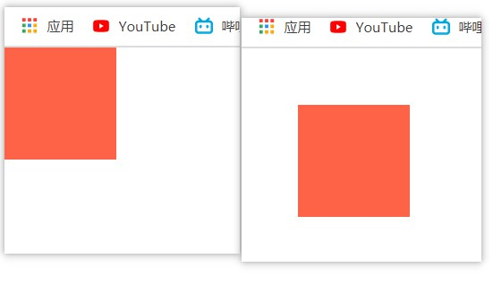
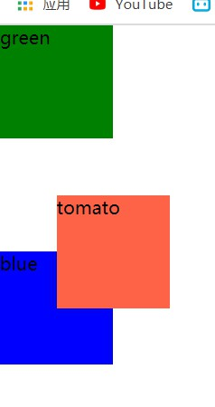
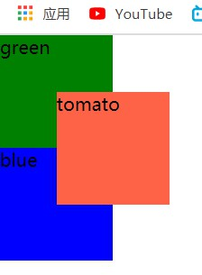
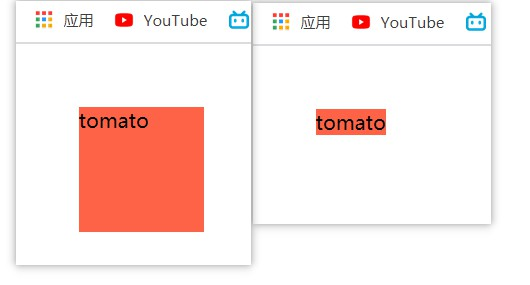
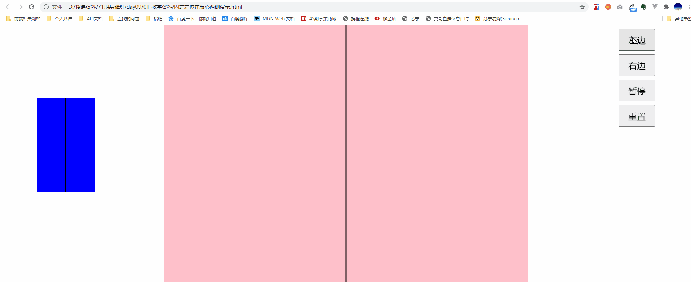

# day09

## 定位

> 1. 布局中，**标准流**和**浮动**无法**快速便解**决的效果，可以使用**定位**实现
> 2. 可以解决盒子与盒子之间的层叠问题
>    - 定位之后的元素层级最高，可以层叠在其他盒子上面

### 定位的步骤

- **1.设定定位方式`position:属性值;`**

  |   定位方式   |  属性值  |
  | :----------: | :------: |
  |   静态定位   |  static  |
  | **相对定位** | relative |
  | **绝对定位** | absolute |
  | **固定定位** |  fixed   |

- **2.设置边偏移**`属性:属性值;`

  | 方向 | 属性名 |     属性值     |
  | :--: | :----: | :------------: |
  | 水平 |  left  | 距离左边的距离 |
  | 水平 | right  | 距离右边的距离 |
  | 垂直 |  top   | 距离上边的距离 |
  | 垂直 | bottom | 距离下边的距离 |

### 定位的分类

- **静态定位（static）**

  - `position: static;` 
  - 浏览器的默认定位，标准流的默认定位

- **相对定位（relative）**

  - `position: relative；` 

  - 要配合方位属性（边偏移）使用，不然无法移动

    ```css
    .rel {
        position: relative;
        /* left: 50px;
        top: 50px; */
        width: 100px;
        height: 100px;
        background-color: tomato;
    }
    ==========华丽的分割线==================
    .rel {
        position: relative;
        left: 50px;
        top: 50px; 
        width: 100px;
        height: 100px;
        background-color: tomato;
    }
    ```

    

  - 相对于自己原来的位置进行偏移

  - 设置了相对定位的元素在页面上占据了位置==>>**没有脱标**

    ```html
    <html>
    <head>
        <style>
            * {
                margin: 0;
                padding: 0;
            }      
            .green {
                width: 100px;
                height: 100px;
                background-color: green;
            }     
            .rel {
                position: relative;
                left: 50px;
                top: 50px;
                width: 100px;
                height: 100px;
                background-color: tomato;
            }      
            .blue {
                width: 100px;
                height: 100px;
                background-color: blue;
            }
        </style>
    </head>
    <body>
        <div class="green"></div>
        <div class="rel"></div>
        <div class="blue"></div>
    </body>
    </html>
    ```

    

- **绝对定位（absolute）**

  - `position: absolute; `

  - 完全脱离标准流，不再占有原位置

    ```css
    ……其它代码同上
    .rel {
        position: absolute;
        left: 50px;
        top: 50px;
        width: 100px;
        height: 100px;
        background-color: tomato;
    }
    ………
    ```

    

  - 需要单独设置宽（width）高（height）

    ```css
    .rel {
        position: absolute;
        left: 50px;
        top: 50px;
        width: 100px;
        height: 100px;
        background-color: tomato;
    }
    =========华丽的分割线============
    .rel {
        position: absolute;
        left: 50px;
        top: 50px;
        /* width: 100px;
        height: 100px; */
        background-color: tomato;
    }
    ```

    

  - 祖先元素**没有定位**→ 默认相对于**浏览器**进行移动

  - 祖先元素**有定位**（相对定位、绝对定位都行）→ 相对于**最近**的**有定位**的**祖先**元素进行移动

- **固定定位（fixed）**

  - `position: fixed; `

  - 配合方位属性一起使用

  - 永远不进行移动

  - 固定定位的元素在页面中**不占据位置** → **脱标**（自负宽高）

    

  

### 固定定位在版心两侧的小技巧

- 先让小盒子在页面中水平居中

- 再让小盒子往左或者往右走**版心的一半+自己的一半**即可

  ```css
  left:50%;
  /*transform属于css3的属性*/
  transform:translateX(-50%);
  /*以下为css3之前的写法，不是很灵活 */
  margin-left:版心的一半 + 自己的一半；
  ```

  

