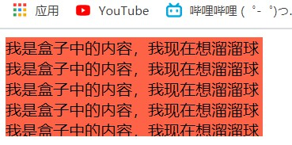

# day10

## 元素层级

- 在浏览器中，浮动元素会压住标准流元素，定位元素会压住浮动元素（即元素层级：标准流<浮动<定位）
- 在css样式中**z-index: ;**可以更改**定位元素**的层级，属性值为**数字（没有单位）**，数字越大层级越高

## 图片与文字的垂直居中（vertical-align）

> **img图片和文字排列时底部会出现空隙**

- 原因在于图片与文字默认为基线对齐

- 使用vertical-align可以解决问题（样式需要加给图片元素）

  - vertical-align:top;---顶线线对齐

    

  - vertical-align:middle;---中线对齐

    

  - vertical-align:baseline;---基线对齐(默认情况)

  - vertical-align:bottom;---底线对齐

    

## 文字溢出效果---overflow

> ​	overflow本意为设置内容溢出的样式，比如说div盒子中设置了宽高，但是内容超出盒子大小，则会溢出

- overflow:

  - hidden---溢出隐藏

    

  - scroll---显示滚动条

    

  - auto---只有需要的时候才会出现滚动条

    

## CSS中设置隐藏的方式

- `overflow:hidden`

  - 只能隐藏内容
  - 自身元素不隐藏

- `visibility:hidden`

  - 隐藏自身元素以及内容

  - 自身位置保留

    

- `display:none`

  - 隐藏元素自身以及内容

  - 不占据原有位置，可以看成是元素的删除

    

|         属性          |       作用       |            特点            |
| :-------------------: | :--------------: | :------------------------: |
|  `overflow：hidden;`  | 超出**内容隐藏** | 超出盒子部分的**内容隐藏** |
| `visibility：hidden;` | 元素**本身隐藏** |     在页面中**占位置**     |
|   `display：none;`    | 元素**本身隐藏** |    在页面中**不占位置**    |

## 元素本身透明（opacity）

> 除了可以让背景颜色透明之外，还可以让元素整体（包括里面的内容）一起透明

**代码：** `opacity:0` 

**取值：** 0~1之间的一位小数

**注意点：**

- opacity会让元素整体透明，包括里面的内容（文字或者子元素）

