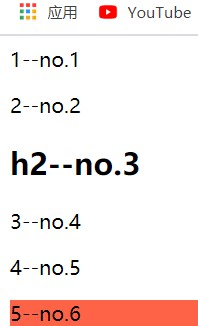

# day11

## 精灵图（sprite）

> 出现的原因在于减少前端对后台的图片请求次数，将小图片作为一张大图发送给前端

- 用法：

  - 盒子 + 背景 + 背景位置

  - 1、摆放盒子在适合的地方，盒子的内容大小和精灵图中需要的图片大小一致

    ```css
    div {
        width: 24px;
        height: 24px;
        background: url(./taobao.png);
        border: 5px solid #000;
    }
    ```

    

  - 2、配合背景位置可以更改想要的图片，**注意点**：移动时候需要是**图片移动**，背景图片默认是左上角和盒子对齐，所以移动时多是**负值**填入，移动图片。

    ```css
    div {
        width: 24px;
        height: 24px;
        background: url(./taobao.png) 0 -220px;
        border: 5px solid #000;
    }
    ```

    

## 字体图标

> 字体图标的本质是字体
>
> 不会因为网页放大而失真，可以获得文字的所有属性，方便更改css样式，也方便与布局

- 用法：

  - 1、下载需要的字体图标

  - 2、在html文件中引入字体图标的css的样式

    ```html
    <link rel="stylesheet" href="fonts/iconfont.css">
    ```

  - 3、通过增加类名使用(第一类名不能更改，第二类名换成需要的类名)

    ```html
    <i class="iconfont icon-refresh"></i>
    ```

    ```html
    <html>
    <head>
        <link rel="stylesheet" href="./fonts/iconfont.css">
    </head>
    <body>
        <span class="iconfont icon-caidan"></span>
        <span class="iconfont icon-aixin"></span>
        <span class="iconfont icon-Dyanjing"></span>
    </body>
    </html>
    ```

    

  - ps-01：网上下载的字体文件包中的**html文件**就是说明书

  - ps-02：设置字体图标样式时，注意**层叠性**问题！！（通过iconfont类名找到i标签）

  - ps-03：**不能**改变字体图标的font-family，否则样式不生效

## 结构伪类选择器

- `元素:first-child`

  - 选择元素父级中第一个子元素

    ```html
    <html>
    <head>
        <style>
            li:first-child {
                background: tomato;
            }
        </style>
    </head>
    <body>
        <ul>
            <li>1</li>
            <li>2</li>
            <li>3</li>
            <li>4</li>
            <li>5</li>
        </ul>
    </body>
    </html>
    ```

    

- `元素:last-child`

  - 选择元素父级中第一个子元素

    ```css
    li:last-child {
        background: tomato;
    }
    ```

    

- `元素:nth-child(n)`

  - 选择元素父级中第**n**个子元素

    ```css
    li:nth-child(3) {
        background: tomato;
    }
    ```

    

- ps：上述结构伪类中只是在**元素所在父级**中排序，选择对应顺序的**元素**，即如果选择元素排序不对则**选择不生效**

  ```html
  <html>
  <head>
      <style>
          p:nth-child(3) {
              background: tomato;
          }
      </style>
  </head>
  <body>
      <div>
          <p>1--no.1</p>
          <p>2--no.2</p>
          <h2>h2--no.3</h2>
          <p>3--no.4</p>
          <p>4--no.5</p>
          <p>5--no.6</p>
      </div>
  </body>
  </html>
  ```

  

  ```css
  p:nth-child(4) {
      background: tomato;
  }
  ```

  

- `元素:nth-of-type(n)`

  - 可以解决上述问题，表示将元素父级中的**同类元素排序**并选取

    ```html
    <html>
    <head>
        <style>
            p:nth-last-of-type(5) {
                background: tomato;
            }
        </style>
    </head>
    <body>
        <div>
            <p>1--no.1</p>
            <p>2--no.2</p>
            <h2>h2--no.3</h2>
            <p>3--no.4</p>
            <p>4--no.5</p>
            <p>5--no.6</p>
        </div>
    </body>
    </html>
    ```

    

- ps:`元素:nth-last-of-type`表示倒数，也表示元素按照**类型排列**之后的倒数

  ```html
  <html>
  <head>
      <style>
          p:nth-last-of-type(4) {
              background: tomato;
          }
      </style>
  </head>
  <body>
      <div>
          <p>5--no.1</p>
          <p>4--no.2</p>
          <h2>h2--no.3</h2>
          <p>3--no.4</p>
          <p>2--no.5</p>
          <p>1--no.6</p>
      </div>
  </body>
  </html>
  ```

  

