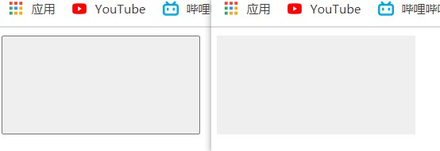
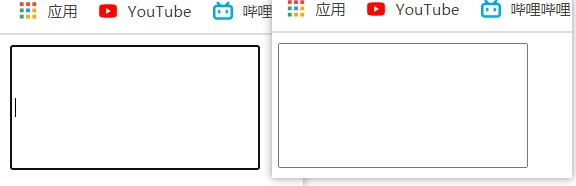
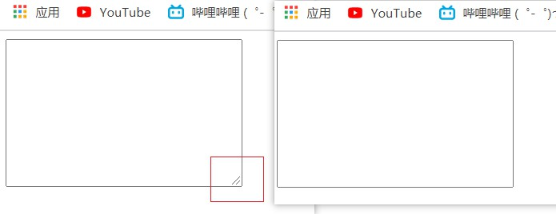
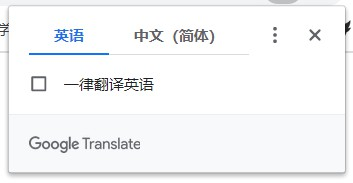
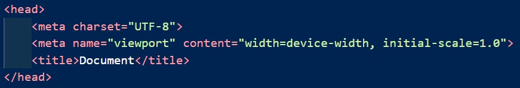
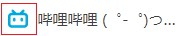

# day12

## 样式初始化补充

- `border:none;`---清除边框

  ```html
  <html>
  <head>
      <style>
          button {
              width: 200px;
              height: 100px;
              border: none;
          }
      </style>
  </head>
  <body>
      <button></button>
  </body>
  </html>
  ```

  

- `outline-style:none;`---清除轮廓线

  ```html
  <html>
  <head>
      <style>
          input {
              width: 200px;
              height: 100px;
              outline-style: none;
          }
      </style>
  </head>
  <body>
      <input type="text">
  </body>
  
  </html>
  ```

  

- `resize:none;`---禁止用户拖拽拉伸文本域

  ```html
  <html>
  <head>
      <style>
          textarea {
              resize: none;
          }
      </style>
  </head>
  <body>
      <textarea cols="30" rows="10"></textarea>
  </body>
  </html>
  ```

  

## 结构标签的认识

- `<!DOCTYPE html>`

  - DOCTYPE---文档类型标签
  - html---表示文档类型为html5的网页

- `<html lang="en"></html>`

  - html---根标签

  - lang---表示网页显示的语言（大部分语言）（可能触发浏览器的自动翻译功能）

    

  - en---表示英语、zh-CN---中文

- head---放置**网页配置标签**和**引入文件标签**

  

- body---html的主体内容

- meta--- 设置网页的元素信息

  ```html
  <meta charset="UTF-8">---字符编码
  ```

- title---页面标题（SEO权重占比很大）

  - `<h1></h1>`作为大多数网站的logo和新闻标题的标签，SEO占比也很大

## SEO：搜索引擎优化

- Search Engine Optimization---提升网页在浏览器的显示排名
- 提升方法
  - 1、花钱---买
  - 2、后缀名为`.html`的网页文件比其他后缀的，可以提升网页排名
  - 3、结构语义化优秀可以提升网页排名

## icon图标

- 作为网页标签中网页标题前的小图标

  

- 通过网站转换后的后缀为`.icon`的图片文件可以通过**link**引入html文件

  - `<link rel=" shortcut icon" href="favicon.ico的pathname" />`

## TDK页面seo三大标签

- Title---标题（第一重要，具有不可替代性），搜索引擎了解网页的入口和对网页主题的归属的最佳判断点

  ```html
  <title>Document</title>
  ```

- Description---描述（网站总体业务和主题概括）

  ```html
  <meta name="description" content="……">
  ```

- Keywords---关键字

  ```html
  <meta name="Keywords" content="…，…，…，…">
  ```

