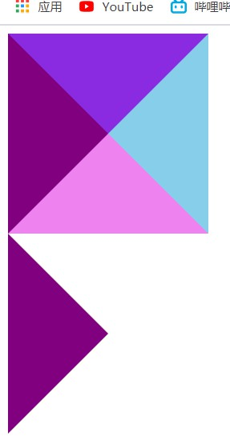
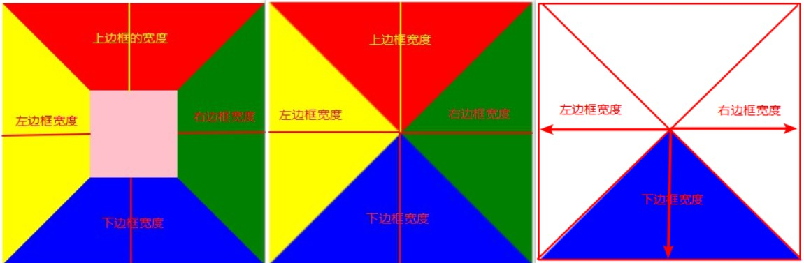
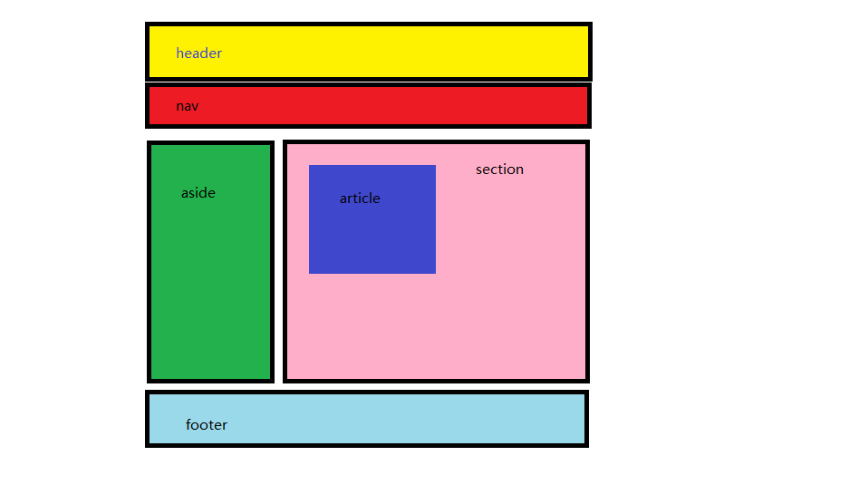
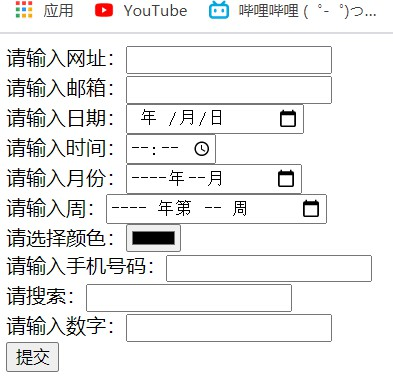
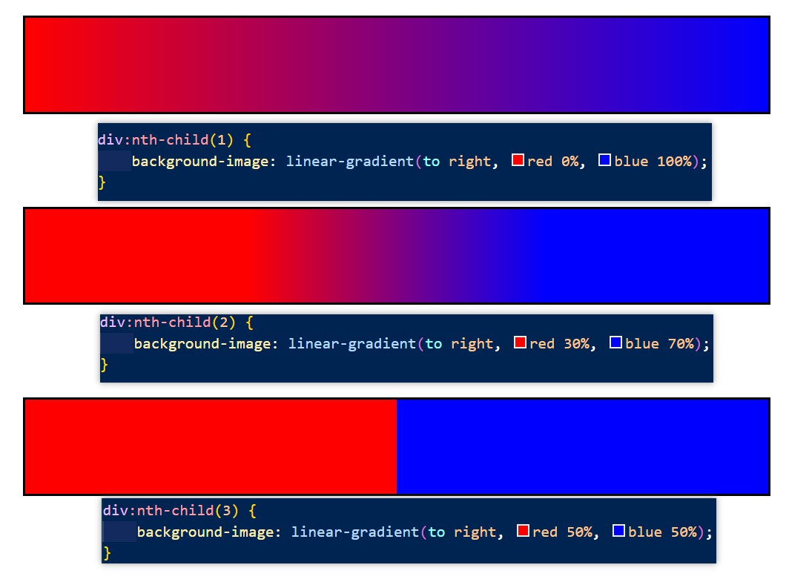

# day13

## 鼠标样式

- **cursor属性**
  - **default** ：光标为一个箭头（默认样式） 
  - **pointer** ：光标为一只小手（a标签的默认样式）
  - **text** ：此光标指示文本 ---竖线光标
  - **move**：显示十字光标（表示可移动的效果）

## CSS画三角形

- **1、画出一个盒子**

- **2、将width和height设置成0**

- **3、设置边框border**

- **4、留下需要的三角，将其他三角颜色设置成透明**

  ```html
  <html>
  <head>
      <style>
          /* 	
          	1、 画出一个盒子
  			2、将width和height设置成0
  			3、设置边框border
  		 */
          div:first-child {
              width: 0;
              height: 0;
              border: 100px solid purple;
              border-bottom: 100px solid violet;
              border-right: 100px solid skyblue;
              border-top: 100px solid blueviolet;
          }     
          /* 4、留下需要的三角，将其他三角颜色设置成透明 */
          div:last-child {
              width: 0px;
              height: 0px;
              border-width: 100px;
              border-style: solid;
              border-color: transparent transparent transparent purple;
          }
      </style>
  </head>
  <body>
      <div></div>
      <div></div>
  </body>
  </html>
  ```

  

- ps:颜色的透明可以用**rgba（）**也可以直接使用关键字**transparent**

  

## HTML5新增的标签（多用于移动端）

- **新增的语义化标签**

  - header---网页头部

  - nav---网页导航

  - aside---网页侧边栏

  - section---网页区块

  - article---网页文章部分

  - footer---网页底部

    

- **多媒体标签**

  - audio
    - src：音频的路径
    - controls：是否显示播放控件
    - autoplay：自动播放（**有兼容性问题**）
    - loop：循环播放（**有兼容性问题**）
  - video
    - src：视频的路径
    - controls：是否显示播放控件 

    - autoplay：自动播放（**有兼容性问题**）
      - 拓展：谷歌浏览器禁止了自动播放，如果想要自动播放的效果，可以设置 muted属性

    - loop：循环播放（**有兼容性问题**）

- **新增表单type属性值**

  ```html
  <!-- html5新增的表单标签：更多的用于移动端：-->
  <form>
    <!-- 网址输入框：会校验用户输入格式是否为网址，如果格式不正确无法提交 -->
    请输入网址：<input type="url" name="url"><br>
  
    <!-- 邮箱输入框：会校验格式 -->
    请输入邮箱：<input type="email" name="email"><br>
  
    <!-- 日期输入框 -->
    请输入日期：<input type="date" name="date"><br>
  
    <!-- 时间输入框 -->
    请输入时间：<input type="time" name="time"><br>
  
    <!-- 月份输入框 -->
    请输入月份：<input type="month" name="month"><br>
  
    <!-- 周输入框 -->
    请输入周：<input type="week" name="week"><br>
  
    <!-- 颜色选择框 -->
    请选择颜色：<input type="color" name="color"><br>
  
    <!-- 手机号码输入框 -->
    请输入手机号码：<input type="tel" name="tel"><br>
  
    <!-- 搜索框 -->
    请搜索：<input type="search" name="search"><br>
  
    <!-- 数字输入框：只能输入数字类型的数据 -->
    请输入数字：<input type="number" name="number"><br>
  
  
    <input type="submit">
  </form>
  ```

  | type的属性值 |                   功能描述                   |
  | :----------: | :------------------------------------------: |
  |     url      |   限制用户输入的必须为URL格式（如：网址）    |
  |    email     |       限制用户输入必须为Email格式格式        |
  |   **date**   | 限制用户输入必须为日期格式（显示日期选择框） |
  |     time     | 限制用户输入必须为时间类型（显示时间选择框） |
  |    month     |   限制用户输入必须为月类型（显示月选择框）   |
  |     week     |   限制用户输入必须为周类型（显示周选择框）   |
  |    color     |                显示颜色选择器                |
  |   **tel**    |     手机号码输入框（只在移动设备上有效）     |
  |  **search**  |                    搜索框                    |
  |    number    |                 输入数字格式                 |

  

- **新增的表单属性**

  |      属性名      |               属性值                |                           功能描述                           |
  | :--------------: | :---------------------------------: | :----------------------------------------------------------: |
  | **placeholder**  |              任意文字               |                  占位符（用于提示用户输入）                  |
  |  **autofocus**   |         autofocus（可省略）         |                   当页面加载时自动获取焦点                   |
  | **autocomplete** | on：打开自动完成；off：关闭自动完成 | 规定input是否应该启用自动完成功能（**需要配合name属性一起使用**） |
  |   **required**   |         required（可省略）          |                  规定这个input的值是必填的                   |

## css3新内容

- **结构伪类选择器**

- **css3的盒模型：自动内减：box-sizing：border-box**

- **伪元素 ::after ::before**

- **属性选择器**（多用在input标签的查找）

  |     选择器     |                      查找规则                      |
  | :------------: | :------------------------------------------------: |
  |    E[attr]     |             选择具有attr属性 的 E元素              |
  | E[attr="val"]  |  选择具有attr属性并且**属性值*等于***val 的 E元素  |
  | E[attr^="val"] | 选择具有attr属性并且**属性值以val*开头*** 的 E元素 |
  | E[attr$="val"] | 选择具有attr属性并且**属性值以val*结尾*** 的 E元素 |
  | E[attr*="val"] |  选择具有attr属性并且**属性值*包含*val** 的 E元素  |

- **过渡属性transition**
  
  - transition-duration---过渡持续时间（时间单位s--秒）
  - transition-property---需要过渡的属性
    - all--默认值，全部能够过度的属性全部选中
    - 属性名，写谁谁过度
  - transition-timing-function---过渡的时间曲线
    - ease---默认，先加速再减速
    - linear---线性，匀速
    - steps（“步数”）---分段走
  - transition-delay---过渡延时开始
  - ps：**transition连写**时第一个时间表示**过度持续时间**，如果存在第二个时间值，才表示延时
  - ps：谁进行过渡变化**transition**就加在谁的身上
  - ps：**transition**只作用于存在**中间状态的属性**
  - 例如：display：none；---display：block；不存在过渡
  
- **文字阴影---text-shadow**

  ```css
  text-shadow:水平偏移 垂直偏移 模糊度 阴影颜色;
  ```

  |    值    |               描述               |
  | :------: | :------------------------------: |
  | h-shadow | 必需。水平阴影的位置。允许负值。 |
  | v-shadow | 必需。垂直阴影的位置。允许负值。 |
  |   blur   |        可选。模糊的距离。        |
  |  color   |        可选。阴影的颜色。        |
  - 上述四个值为一组，可以设置**多组**文字阴影，两组阴影数值之间用**逗号**隔开

- **盒子阴影---box-shadow**

  ```css
  box-shadow:水平阴影 垂直阴影 模糊距离 （外延值） 阴影颜色  （内阴影）；
  ```

  |    值    |                   描述                   |
  | :------: | :--------------------------------------: |
  | h-shadow |     必需。水平阴影的位置。允许负值。     |
  | v-shadow |     必需。垂直阴影的位置。允许负值。     |
  |   blur   |             可选。模糊距离。             |
  |  spread  |            可选。阴影的尺寸。            |
  |  color   |            可选。阴影的颜色。            |
  |  inset   | 可选。将外部阴影 (outset) 改为内部阴影。 |

  - ps：**默认**阴影是外部阴影，但是不能主动设置**outset**这个属性值。如果想要**内部阴影**，请设置**inset** 

- **背景图片大小：background-size**

  - “数字”+“px”

  - 百分比（相对于盒子的宽高百分比）

  - 关键字

    - **contain（包含）**：将背景图片等比例缩放，直到**不会超出盒子**的最大
    - **cover（覆盖）**：将背景图片等比例缩放，直到**填满整个盒子刚好**没有空白

  - ps：在设置`background-size` 和`background`连写的时候注意覆盖问题

    - 要么单独写的写在连写的下面
    - 要么单独写的写在连写的里面

    ```css
    /* 连写完整版中，也有background-size属性，注意连写的覆盖问题 */
    background：color image repeat attachment position / size
    ```

- **背景渐变background-image** 

  - 线性渐变：background-image：linear-gradient（）

    - 参数

      - 方向，颜色 范围，颜色 范围……(可以设置多组数值)

    - 方向（默认从上往下）

      - 关键词：**to top**、**to right**、**to bottom**、**to left**
      - 角度：“数字”+**deg**

    - 范围---百分比（从百分比开始渐变，如果之前或者之后没有其他颜色则默认不渐变）

      

  - 径向渐变：background-image：radial-gradient（）---基本同上

    - 参数
      - 半径 at 圆心位置，颜色 范围，颜色 范围……
    - 圆心位置---取值同background-position取值
    - 范围---百分比（圆心到圆边，半径长度的渐变，如果之前或者之后没有其他颜色则默认不渐变）

- **滤镜：filter**

  - blur（）---模糊度---“数字”+px（数字越大越模糊）

  - grayscale（）---灰度---百分比（0%--无灰度，100%--逐渐变灰）

    ```css
    /* 模糊度：数字+px——》0px表示不模糊无变化，越大越模糊 */
    filter: blur(0px);
    
    /* 转换成灰度图像：百分比（0%~100%）——》0%无变化，100%完全转换成灰度图像 */
    filter: grayscale(0%);
    ```

    

# H5的说法

- 狭义的H5表示HTML5的版本标签
- 广义来说H5表示了html5本身+css3+JavaScript

