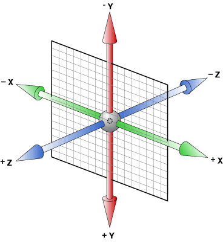

# day14

## 2D转换

- ### 缩放（scale）

  - **scale()**指定对象的2D scale（2D缩放）。

    - 第**一**个参数（纯数字，表示倍数，没有单位，数值大于0）对应**X轴**，第二个参数（纯数字，表示倍数，没有单位，数值大于0）对应**Y轴**。
    - 如果第二个参数未提供，则默认取第一个参数的值（进行**等比例缩放**）
    - 默认转换原点为**中心点**

  - **scalex()** 

    - 指定对象X轴的（水平方向）缩放 

  - **scaley()**

    - 指定对象Y轴的（垂直方向）缩放 

  - ps：缩放时**不影响**(不会挤开)其他盒子

    

- ### 平移（translate）

  - **translate()** 指定对象的2D translation（2D平移）。
    - 第一个参数（“数字”+px、百分比、百分比参照自身做出变化）对应**X轴**，第二个参数（“数字”+px、百分比、百分比参照自身做出变化）对应Y轴。
    - 如果第二个参数未提供，则默认值为0 
  - **translatex()**
    - 指定对象X轴（水平方向）的平移 
  - **translatey()**
    - 指定对象Y轴（垂直方向）的平移 
  - ps：平移时**不影响**(不会挤开)其他盒子

- ### 旋转（rotate）

  - **rotate()**指定对象的2D rotation（2D旋转）。

    - 参数为“数字”+deg（角度）

    - 正值表示顺时针

      ```css
      transform: rotate(360deg);
      ```

      

    - 负值表示逆时针

      ```css
      transform: rotate(-360deg);
      ```

      

  - ps：旋转时**不影响**(不会挤开)其他盒子

- ###transform连写

  - 以第一个属性为主要转换属性

    ```css
    transform: translate(200px) rotate(-360deg);
    ```

    

    ```css
     transform: rotate(-360deg) translate(200px);
    ```

    

- ###转换原点（transform-origin）

  - 可用百分比指定坐标值。可以为负值。 

  - 可用长度值指定坐标值。可以为负值。 

  - x轴

    - left： 指定原点的横坐标为left 
    - center①： 指定原点的横坐标为center 
    - right： 指定原点的横坐标为right 

  - y轴

    - top： 指定原点的纵坐标为top 

    - center②： 指定原点的纵坐标为center 

    - bottom： 指定原点的纵坐标为bottom 

    - ```css
      “相册”倒下时是transform-origin:bottom center;
      “相册”翻页时是transform-origin:left center;
      ```

    

## 3D转换

- ### 坐标系

  

  - **x轴：** 浏览器中水平向右是x轴正方向

  - **y轴：** 浏览器中垂直向下是y轴正方向

  - **z轴：** 做浏览器平面垂直向脸方向是z轴正方向

- ### 视距（perspective）

  - `perspective` 属性给父元素设置，可以让其子元素有近大远小的效果。

- ### 子元素空间内定位（transform-style）

  - flat：指定子元素位于此元素所在平面内 
  - preserve-3d：指定子元素定位在三维空间内 

- ### 3D旋转（rotate3D）

  - translate3d()：指定对象的3D位移。第1个参数对应X轴，第2个参数对应Y轴，第3个参数对应Z轴，**参数不允许省略** 
  - translatez()：指定对象Z轴的平移 

- ### 3D平移（translate3D）

  - rotate3d()：指定对象的3D旋转角度，其中前3个参数分别表示旋转的方向x,y,z，第4个参数表示旋转的角度，**参数不允许省略** 
  - rotatex()：指定对象在x轴上的旋转角度 
  - rotatey() ：指定对象在y轴上的旋转角度 
  - rotatez()：指定对象在z轴上的旋转角度 

## 动画效果

- ### 动画定义

  - ```css
    @keyframes 动画名{
        from(相当于0%){动画效果}
        to(相当于100%){动画效果}
    }
    ============================
    @keyframes 动画名{
        /*可以添加任意0~100%之间作为动画关键帧*/
        0%{动画效果}
        10%{动画效果}
        20%{动画效果}
        ……
        100%{动画效果}
    }
    ```

  - 

- ### 动画调用

  - ```css
    animation: name duration timing-function delay iteration-count direction fill-mode;
    ```

    - name ---动画名

      - 同定义的动画名
- duration ---动画单轮一次的时间
    
  - 单位（s---秒）
    - timing-function ---时间曲线，动画运动方式

      - ease ---先加速播放，播放到找中间后再减速播放（默认）
  - linear---匀速播放
      - steps（“步数”）---单步播放
    - delay ---延时播放时间
    
  - 单位（s---秒）
    - iteration-count ---播放次数

      - 可填具体数字
  - infinite---循环播放
    - direction ---是否倒放

      - normal： 正常方向 
      - reverse： 反方向运行 
  - **alternate： 动画先正常运行再反方向运行，并持续交替运行** 
      - alternate-reverse： 动画先反运行再正方向运行，并持续交替运行 
- fill-mode ---动画播放结束后的位置
    
      - none： 默认值。不设置对象动画之外的状态 
      - forwards： 设置对象状态为动画**结束时**的状态 
      - backwards： 设置对象状态为动画**开始时**的状态 
  - both： 设置对象状态为动画结束或开始的状态 
    - animation-play-state ---动画播放/暂停
  - running： 运动 
      - paused： 暂停 

