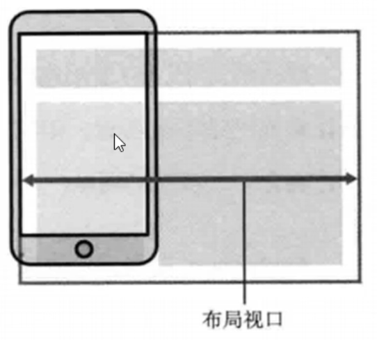
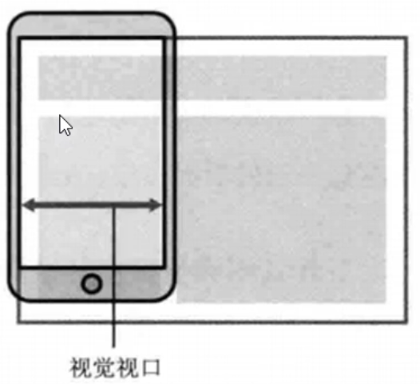
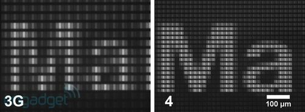
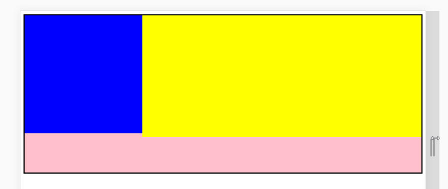
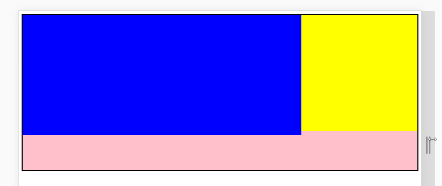
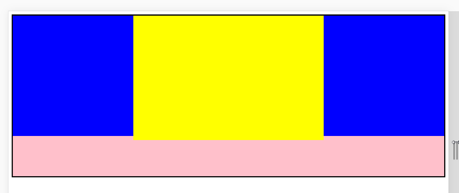

# day15

## 私有前缀

> 私有前缀是为了兼容老版本浏览器的写法
>
> - 对于新版本的浏览器无需添加。
>
> - 如果需要兼容老版本浏览器，需要在css3属性前添加私有前缀。

- ### -webkit-[chrome、safari]---谷歌、苹果浏览器

- ### -ms-[IE]---IE浏览器

- ## -moz-[firefox]---火狐llq

- ###-o-[opera]---欧朋浏览器

  ```css
      /*谷歌浏览器和safari浏览器的前缀 -webkit-*/
      -webkit-transform: rotate(45deg);
      /*火狐浏览器的前缀 -moz-*/
      -moz-transform: rotate(45deg);
      /*ie浏览器的前缀 -ms-*/
      -ms-transform: rotate(45deg);
      /*opera浏览器的前缀 -o-*/
      -o-transform: rotate(45deg);
      /*规范阶段的标准写法*/
      transform: rotate(45deg);
  ```

## 视口

- ### viewport

  - layout viewport(布局视口)

    

  - visual viewport(视觉视口)

    

  - ideal viewport（理想视口）

- ## meta标签的设置视口

  ```html
  <meta name="viewport" content="width=device-width, user-scalable=no, initial-scale=1.0, maximum-scale=1.0, minimum-scale=1.0">
  ```

  |     属性      |                    解释说明                    |
  | :-----------: | :--------------------------------------------: |
  |     width     | 设置视口的宽度，device-width表示当前设备的宽度 |
  | user-scalable |          设置用户是否可以缩放，yes/no          |
  | initial-scale |                   初识缩放比                   |
  | maximum-scale |                   最大缩放比                   |
  | minimum-scale |                   最小缩放比                   |

## 二倍图

- ### 移动端开发时以*多个物理像素(分辨率)*代表一个*CSS像素(px)*

  - 其实pc端和早期的手机屏幕确实设备像素比是1:1，即：1px==1个物理像素（发光点）

  - 后面随着技术的发展，出现了比如：**Retina（视网膜屏幕）**显示技术，可以将把更多的物理像素点压缩至一块屏幕，即1px==多个物理像素（发光点），从而达到更高的分辨率，并提高屏幕显示的细腻程度。

    

## 移动端开发

- 将pc端和移动端分开设计网页(单独制作移动端网站）

  - 流式布局（百分比布局）

  - flex弹性布局

  - less+rem+媒体查询布局
  - 混合布局

- 进行响应式布局

  - 媒体查询
  - bootstarp（框架）

## 流式布局

- **布局特征：**
  - 一般盒子高度写死，宽度百分比或者自适应
  - 小图片、小图标、文字大小一般写死
  - 大图片一般宽度自适应（100%），高度不设置让其等比例缩放
  - 宽设百分比，高根据内容

- **经典的布局：**

  - 左侧固定，右侧自适应

    

  - 右侧固定，左侧自适应

    

  - 左右固定，中间自适应

    

  - 等分布局

- ps：overflow：hidden---触发bfc（block formatting context --块级格式化上下文）---变为独立渲染区域

  - 1.解决margin-top的塌陷
  - 2.清除浮动
  - 3.不会位于浮动元素之下