# day16

##flex布局（弹性布局、伸缩布局）

### 特点

- 操作方便、布局简单、广泛用于**移动端页面**
- PC端支持较差，IE 11或更低的版本可能不兼容或者兼容部分

### 使用

- 给父元素添加`display:flex;`
- 可以给父元素添加**属性和属性值**改变父元素内子元素盒子的排列方式
- 可以给子元素添加**属性和属性值**改变自身在父元素中的的排列方式

### 属性

- #### display:flex;

  - 添加给父元素，改变父元素内子元素的特性和布局

- #### 前置知识

  - 弹性布局中存在**主轴**和**测轴**的概念
    - 主轴默认同x轴的正方向，指向右侧
    - 测轴默认同y轴的正方向，指向下侧
  - 父盒子又叫**flex容器**
  - 子元素盒子又叫**flex项目**

- ####justify-content---主轴对齐方式

  - ```css
    /*
    	1、子元素向主轴行起始位置对齐
    	2、所有后续的伸缩盒项目（子元素盒子）与其前一个项目对齐
    */
    justify-content:flex-start; 
    ```

    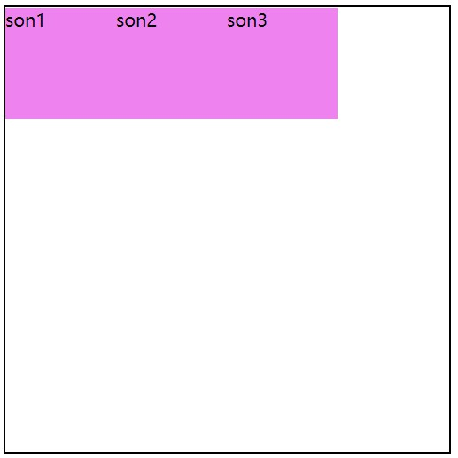

  - ```css
    /*
    	1、弹性盒子元素将向行中间位置对齐
    	2、子元素将相互对齐并在行中居中对齐
    	3、第一个元素与最后一个元素距离两边的距离相同 
    */
    justify-content: center;
    ```

    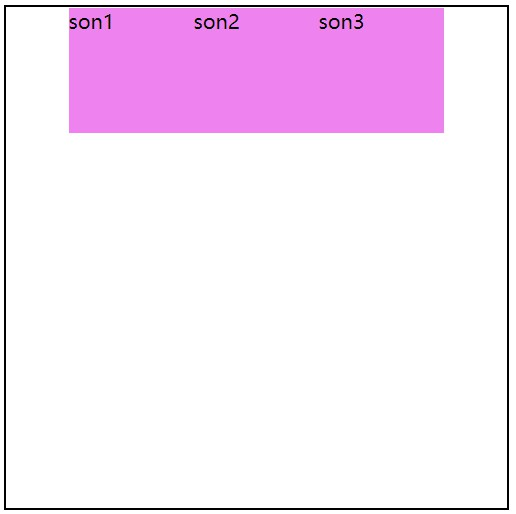

  - ```css
    /*
    	1、弹性盒子元素将向行结束位置对齐
    	2、该行的第一个子元素的结束位置的边界将与该行的主结束位置的边界对齐
    	3、同时所有后续的伸缩盒项目与其前一个项目对齐
    */
    justify-content: flex-end;
    ```

    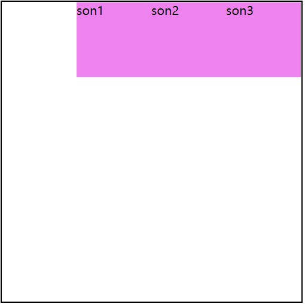

  - ```css
    /*
    	1、子元素会平均地分布在行里，两端保留子元素与子元素之间间距大小的一半
    	2、如果只有一个伸缩盒项目，则该值等效于'center'
    */
    justify-content: space-around;
    ```

    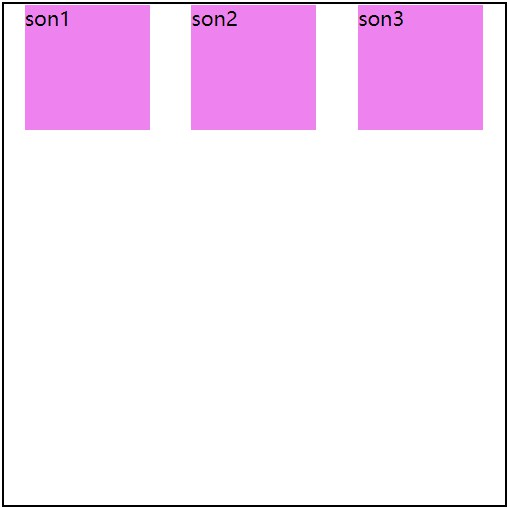

  - ```css
    /*
    	1、弹性盒子元素会平均地分布在行里，并确保两两之间的空白空间相等
  2、如果只有一个子元素，则该值等效于'flex-start'
    */
  justify-content: space-between;
    ```
    
    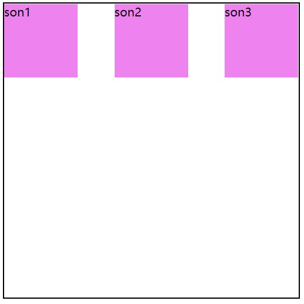

  - ```css
  /*
    	1、子元素会平均地分布在行里，子元素之间的间距一致
  */
    justify-content: space-evenly;
    ```
    
    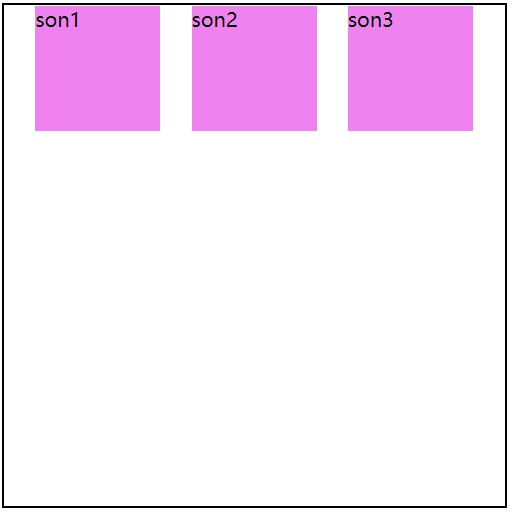
    

- #### flex-wrap---容器是否换行

  - ```css
    /*
    	1、flex-wrap默认为nowrap表示单行显示
    	2、该情况下flex子项可能会溢出容器 
    */
    flex-wrap: nowrap;
    ```

    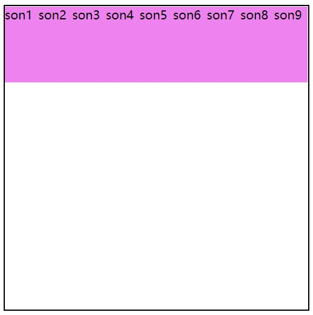

  - ```css
    /*
    	1、flex容器为多行
    	2、该情况下flex子项溢出的部分会被放置到新行，子项内部会发生断行 
    	ps:分行情况下，默认每行总高度相等
    */
    flex-wrap: wrap;
    ```

    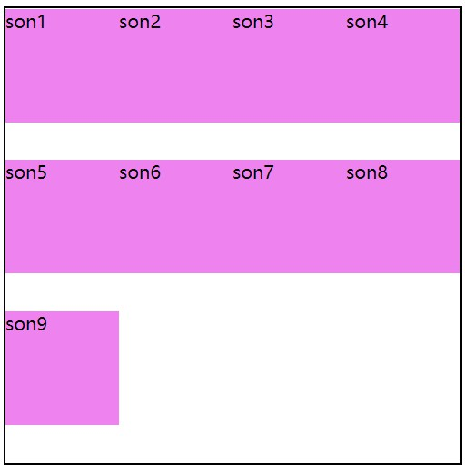

- #### align-items---**当前行的侧轴（纵轴）方向上的对齐方式**

  - ```css
    /*
    	1、弹性盒子元素的侧轴（纵轴）起始位置的边界紧靠住该行的侧轴起始边界。
    */
    align-items: flex-start;
    ```

    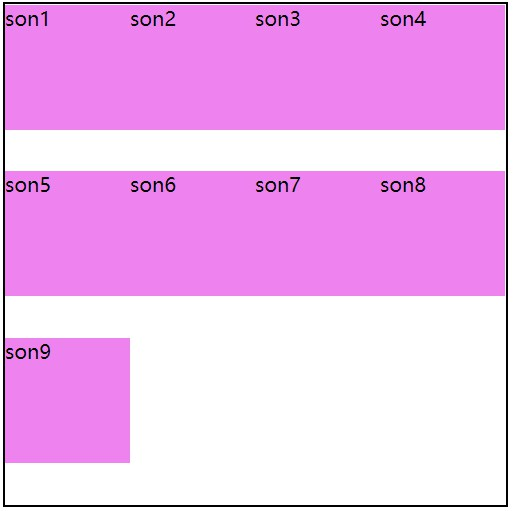

  - ```css
    /*
    	1、弹性盒子元素的侧轴（纵轴）起始位置的边界紧靠住该行的侧轴结束边界。
    */
    align-items: flex-end;
    ```

    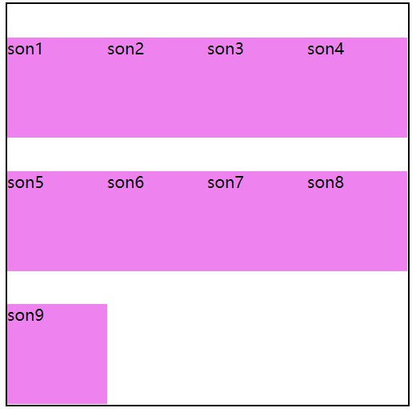

  - ```css
    /*
    	1、弹性盒子元素在该行的侧轴（纵轴）上居中放置。
    */
    align-items: center;
    ```

    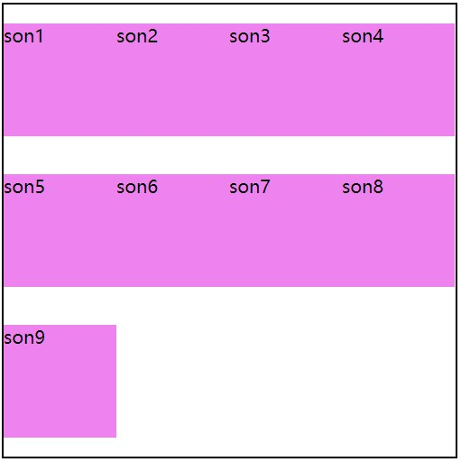

  - ```css
    /*
    	1、子元素没有指定具体的高度时会铺满父元素盒子（此项为默认选项）
    */
    align-items: stretch;
    ```

    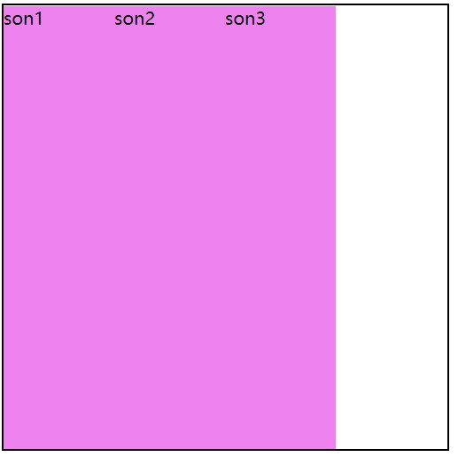

- #### align-content---多行的测轴对齐方式

  - ```css
    /*
    	1、各行向弹性盒容器的起始位置堆叠。
    */
    align-content: flex-start;
    ```

    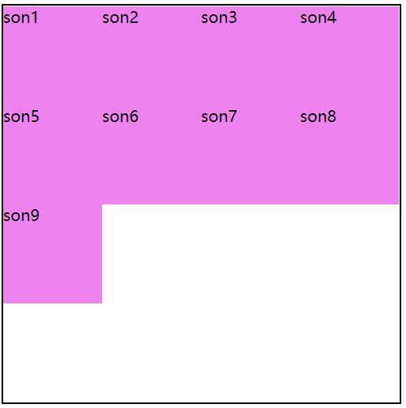

  - ```css
    /*
    	1、各行向弹性盒容器的结束位置堆叠。
    */
    align-content: flex-end;
    ```

    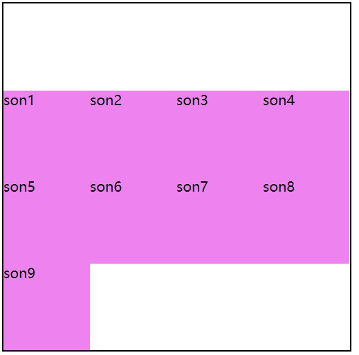

  - ```css
    /*
    	1、各行向弹性盒容器的中间位置堆叠
    	2、各行两两紧靠住同时在弹性盒容器中居中对齐
    	3、保持弹性盒容器的侧轴起始内容边界和第一行之间的距离与该容器的侧轴结束内容边界与第最后一行之间的距离相等
    */
    align-content: center;
    ```

    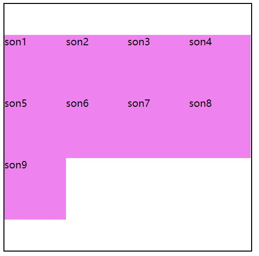

  - ```css
    /*
    	1、各行在弹性盒容器中平均分布，两端保留子元素与子元素之间间距大小的一半
    	2、如果弹性盒容器中只有一行，该值等效于'center'
    */
    align-content: space-around;
    ```

    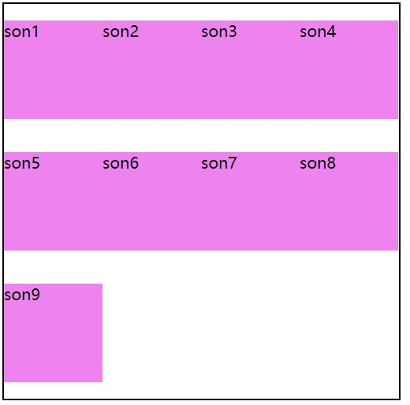

  - ```css
    /*
    	1、各行在弹性盒容器中平均分布
    	2、如果弹性盒容器中只有一行，该值等效于'flex-start'
    */
    align-content: space-between;
    ```

    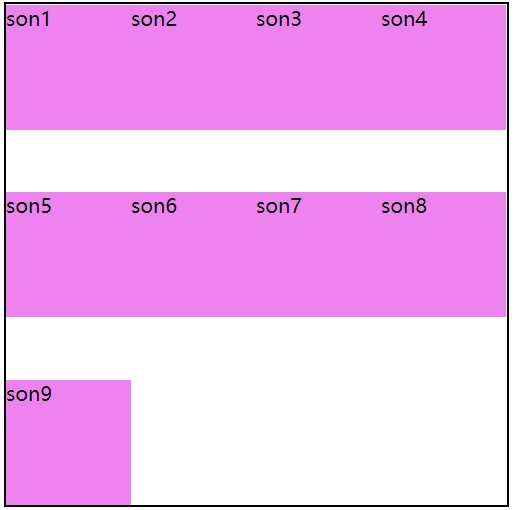

  - ```css
    /*
    	1、子元素高度没有明确数值时各行将会伸展以占用剩余的空间。
    */
    align-content: stretch;
    ```

    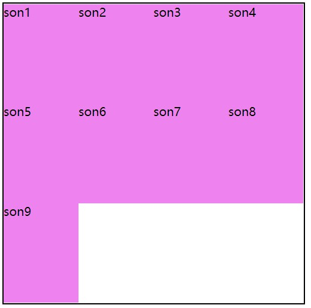

- #### flex-direction---定义flex容器的主轴方向

  - row： 主轴与行内轴方向作为**默认**的书写模式。即横向从左到右排列（左对齐）。 

    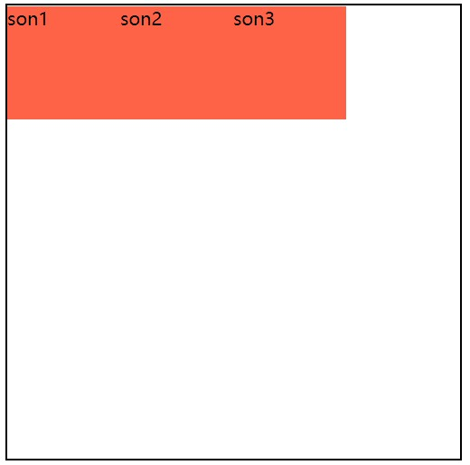

  - row-reverse： 对齐方式与row相反。 

    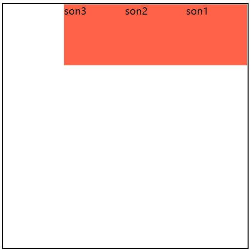

  - column： 主轴与块轴方向作为默认的书写模式。即纵向从上往下排列（顶对齐）。 

    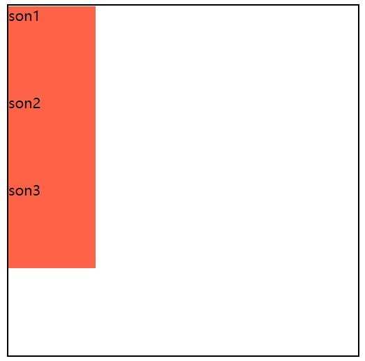

  - column-reverse： 对齐方式与column相反

    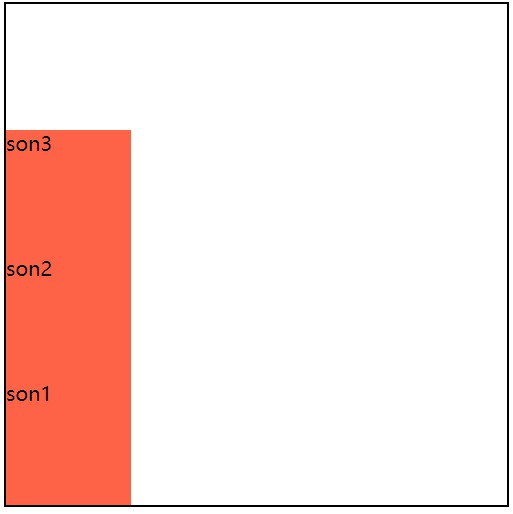

  - **ps:测轴永远与主轴垂直**

- #### 以上均为父元素内设置属性

- #### 以下为子元素内设置属性

- #### flex---子元素的占比（ps：会优先安排有具体width/height数值的子元素，其后剩下的空间按比分配）

  - ```html
    <html>
    <head>
        <style>
            .father {
                display: flex;
                width: 400px;
                height: 400px;
                margin: 100px auto;
                border: 2px solid #000;
                flex-wrap: wrap;
            }    
            .son:nth-child(1),
            .son:nth-child(3) {
                width: 100px;
                height: 100px;
                flex: 2;
                background-color: tomato;
            }      
            .son:nth-child(2) {
                width: 100px;
                height: 100px;
                flex: 1;
                background-color: violet;
            }
        </style>
    </head>
    <body>
        <div class="father">
            <div class="son">son1</div>
            <div class="son">son2</div>
            <div class="son">son3</div>
        </div>
    </body>
    </html>
    ```

    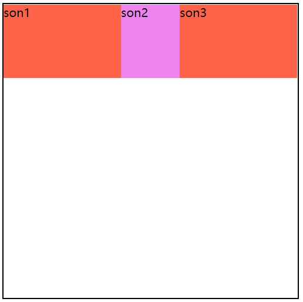

  - flex的属性值为数字，表示了该子元素会在行内占据的分数，如上图一行分为5份，son1、son3占据两份，son2占据一份

- ###align-self---flex子项单独在侧轴（纵轴）方向上的对齐方式

  - ```css
    .son1 {
        /*
         弹性盒子元素的侧轴（纵轴）起始位置的边界紧靠住该行的侧轴起始边界。
        */
        align-self: flex-start;
    }
    .son2 {
        /*
         弹性盒子元素在该行的侧轴（纵轴）上居中放置。
        */
        align-self: center;
    }
    .son3 {
        /*
         弹性盒子元素的侧轴（纵轴）起始位置的边界紧靠住该行的侧轴结束边界。
        */
        align-self: flex-end;
    }
    .son4 {
        width: 50px;
        background-color: skyblue;
        /*
        填满整个测轴，但同时会遵照'min/max-width/height'属性的限制
        */
        align-self: stretch;
    }
    ```

    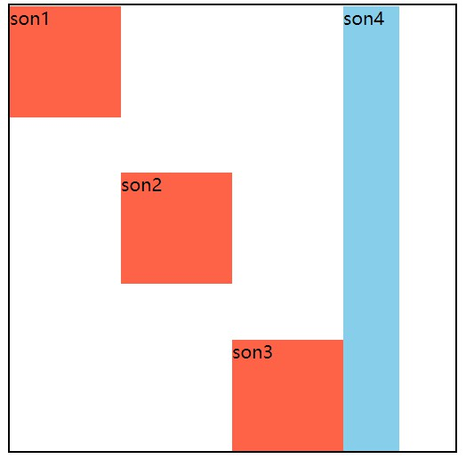

- ###order---**子元素出現的順序**（默认值为0，数字越小越靠前）

  - ```html
    <html>
    <head>
        <style>
            .father {
                display: flex;
                width: 400px;
                height: 400px;
                margin: 100px auto;
                border: 2px solid #000;
                flex-wrap: wrap;
            }       
            .son {
                width: 100px;
                height: 100px;
                background-color: tomato;
            }  
            .son1 {
                align-self: flex-start;
                order: 3;
            }    
            .son2 {
                align-self: center;
                order: 2;
            }   
            .son3 {
                align-self: flex-end;
                order: 1;
            }
        </style>
    </head>
    <body>
        <div class="father">
            <div class="son1 son">son1</div>
            <div class="son2 son">son2</div>
            <div class="son3 son">son3</div>
        </div>
    </body>
    </html>
    ```

    **结构为son1、son2、son3，但是表现形式来说，是son3在前**

    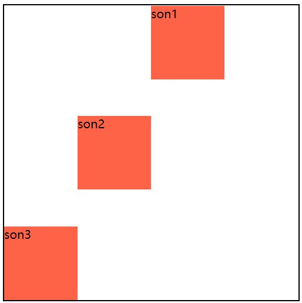