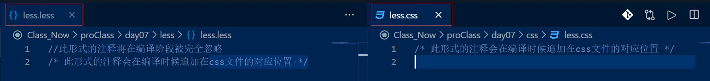
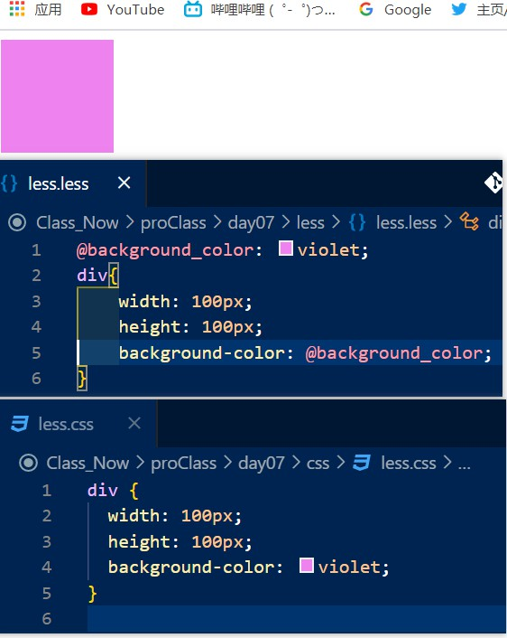
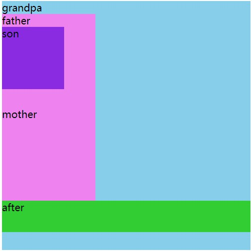
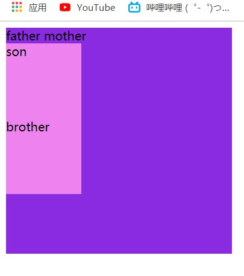
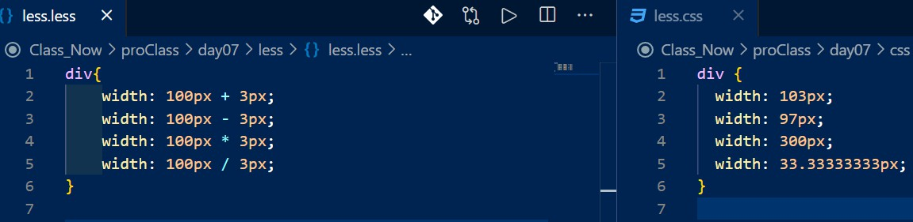
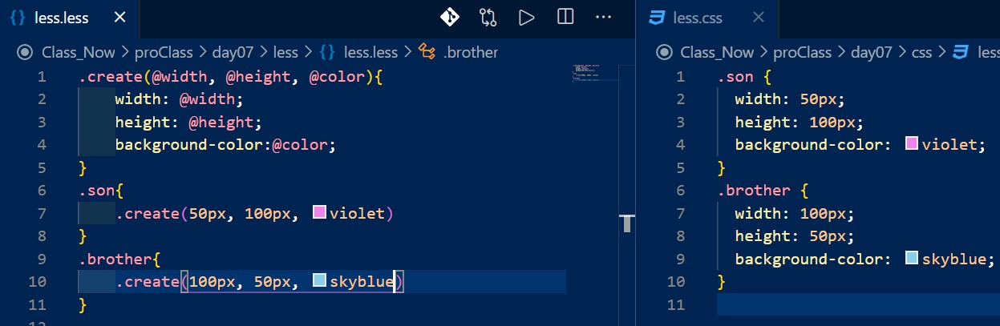
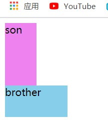
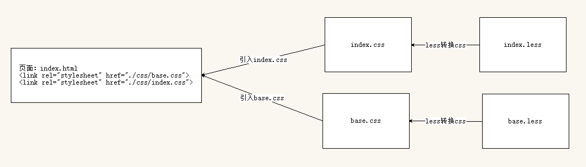
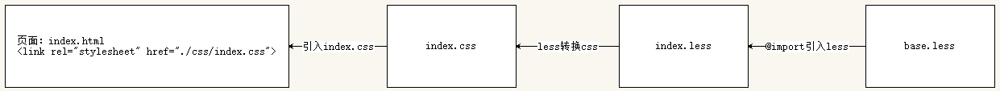
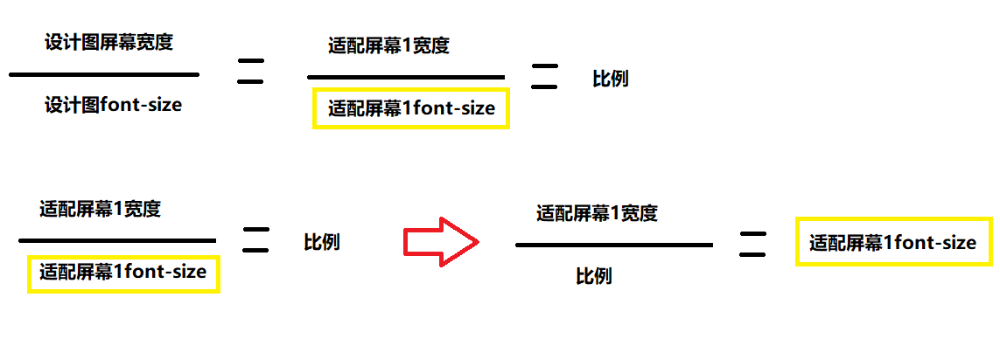

# day17

## less

- ####css预处理器

  - less是一种css的预处理语言，也叫做css的预处理器，扩展了变量、函数、运算等特性
  - 常见的css预处理器有：Less、Sass、Stylus

- #### 特点

  - 1、完全兼容css语法
  - 2、less文件需要编译之后才能使用，浏览器不能直接识别less文件
  - 3、html文件中引用的文件是less文件编译之后生成的css后缀文件
  
- #### 语法

  - 1、注释

    - less中完全兼容css文件中的注释形式

      ```css
      /* 此形式的注释会在编译时候追加在css文件的对应位置 */
      ```

    - less文件自身注释为双斜杠

      ```less
      //此形式的注释将在编译阶段被完全忽略
      ```

    

  - 2、变量

    - 变量定义：

      - `@变量名:值;`

    - 变量引用：

      - `@变量名`

      

    - 实现方式：

      - 变量定义不会出现在css文件中，而变量在less文件中引用后，变量对应的值将填入css文件对应位置

  - 3、嵌套

    - 用法：

      - less文件中可以遵循html文件中的节点结构进行选择器的嵌套

        ```html
        <body>
            <div class="grandpa">grandpa
                <div class="father">father
                    <div class="son">son</div>
                </div>
                <div class="mother">mother</div>
            </div>
        </body>
        ```

        ```less
        .grandpa{
            width: 400px;
            height: 400px;
            background-color: skyblue;
            // 1、后代选择器---选择器嵌套即可
            .son{
                width: 100px;
                height: 100px;
                background-color: blueviolet;
            }
            // 2、子代选择器---在选择器之前添加>（大于号箭头）即可
            >div{
                width: 150px;
                height: 150px;
                background-color: violet;
            }
            // 3、伪元素选择器---&（与号）即表示上一级选择器，其后则按照正常书写伪元素即可
            &::after{
                content: 'after';
                display: block;
                width: 100%;
                height: 50px;
                background-color: limegreen;
            }
            /*
            	其它伪类选择器也同上，&表示上一级选择器，其后按照正常选择器书写模式书写
              &:nth-child(1) {
                background-color: red;
              }
        
              &:hover {
                background-color: green;
              }
            */
        }
        ```

        

        ```less
        .father{
            width: 300px;
            height: 300px;
            background-color: skyblue;
            // 4、并集选择器---直接写，省去了查找父元素
            .son,
            .brother{
                width: 100px;
                height: 100px;
                background-color: violet;
            }
            //5、交集选择器---&（与号）即表示上一级选择器
            &.mother{
                background-color: blueviolet;
            }
        }
        ```

        

  - 4、运算

    - 运用

      - less文件中支持**加“+”，减“-”，乘“*”，除“/”**四则运算

      - 两数字与**运算符**之间存在空格

      - 结果会**直接**在css文件中计算得出

        

  - 5、函数

    - 函数就是一段具有**函数名称**的代码块，可以用来存放**重复**的代码

    - 语法：

      - ```less
        .函数名(参数, 参数){代码块}
        //器中函数名括号中可以加入参数,彼此通过逗号隔开
        //传入的参数会作用在（替换）函数代码块中的同名变量
        ```

    - 调用：

      - 在选择器中调用`.函数名([参数], [参数]);`---参数在函数定义时确定是否书写，有参函数需要填入参数，无参函数不必填参数

      

      

  - 6、less文件引用其它less文件

    - ```less
      @import '需要引入的less文件的路径';
      //结束加分号
      注意点：一般引入的文件写在最前面，保证自己的样式写在后，优先
      
      ```

    - **对比：**

      - 原来的分开引入：

        

      - 现在的@import合并引入：

        

## rem布局

- #### rem&em的了解

  - **em**
    - **当前**标签的font-size---font-size*em==px
  - **rem**(其中r表示root--根)
    - **html**标签的font-size---font-size*rem==px

- #### rem布局原理

  - 通过改变**html标签**的font-size控制其他**rem单位元素**的改变

- #### 媒体查询

  - 语法：
    - `media screen and (条件){}`
  - 条件：
    - min-width---样式生效的最小宽（实际网页宽度>=（大于等于）min-width时候生效）
    - max-width---样式生效的最大宽（实际网页宽度<=（小于等于）max-width时候生效）
    - width---样式生效的准确宽度（实际网页宽度==（正好等于）width时候生效）
  - **ps：**
    - 媒体查询相当于**屏蔽原有代码**，如果**不满足条件**，则被屏蔽的样式代码**不会出现**
    - 媒体查询，**不会**提升优先级，即权重不变，如果满足条件后代码权重没有后面的代码权重高则**会被覆盖**
    - `media screen and (条件)`单词和单词，单词和括号之间**空格**不能删除
    -  `media screen and (min-width:) and (max-width:)`---样式生效的范围（min-width<= 实际网页宽度 <=max-width）

- #### rem适配方案（其一）

  - less+rem+媒体查询

    

  - ```less
    /* 1、把px单位通过计算转换成rem单位（除以设计图尺寸屏幕中自定义的font-size：比如50px） */
    div {
        width: 8rem;
        height: 8rem;
        background-color: pink;
    }
    
    /* ---------------------------------------------------------------------------- */
    /* 2、保持比例相同，进行不同屏幕的适配 */
    /* 
    此时需要适配640px的屏幕的font-size
    比例：15
    font-size = 屏幕宽度/比例 = 375 / 15 = 25
    */
    @media screen and (min-width: 375px) {
        html {
            font-size: 25px;
        }
    }
    
    /* 此时需要适配640px的屏幕的font-size
    比例：15
    屏幕的宽度/font-size =  15
    font-size = 屏幕宽度 / 比例 = 640 / 15 = 42.66
    */
    @media screen and (min-width:640px) {
        html {
            font-size: 42.66px;
        }
    }
    
    /* 此时这是适配750px的屏幕的font-size的设置
    比例：屏幕的宽度 / font-size = 750 / 50 = 15
    */
    @media screen and (min-width:750px) {
        html {
            font-size: 50px;
        }
    }
    ```

