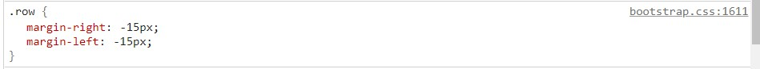
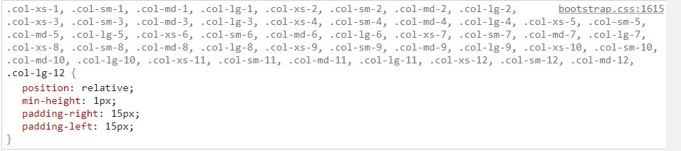

# day18

## 相应式布局

- ####一套代码，同时适配pc端和移动端等屏幕宽度不一的场景

- ####四种基本情况

  - 超小屏---0~768px---移动端（手机）
  - 小屏---768px~992px---平板
  - 中屏---992px~1200px---老式电脑（大屁股电脑）
  - 大屏---1200px~以上---现代电脑pc
  
  

## bootstrap框架

- ####版本

  - 2.x.x---已经停止维护
  - 3.x.x---放弃IE6、7的兼容，偏向响应式布局，对IE8支持但界面效果不友好
  - 4.x.x---目前最新版

- ####bootstrap中只初始化了一部分css样式

  - ```html
    <html>
    <head>
    	<!-- 引入bootstrap的样式文件 -->    
        <link rel="stylesheet" href="./bootstrap/css/bootstrap.css">
        <style>
            .container {
                /* 可以书写类中的属性覆盖bootstrap中的样式 */
                border: 1px solid #000;
            }
        </style>
    </head>
    <body>
        <!-- 书写时只需要引用bootstrap样式文件的类名即可 -->
        <div class="container">saber violet</div>
    </body>
    </html>
    ```

  - 

  

- ####bootstrap框架中的一些类（全部内容需要去官网查找原文文档）

  - **布局容器**

    - .container---响应式布局容器
      - 不同宽版心不同，超小屏时会自适应宽度
      - 布局容器默认15px左右padding

    

    - .container-fluid---流式布局容器
      - 宽度让盒子自适应
      - 布局容器默认15px左右padding

  - **可以抵销父元素左右padding的类(加给子元素)**

    - .row

      - 原理：通过左右margin负值来解决

      

  - **栅格系统**

    - bootstrap会把一行分成12列，通过该对应类名实现盒子宽度动态变化

    - 宽度百分比+浮动+媒体查询

    - 语法：

      - .col-[取值1]-[取值2]

    - 取值1：屏幕的情况

      - lg：大屏**及以上**生效
      - md：中屏幕**及以上**生效
      - sm：小屏及以上生效
      - xs：超小屏**及以上**生效---所有屏幕都可生效

    - 取值2：在12份中占据的份数（可以不占满，但份数必须为整数）

      

  - **bootstrap全局样式(类)**

    - 对齐：

      - .text-left

      - .text-center

      - .text-right

        ```html
        <html>
        <head>
            <link rel="stylesheet" href="./bootstrap/css/bootstrap.css">
            <style>
                div {
                    width: 200px;
                    height: 100px;
                    background-color: skyblue;
                    border: 10px solid #000;
                }
            </style>
        </head>
        <body>
            <div class="text-left">左边</div>
            <div class="text-center">中间</div>
            <div class="text-right">右边</div>
        </body>
        </html>
        ```

        

      

    - 表格：语法：**.table +** 

      - .table---普通表格

        ```html
        <html>
        <head>
            <link rel="stylesheet" href="./bootstrap/css/bootstrap.css">
            <style>
                div {
                    width: 300px;
                }
            </style>
        </head>
        <body>
            <div>
                <table class="table">
                    <tr>
                        <th>表头单元格</th>
                        <th>表头单元格</th>
                        <th>表头单元格</th>
                    </tr>
                    <tr>
                        <td>普通单元格</td>
                        <td>普通单元格</td>
                        <td>普通单元格</td>
                    </tr>
                     <tr>
                        <td>普通单元格</td>
                        <td>普通单元格</td>
                        <td>普通单元格</td>
                    </tr>
                </table>
            </div>
        </body>
        </html>
        ```

        

      - .table-striped---隔行变色

        ```html
        <table class="table table-striped">
        ```

        

    - 按钮：语法：**.btn +** 

      ```html
      <button class="btn">按钮</button>
      ```

      ```html
      <button class="btn btn-default"> default按钮</button>
      ```

      ```html
      <button class="btn btn-primary">primary按钮</button>
      ```

      ```html
      <button class="btn btn-success">success按钮</button>
      ```

      ```html
      <button class="btn btn-info">info按钮</button>
      ```

      ```html
      <button class="btn btn-warning">warning按钮</button>
      ```

      ```html
      <button class="btn btn-danger">danger按钮</button>
      ```

      ```html
      <button class="btn btn-link">link按钮</button>
      ```

      ```html
      <button class="btn btn-lg">lg按钮</button>
      ```

      ```html
      <button class="btn">默认按钮为中等大小</button>
      ```

      ```html
      <button class="btn btn-sm">sm按钮</button>
      ```

      ```html
      <button class="btn btn-xs">xs按钮</button>
      ```

      

  - bootstrap响应式工具

    - 控制元素在不同屏幕宽度下的显示与隐藏

      - .hidden---元素隐藏（所有屏幕范围都隐藏）
      - .hidden-lg---**只有**大屏隐藏
      - .hidden-md---**只有**中屏隐藏
      - .hidden-sm---**只有**小屏隐藏
      - .hidden-xs---**只有**超小屏隐藏

      

  - bootstrap组件（引用css文件，jQuery的js文件和js源文件后可以使用的功能组件）

    - 字体图标
    - 导航条
    - ……