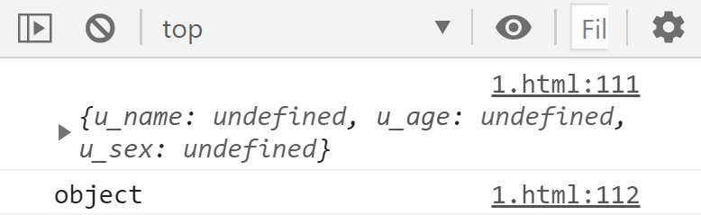
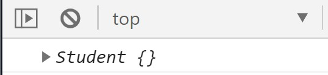
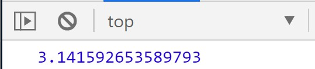
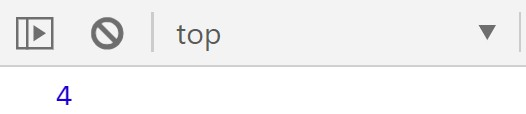
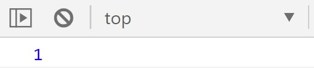
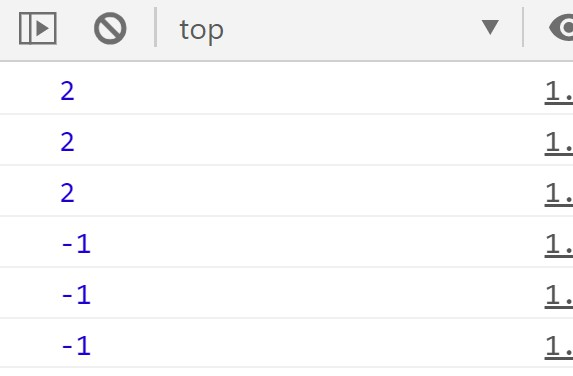
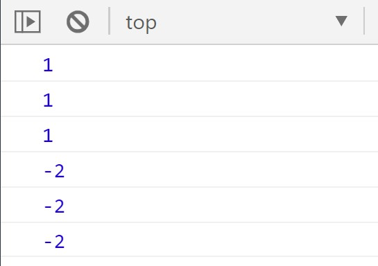
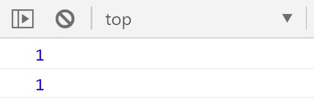
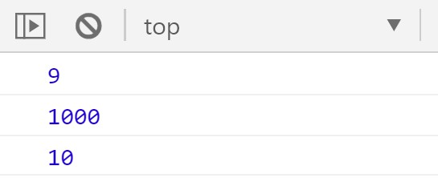
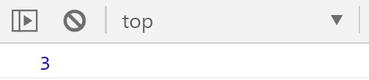

# day24

## 对象

> 对象：**一个具体的事物就是一个对象**，JS中万物皆对象
>
> 一组**无序**的**键值对**的集合

### 对象的组成

- 属性

  > 一个具体的人的属性：姓名、性别、年龄 …

- 方法 -- fuction(){}

  > 一个具体的人的方法：能吃饭、能睡觉 …

- ```js
  var obj = {
      //属性
      name : 'xi',
      age : 18,
      sex : 'man',
      
      //方法
      skill_magicl:function(){
          console.log('Fire ball');
          //行为代码
      },
      skill_physical:function(){
          console.log('Dragon claw');
          //行为代码
      }
  }
  ```

### 创建对象

- 字面量---{}

  ```js
  var obj = {};
  ```

- 构造函数---new Object()

  ```js
  var obj = new Object();
  ```

### 对象的取值和赋值

- 点语法（点后**只认**属性名）

  ```js
  //取值
  对象名.属性名;//属性存在返回属性值，属性不存在返回undefined
  对象名.方法名();//调用方法，方法存在执行，不存在报错
  ```

  ```js
  //赋值
  对象名.属性名 = 属性值;//属性存在覆盖属性值，属性不存在创建新属性名并赋值
  ```

- `[‘’]`语法（中括号中可以写**变量**）

  ```js
  //取值
  对象名['属性名'];
  ```

  ```js
  //赋值
  对象名['属性名'] = 属性值;
  ```

- 优先使用点语法，需要时使用中括号语法

### 遍历对象

- ```js
  for(var k in 对象名){
      //k---对象内的每一个属性名 
  }
  ```

### 批量创建对象

- 使用**工厂函数**创建对象 --- 早期方法

  - 创建一个函数，函数内部手动创建对象，给对象添加属性方法，手动返回创建的对象

    ```js
    function createObject(name, age, sex){
        var obj = {
            u_name : name,
            u_age : age,
            u_sex : sex
        };
        return obj;
    }
    ```

  - 创造的对象是Object类型的，不能直观体现**具体类型名**

    ```js
    console.log(createObject());
    console.log(typeof createObject());
    ```

    

- **构造函数**创建对象

  > **JS中使用什么构造函数创建对象，对象就是什么类型的**

  - 构造函数的函数名**首字母大写** --- 书写规范（不是硬性规定）

    ```js
    function Student(name, age, sex) {
                this.name = name;
                this.age = age;
                this.sex = sex;
            }
    ```

  - 定义函数后配合**new**关键字使用---可展示具体的**类型名**，数据类型是object

    ```js
    var student = new Student();
    console.log(student);
    console.log(typeof student);
    ```

    

  - **new**关键字的作用

    > 1、创建出一个空对象，且用对应构**造函数名**作为类型
    >
    > 2、把**构造函数中**的**this**指向了这个空对象
    >
    > 3、执行构造函数中的代码
    >
    > 4、返回创建出来的对象

  - PS：

    > 1、对象是**new**创建的
    >
    > 2、**构造函数**的目的是给空对象添加属性---**实例化对象**

## 值类型和引用类型

### 值类型

> 1、数字：number
>
> 2、字符串：string
>
> 3、布尔：boolean
>
> 4、undefined
>
> 5、null

- 在内存中以**值**方式存储---存在**栈**中

### 引用类型

> 1、数组：array
>
> 2、函数：function
>
> 3、对象：object

- 在内存中以**地址**方式存储---存在**堆**中

### 值类型和引用类型の赋值特征

> 值类型赋值是**值**；引用类型赋值是**地址**

### 值类型和引用类型の参数传递

> 值类型传递的是**值**；引用类型传递的是**地址**

## 内置对象

> JS自带的一些对象，提供了一些常用的属性和方法

### Math对象

> 不用new Math()，可以直接用

- Math.PI---圆周率

  ```js
  console.log(Math.PI);
  ```

  

- Math.max()---传参数，不传数组

  ```js
  console.log(Math.max(1, 2, 3, 4));
  ```

  

- Math.max()---传参数，不传数组

  ```js
  console.log(Math.min(1, 2, 3, 4));
  ```

  

- Math.ceil()---向上取整(负数取数值大的一侧)

  ```js
  console.log(Math.ceil(1.1));
  console.log(Math.ceil(1.5));
  console.log(Math.ceil(1.9));
  console.log(Math.ceil(-1.9));
  console.log(Math.ceil(-1.5));
  console.log(Math.ceil(-1.1));
  ```

  

- Math.floor()---向下取整(负数取数值小的一侧)

  ```js
  console.log(Math.floor(1.1));
  console.log(Math.floor(1.5));
  console.log(Math.floor(1.9));
  console.log(Math.floor(-1.9));
  console.log(Math.floor(-1.5));
  console.log(Math.floor(-1.1));
  ```

  

- Math.round()---四舍五入

  > 参数部分**大于**0.5，入到相邻的**绝对值**更大的数；
  >
  > 参数部分**小于**0.5，舍到相邻的**绝对值**更小的数；
  >
  > 参数部分**等于**0.5，则舍入到相邻的在**正无穷方向**上的整数

  ```js
  console.log(Math.round(1.1));
  console.log(Math.round(1.5));//2
  console.log(Math.round(1.9));
  console.log(Math.round(-1.9));
  console.log(Math.round(-1.5));//-1(特殊情况)
  console.log(Math.round(-1.1));
  ```

  

- Math.random()---随机数

  > 随即取**[0,1)**（0取的到，1取不到）区间的小数

  ```js
  //随即取到min到max之间的数(包括min和max)
  Math.floor(Math.random()*(max-min+1))+min
  ```

- Math.abs()---绝对值

  ```js
  console.log(Math.abs(1));  // 1
  console.log(Math.abs(-1));  // 1
  ```
  
  

- Math.pow(num, power)---次幂（次方）

  ```js
  console.log(Math.pow(3, 2));  // 3的平方  9
  console.log(Math.pow(10, 3)); // 10的三次方 1000
  console.log(Math.pow(100, 0.5));  // 100的开方  10
  ```
  
  

- Math.sqrt(num)---开平方

  ```js
  console.log(Math.sqrt(9));  // 3
  ```
  
  

 