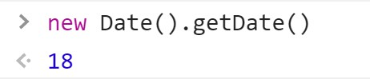

# day25

## 内置对象

### Date对象

> Js提供的是Date的**构造函数**，是需要**new**的---因为日期是动态变换的
>
> Date对象负责处理时间和日期new 

#### 创建日期对象

- Date()---不传参数表示当前日期对象

  

- Date()---参数可传日期格式**字符串**

  

#### 默认日期格式化的方法

- 直接打印日期对象，浏览器会**默认调用**toString()

  

- new Date()是**对象类型**，但是打印时是**字符串格式**

  

- toLocalDateString()---只要日期

  

- toLocaleString()---用当地方法表示日期时间

  

- toLocaleTimeString()---只要时间不要日期

  

#### 获取日期的指定部分

- new Date().getFullYear()---返回年份**数字类型**

  

- new Date().getMonth()---返回月份**数字类型，数字从0开始**

  

- new Date().getDate()---返回**数字类型**的**日期**

  

- new Date().getDay()---返回**数字类型**的**星期**数

  

- new Date().getHours()---返回**数字类型**的**小时**数

  

- new Date().getMinutes()---返回**数字类型**的**分钟**数

  

- new Date().getSeconds()---返回**数字类型**的**秒**数

  

#### 时间戳

> 时间戳：日期数の字形式
>
> 距离1970年1月1日00:00:00过去的总**毫秒数**---可用于计算时间差


> 运用：
>
> 1. 计算代码执行时间
> 2. 倒计时

### Array对象

> JS内置了**Array构造函数**，每个数组都存在属性和方法

#### 数组转换成字符串---arr.join('分隔符')


- PS：不传参默认逗号`,`分隔
- PS：要分隔符就传入**空字符串**

#### 数组增删

> 操作会改变**原数组**本身

- push()---数组**尾部**增添一项或多项，返回**数组长度**

  

- unshift()---数组**首部**增添一项或多项，返回**数组长度**

  

- pop()---数组**尾部**删除一项，返回数组内**删除的元素**

  

- shift()---数组**首部**删除一项，返回数组内**删除的元素**

  

#### 数组的翻转和排序

- reverse()---翻转**原**数组，返回值为整个数组

  

- sort()---数组排序，返回值为整个数组，可填入比较方法，未填入参数时候默认**从高位开始比较并从小到大排位**`即1、2、10排序时会出现1、10、2`，返回值为整个数组

  

- sort(function(a,b){return a - b})---a表示前一项，b表示后一项，返回值大于零则翻转位置，**则a-b表示从小到大排**，返回值为整个数组

  

- sort(function(a,b){return b - a})---a表示前一项，b表示后一项，返回值大于零则翻转位置，**则b-a表示从小到大排**，返回值为整个数组

  

- PS：上述a表示的是**数组内元素的前一项**；b表示的是**数组内元素的后一项**，所以**可以获得元素属性**，return返回**只关注**大于0还是小于0，**返回值**大于0就交换数组元素

#### 数组合并和截取

- concat()---数组拼接

  ```js
  arr.concat(arr1,arr2,……)
  ```

  

- slice([参数1]，[参数2])

  - 不传参，从开始截取到最后

    

  - 参数2**不填**就表示从参数1开始截取到最后

    

  - 参数1：开始的**索引**，参数2：结束的索引（不包含结束索引表示的元素）

    

- splice([参数1]，[参数2]，[参数3],……)---数组任意位置改变数组（增、删、添）
  - 参数1---删除的起始下标
  - 参数2---删除几项（个数）
  - 参数3---可写多个元素，添加的元素

  ```js
  let arr = ["violet", "saber", "Naruto", "rider"];
  console.log(arr);
  arr.splice(1, 2, 'scarlet');//从下标1开始删除，删除两个元素，从删除位置开始添加，添加‘scarlet’元素
  console.log(arr);
  ```

  

#### 查找数组元素

- indexOf(`数组元素`)---**第一次**出现的元素下标

  - 找到返回下标
  - 找不到返回-1

  

- lastIndexOf(`数组元素`)---**最后一次**出现的元素下标

  - 找到返回下标
  - 找不到返回-1

  

- PS：可以通过返回值判断数组中是否含有搜索元素

## 基本包装类型

> **简单数据类型本身是没有任何属性和方法的**

### Number（）

- toString（）---转换成字符串

  

- toFixed（[位数]）---（四舍五入）保留小数

  

### Boolean（）

- toString（）---转换成字符串

  

### String（）

- 字符串可以遍历（伪数组，有下标，可遍历，不能用数组方法）

- 字符串不变---**只读**

- 查找字符在字符串的位置

  - indexOf()
  - lastIndexOf()
  - 用法效果同数组

- 去除字符串首位空格**trim()**

  

- 字母大小写转换**toUpperCase()--大写**、**toLowerCase()--小写**

  

- 字符串拼接
  - 1、加号`+`---运算符重载
  - 2、concat(str1, str2, …)---用法效果同数组

- 字符串截取

  - 1、str.slice([start], [end])---用法效果同数组(有始无终)
  - 2、str.substring([start], [end])---同上（有始无终）
  - 3、str.substr([begin], [length])---从begin开始截取length长度

  

- 把字符串分割成数组：split('分隔符')，参数为**空字符**即字符串全部拆分

  

- 字符串替换：replace()

  

  - 可填两个参数，参数1：需要替换的**第一个**字符（串），参数2：用于替换的字符串

    

  - PS：利用**正则表达**式可以全部替换