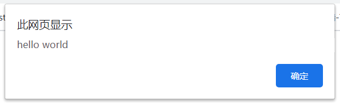
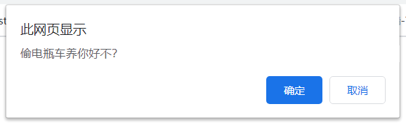
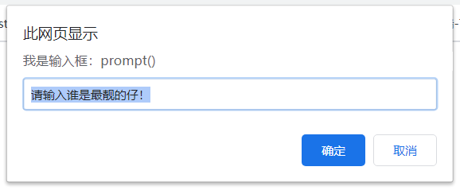
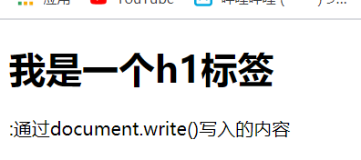
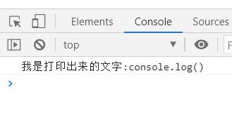

# day19

## JavaScript基本介绍

- > ### web标准的三部分（网页的三大部分）
  >
  > - **HTML**：控制页面的**结构**
  > - **CSS**：控制页面的**样式**
  > - **JavaScript**：控制网页的行为（动态效果）
  
- ### JavaScript

  - #### 作用：

    ```
    JavaScript的诞生起初是为了校验表单输入的准确性;
    经过发展之后，如今的JavaScript可以胜任:
    	1.前端网页中的特效
    	2.后端的服务器事项(node.js)
    	3.前后端的交互:异步与服务器交互(AJAX)
    	4.命令行工具的开发(node.js)
    	5.桌面程序(Electron)
    	6.app开发(ReatNative)
    	7.硬件控制--物联网(Ruff)
    	8.游戏开发(cavans)
    	……
    ```

  - > JavaScript是一种运行在 **浏览器** 的 **脚本语言** ，现在也可以运行在服务器端

  - #### 发展历史：

    - 1995年，Netscape(网景)公司的`Brendan Eich(布兰登·艾奇)`，花了10天时间为Netscape Navigator2.0开发了一个名为`LiveScript`的脚本程序，目的是在浏览器中执行预检测程序（表单校验）
    - 后来Netscape在与Sun合作之后将其改名为JavaScript。目的是为了利用 Java 这个因特网时髦词汇
    - 微软发布了 IE 3.0 并搭载了一个 JavaScript 的克隆版，叫做 JScript（这样命名是为了避免与 Netscape 潜在的许可纠纷）
    - 1997年，ECMA（欧洲计算机制造商协会）邀请了Netscape、Sun、微软、Borland等公司的一些程序员组成了TC39，最终锤炼出来了ECMA-262，该标准定义了一门全新的脚本语言，名为`ECMAScript`。

  - #### 组成：

    - > JavaScript = ECMAScript + DOM + BOM

    - **ECMAScript（JavaScript的核心）**：ECMAScript是一套标准，规范了语言的基本语法。

    - **DOM**（**Document** Object Model）：一套操作网页元素的方法

    - **BOM**（Browser Object Model）：一套操作浏览器功能的方法

  - #### JavaScript书写位置

    - 写在`script`标签中

      ```html
      <script>
        alert('hello world');
      </script>
      ```

    - 写在一个单独的.js文件中，通过script的src属性引入即可

      ```html
      <script src="demo.js"></script>
      ```

    - PS:

      - script标签可以放在很多地方，但是一般写在body标签内容的最下面
      - 如果给script标签上有src属性，则标签行内的代码会直接忽略

  - #### 注释

    - 单行注释

      ```js
      // 这是单行注释， 单行注释只能写一行代码
      //  快捷键： ctrl + /  
      // 注释的内容
      ```

    - 多行注释 

      ```js
      /*
          这是多行注释，在多行注释中可以换行
          快捷键：alt + shift + a
      */
      /* 注释的内容 */
      ```

  - #### 5种输出语句

    - **alert ： 弹框**

      

      ```js
      //alert会弹出一个：弹框/警告框/提示框/弹窗
      alert("hello world");
      ```

    - **confirm ： 确认框**

      

      ```js
      //alert会弹出一个：弹框/警告框/提示框/弹窗
      confirm("偷电瓶车养你好不？");
      ```
    - **prompt ： 输入框**
    
      
    
      ```js
        //prompt：弹出一个输入框，可以输入值
        prompt("我是输入框：prompt()", "请输入谁是最靓的仔！");
      ```
    
    - **document.write ： 网页中写入内容**
    
      
    
      ```js
      //可以识别标签
      document.write("<h1>我是一个h1标签</h1>");
      document.write(":通过document.write()写入的内容");
      ```
    
    - **控制台打印(输出)**
    
      
      
      ```js
      //打开调试工具，选择Console选项（控制台），在console中可以看到打印的信息
      console.log("我是打印出来的文字:console.log()");
      ```
    
  - #### 变量
  
  - 变量：可以变化的量（相当于一个储存数据的容器）
  
  - 作用 ： 存储数据  
  
  - 在使用变量之前需要先声明，才能使用变量。（相当于先做出一个容器，才能装东西）
  
  - 声明 ：用 **var**来声明
  
  - **先声明，后赋值**
  
    ```js
      var age;  // 声明一个变量 name
    age = 18; // 一个等号表示赋值（把等号后面的赋值给前面的！）
      console.log(age);
      ```
  
    - **同时声明和赋值**
  
    ```js
      var age2 = 20;
    console.log(age2);
      ```
  
    - **同时声明多个变量并赋值**
  
    ```js
      // ， => 并列
    var age3 = 30，age4= 40;
      // 相当于
      var age3 = 30;
      var age4 = 40;
      ```
  
    - #### PS:warning!!!
  
    - **直接声明变量，不赋值**
  
      ```js
         var age5;
       console.log(age5);// undefined =》 表示只声明，没有赋值
        ```
  
      - **不声明变量，直接赋值**
  
      ```js
        // 不推荐, age6会作为全局变量出现
      age6 = 60;
        console.log( age6 );
        ```
  
      - **不声明变量，也不赋值变量，直接使用**
  
      ```js
         // age7 is not defined 表示是没有定义（说白了就是没有声明和赋值直接使用）
      console.log(age7);
        ```
  
    - #### js代码作为解释型语言，一旦报错了，后面的代码就不再执行了！！！

