# day20

## 变量起名规则&规范

### 规则（类似法律必须遵守）

- 1、可以以字母、数字、下划线、$符号组成，但不能以**数字**开头

- 2、变量区分大小写，name、NAME、Name……是不同的变量名

- 3、变量不可以使用**关键字**或者**保留字**

  **关键字：**

  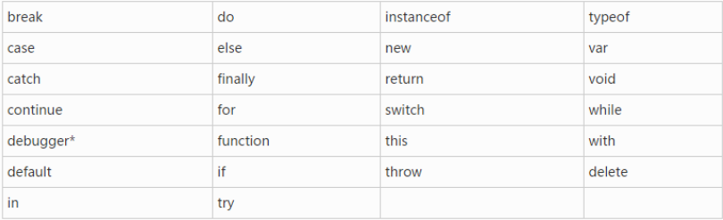

  **保留字：**

  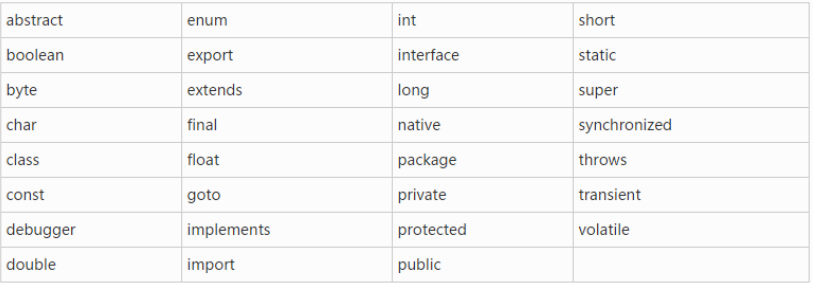

### 规范（类似道德希望遵守）

- 1、变量命名应该尽量具备相应意义，年龄--age、姓名--name……
- 2、可以遵循**驼峰命名法**---首个单词小写，从第二个单词开始首字母大写，getElementById……

## 数据类型

### 简单（基本）数据类型

- 数字类型---number

  - int---整形（整数）
  - float---浮点型（带小数部分）
    - 浮点型计算时容易出现bug---（0.1+0.2---打印：0.30000000000000004）
  - 科学计数法（50,000 == 5 * 10^4 == 5e4）

- 字符串类型---string

  - 通过引号包裹的字符

    - 可以`"……'……'……"`---双引号套单引号
    - 可以`'……"……"……'`---单引号套双引号
    - 不可以`"……"……"……"`---双引号套双引号
    - 不可以`'……'……'……'`---单引号套单引号
    - 不可以`"……'……"……'`---双引号、单引号混合嵌套

  - .length属性---可以返回字符串长度

    ```js
    var str = "1二34五六78nine";
    console.log(str);
    console.log(str.length);
    ```

    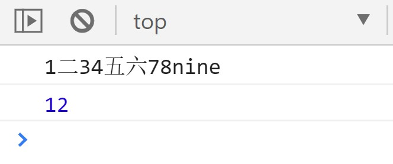

  - 转义字符---`\--反斜杠`---转义字符有自身特定含义

    | 代码 |    输出    |
    | :--: | :--------: |
    | `\'` | **单引号** |
    | `\"` | **双引号** |
    | `\\` |   反斜杠   |
    | `\&` |    和号    |
    | `\n` | **换行符** |
    | `\r` |   回车符   |
    | `\t` |   制表符   |
    | `\b` |   退格符   |
    | `\f` |   换页符   |

    ```js
    console.log("转义字符换行\n\'单引号\'\n\"双引号\"\n……");
    ```

    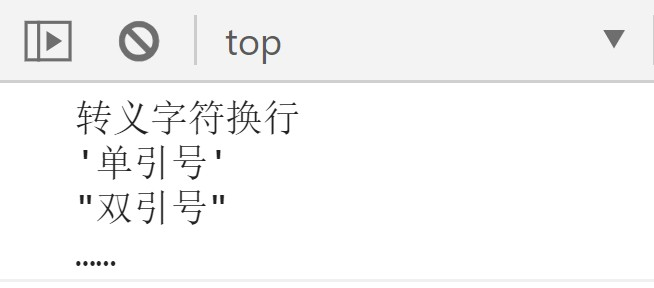

  - 字符串拼接

    - “abc” + “123” ---字符串通过**加号**拼接

    - “123” + 321 ---“123321”---**string类型** + **number类型**会**隐式转换**为**字符串**+**字符串**（运算符重载）

      - **只要**加号两侧**有一个**是**string**类型就是字符串拼接
      - **只有**加号两侧**都**是**number**类型才是数字相加

      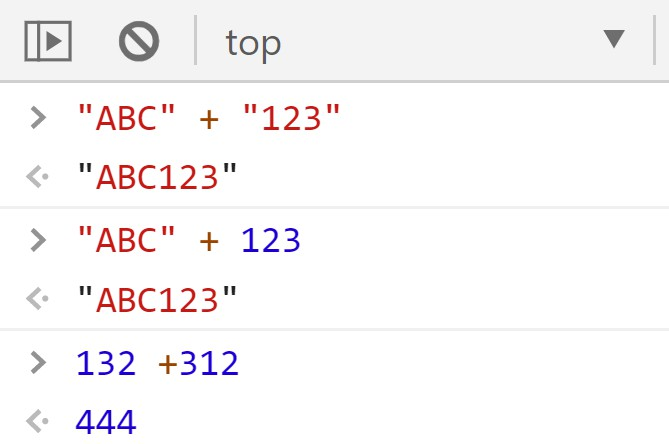

  - 布尔类型：boolean

    - true---真(正向结果)
    - false---假（反向结果）

    ```js
    console.log("Boolean：");
            console.log(1 > 2);//false
            console.log(1 < 2);//true
    ```

    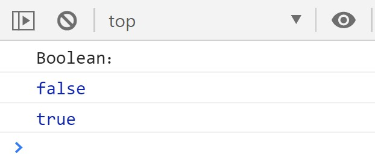

  - undefined：声明未赋值

    ```js
    var str;
            console.log("undefined：");
            console.log(str);
    ```

    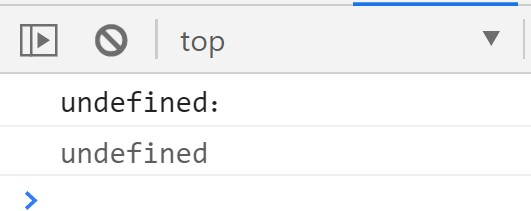

  - null：空类型

    ```js
    var str = null;
            console.log("null：");
            console.log(str);
    ```

    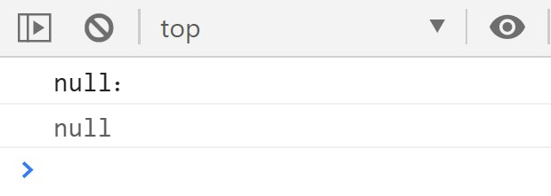

    

    ​			**未定义和定义为空**

### 复杂数据类型：对象

- 数组：array
- 函数：function
- 对象：object

### 查看数据类型

- 根据console（控制台）打印的数据颜色

- 根据`typeof`**操作符**---返回一个**字符串**，表示数据类型

  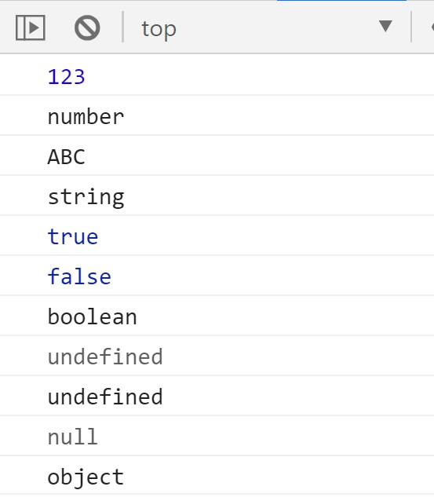

### 字面量赋值与变量赋值

- 字面量(直接量)赋值---值固定不变，**浏览器可以直接识别的量**
  - `var num = 123;`
  - `var str = "abc";`
- 变量赋值
  - `var age = num;`
  - `var name = str;`

## 运算符（操作符）

- 算术运算符

  - `+`---加

    - 存在运算符重载(**数字类型**相加时为**加法**运算符，**一旦**加号两侧**出现字符型**则加号则为**字符串拼接**)

  - `-`---减、`*`---乘、`/`---除、`%`---取余

    - 存在隐式转换(**字符型**数据配合以上运算符会被**隐式转换**为**数字型数据**)

      ```js
      let str = "567";
      console.log(+str);
      console.log(typeof(+str));
      console.log(str * 1);
      console.log(typeof(str * 1));
      console.log(str / 1);
      console.log(typeof(str / 1));
      console.log(str - 0);
      console.log(typeof(str - 0));
      ```

      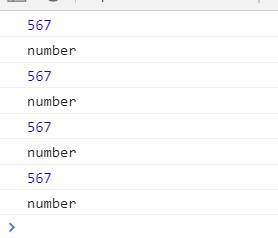

- 赋值运算符

  - `=`---赋值
    - `var A = 12;`
  - `+=`、`-=`、`*=`、`/=`、`%=`
    - `var B = B+1;等同于var B += 1;`
    - `var B = B-1;等同于var B -= 1;`
    - `var B = B*1;等同于var B *= 1;`
    - `var B = B/1;等同于var B /= 1;`
    - `var B = B%1;等同于var B %= 1;`

- 一元运算符

  - 自增`(++)`---单独占据一条语句时，`(++)`前后没有区别

    ```js
    var num = 3;
    num++;
    console.log(num);
    num = 3;
    ++num;
    console.log(num);
    ```

    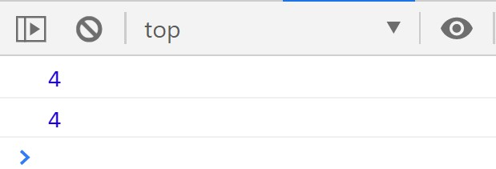

    - `i++`---后置自增

      - 在**同一语句**中**先**参与运算**再**自增

      ```js
      var before = 5;
      after = before++;
      console.log("before:" + before);
      console.log("after:" + after);
      ```

      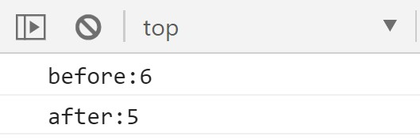

    - `++i`---前置自增

      - 在**同一语句**中**先**自增**再**参与运算

      ```js
      var before = 5;
      after = ++before;
      console.log("before:" + before);
      console.log("after:" + after);
      ```

      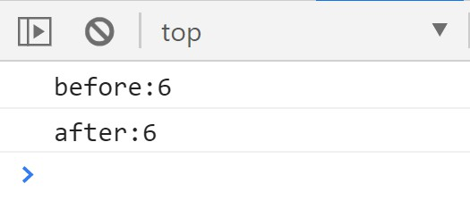

  - **自减运算符同理**

  - 自减`(--)`---单独占据一条语句时，`(--)`前后没有区别

    - `i--`---后置自减
      - 在**同一语句**中**先**参与运算**再**自减
    - `--i`---前置自减
      - 在**同一语句**中**先**自减**再**参与运算

- 逻辑运算符

  - &&---逻辑与

    - 同真为真

    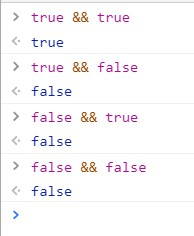

  - ||---逻辑或

    - 只要有一真为真

    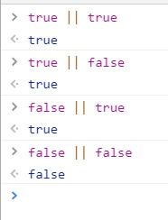

  - !---逻辑非(逻辑取反)

    - 真假相反

    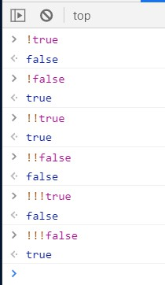

- 比较运算符（关系运算符）

  > `<`---小于
  > `<=`---小于等于
  > `>`---大于号
  > `>=`---大于等于

  - #### 等于号：

  - `==`---相等（内容相等即相等）

  - `===`---全等（数据类型**也**要相等才算相等）

    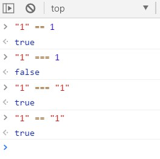

  - #### 不等于号：

  - `!=`---不相等

  - `!==`---不全等（**只要**不是全等就是true）

    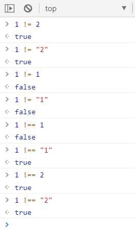

- 运算符优先级（上述运算符中）

  - `()`---小括号优先级最高
  - 一元运算符次之`++、--、!`
  - `+、-、*、/、%`---居中，但是先`*、/、%`后`+、-`
  - 比较运算符较低---且`>、>=、<、<=`先，`==、!=、===、!==`后
  - `&&、||`---运算符最低

## 表达式

- 可由字面量、变量、运算符组成的**有结果**的式子

## 数据类型的转换

- 转换成数字类型

  - Number(数据)

    - 数据中带有**非数字**字符则返回**NaN**

      ```js
      console.log("Number：");
              console.log(Number('happy567'));	//NaN
              console.log(Number('567happy'));	//NaN
              console.log(Number('567'));			//567
      ```

      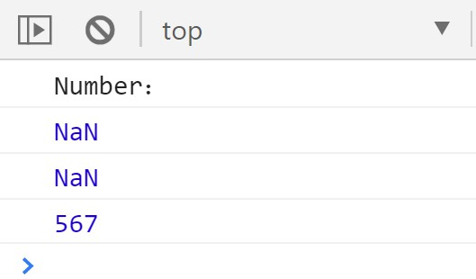

  - parseInt（数据）

    - 从**第一个字符**开始转换为**整型数字**，如果**开头**不是数字则返回**NaN**，**中途**出现不是数字则**停止转换后续数据**

      ```js
      console.log("parseInt：");
              console.log(parseInt('happy567'));		//NaN
              console.log(parseInt('567happy'));		//567
              console.log(parseInt('567happy567'));	//567
              console.log(parseInt('happy5.67'));		//NaN
              console.log(parseInt('5.67happy'));		//5
              console.log(parseInt('5.6.7happy'));	//5
      ```

      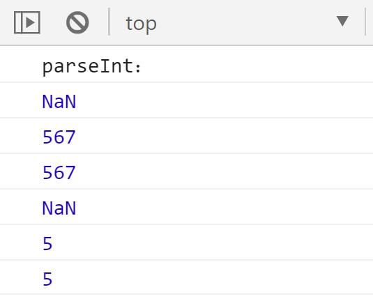

  - parseFloat（数据）

    - 从**第一个字符**开始转换会记录第一个**小数点**，如果**开头**不是数字则返回**NaN**,**中途**出现不是数字或出现**第二个**小数点则**停止转换后续数据**

      ```js
      console.log("parseFloat：");
              console.log(parseInt('happy567'));			//NaN
              console.log(parseInt('567happy'));			//567
              console.log(parseInt('567happy567'));		//567
              console.log(parseFloat('happy5.67'));		//NaN
              console.log(parseFloat('5.67happy'));		//5.67
              console.log(parseFloat('5.6.7happy'));		//5.6
      ```

      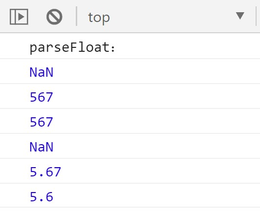

  - 隐式转换（计算转换）

    ```js
    let str = "567";
    console.log(+str);
    console.log(typeof(+str));
    console.log(str * 1);
    console.log(typeof(str * 1));
    console.log(str / 1);
    console.log(typeof(str / 1));
    console.log(str - 0);
    console.log(typeof(str - 0));
    ```

    

