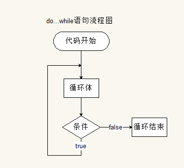

# day21

## 转成字符串类型

- **String(数据)**

  

- **数据.toString()**

  

- **拼接字符串**

  

## 转成布尔类型

### Boolean(数据)

```js
false:
    数字--0
    字符串--''
    undefined--undefined
    null--null
    NaN
true:
	其它
```


### !!--非非（双重取反）

```js
!--取反时会进行隐式转换，转为布尔值
!!--两次取反保证数据布尔值不会改变
```


## NaN

- **not a number**---这不是一个可以用**数字值**表示的数据

- 将**非数字值**的数据转成number（**数字类型**）时会出现

  

- ps1：typeof(NaN) >>> number

  

- ps2：NaN不等于任何值（包括自己）>>> false

  

## 流程控制

### 顺序结构

> 程序的默认执行顺序


### 分支结构

> 也叫选择结构


- if语句

  - ```js
    if (判断条件){
        (条件满足时)执行代码1
    }
    	//(条件不满足)跳过代码2
    ```

  - ```js
    if (判断条件){
        (条件满足时)执行代码1
    }
    else{
        (条件不满足)执行代码2
    }
    ```

  - ```js
    if (判断条件1){
        (条件满足时)执行代码1---跳过其他分支
    }
    	//(条件不满足)跳过代码1
    else if(判断条件2){
        (条件满足时)执行代码2---跳过其他分支
    }
    	//(条件不满足)跳过代码2
    else if(判断条件3){
        (条件满足时)执行代码3---跳过其他分支
    }
    	……
    else{
        (条件全都不满足)执行代码4
    }
    ```

- 三元运算符（语句判断）

  - ```js
    var result(最终结果) = (判断条件)?(表达式1):(表达式2)
    --true条件满足时，表达式1值返回给最终结果
    --false条件不满足时，表达式2值返回给最终结果
    ```

- switch语句（具体值的判断）

  - ```js
    switch(表达式){
           case 值1:
            	语句1;
            	break;---执行代码后跳出switch
           case 值2:
            	语句2;
            	break;---执行代码后跳出switch
           case 值3:
            	语句3;
            	break;---执行代码后跳出switch
           ……
           default:
            	默认语句;
            	break;---执行代码后跳出switch
    }
    ```

  - 表达式 === 值>>>true,执行**全等**值对应的语句，遇见break就直接结束switch

  - PS：case语句**不加**break，则执行**全等**值对应的语句后，**一直**顺序执，直到**遇见**break，或者执行完全部语句，才会结束switch

### 循环结构

> 重复执行一段代码


- while循环

  - ```js
    while(判断条件){
    	循环体;---重复执行的代码;
    }
    ```
    
    

- do……while

  - ```js
    do{
        循环体;---重复执行的代码;
    }while(while(判断条件);
    ```
    
    

- for循环

  - ```js
    for(初始化语句; 判断条件; 循环增量){
        循环体;
    }
    ```
    
    

- break **&** continue
  - break---跳出整个循环，开始执行循环之后的代码
  - continue---跳出本次循环，进入下一次循环

