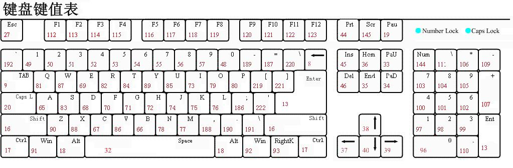

# day28

## 创建节点

### document.write()——几乎不用

> document.write() 可以在document网页中生成新节点（会解析标签），但是一般不用

- **缺点：**
  - 只能在文档页面中生成，不能指定生成在特定位置

  - 如果在网页加载完毕之后再设置（在事件函数中使用）document.write()写入内容，此时会把之前的页面内容覆盖掉

    > **原因：**
    >
    > 页面从上往下加载的时候，会开启一个文档流，当页面加载完，文档流就会关闭。
    >
    > document.write() 就是在文档流上写入内容。
    >
    > - 如果页面没加载完成，文档流还开着，此时document.write() 直接在当前文档流上写内容
    > - 如果页面已经加载完成了，文档流已经关闭，此时document.write() 会重新开启一个新的文档流写内容，那么旧的文档流已经被覆盖

### innerHTML——慎用

> innerHTML也可以创建节点（会解析标签）

- **缺点：**
  - 如果原来标签中原来有内容，此时会覆盖原先内容。

  - 如果执行多次innerHTML的时候，此时容易出现效率问题。

### createElement——推荐使用

> 在**内存**中创建一个元素节点，一般配合appendChild()方法一起使用

- **语法：** `document.createElement('tagName')`

- **作用：** 在内存中创建一个元素节点

- **参数：**
  - tagName：需要生成标签的标签名

- **返回值：**
  - 创建好的元素

## 注册事件

### tips--双击事件

> 双击事件：(on)dblclick

### on+事件名称

> - 几乎所有浏览器都支持
>
> - 一个元素上**一种事件**只能注册**一次**，后注册的会**覆盖**之前注册的
>   - ps：类似于赋值，后面赋值把前面赋值的覆盖了

```js
// 注册事件-------------------------
box.onclick = function(){
	// 事件处理程序	
}
```

### addEventListener('事件名称',fn)

> 1、现代浏览器都支持（不过IE678不支持）
>
> 2、不会出现覆盖问题

```js
事件源.addEventListener(type,func,useCapture);
// 第一个参数：事件的类型：click 、 mouseover……
// 第二个参数：事件处理程序（函数）
// 第三个参数：事件的阶段（是否捕获），默认为false表示冒泡阶段，true表示捕获阶段

// 例子1：-------------------------------------
function fn() {
    alert("哈哈哈");
}
box.addEventListener("click", fn, false);
//PS：如果想让注册的事件之后能移除，不能用匿名函数。
// 例子2：-------------------------------------
box.addEventListener("click", function (){alert("哈哈哈");}, false);
// 例子3：-------------------------------------
box.addEventListener("click", ()=>{alert("哈哈哈");}, false);
```

### 移除事件的两种方式

- on+事件名=null

  ```js
  btn.onclick = null;
  ```

- removeEventListener('事件名称'，函数名)

  ```js
  // 第一个参数：事件的类型
  // 第二个参数：要移除的函数名
  // 第三个参数：事件的阶段（是否捕获），默认为false表示冒泡阶段，true表示捕获阶段
  事件源.removeEventListener(type, func, useCapture);
  // 例子1：-------------------------------------
  function fn() {
      alert("哈哈哈");
  }
  box.addEventListener("click", fn, false);
  box.removeEventListener("click", fn, false);
  //PS：如果想让注册的事件之后能移除，不能用匿名函数。
  ```

## 事件流

- 事件冒泡

  > 当一个元素的事件被触发时，**同类型事件**将会在该元素的所有祖先元素**由内而外中依次被触发**。这一过程被称为事件冒泡。

- 事件捕获

  > 事件捕获是**火狐浏览器**最早提出来的，IE678不支持事件捕获
  >
  > 当一个元素的事件被触发时，同样的事件将会在该元素的所有祖先元素**由外而内依次被触发**。这一过程被称为事件捕获。

- 事件的三个阶段

  > 任何事件都会有三个阶段

  1. 事件的**捕获阶段**

  2. 事件的**目标阶段**（触发自己的事件）

  3. 事件的**冒泡阶段**

- PS:如果是addEventListener，可以通过第三个参数控制事件在什么阶段触发

  - false：默认值，冒泡阶段触发
  - true：捕获阶段触发

- on注册事件：默认只在冒泡阶段触发

## 事件对象

> 对于现代浏览器，获取事件对象只需要在注册事件的时候，指定一个形参即可。这个形参就是获取到的事件对象。

```js
btn.onclick = function(event){
    //event就是事件对象，里面包含了事件触发时的一些信息。
	console.log(event);
}
// --------------------------------
btn.addEventListener('click',function (event) {
    //event就是事件对象，里面包含了事件触发时的一些信息。
    console.log( event );
});
```

### 鼠标事件对象的属性

- **记录鼠标位置信息的相关属性：**
  - screenX和screenY：光标相对于**显示器屏**幕左上角的水平和垂直坐标（用的很少）

  - clientX和clientY：光标相对于**可视区域**左上角的水平和垂直坐标

    > 如果有滚动条，不包括被卷去的距离

  - pageX和pageY：光标相对于**整个网页**左上角的水平和垂直坐标（推荐使用）

    > 如果有滚动条，包括卷去的距离

### 键盘事件对象的属性

- **记录了键盘码的相关属性**

  - e.keyCode：获取按下的键盘码

    > 键盘上的的每一个键都有唯一的数字与之对应

