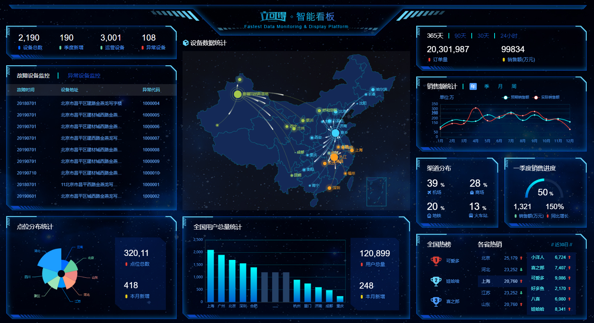
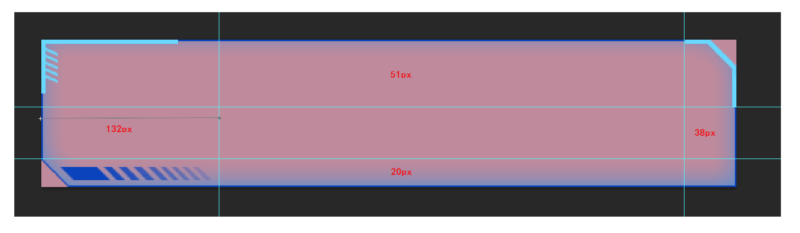

# 可视化项目

## 项目介绍

​	应对现在数据可视化的趋势，越来越多企业需要在很多场景(营销数据，生产数据，用户数据)下使用，可视化图表来展示体现数据，让数据更加直观，数据特点更加突出。我们引入 '立可得' 数据可视化项目。

​	该项目除了使用了基础的DIV+CSS布局，还引入了一些C3技术，还引入了各类图表的绘制，以及高级的地图数据可视化案例。主要功能有：饼状图、柱状图、线形图、地图 ...



## 基础布局

### html结构：

```html
<body>
  <div class="container">
  	<div class="column">
      	<!--概览-->                                    
    	<div></div>
		<!--监控-->                                    
    	<div></div> 
		<!--点位-->                                    
    	<div></div>                                           
    </div>
    <div class="column">
      	<!--地图-->                                    
    	<div></div>
		<!--用户-->                                    
    	<div></div>                                          
    </div>
    <div class="column">
      	<!--订单-->                                    
    	<div></div>
		<!--销售-->                                    
    	<div></div> 
        <!--渠道 季度-->  
    	<div></div>
		<!--排行-->                                    
    	<div></div>                                     
    </div>                        
  </div>
</body>
```

### css样式：

```css
/* 基础布局 */
body{
  font-size: 0.5rem;
  font-family: Arial, Helvetica, sans-serif;
  margin: 0;
  padding: 0;
  background: url(../images/bg.jpg) no-repeat 0 0 / cover;
  /* 行高是字体1.15倍 */
  line-height: 1.15;
}
h4,h3,ul{
  margin: 0;
  padding: 0;
  font-weight: normal;
}
ul{
  list-style: none;
}
a{
  text-decoration: none;
}

/*架构布局*/
.container{
  max-width: 1920px;
  min-width: 1024px;
  margin: 0 auto;
  min-height: 780px;
  padding: 3.667rem 0.833rem 0;
  background: url(../images/logo.png) no-repeat 0 0 / contain;
  display: flex;
}
.column{
  flex: 3;
  position: relative;
}
.column:nth-child(2){
  flex: 4;
  margin: 1.333rem 0.833rem 0;
}
```

## 概览区域-布局

### html结构：

```html
<div class="overview panel">
    <div class="inner">
        <div class="item">
            <h4>2,190</h4>
            <span>
                <i class="icon-dot" style="color: #006cff"></i>
                设备总数
            </span>
        </div>
        <div class="item">
            <h4>190</h4>
            <span>
                <i class="icon-dot" style="color: #6acca3"></i>
                季度新增
            </span>
        </div>
        <div class="item">
            <h4>3,001</h4>
            <span>
                <i class="icon-dot" style="color: #6acca3"></i>
                运营设备
            </span>
        </div>
        <div class="item">
            <h4>108</h4>
            <span>
                <i class="icon-dot" style="color: #ed3f35"></i>
                异常设备
            </span>
        </div>
    </div>
</div>
```

### 样式描述：

- 容器高度 110px
- h4字体  28px   #fff   左padding 4.8px   下margin 8px
- span字体  16px  #4c9bfd

```css
/* 概览区域 */
.overview{
  height: 4.583rem;
}
.overview .inner{
  display: flex;
  justify-content: space-between;
}
.overview h4{
  font-size: 1.167rem;
  padding-left: 0.2rem;
  color: #fff;
  margin-bottom: 0.333rem
}
.overview span{
  font-size: 0.667rem;
  color: #4c9bfd;
}
```

## 公用面板样式

> 所有的面板的基础样式是一致的，提前布局好。

### 切割示例图：



- 面板 .panel 
- 容器 .inner
- 标题 h3

```css
/* 面板公用样式 */
.panel{
  border: 2rem solid #ccc;
  border-width: 2.125rem 1.583rem 0.833rem 5.5rem;
  border-image: url(../images/border.png) 51 38 20 132;
  position: relative;
  margin-bottom: 0.833rem;
  box-sizing: border-box;
}
.panel .inner{
  position: absolute;
  top: -2.125rem;
  right: -1.583rem;
  bottom: -0.833rem ;
  left: -5.5rem;
  padding: 1rem 1.5rem;
}
.panel h3{
  font-size: 0.833rem;
  color: #fff;
}
```

## 监控区域-布局

### html结构：

```html
<!--监控-->
<div class="monitor panel">
    <div class="inner">
        <div class="tabs">
            <a href="javascript:;" class="active">故障设备监控</a>
            <a href="javascript:;">异常设备监控</a>
        </div>
        <div class="content" style="display: block;">
            <div class="head">
                <span class="col">故障时间</span>
                <span class="col">设备地址</span>
                <span class="col">异常代码</span>
            </div>
            <div class="marquee-view">
                <div class="marquee">
                    <div class="row">
                        <span class="col">20180701</span>
                        <span class="col">11北京市昌平西路金燕龙写字楼</span>
                        <span class="col">1000001</span>
                        <span class="icon-dot"></span>
                    </div>
                    <div class="row">
                        <span class="col">20190601</span>
                        <span class="col">北京市昌平区城西路金燕龙写字楼</span>
                        <span class="col">1000002</span>
                        <span class="icon-dot"></span>
                    </div>
                    <div class="row">
                        <span class="col">20190704</span>
                        <span class="col">北京市昌平区建材城西路金燕龙写字楼</span>
                        <span class="col">1000003</span>
                        <span class="icon-dot"></span>
                    </div>
                    <div class="row">
                        <span class="col">20180701</span>
                        <span class="col">北京市昌平区建路金燕龙写字楼</span>
                        <span class="col">1000004</span>
                        <span class="icon-dot"></span>
                    </div>
                    <div class="row">
                        <span class="col">20190701</span>
                        <span class="col">北京市昌平区建材城西路金燕龙写字楼</span>
                        <span class="col">1000005</span>
                        <span class="icon-dot"></span>
                    </div>
                    <div class="row">
                        <span class="col">20190701</span>
                        <span class="col">北京市昌平区建材城西路金燕龙写字楼</span>
                        <span class="col">1000006</span>
                        <span class="icon-dot"></span>
                    </div>
                    <div class="row">
                        <span class="col">20190701</span>
                        <span class="col">北京市昌平区建西路金燕龙写字楼</span>
                        <span class="col">1000007</span>
                        <span class="icon-dot"></span>
                    </div>
                    <div class="row">
                        <span class="col">20190701</span>
                        <span class="col">北京市昌平区建材城西路金燕龙写字楼</span>
                        <span class="col">1000008</span>
                        <span class="icon-dot"></span>
                    </div>
                    <div class="row">
                        <span class="col">20190701</span>
                        <span class="col">北京市昌平区建材城西路金燕龙写字楼</span>
                        <span class="col">1000009</span>
                        <span class="icon-dot"></span>
                    </div>
                    <div class="row">
                        <span class="col">20190710</span>
                        <span class="col">北京市昌平区建材城西路金燕龙写字楼</span>
                        <span class="col">1000010</span>
                        <span class="icon-dot"></span>
                    </div>
                </div>
            </div>
        </div>
        <div class="content">
            <div class="head">
                <span class="col">异常时间</span>
                <span class="col">设备地址</span>
                <span class="col">异常代码</span>
            </div>
            <div class="marquee-view">
                <div class="marquee">
                    <div class="row">
                        <span class="col">20190701</span>
                        <span class="col">北京市昌平区建材城西路金燕龙写字楼</span>
                        <span class="col">1000001</span>
                        <span class="icon-dot"></span>
                    </div>
                    <div class="row">
                        <span class="col">20190701</span>
                        <span class="col">北京市昌平区建材城西路金燕龙写字楼</span>
                        <span class="col">1000002</span>
                        <span class="icon-dot"></span>
                    </div>
                    <div class="row">
                        <span class="col">20190703</span>
                        <span class="col">北京市昌平区建材城西路金燕龙写字楼</span>
                        <span class="col">1000002</span>
                        <span class="icon-dot"></span>
                    </div>
                    <div class="row">
                        <span class="col">20190704</span>
                        <span class="col">北京市昌平区建材城西路金燕龙写字楼</span>
                        <span class="col">1000002</span>
                        <span class="icon-dot"></span>
                    </div>
                    <div class="row">
                        <span class="col">20190705</span>
                        <span class="col">北京市昌平区建材城西路金燕龙写字楼</span>
                        <span class="col">1000002</span>
                        <span class="icon-dot"></span>
                    </div>
                    <div class="row">
                        <span class="col">20190706</span>
                        <span class="col">北京市昌平区建材城西路金燕龙写字楼</span>
                        <span class="col">1000002</span>
                        <span class="icon-dot"></span>
                    </div>
                    <div class="row">
                        <span class="col">20190707</span>
                        <span class="col">北京市昌平区建材城西路金燕龙写字楼</span>
                        <span class="col">1000002</span>
                        <span class="icon-dot"></span>
                    </div>
                    <div class="row">
                        <span class="col">20190708</span>
                        <span class="col">北京市昌平区建材城西路金燕龙写字楼</span>
                        <span class="col">1000002</span>
                        <span class="icon-dot"></span>
                    </div>
                    <div class="row">
                        <span class="col">20190709</span>
                        <span class="col">北京市昌平区建材城西路金燕龙写字楼</span>
                        <span class="col">1000002</span>
                        <span class="icon-dot"></span>
                    </div>
                    <div class="row">
                        <span class="col">20190710</span>
                        <span class="col">北京市昌平区建材城西路金燕龙写字楼</span>
                        <span class="col">1000002</span>
                        <span class="icon-dot"></span>
                    </div>
                </div>
            </div>
        </div>
    </div>
</div>
```

## 结构解释：

- .tabs  标签选项   加上active激活选项  默认激活第一个选项
- .content  切换内容  加上`style="display: block;"`显示内容   默认激活第一个内容

### 样式描述：

- .inner 容器内间距  24px  0
- .tabs 容器内间距 0 36px
  - a 容器  颜色： #1950c4  内间距：0 27px  字体：18px
  - 第一个a容器  去除左侧内间距   加上右侧2px宽度边框#00f2f1
  - 激活的时候  颜色白色
- .content容器
  - 占满剩余高度  flex:1
  - 默认隐藏
- .head 容器
  - 行高 1.05  背景 rgba(255, 255, 255, 0.1)  内间距  12px 36px  颜色 #68d8fe 字体大小 14px
- row 容器
  - 行高 1.05  内间距  12px 36px  颜色 #68d8ff 字体大小 12px
  - .icon-dot 字体图标   绝对定位  左边0.64rem  透明度0
  - 鼠标经过后：背景 rgba(255, 255, 255, 0.1)  透明度1
- col容器
  - 宽度：3.2rem   8.4rem    3.2rem
  - 第二个col   一行不换行  溢出  省略

```css
/* 监控区域 */
.monitor{
  height: 20rem;
}
.monitor .inner{
  padding: 1rem 0;
  display: flex;
  flex-direction: column;
}
.monitor .tabs{
  padding: 0 1.5rem;
  margin-bottom: 0.75rem;
  display: flex;
}
.monitor .tabs a{
  color:#1950c4;
  font-size: 0.75rem;
  padding: 0 1.125rem;
}
.monitor .tabs a:first-child{
  padding-left: 0;
  border-right: 0.083rem solid #00f2f1;
}
.monitor .tabs a.active{
  color: #fff;
}
.monitor .content{
  flex: 1;
  position: relative;
  display: none;
}
.monitor .head{
  display: flex;
  justify-content: space-between;
  line-height: 1.05;
  background-color: rgba(255, 255, 255, 0.1);
  padding: 0.5rem 1.5rem;
  color: #68d8fe;
  font-size: 0.583rem;
}
.monitor .row{
  display: flex;
  justify-content: space-between;
  line-height: 1.05;
  font-size: 0.5rem;
  color: #61a8ff;
  padding: 0.5rem 1.5rem;
}
.monitor .row .icon-dot{
  position: absolute;
  left: 0.64rem;
  opacity: 0;
}
.monitor .row:hover {
  background-color: rgba(255, 255, 255, 0.1);
  color: #68d8fe;
}
.monitor .row:hover .icon-dot{
  opacity: 1;
}
.monitor .col:first-child{
  width: 3.2rem;
}
.monitor .col:nth-child(2){
  width: 8.4rem;
  white-space: nowrap;
  text-overflow: ellipsis;
  overflow: hidden;
}
.monitor .col:nth-child(3){
  width: 3.2rem;
}
```

## 监控区域-效果

### 切换功能：

- 绑定 点击 事件
- 点击的时候获取下标
- 当前容器加active其他容器移除active
- 对应的内容容器显示，其他容器隐藏

```js
// 切换
$('.monitor').on('click','.tabs a', function(){
    $(this).addClass('active').siblings().removeClass('active')
    $('.monitor .content').eq($(this).index()).show().siblings('.content').hide()
})
```

### 动画功能：

- 实现思路：
  - 先克隆列表，追加在后面
  - marquee-view 占满剩余高度，溢出隐藏
    - 绝对定位，top 1.6rem bottom 0 
    - 宽度100%，溢出隐藏
  - 使用animation实现动画
  - 使用 translateY 向上位移 50%
  - 动画时间15s，匀速播放，循环执行。

### js代码：

```js
// 动画
$('.marquee').each(function(index, item){
    var $cloneList = $(item).children().clone()
    $(item).append($cloneList)
})
```

### css代码：

```css
/* 动画 */
.monitor .marquee-view{
  position: absolute;
  width: 100%;
  top: 1.6rem;
  bottom: 0;
  overflow: hidden;
}
.monitor .marquee{
  animation: scroll-top 15s linear infinite;
}
.monitor .marquee:hover{
  animation-play-state: paused;
}
@keyframes scroll-top {
  0%{}
  100%{
    transform: translateY(-50%);
  }
}
```

## 点位区域-布局

### html结构：

```html
<!-- 点位 -->
<div class="point panel">
    <div class="inner">
        <h3>点位分布统计</h3>
        <div class="chart">
            <div class="pie"></div>
            <div class="data">
                <div class="item">
                    <h4>320,11</h4>
                    <span>
                        <i class="icon-dot" style="color: #ed3f35"></i>
                        点位总数
                    </span>
                </div>
                <div class="item">
                    <h4>418</h4>
                    <span>
                        <i class="icon-dot" style="color: #eacf19"></i>
                        本月新增
                    </span>
                </div>
            </div>
        </div>
    </div>
</div>
```

### css样式：

```css
/* 点位 */
.point {
  height: 14.167rem;
}
.point .chart {
  display: flex;
  margin-top: 1rem;
  justify-content: space-between;
}
.point .pie {
  width: 13rem;
  height: 10rem;
  margin-left: -0.4rem;
}
.point .data {
  display: flex;
  flex-direction: column;
  justify-content: space-between;
  width: 7rem;
  padding: 1.5rem 1.25rem;
  box-sizing: border-box;
  background-image: url(../images/rect.png);
  background-size: cover;
}
.point h4 {
  margin-bottom: 0.5rem;
  font-size: 1.167rem;
  color: #fff;
}
.point span {
  display: block;
  color: #4c9bfd;
  font-size: 0.667rem;
}
```

## 点位区域-饼图

### 实现步骤：

- 从官方示例中找到最接近项目需求的例子，适当修改。
  - [在线链接](https://echarts.apache.org/examples/zh/editor.html?c=pie-roseType)
- 在自己的项目中使用起来
- 按照产品需求，来定制图表。

### 第一步：参考官方例子，使用起来

```js
// 实现点位-饼状图
(function () {
  var option = {
    // 控制提示
    tooltip: {
      // 非轴图形，使用item的意思是放到数据对应图形上触发提示
      trigger: 'item',
      // 格式化提示内容：
      // a 代表图表名称 b 代表数据名称 c 代表数据  d代表  当前数据/总数据的比例
      formatter: "{a} <br/>{b} : {c} ({d}%)"
    },
    // 控制图表
    series: [
      {
        // 图表名称
        name: '点位统计',
        // 图表类型
        type: 'pie',
        // 南丁格尔玫瑰图 有两个圆  内圆半径10%  外圆半径70%
        // 百分比基于  图表DOM容器的半径
        radius: ['10%', '70%'],
        // 图表中心位置 left 50%  top 50% 距离图表DOM容器
        center: ['50%', '50%'],
        // 半径模式，另外一种是 area 面积模式
        roseType: 'radius',
        // 数据集 value 数据的值 name 数据的名称
        data: [
          { value: 10, name: 'rose1' },
          { value: 5, name: 'rose2' },
          { value: 15, name: 'rose3' },
          { value: 25, name: 'rose4' },
          { value: 20, name: 'rose5' },
          { value: 35, name: 'rose6' },
          { value: 30, name: 'rose7' },
          { value: 40, name: 'rose8' }
        ]
      }
    ]
  };
  var myChart = echarts.init($('.pie')[0])
  myChart.setOption(option)
})();
```

### 第二步：按照需求定制

- 需求1：数据使用

```js
{ value: 20, name: '云南' },
{ value: 26, name: '北京' },
{ value: 24, name: '山东' },
{ value: 25, name: '河北' },
{ value: 20, name: '江苏' },
{ value: 25, name: '浙江' },
{ value: 30, name: '四川' },
{ value: 42, name: '湖北' }
```

- 需求2：颜色设置

```js
['#006cff', '#60cda0', '#ed8884', '#ff9f7f', '#0096ff', '#9fe6b8', '#32c5e9', '#1d9dff'],
```

- 需求3：字体略小些  10 px [`label`](https://echarts.apache.org/zh/option.html#series-pie.label.fontSize)
- 需求4：引导线略短些  [`labelLine`](https://echarts.apache.org/zh/option.html#series-pie.labelLine)
  - 连接图表 8 px
  - 连接文字 10 px

```diff
-     data:[
-         {value:10, name:'rose1'},
-         {value:5, name:'rose2'},
-         {value:15, name:'rose3'},
-         {value:25, name:'rose4'},
-         {value:20, name:'rose5'},
-         {value:35, name:'rose6'},
-         {value:30, name:'rose7'},
-         {value:40, name:'rose8'}
-     ]
+		data: [
+          { value: 20, name: '云南' },
+          { value: 26, name: '北京' },
+          { value: 24, name: '山东' },
+          { value: 25, name: '河北' },
+          { value: 20, name: '江苏' },
+          { value: 25, name: '浙江' },
+          { value: 30, name: '四川' },
+          { value: 42, name: '湖北' }
+        ],
+        // 文字调整
+        label:{
+          fontSize: 10
+        },
+        // 引导线调整
+        labelLine: {
+          // 连接扇形图线长
+          length: 8,
+          // 连接文字线长
+          length2: 10
+        } 
+      }
+    ],
+    // 每块图颜色
+    color: ['#006cff', '#60cda0', '#ed8884', '#ff9f7f', '#0096ff', '#9fe6b8', '#32c5e9', '#1d9dff']
```

## 地图区域-预留布局

### html结构：

```html
<!-- 地图 -->
<div class="map">
    <h3>
        <span class="icon-cube"></span>
        设备数据统计
    </h3>
    <div class="chart">
        <div class="geo"></div>
    </div>
</div>
```

### css样式：

```css
/* 地图  */
.map {
  height: 24.1rem;
  margin-bottom: 0.833rem;
  display: flex;
  flex-direction: column;
}
.map h3 {
  line-height: 1;
  padding: 0.667rem 0;
  margin: 0;
  font-size: 0.833rem;
  color: #fff;
}
.map .icon-cube {
  color: #68d8fe;
}
.map .chart {
  flex: 1;
  background-color: rgba(255, 255, 255, 0.05);
}
.map .geo {
  width: 100%;
  height: 100%;
}
```

## 用户统计-布局

### html结构：

```html
<!-- 用户 -->
<div class="users panel">
    <div class="inner">
        <h3>全国用户总量统计</h3>
        <div class="chart">
            <div class="bar"></div>
            <div class="data">
                <div class="item">
                    <h4>120,899</h4>
                    <span>
                        <i class="icon-dot" style="color: #ed3f35"></i>
                        用户总量
                    </span>
                </div>
                <div class="item">
                    <h4>248</h4>
                    <span>
                        <i class="icon-dot" style="color: #eacf19"></i>
                        本月新增
                    </span>
                </div>
            </div>
        </div>
    </div>
</div>
```

### css样式：

```css
/* 用户模块 */
.users {
  height: 14.167rem;
  display: flex;
}
.users .chart {
  display: flex;
  margin-top: 1rem;
}
.users .bar {
  width: 24.5rem;
  height: 10rem;
}
.users .data {
  display: flex;
  flex-direction: column;
  justify-content: space-between;
  width: 7rem;
  padding: 1.5rem 1.25rem;
  box-sizing: border-box;
  background-image: url(../images/rect.png);
  background-size: cover;
}
.users h4 {
  margin-bottom: 0.5rem;
  font-size: 1.167rem;
  color: #fff;
}
.users span {
  display: block;
  color: #4c9bfd;
  font-size: 0.667rem;
}
```

## 用户统计-柱状图

### 实现步骤：

- 从官方示例中找到最接近项目需求的例子，适当修改。
  - [在线链接](https://echarts.apache.org/examples/zh/editor.html?c=bar-tick-align)
- 在自己的项目中使用起来
- 按照产品需求，来定制图表。

### 第一步：参考官方示例 + 分析

```js
option = {
    // 工具提示
    tooltip: {
      // 触发类型  经过轴触发axis  经过图形触发item
      trigger: 'axis',
      // 轴触发提示才有效
      axisPointer: {    
        // 默认为直线，可选为：'line' 线效果 | 'shadow' 阴影效果
        type: 'shadow'        
      }
    },
    // 图表边界控制
    grid: {
      // 距离 上右下左 的距离
      left: '3%',
      right: '4%',
      bottom: '3%',
      // 是否包含文本
      containLabel: true
    },
    // 控制x轴
    xAxis: [
      {
        // 使用类目，必须有data属性
        type: 'category',
        // 使用 data 中的数据设为刻度文字
        data: ['Mon', 'Tue', 'Wed', 'Thu', 'Fri', 'Sat', 'Sun'],
        // 刻度设置
        axisTick: {
          // 标签与刻度对齐
          alignWithLabel: true
        }
      }
    ],
    // 控制y轴
    yAxis: [
      {
        // 使用数据的值设为刻度文字
        type: 'value'
      }
    ],
    // 控制x轴
    series: [
      {
        // 图表数据名称
        name: '用户统计',
        // 图表类型
        type: 'bar',
        // 柱子宽度
        barWidth: '60%',
        // 数据
        data: [10, 52, 200, 334, 390, 330, 220]
      }
    ]
  };
```

### 第二步：使用起来

```js
// 用户统计-柱状图
(function () {
  var option = {
    // 参考上面即可...                    
  };
  var myChart = echarts.init($('.bar')[0])
  myChart.setOption(option)
})();
```

### 第三步：按照需求修改

- 调整刻度
  - 剔除刻度 [axisTick  .   show](https://echarts.apache.org/zh/option.html#xAxis.axisTick.show)
  - 文字颜色  #4c9bfd  [axisLabel  .  color](https://echarts.apache.org/zh/option.html#xAxis.axisLabel.color)

```diff
    // 控制x轴
    xAxis: [
      {
        // 使用类目，必须有data属性
        type: 'category',
        // 使用 data 中的数据设为刻度文字
        data: ['Mon', 'Tue', 'Wed', 'Thu', 'Fri', 'Sat', 'Sun'],
        // 刻度设置
        axisTick: {
          alignWithLabel: true,
+          show: false
        },        
+        // 文字
+        axisLabel: {
+          color: '#4c9bfd'
+        }
      }
```

```diff
    // 控制y轴
    yAxis: [
      {
        // 使用数据的值设为刻度文字
        type: 'value',
+        // 刻度设置
+        axisTick: {
+          show: false
+        },
+        // 文字
+        axisLabel: {
+          color: '#4c9bfd'
+        }
+      }
    ],
```

- 调整边框与间距 [grid](https://echarts.apache.org/zh/option.html#grid)
  - 加上边框颜色  rgba(0, 240, 255, 0.3) [borderColor](https://echarts.apache.org/zh/option.html#grid.borderColor)
  - y轴分割线颜色 rgba(0, 240, 255, 0.3) [splitLine](https://echarts.apache.org/zh/option.html#yAxis.splitLine)
  - 边距调整   3% 3% 3% 0% [top/right/bottom/left]

```diff
    // 图表边界控制
    grid: {
      // 距离 上右下左 的距离
+      top: '3%',
+      right: '3%',
+      bottom: '3%',
+      left: '0%',
      // 是否包含文本
      containLabel: true,
+      // 显示边框
+      show: true,
+      // 边框颜色
+      borderColor: 'rgba(0, 240, 255, 0.3)'
    },
```

```diff
    // 控制y轴
    yAxis: [
      {
        // 使用数据的值设为刻度文字
        type: 'value',
        // 刻度设置
        axisTick: {
          show: false
        },
        // 文字
        axisLabel: {
          color: '#4c9bfd'
        },
+        splitLine: {
+          lineStyle: {
+            color: 'rgba(0, 240, 255, 0.3)'
+          }
+        }
      }
    ],
```

- 调整数据，与省略图形。

```js
// series
data: [2100,1900,1700,1560,1400,1200,1200,1200,900,750,600,480,240]
```

```js
// xAxis
data: ['上海', '广州', '北京', '深圳', '合肥', '', '......', '', '杭州', '厦门', '济南', '成都', '重庆']
```

- 柱子颜色

  - 颜色，使用[渐变](https://echarts.apache.org/zh/option.html#yAxis.axisLine.lineStyle.color)，从 #00fffb  渐变到 #0061ce

  ```js
  // 在series中配置itemStyle
  
  // 颜色
  itemStyle: {
      color: {
          type: 'linear',
          // 0, 0, 0, 1 意思是颜色从上到下渲染
          // 0，1，0，0 从下到上渲染
          // 0，0，1，0 颜色横向从左到右渲染
          // 1，0，0，0 颜色横向横向从右到左渲染
          x: 0,
          y: 0,
          x2: 0,
          y2: 1,
          colorStops: [{
              offset: 0, color: '#00fffb' // 0% 处的颜色
          }, {
              offset: 1, color: '#0061ce' // 100% 处的颜色
          }],
          global: false // 缺省为 false
      }
  }
  ```

- 经过图形才显示提示
  
  ```diff
    // 经过图形才显示工具提示
      tooltip: {
  -      trigger: 'axis',
  +      trigger: 'item',
  ```
  
- 省略的柱子颜色为 `#254065` [itemStyle.color](https://echarts.apache.org/zh/option.html#series-bar.data.itemStyle.color)
  
- 且省略的柱子不需要提示 [tooltip.extraCssText -添加额外样式](https://echarts.apache.org/zh/option.html#tooltip.extraCssText)
  
- 鼠标经过柱子颜色高亮状态为 ` #254065`  [emphasis](https://echarts.apache.org/zh/option.html#series-bar.data.emphasis)
  
  ```js
  // series的data中数据，除了写数值外，还可以是对象形式
  
  // 中间省略的数据  准备三项
  var item = {
        // 数值
        value: 1200,
        // 柱子颜色
        itemStyle: {
          color: '#254065'
        },
        // 鼠标经过柱子颜色
        emphasis: {
          itemStyle: {
            color: '#254065'
          }
        },
        // 工具提示隐藏
        tooltip: {
          extraCssText: 'opacity:0'
     	  	// 注意： 'display:none' 无法隐藏工具提示
        }
  }
  ```
  
- 修改series的data数据
  
  ```diff
  // series配置data选项在中使用
  - data: [2100,1900,1700,1560,1400,1200,1200,1200,900,750,600,480,240],
  + data: [2100,1900,1700,1560,1400,item,item,item,900,750,600,480,240],
  ```
