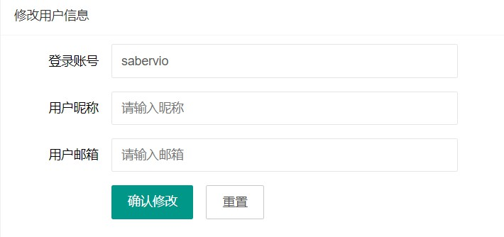
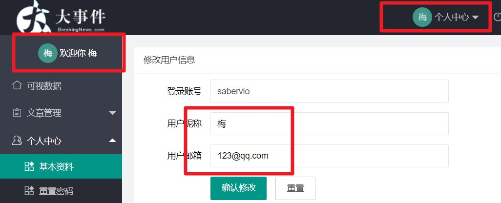

# day52

## 基本资料页面（userInfo）

### 渲染信息

```js
// 显示帐号、昵称、邮箱的初始化
getInfoUser((res) => {
    //ES6解构赋值
    const { username, nickname, email, id } = res.data.data
	//发送请求时接口文档要求id数据，于是用隐藏表单域提前接收数据
    $('.layui-form input[name=id]').val(id)
    //找到各自的DOM元素赋值，其中email和nickname没有时服务器返回为''---空字符串
    $('.layui-form input[name=username]').val(username)
    $('.layui-form input[name=email]').val(email)
    $('.layui-form input[name=nickname]').val(nickname)
})
```



- 隐藏表单域

  > 我们无需显示给用户让用户输入, 
  >
  > 但是提交的时候, 还想要这个值, 所以我们可以在js代码里把值赋予进去, 然后等提交时候, 收集一下即可了

  ```html
   <!-- 为了保存它的id, 这叫隐藏域, 方便修改时, 获取id的值 -->
  <input type="hidden" name="id" value="">
  ```

### 验证和获取表单数据

- 表单验证

  ```js
  //common文件夹下的verify.js（专门处理验证的js文件）中添加
  // 昵称&邮箱
  nickname: [
      /^[\u4E00-\u9FA5]+$/,
      '昵称只能是中文'
  ],
  email: [
      /^[A-Za-z0-9\u4e00-\u9fa5]+@[a-zA-Z0-9_-]+(\.[a-zA-Z0-9_-]+)+$/,
      '请输入正确邮箱'
  ]
  ```

- 收集表单值

  > jQ给我们提供了一个 serialize()方法, 可以收集form里所有name属性的值和value属性的值形成参数名=表单域值&参数名=表单域值的字符串

  ```js
  const data = $(".layui-form").serialize()
  ```

### 确认修改&自动刷新页面

- 提交表单值

  ```js
  $(".layui-form").on("submit", e => {
      // 阻止默认提交事件
      e.preventDefault()
      // 数据获取，修改发送格式
      const data = $(".layui-form").serialize()
      getObjectToString(data)
    	//调用index.js中挂载到window上的方法重新渲染信息页面
      postUserInfo(data, res => {
          window.parent.getUserInfo()
      })
  })
  ```

  

### 重置按钮

```js
// 重置按钮
// 把上面用户的信息, 重新铺设一遍
$(".my-reset").on("click", (ev) => {
    ev.preventDefault()
    $(".layui-form input[name=nickname]").val(nickname)
    $(".layui-form input[name=email]").val(email)
})s
```

## 密码重置页面（repwd）

### 表单认证

```js
//common文件夹下的verify.js（专门处理验证的js文件）中添加
// 修改密码页面使用 - 新旧密码不能一样
diff: function(value){
    return ($(".oldPwd").val() == value) && "新密码和旧密码不能一样"
},
// 修改密码页 - 使用
same: function(value) {
    return ($(".newPwd").val() !== value) && '两次密码不相同'
}
```

- **封装模块**
  - **common/verify.js**---抽取代码，专门处理表单认证规则

### 表单提交&返回登陆页面

```js
// 提交表单
$('.layui-form').on('submit', (e) => {
    //组织表单默认跳转事件
    e.preventDefault();
    //获取表单数据
    const data = $(".layui-form").serialize()
    //发送请求
    postChangePassword(data, res => {
        //解构响应数据
        const { status } = res.data
        //如果状态码正确执行跳转操作
        if (status === 0) {
            setTimeout(() => {
                localStorage.removeItem('token')
                window.parent.location.href = '../../../../day_52/阶段代码/login.html'
            }, 500);
        }
    })
})
```

### 重置按钮

- 清空表单

  ```js
  // 重置按钮
  $('.layui-form .layui-input-block .layui-btn-primary').click(() => {
      $('.layui-form input').val('')
  })
  ```

## 更换头像页面（ avatar）

### 插件配置

> 找插件 - 下插件 - 引插件 - 用插件 - 改配置

- 引入cropper.css
- 引入jQuery.js  (因为这个cropper插件里面代码都用jQuery.js写的)
- 引入 cropper.js
- 引入jquery-cropper.js

```js
// 1. 初始化裁剪插件
var cropper = new Cropper($("#image")[0], {
    aspectRatio: 1, // 裁剪图层的横纵比例
    preview: $(".img-preview") // 裁剪预览位置
});
```

### 上传按钮处理

```js
// 2. 点击按钮 -让别的按钮触发点击事件
$(".select").on("click", e => {
    $("#file").click()
})
```

### 图片预览（回显图片）

```js
// 3. 选择文件窗口出现 - 选中文件点击打开, 会触发change事件
$("#file").on("change", function (e) {
    let url = URL.createObjectURL(this.files[0])
    cropper.replace(url)
})
```

### 确认按钮-发送请求&确认按钮-更新页面

```js
// 4. 提交修改&渲染页面
$(".sure").on("click", e => {
    let canvas = cropper.getCroppedCanvas({
        width: 100,
        height: 100
    })
    let base64Str = canvas.toDataURL('../../../assets/images/sample.jpg')

    base64Str = encodeURIComponent(base64Str)
    let argStr = "avatar=" + base64Str
    upHeadImgAPI(argStr, res => {
        window.parent.getUserInfo()
    })
})
```

### 设置默认头像

> 将上述几步用函数包裹，在设定默认头像之后在进行调用，否则只会显示**html**结构中显示地址的图片

```js
// 更换头像
getInfoUser(res => {
    let { user_pic } = res.data.data
    debugger
    if (user_pic) $("#image").attr("src", user_pic)
    handleCropper()
})
const handleCropper = () => {
    // 1. 初始化裁剪插件
    // 2. 点击按钮 -让别的按钮触发点击事件
    // 3. 选择文件窗口出现 - 选中文件点击打开, 会触发change事件
    // 4. 提交修改&渲染页面
}
```

