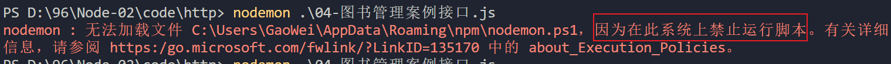

# day56

## http 模块

> http 模块是 Node.js 官方提供的、用来创建web 服务器和客户端的模块。它提供了一系列的方法和属性

- http.createServer() 方法，用来创建一个web 服务器，从而对外提供web 资源

- http.request() 方法，用来发起 http 网络请求，请求其它web 服务器上的资源

- 如果要在 JavaScript 代码中使用 http 模块，则需要先导入它


### 创建Web服务器

#### 导入http模块

```js
const http = require('http')
```

#### 创建服务器

```js
const server = http.createServer()
```

#### 启动服务器

```js
server.listen(3000【端口号】,【回调函数】() => {
    console.log('my server start work')
})
```

#### 监听请求

```js
server.on('request'【请求事件】,【回调函数】() => {
    console.log('There is a request')
})
```

### 访问本地服务器

- **localhost:[端口号]**

### 端口号

> 通过端口号，客户端发送过来的网络请求，可以被准确地交给端口号对应的web服务进行处理


**端口错误码**（端口号占用）

- EADDRINUSE
  - E---error【错误】
  - ADDR---address【地址】
  - INUSE--- in use【正在使用】

###Request请求对象（req）

- Request.url---请求地址

- Request.method---请求方式
- Request.headers---请求头

#### Request获取GET参数

- 1、引入URL模块

- 2、使用url.parse(参数1,参数2)解析参数

  - 参数1：url地址

  - 参数2：是否生成query参数对象（布尔值）

    ```js
    url.parse(req.url,true).query
    ```

#### Request获取POST参数

> post参数是以数据流的方式提交给服务器的所以无法一次性拿到所有参数，需要监听数据流事件

- data事件：有数据提交给服务器时触发
- end事件：所有数据提交完成时触发
- 步骤
  - 引入**node**核心模块**querystring**模块
  - 定义一个空字符串**str**变量，用于准备拼接参数
  - 监听**req**的**data**事件，拼接参数
  - 监听**req**的**end**事件，处理参数并完成业务逻辑
    - `querystring.parse(str)`---得到对象

### Response 响应对象（res）

- Response.end()---响应完成，给浏览器返回响应内容
- Response.write()---多次配置响应内容
- Response.setHeader()---配置响应头
- Response.statusCode()---配置响码

### 解决中文乱码问题

> 当调用 res.end() 方法，向客户端发送中文内容的时候，会出现乱码问题，此时，需要手动设置内容的编码格式

```js
res.setHeader('Content-Type', 'text/html; charset=utf-8')
```

## npm

### 什么是npm

> npm（node  package  manager）node包管理器

### npm作用

#### 管理node模块的工具

- 下载并安装第三方的模块
- 卸载第三方模块
- 发布模块
- 删除已发布的模块
- ....

#### 第三方模块

- 非内置模块，安装完node，还不能使用的模块，需要从网上下载安装，才能使用的模块
- 第三方模块是个人、公司、组织编写的模块，发布到网上，供人使用

### npm初始化(不能有中文路径)

```bash
npm init -y
# 或
npm init
# 然后一路回车
```

### 安装卸载项目模块

- 下载安装第三方模块

  ```bash
  npm install 模块名
  #或
  npm i 模块名
  ```

- 安装指定版本包

  ```bash
  npm install 模块名@版本号
  #或
  npm i 模块名@版本号
  ```

- 卸载模块

  ```bash
  npm uninstall 模块名
  #或
  npm un 模块名
  ```

### 关于项目模块的说明

- 下载安装的模块，存放在当前文件夹的 `node_modules` 文件夹中，同时还会生成一个记录下载的文件 `package-lock.json`
- 下载的模块，在哪里可以使用
  - 在当前文件夹
  - 在当前文件夹的子文件夹
  - 在当前文件夹的子文件夹的子文件夹
  - ......
- 怎样使用第三方模块
  - 和使用内置模块一样，需要使用 `require` 加载模块
  - 调用模块提供的方法完成工作（一般好的模块都会用使用文档的）

### 全局模块

- 全局安装的模块，不能通过 `require()` 加载使用

- 全局安装的模块，一般都是命令或者工具

- 安装方法，在安装模块的命令后面，加 `-g`

  ```bash
  npm i 模块名 -g
  # 或
  npm i -g 模块名
  ```

- 查看全局安装的模块 

  ```bash
  npm list -g --depth 0
  ```

- 卸载方法（也是多一个 `-g`）

  ```bash
  npm un 模块名 -g
  ```

- 全局安装的模块，在系统盘（C盘）

  - 通过命令 `npm root -g` 可以查看全局安装路径

### 全局安装nodemon模块

- 安装命令

  ```bash
  npm i nodemon -g
  ```

- nodemon的作用：

  - 代替node命令，启动服务的，当更改代码之后，nodemon会自动帮我们重启服务

- 运行nodemon，如果报错如下：

  

- 解决办法是：
  - `管理员`方式，打开命令行窗口
  - 执行 ` set-ExecutionPolicy RemoteSigned; ` 
  - 在出现的选项中，输入 `A`，回车。即可

### dependencies说明

- 保存依赖包的记录
- 项目中有`package.json`，使用`npm i`就会从`package.json`里面的`dependencies`中寻找依赖包信息，然后拉取`node_modules`依赖包
- 执行`npm i`命令要在`package.json`同级目录

### 更改镜像源

> 镜像源，就是下载安装第三方模块的网站
>
> 下载的第三方模块都是从国外的npm主站下载的，速度比较慢
>
> 淘宝在国内对npm上的第三方模块做了一个备份，也就是说，可以从国内下载第三方模块
>
> 除了淘宝之外，还有很多其他镜像源

简单的更改镜像源方法：

- 全局安装 nrm 的模块
  - nrm  用于管理镜像源
- 使用nrm
  - `nrm ls` 通过这个命令，可以查看可用的镜像源
  - `nrm use taobao` ，切换下载模块的网站为淘宝

