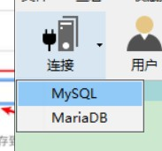

# day58

## 案例（书籍接口）

### 接口文档

> **本地服务器：**
>
> http://localhost:3000

#### 服务端编程

```js
// 加载文件模块
const fs = require('fs')
// 加载路径模块
const path = require('path')
// 加载express模块构建服务器
const express = require('express')
const app = express()
app.listen(3000, () => console.log('OK'))

//模拟数据存储，json文件存储数据，路径 
const storagePath = path.join(__dirname, 'books.json')
```

#### 图书列表

+ 接口URL：  /api/getbooks
+ 调用方式： GET
+ 参数格式：

| 参数名称  | 参数类型 | 是否必选 | 参数说明 |
| --------- | -------- | -------- | -------- |
| id        | Number   | 否       | 图书Id   |
| bookname  | String   | 否       | 图书名称 |
| author    | String   | 否       | 作者     |
| publisher | String   | 否       | 出版社   |

+ 响应格式：

| 数据名称    | 数据类型 | 说明                     |
| ----------- | -------- | ------------------------ |
| status      | Number   | 200 成功；500 失败；     |
| msg         | String   | 对 status 字段的详细说明 |
| data        | Array    | 图书列表                 |
| + id        | Number   | 图书Id                   |
| + bookname  | String   | 图书名称                 |
| + author    | String   | 作者                     |
| + publisher | String   | 出版社                   |

+ 返回示例：

```json
{
  "status": 200,
  "msg": "获取图书列表成功",
  "data": [
    { "id": 1, "bookname": "西游记", "author": "吴承恩", "publisher": "北京图书出版社" },
    { "id": 2, "bookname": "红楼梦", "author": "曹雪芹", "publisher": "上海图书出版社" },
    { "id": 3, "bookname": "三国演义", "author": "罗贯中", "publisher": "北京图书出版社" }
  ]
}

```

#### api接口

```js
/* 图书列表 */
app.get('/api/getbooks', (req, res) => {
    fs.readFile(storagePath, 'utf8', (err, data) => {
        // 错误返回
        if (err) {
            res.send({
                status: '500',
                msg: '失败'
            })
        }
        // 解析JSON字符串
        data = JSON.parse(data)
        // 成功返回
        res.json({
            "status": 200,
            "msg": "获取图书列表成功",
            "data": data
        })
    })
})
```

#### 添加图书

+ 接口URL：  /api/addbook
+ 调用方式： POST
+ 参数格式：

| 参数名称  | 参数类型 | 是否必选 | 参数说明 |
| --------- | -------- | -------- | -------- |
| bookname  | String   | 是       | 图书名称 |
| author    | String   | 是       | 作者     |
| publisher | String   | 是       | 出版社   |

+ 响应格式：

| 数据名称 | 数据类型 | 说明                         |
| -------- | -------- | ---------------------------- |
| status   | Number   | 201 添加成功；500 添加失败； |
| msg      | String   | 对 status 字段的详细说明     |

+ 返回示例：

```json
{
    "status": 201,
    "msg": "添加图书成功"
}
```

#### api接口

```js
/* 添加图书 */
// 应用级配置，在post时配置
app.use(express.urlencoded({ extended: false }))
app.post('/api/addbook', (req, res) => {
    // 获取请求体内的参数数据
    let reqData = req.body
    // 时间戳做id
    reqData.id = Date.now()
    fs.readFile(storagePath, 'utf8', (err, data) => {
        if (err) {
            return res.send({
                "status": 500,
                "msg": "添加图书失败"
            })
        }
        data = JSON.parse(data)
        // 追加数据内容
        data.push(reqData)
        // 
        fs.writeFile(storagePath, JSON.stringify(data, null, 4), (err) => {
            if (err) {
                res.send({
                    "status": 500,
                    "msg": "添加图书失败"
                })
            } else {
                res.send({
                    "status": 201,
                    "msg": "添加图书成功"
                })
            }
        })
    })
})
```

#### 删除图书

+ 接口URL：  /api/delbook
+ 调用方式： GET
+ 参数格式：

| 参数名称 | 参数类型 | 是否必选 | 参数说明 |
| -------- | -------- | -------- | -------- |
| id       | Number   | 是       | 图书Id   |

+ 响应格式：

| 数据名称 | 数据类型 | 说明                                                         |
| -------- | -------- | ------------------------------------------------------------ |
| status   | Number   | 200 删除成功；500 未指定要删除的图书Id；501 执行Sql报错；502 要删除的图书不存在； |
| msg      | String   | 对 status 字段的详细说明                                     |

+ 返回示例：

```json
{
    "status": 200,
    "msg": "删除图书成功！"
}
```

```js
/* 添加图书 */
// 应用级配置，在post时配置
app.use(express.urlencoded({ extended: false }))
app.post('/api/addbook', (req, res) => {
    // 获取请求体内的参数数据
    let reqData = req.body
    // 时间戳做id
    reqData.id = Date.now()
    fs.readFile(storagePath, 'utf8', (err, data) => {
        if (err) {
            return res.send({
                "status": 500,
                "msg": "添加图书失败"
            })
        }
        data = JSON.parse(data)
        // 追加数据内容
        data.push(reqData)
        // 
        fs.writeFile(storagePath, JSON.stringify(data, null, 4), (err) => {
            if (err) {
                res.send({
                    "status": 500,
                    "msg": "添加图书失败"
                })
            } else {
                res.send({
                    "status": 201,
                    "msg": "添加图书成功"
                })
            }
        })
    })
})

/* 删除图书 */
app.get('/api/delbook', (req, res) => {
    // 通过id查找书籍删除
    const reqId = req.query.id
    // 没有id传递或者id没有传递数值
    if (reqId == '' || reqId == undefined) {
        return res.send({
            "status": 500,
            "msg": "未指定要删除的图书Id"
        })
    }
    // 读取json文件数据
    fs.readFile(storagePath, 'utf8', (err, data) => {
        if (err) {
            return res.send({
                "status": 501,
                "msg": "执行Sql报错"
            })
        }
        // 解析数据
        data = JSON.parse(data)
        // 存下长度以判断是否找到匹配项
        const dataLength = data.length
        // 数组方法剔除id匹配项
        data = data.filter(item => item.id != reqId)
        // 如果没有删除项则返回图书不存在
        if (dataLength == data.length) {
            return res.send({
                "status": 502,
                "msg": "要删除的图书不存在"
            })
        }
        // 删除结束重新写入json文件
        fs.writeFile(storagePath, JSON.stringify(data, null, 4), (err) => {
            if (err) {
                res.send({
                    "status": 501,
                    "msg": "执行Sql报错"
                })
            } else {
                res.send({
                    "status": 200,
                    "msg": "删除图书成功"
                })
            }
        })
    })
})
```

### 使用第三方模块实现跨域资源共享

实现跨域资源共享，可以使用一个叫做  cors 的第三方模块。推荐使用它来实现跨域资源共享。

使用方法：

- 下载安装cors   `npm i cors`
- `const cors = require('cors')`  --- 加载模块
- `app.use(cors())`  --  使用use方法即可

> 客户端使用时先启动服务器

## 路由

> 广义上来讲，路由就是**映射关系**

### Express中的路由

> 在 Express 中，路由指的是客户端的请求与服务器处理函数之间的映射关系
>
> Express 中的路由分 3 部分组成，分别是请求的类型、请求的 URL 地址、处理函数
>
> 每当一个请求到达服务器之后，需要先经过路由的匹配，只有匹配成功之后，才会调用对应的处理函数
>
> 在匹配时，会按照路由的顺序进行匹配，如果请求类型和请求的 URL 同时匹配成功，则 Express 会将这次请求，转 交给对应的 function 函数进行处理

### 模块化路由

> 为了方便对路由进行模块化的管理，Express **不建议**将路由直接挂载到 app 上，而是推荐将路由抽离为单独的模块

1. 创建路由模块对应的 .js 文件

   1. 【例如】创建router/login.js  存放 登录、注册、验证码三个路由
   2. 【例如】创建router/heroes.js 存放 和英雄相关的所有路由

2. 调用 express.Router() 函数创建路由对象

   ```js
   const express = require('express')
   const router = express.Router()
   ```

3. 向路由对象上挂载具体的路由

   ```js
   // 把app换成router，比如
   router.get('/xxx/xxx', (req, res) => {})
   router.post('/xxx/xxx', (req, res) => {})
   ```

4. 使用 module.exports 向外共享路由对象

   ```js
   module.exports = router
   ```

5. 使用 app.use() 函数注册路由模块 -- app.js

   ```js
   // app.js 中，将路由导入，注册路由
   const login = require('./router/logon.js')
   app.use(login)
   
   // app.use(require('./router/heroes.js'))
   app.use( require(path.join(__dirname, 'router', 'heores.js')) )
   ```

### 为路由模块添加前缀

我们可以省略路由模块中的 `/api` 前缀，而是在注册路由的时候，统一设置。

```js
app.use('/api', router)
```

```js
// 导入路由模块，并注册路由
app.use('/api',  require(path.join(__dirname, 'router', 'login.js'))  )
app.use('/my',  require(path.join(__dirname, 'router', 'heroes.js'))  )
```

路由文件中，把前缀 /api 和 /my 去掉

### 使用路由模块的好处

- 分模块管理路径，提高了代码的可读性
- 可维护性更强
- 减少路由的匹配次数
- 权限管理更方便
- etc...

## MySQL

> **数据库 (database) 是用来组织、存储和管理数据的仓库**

### 常见的数据库及分类

市面上的数据库有很多种，最常见的数据库有如下几个

- MySQL 数据库(目前使用最广泛、流行度最高的的开源免费数据库;) 
- Oracle 数据库(收费)
- SQL Server 数据库(收费)
- Mongodb 数据库(Community + Enterprise)

其中，MySQL、Oracle、SQL Server 属于**传统型数据库**(又叫做:关系型数据库 或 SQL 数据库)，这三者的 设计理念相同，用法比较类似

而 Mongodb 属于**新型数据库**(又叫做:非关系型数据库 或 NoSQL 数据库)，它在一定程度上弥补了传统型 数据库的缺陷

### 操作MySQL的图形化工具（Navicat）

#### 连接到MySQL服务器




#### 创建数据库


#### 创建数据表

比如创建一个学生信息表：

| id（不允许重复） | name   | age  | sex  | tel         |
| ---------------- | ------ | ---- | ---- | ----------- |
| 1                | 王宇   | 23   | 男   | 13200008888 |
| 2                | 王宇   | 24   | 男   | 13300008888 |
| 3                | 裴志博 | 25   | 男   | 18866669999 |
| ...              | ...    | ...  | ...  | ...         |

> 对于一张表，最重要的是表头的设计
>
> 对于数据库中的数据表，最重要的设计也是表头，只不过在数据库中`把表头叫做字段`。

| 名（表头） | 类型    | 长度 | 不是null | 键   | 其他         |
| ---------- | ------- | ---- | -------- | ---- | ------------ |
| id         | int     |      | √        | 🗝    | 勾选自动递增 |
| name       | varchar | 10   | √        |      |              |
| age        | int     |      |          |      |              |
| sex        | char    | 1    |          |      |              |

- id  --  自动递增  --  √

- 最后保存，填表名 `student` 。

- 其他补充点
  - 数据库中的数字类型
    - tinyint  -128~127
    - smallint -65535 ~ 65535
    - int -21亿 ~ 21亿
    - bigint 更大
  - 数据库中的字符串类型
    - varchar - 变长字符串类型 
    - char     - 定长字符串类型

#### 导入导出数据表

- 导出
  - 在数据表名字上，比如 `student` 上，右键 --> 转储SQL文件 --> 结构和数据，选择保存位置保存即可。

- 导入
  - 在数据库名上面 --> 右键 --> 运行SQL文件 --> 选择SQL文件，运行即可完成导入。
  - 导入注意事项，表名不能重复。