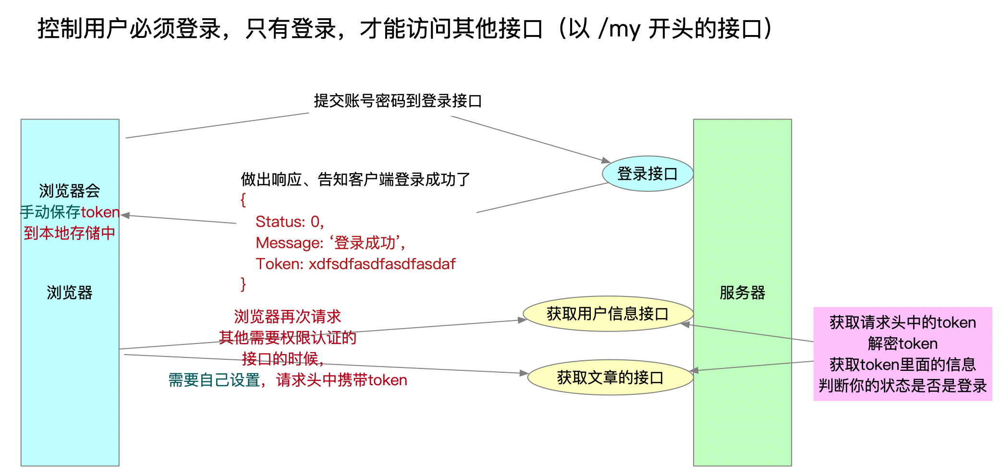

# day60

## 综合应用-服务端(书籍管理)搭建-案例

#### 初始化项目，下载模块

```shell
npm init -y
npm i express cors mysql
# express 用于搭建服务器
# cors 用于解决跨域
# mysql 用于操作数据库
```

#### 创建主入口文件app.js

```js
/* 配置服务器 */
const express = require('express')
const app = express()
app.listen(3000, console.log('综合案例api项目开启OK……'))
/* 应用级配置 */
app.use(express.urlencoded({ extended: false }))//通过querystring接收post请求参数
const cors = require('cors')//引入cors模块解决跨域问题
app.use(cors())
/* 引入路由模块 */
const books = require('./routers/books')
app.use('/api', books)
```

#### 拆解路由文件

> 路由文件全部置于**routers**文件夹下

```js
/* 通过express模块构造路由对象 */
const express = require('express')
const router = express.Router()
const db = require('../db.js')//引入封装的db函数（调用数据库）
/* get请求获取图书列表 */
router.get('/getbooks', (req, res) => {
    db('select * from book', null, (err, result) => {
        console.log(result)
        if (err) {
            res.json({
                status: '500',
                msg: '获取图书列表失败'
            })
        } else {
            res.json({
                status: 200,
                msg: '获取图书列表成功',
                data: result
            })
        }
    })
})
/* post请求添加图书 */
router.post('/addbook', (req, res) => {
    db('insert into book set ?', req.body, (err, result) => {
        console.log(result)
        if (err) {
            res.json({
                status: '500',
                msg: '添加图书失败'
            })
        } else {
            res.json({
                status: 201,
                msg: '添加图书成功',
            })
        }
    })
})
/* get请求删除指定图书 */
router.get('/delbook', (req, res) => {
    db('delete from book where id=?', req.query.id, (err, result) => {
        if (err) {
            res.json({
                status: '500',
                msg: '删除图书失败'
            })
        } else {
            res.json({
                status: 201,
                msg: '删除图书成功',
            })
        }
    })
})

/* 将路由对象暴露出去 */
module.exports = router
```

#### 封装数db函数（调用数据库）

```js
const db = (sql, params, callback) => {
    /* 配置路由 */
    const mysql = require('mysql')
    const conn = mysql.createConnection({
        host: 'localhost',
        port: 3306,
        user: 'root',
        password: 'root',
        database: 'user'
    })
    conn.connect()
    /* 重点操作数据库的语句 */
    conn.query(sql, params, callback)//sql==>SQL语句，params==>占位符的值，callback==>回调函数
    conn.end()
}
/* 将方法暴露出去 */
module.exports = db
```

## 身份认证

### Web 开发模式

目前主流的 Web 开发模式有两种，分别是: 

- 基于服务端渲染的传统 Web 开发模式

- 基于前后端分离的新型 Web 开发模式

#### 服务端渲染的开发模式

> 所有的web资源由同一个服务器统一管理（前后端代码必须放到一起）
>
> 页面和页面中使用的数据，由服务器组装，最后将完整的HTML页面响应给客户端

**优点：**

- **前端耗时少**
  - 服务器端负责动态生成 HTML 内容，浏览器只需要直接渲染页面即可，尤其是移动端，更省电
- **有利于SEO**
  - 因为服务器端响应的是完整的 HTML 页面内容，所以爬虫更容易爬取获得信息，更有利于 SEO

**缺点:**

- **占用服务器端资源**
  - 即服务器端完成 HTML 页面内容的拼接，如果请求较多，会对服务器造成一定的访问压力
- **不利于前后端分离，开发效率低**
  - 使用服务器端渲染，则**无法进行分工合作**，尤其对于**前端复杂度高**的项目，不利于项目高效开发

#### 前后端分离的开发模式

> **依赖于Ajax技术**
>
> 后端不提供完整的 HTML 页面内容，而 是提供一些 API 接口
>
> 前端通过 Ajax 调用后端提供的 API 接口，拿到 json 数据 之后再在前端进行 HTML 页面的拼接，最终展示在浏览器上
>
> 简而言之，前后端分离的 Web 开发模式，就是**后端只负责提供** **API** **接口，前端使用** **Ajax** **调用接口**的开发模式

**优点：**

- **开发体验好**
  - 前端专注于 UI 页面的开发，后端专注于api 的开发，且前端有更多的选择性
- **用户体验好**
  - Ajax 技术的广泛应用，极大的提高了用户的体验，可以轻松实现页面的局部刷新
- **减轻了服务器端的渲染压力**
  - 因为页面最终是在每个用户的浏览器中生成的

**缺点：**

- **不利于SEO**
  - 因为完整的 HTML 页面需要在客户端动态拼接完成，所以爬虫对无法爬取页面的有效信息
  - (解决方 案：利用 Vue、React 等前端框架的 **SSR** (server side render)技术能够很好的解决 SEO 问题!)

#### 如何选择 Web 开发模式

- 企业级网站（公司的网站），主要功能是展示而没有复杂的交互，并且需要良好的 SEO，这时可以使用**服务器端渲染**
- 类似后台管理页面，交互性比较强，不需要 SEO 的考虑，那么就可以使用**前后端分离**的开发模式
- **同时兼顾**了**首页的渲染速度**和**前后端分离的开发效率**，一些网站采用了首屏服务器端渲染（不多）
  - 即对于用户最开始打开的那个页面采用的是服务器端渲染，而其他的页面采用前后端分离开发模式

### 身份认证机制

> 服务端渲染推荐使用 **Session** **认证机制**（Session也会用到Cookie）
>
> 前后端分离推荐使用 **JWT** **认证机制**

#### Cookie


##### 实现身份认证

搭建基础的服务器

- 下载安装第三方模块 `express` 和 `cookie-parser`
- 创建app.js
- 加载所需模块
  - `const express = require('express')`
  - `const cookieParser = require('cookie-parser')`配置 cookie-parser

- 全局配置使用cookie-parser
  - `app.use(cookieParser())`
- 设置cookie
  - `res.cookie(名, 值, {maxAge: 毫秒数})`
  - `res.cookie(名, 值)`
  - `res.cookie(名, 值, {maxAge: 2*60*1000})`
- 获取cookie
  - req.cookies.名

- 实现三个路由
  - /login.html （里面直接响应login.html页面）
  - /api/login
  - /index.html （里面直接响应index.html页面）
- 创建存放index页面的public文件夹
  - 创建index.html
  - 创建login.html
- 完成登录接口
  - 如果登录成功，设置cookie。`res.cookie('key', 'value', 配置项)`
  - 跳转到 /index.html 路由
- /index.html 路由中，根据cookie判断是否登录，从而完成身份认证

**public/index.html**

```html
<!DOCTYPE html>
<html lang="en">
<head>
  <meta charset="UTF-8">
  <meta name="viewport" content="width=device-width, initial-scale=1.0">
  <title>Document</title>
</head>
<body>
  <h1>后台首页(登录后才能查看)-cookie</h1>
</body>
</html>
```

**public/login.html**

```html
<!DOCTYPE html>
<html lang="en">
<head>
    <meta charset="UTF-8">
    <meta name="viewport" content="width=device-width, initial-scale=1.0">
    <title>Document</title>
</head>
<body>
    <!-- 为了快速演示，我们使用同步提交。就不用ajax了 -->
    <!-- 需要设置表单的action属性为接口地址，method为请求方式 -->
    <form action="/api/login" method="POST">
        账号：<input type="text" name="username" /> <br />
        密码：<input type="text" name="password" /> <br />
        <button>登录</button>
    </form>
</body>
</html>
```

**app.js**

```js
const express = require('express')
const cookieParser = require('cookie-parser')
const path = require('path')

const app = express()
app.listen(3000, () => console.log('启动了'))

// 接收POST请求体
app.use(express.urlencoded({extended: false}))
// 配置cookie-parser
app.use(cookieParser())

// 准备三个路由

// 用于显示登录页面
app.get('/login.html', (req, res) => {
    // sendFile方法，可以读取文件，并将读取的结果响应给客户端
    // 要求，参数必须是一个绝对路径
    res.sendFile(path.join(__dirname, 'public', 'login.html'))
})

// 用于完成登录验证的（判断账号密码是否正确的接口）
app.post('/api/login', (req, res) => {
    // console.log(req.body)
    // 约定，假设账号是 admin、密码是123
    if (req.body.username === 'admin' && req.body.password === '123') {
        // 登录成功，跳转到index.html
        // 设置cookie
        // res.cookie('key', 'value', '选项')
        // res.cookie('isLogin', 1) // 没有填选项，默认cookie有效期是会话结束
        res.cookie('isLogin', 1);
        res.send('<script>alert("登录成功"); location.href="/index.html"</script>')
    } else {
        // 登录失败
        res.send('<script>alert("登录失败"); location.href = "/login.html"</script>')
    }
})

// 显示index.html页面的
app.get('/index.html', (req, res) => {
    // 获取cookie
    // console.log(req.cookies)
    if (req.cookies.isLogin && req.cookies.isLogin === '1') {
        res.sendFile(path.join(__dirname, 'public', 'index.html'))
    } else {
        // 没有登录
        res.send('<script>alert("请先登录"); location.href="/login.html"</script>')
    }
})
```

##### 有效期

默认：浏览会话结束（也就是关闭浏览器）

设置有效期： res.cookie('isLogin', 1, {maxAge: 毫秒数})

如：`res.cookie('isLogin', 1, {maxAge: 2*60*1000})`

##### 优缺点

- 优点
  - 体积小
  - 客户端存放，不占用服务器空间
  - 浏览器会自动携带，不需要写额外的代码，比较方便
- 缺点
  - 客户端保存，安全性较低，但可以存放加密的字符串来解决
  - 可以实现跨域，但是难度大，难理解，代码难度高
  - 不适合前后端分离式的开发

##### 适用场景

- 传统的服务器渲染模式
- 存储安全性较低的数据，比如视频播放位置等

#### Session


##### 实现身份认证

- 搭建基础的服务器

  - 下载安装第三方模块 `express` 和 `express-session`

  - 创建app.js

  - 加载所需模块
    - `const express = require('express')`
    - `const session = require('express-session')`

  - 配置 session

    ```js
    app.use(session({
        secret: 'adfasdf', // 这个随便写
        saveUninitialized: false,
        resave: false
    }))
    ```

  - req.session.xxxx = 'yyyy'
  - 获取session
    
    - req.session.xxxx

- 实现三个路由

  - /login.html （里面直接响应login.html页面）
  - /api/login
  - /index.html （里面直接响应index.html页面）

- 创建存放index页面的public文件夹

  - 创建index.html
  - 创建login.html

- 完成登录接口

  - 如果登录成功，使用session记录用户信息。

    ```js
    req.session.isLogin = 1
    req.session.username = req.body.username
    ```

  - 跳转到 /index.html 路由

- /index.html 路由中，根据session判断是否登录，从而完成身份认证

**public/index.html**

```html
<!DOCTYPE html>
<html lang="en">
<head>
    <meta charset="UTF-8">
    <meta name="viewport" content="width=device-width, initial-scale=1.0">
    <title>Document</title>
</head>
<body>
    <h1>这里是后台首页(登录后才能查看) -- session</h1>
    <h1>欢迎你：{{username}}</h1>
</body>
</html>
```

**public/loin.html**

```html
<!DOCTYPE html>
<html lang="en">
<head>
    <meta charset="UTF-8">
    <meta name="viewport" content="width=device-width, initial-scale=1.0">
    <title>Document</title>
</head>
<body>
    <!-- 为了快速演示，我们使用同步提交。就不用ajax了 -->
    <!-- 需要设置表单的action属性为接口地址，method为请求方式 -->
    <form action="/api/login" method="POST">
        我的账号：<input type="text" name="username" /> <br />
        我的密码：<input type="text" name="password" /> <br />
        <button>登录</button>
    </form>
</body>
</html>
```

**app.js**

```javascript
const express = require('express')
const session = require('express-session')
const path = require('path')

const app = express()
app.listen(3000, () => console.log('启动了'))

// 接收POST请求体
app.use(express.urlencoded({extended: false}))
// 配置session， 配置项 对象中的三项是必填的，不然会报一个警告。
app.use(session({
    //传递session的加密秘钥，一般情况下随便填一个字符串。
    secret: 'asdf23sfsd23',
    // 下面两项，设置成true或者false，都可以。使用内存存储session的时候，下面两项没作用
    saveUninitialized: false,
    resave: false
}))

// 准备三个路由

// 用于显示登录页面
app.get('/login.html', (req, res) => {
    // sendFile方法，可以读取文件，并将读取的结果响应给客户端
    // 要求，参数必须是一个绝对路径
    res.sendFile(path.join(__dirname, 'public', 'login.html'))
})

// 用于完成登录验证的（判断账号密码是否正确的接口）
app.post('/api/login', (req, res) => {
    // console.log(req.body)
    // 假设账号任意，密码必须是123
    if (req.body.password === '123') {
        // 假设登录成功
        // req.session.xxxx = 'yyyy'
        req.session.isLogin = 1
        req.session.username = req.body.username
        // 做出响应
        res.send('<script>alert("登录成功"); location.href="/index.html"</script>')
    }
})

// 显示index.html页面的
app.get('/index.html', (req, res) => {
    // 获取session    req.session
    if (req.session.isLogin && req.session.isLogin == 1) {
        const fs = require('fs')
        fs.readFile('./public/index.html', 'utf-8', (err, data) => {
            if (err) return console.log(err)
            // 更换用户名
            data = data.replace('{{username}}', req.session.username)
            res.send(data)
        })
    } else {
        res.send('<script>alert("请登录"); location.href="/login.html"</script>')
    }
    
})
```

##### 有效期

默认：浏览会话结束（也就是关闭浏览器）

##### 优缺点

- 优点
  - 服务端存放，安全性较高
  - 浏览器会自动携带cookie，不需要写额外的代码，比较方便
  - 适合服务器端渲染模式
- 缺点
  - 会占用服务器端空间
  - session实现离不开cookie，如果浏览器禁用cookie，session不好实现
  - 不适合前后端分离式的开发

##### 适用场景

- 传统的服务器渲染模式
- 安全性要求较高的数据可以使用session存放，比如用户私密信息、验证码等

#### JWT



> 前端提交用户名和密码，服务端验证
>
> 服务端验证通过后，生成token，返回给前端
>
> 前端自行保存token（localstorage）
>
> 登陆成功后，每次请求要在请求头带上Authorization ，值是token

##### 实现身份认证

- 想要完成jwt方式的身份认证，需要以下两个第三方模块

  - express-jwt  用于`解密`token字符串，还可以控制哪些接口需要身份认证
  
- jsonwebtoken 用于`加密`token字符串
  
    > 1、登录的接口，要给客户端返回token
    > 2、控制其他接口，必须携带正确的token才能访问
    > 3、其他需要权限的接口中，能够使用token中保存的数据（用户名）
    > 4、如果身份认证失败，服务器要响应 {status: 1, message: '身份认证失败！'}
  
- **登录成功之后，生成token**

**在login.js**

- 加载jsonwebtoken模块
- 使用该模块的 sign 方法生成token加密串
- 返回给客户端的时候，要在加密串前面加上 “`Bearer ` ”

```js
/*  login.js  */
// 加载jsonwebtoken模块（用于生成token加密串）
const jwt = require('jsonwebtoken')

// 登录的接口
router.post('/login', (req, res) => {
    // 假设账号是 admin，密码是 111111
    if (req.body.username === 'admin' && req.body.password === '111111') {
        // 登录成功
        res.json({
            status: 0,
            message: '登录成功',
            // token: 'Bearer ' + jwt.sign(要保存的信息, 秘钥, 配置项)
            // 生成的token前面必须有Bearer，还有一个空格。否则一会token不能正常的解密
            // expiresIn 值是字符串时 为毫秒 ， 值是数值时 为秒
            token: 'Bearer ' + jwt.sign({username: 'admin', age: 20}, 'bigevent-9760', {expiresIn: 20})
        })
    }
})
```

**使用express-jwt控制 以 /my 开头的接口，必须加入token才能访问**

**在 app.js 中**

- 加载 express-jwt 模块
- 应用级配置，指定哪些接口不需要身份认证

```js
// 使用express-jwt模块，控制 以 /my 开头的接口，需要正确的token才能访问
const expressJWT = require('express-jwt')

// unless ： 如果没有 unless方法，则默认所有接口都需要验证，unless把不需要验证的接口排除掉。
/* 
secret : 加密秘钥
algorithms ： 加密算法 ['HS256']
path 取值范围：
  字符串：表示排除一个地址 如 '/api/login'
  数组： 表示排除多个地址 如 ['/api/login', ]
  正则： 表示排除符合规则的地址 如 /^\/api/  (排除以 /api开头的接口)
*/
app.use( expressJWT({secret: 'bigevent-9760', algorithms: ['HS256']}).unless({path: /^\/api/}))
```

##### 优缺点

- 优点
  - token由客户端保存，不会占用服务器端空间
- 缺点
  - 客户端发送请求的时候，需要手动编写代码，携带token

##### 适用场景

- 适合前后端分离模式的开发