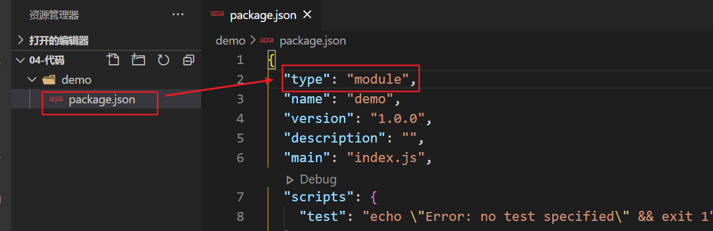
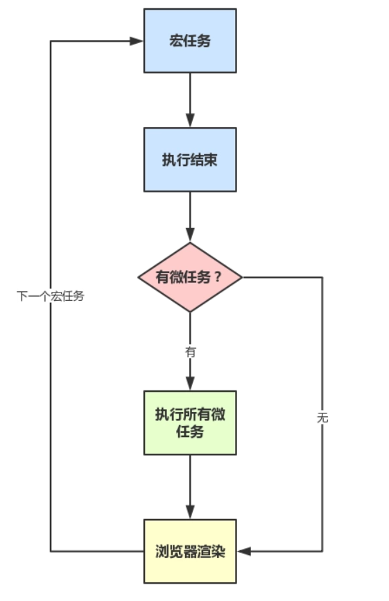

# day62

## 模块化

> node.js遵循了CommonJs的模块化规范
>
> **导入：**`require('')`
>
> **导出：**`module.exports`

### 前端模块化

> 在ES6模块化规范诞生之前，JavaScript社区尝试并提出了**AMD（国外requirejs）**、**CMD（国内seajs淘宝）**、**CommonJS（nodejs）**
>
> - AMD、CMD适用于浏览器端JavaScript模块化
> - CommonJs适用于服务端JavaScript模块化

### ES6的模块化规范

> 每个 js 文件都是一个独立的模块
>
> 导入其它模块成员使用 `import`  关键字
>
> 向外共享模块成员使用 `export` 关键字 

### 在 node.js 中体验 ES6 模块化

> 确保安装了 **v14.15.1** 或更高版本的 node.js
>
> 在 package.json 的根节点中添加 "type": "module" 节点



#### 基本语法

- **默认导出 & 默认导入**

  - 默认导出的语法： `export default 默认导出的成员(可以对象形式导出)`

    ```js
    const a = 10
    const b = 20
    const fn = () => {
        console.log('This is a function')
    }
    
    export default {
        a,
        b,
        fn
    }
    ```

  - 默认导入的语法： `import result(接收名称) from '不加后缀会按照模块解析(模块标识符)'`

    ```js
    import result from './export.js'//可以按照对象取值方法调取对象内容
    console.log(result)		//{ a: 10, b: 20, fn: [Function: fn] }
    console.log(result.a)	//10
    console.log(result.b)	//20
    console.log(result.fn)	//[Function: fn]
    ```

  - **PS**：

    - 每个模块中，只允许使用唯一的一次 export default
    - 默认导入时的接收名称可以任意名称，只要是合法的成员名称即可

- **按需导入 & 按需导出**

  - 按需导出的语法： `export const a = 10`

  - 按需导入的语法： `import { a[as 别名] } from '模块标识符'`

    ```js
    import { a as c } from './export.js'
    console.log(c)	//10
    console.log(a)	//ReferenceError: a is not defined[引用别名c之后a就不能用了]
    ```

  - **PS：**

    - 每个模块中可以使用多次按需导出
    - 按需导入的成员名称必须和按需导出的名称保持一致
    - 按需导入时，可以使用as 关键字进行重命名
    - 按需导入可以和默认导入一起使用

- **直接导入执行模块代码**

  - 如果只想单纯地执行某个模块中的代码，并不需要得到模块中向外共享的成员

  - `import './xxx.js'`

    ```js
    /* export.js */
    console.log('export code')
    ```

    ```js
    /* import.js */
    import './export.js'	//export code
    ```

## Promise

> ES6提出的异步编程规范，目的是为了解决“回调地狱”

### Promise基本语法

- 创建一个 promise 对象

  ```js
  const p = new Promise((resolve, reject) => {
    promise内部一般可以封装一个异步操作
  	成功调用 resolve()
  	失败调用 reject()
  })
  ```

- 使用一个 promise 对象

  ```js
  promise 对象
    .then(res => { ... }) 处理成功
    .catch(res => { ... }) 处理失败
  ```

### Promise三个状态

> `then、catch`才会处理**成功**和**失败**
>
> **状态凝固：**一旦**Promise**被标记为**成功**或**失败**之后就不允许更改状态（不允许出现多次成功`resolve`或失败`reject`）

- **pending**---等待中，`new Promise()`就开始等待
- **fulfilled/resolved**---将**Promise**标记为成功
- **rejected**---将**Promise**标记为失败

### Promise静态方法（all、race）

- **all：**`Promise.all([ promise1, promise2, ... ]).then( ... )`
- Promise.all() 方法会发起并行的 Promise 异步操作，**等所有**的异步操作全部结束后才会执行下一步的 .then操作（**等待机制**）
  
- **race：**`Promise.race([ promise1, promise2, ... ]).then( .... )`
- Promise.race() 方法会发起并行的 Promise 异步操作，**只要任何一个异步操作完成**，就立即执行下一步的 .then 操作（**赛跑机制**）
  

### async&await

> async 和 await 是**一对**关键字

- async用于修饰一个函数, 表示一个函数是异步

  > 如果async函数内没有await, 那么async没有意义的, 全是同步的内容
  >
  > 只有遇到了await开始往下, 才是异步的开始

- await 要用在 async 函数中

  ```js
  console.log(1)
  async function fn () {
    console.log(4)
    const res = await 2
    console.log(res)
  }
  fn()
  console.log(3)
  //1 4 3 2
  ```

- await 后面一般会跟一个promise对象,  await会阻塞async函数的执行,

  直到等到 promise成功的结果(resolve的结果)

- await 只会等待 promise 成功的结果, 如果失败了会报错, 需要 **try & catch**

  ```js
  async function fn() {
      try {
         const res = await fnc('...')
         ...
      } catch (err) {
        ...
      }
  }
  ```

## 事件循环队列 - 宏任务微任务

> **JavaScript 是一门单线程执行的编程语言**
>
> 如果前一个任务非常耗时，则后续的任务就不得不一直等待
>
> 为了防止某个耗时任务导致程序假死的问题，异步代码 由JavaScript  委托给**宿主环境(浏览器,node环境)**进行等待执行

### 宏任务

> 主代码块, 定时器, 延时器的代码内容等都属于宏任务,  上一个宏任务执行完, 才会考虑执行下一个宏任务

### 微任务

> 当前宏任务执行完，在下一个宏任务开始之前需要执行的任务, promise 的 .then  .catch 中的代码都属于微任务

- js 主线程遇到异步的内容, 交给浏览器去等待, 不会阻塞主线程
- 一定是满足条件后的任务, 才会被添加到任务队列



