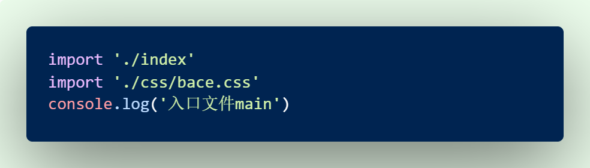

# day63

## yarn包管理器

> 快速、可靠、安全的依赖管理工具
>
> 和 npm 类似, 都是包管理工具, 可以用于下载包

- 基本命令

  ```bash
  1. 初始化
  	yarn init  /  yarn init -y
  
  2. 添加依赖
  	yarn add [package]
  	yarn add [package]@[version]
  
  3. 移除包
  	yarn remove [package]
               
  4. 安装项目全部依赖            
  	yarn 或者 yarn install
  
  5. 全局
  	安装: yarn global add [package]     npm i -g 包名
  	卸载: yarn global remove [package]
  ```

## webpack

> webpack 是一个现代 javascript 应用程序的 **静态模块打包器 (module bundler)**

### webpack 能做什么

- 语法转换
  - less/sass转换成css
  - ES6转换成ES5
  - ...
- html/css/js 代码压缩合并 (打包)
- webpack可以在开发期间提供一个开发服务器

### webpack 5 的基本使用

1. 建目录  dist    src/index.js

2. 初始化

   ```bash
   yarn init -y
   ```

3. 安装依赖包

   ```bash
   yarn add webpack  webpack-cli  -D #-D作为开发阶段的依赖, 只在开发阶段使用
   # dependencies  项目依赖
   # devDependencies 开发依赖
   ```

4. 配置scripts 

   ```json
   scripts: {
   	"build": "webpack --config webpack.config.js"
   }
   // --config  webpack.config.js 这个配置文件名为默认值, 不加也会默认找这个文件
   ```

5. 提供 webpack.config.js 

   ```js
   const path = require('path')//可根据实际需要配置相关选项
   module.exports = {
     // 入口: 从哪个文件开始打包
     entry: './src/main.js'
     
     // output: 配置输出 (打包到哪去)
     output: {
       
     // 打包输出的目录 (必须是绝对路径)
     path: path.join(__dirname, 'dist'),
       // 打包生成的文件名
       filename: 'bundle.js'
     },
   
     // 打包模式 production 压缩/development 不压缩
     mode: 'development'
   }
   ```

### 自动生成html - `html-webpack-plugin` 插件 

> 配置好了之后, public 目录的 index.html 就不需要引入打包后的文件了, 会自动被插件生成 html 引入

1. 下载

   ```js
   yarn add html-webpack-plugin  -D
   ```

2. **在`webpack.config.js`文件中，引入模块** :

   ```js
   // 引入自动生成 html 的插件
   const HtmlWebpackPlugin = require('html-webpack-plugin')
   ```

3. 配置

   ```json
   plugins: [
     new HtmlWebpackPlugin({ template: './public/index.html' })
   ]
   ```

### webpack - loaders 的配置

>webpack默认只认识 js 文件和 json文件, 但是webpack 可以使用 [loader](https://www.webpackjs.com/concepts/loaders) 来加载预处理文件, 允许webpack也可以打包 js之外的静态资源

1. 安装依赖

   ```bash
   yarn add style-loader css-loader -D
   ```

2. 配置

   ```json
   module: {
     // loader的规则
     rules: [
       {
         // 正则表达式，用于匹配所有的css文件
         test: /\.css$/,
         // 先用 css-loader 让webpack能够识别 css 文件的内容
         // 再用 style-loader 将样式, 以动态创建style标签的方式添加到页面中去
         use: [ "style-loader", "css-loader"]
       }
     ]
   }
   ```

### 分离 css 文件 `mini-css-extract-plugin`

> 上面的操作，使得`css`和`js`文件混杂在一起，插件: `mini-css-extract-plugin`可以把`css`分离出来

1. 安装依赖包

   ```bash
   yarn add mini-css-extract-plugin -D
   ```

2. **在`webpack.config.js`文件中，引入这个模块** 

   ```js
   // 引入分离 css 文件的 模块
   const MiniCssExtractPlugin = require('mini-css-extract-plugin')
   ```

3. 配置loaders

   ```json
   // 模块加载
   module: {
     // loader的规则
     rules: [
       // 配置 css 文件的解析
       {
         test: /\.css$/,
         use: [ // 根据官方文档写的，注意'css-loader'的书写位置
           {
             loader: MiniCssExtractPlugin.loader,
             options: {  // 目前在使用的时候可以不加options
               publicPath:'../',
             },
           },
           'css-loader'
         ]
       },
     ],
   }
   ```

4. 插件的配置

   ```json
   plugins: [
     new HtmlWebpackPlugin({ template: './public/index.html' }),
     
     // 定义打包好的文件的存放路径和文件名
     new MiniCssExtractPlugin({ 
    		filename:'css/index.css'
     })
   ]
   ```

### 以上操作都是在`js入口文件`引入之后运行`build`的结果

