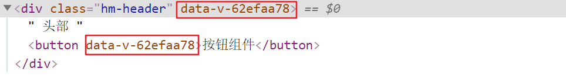
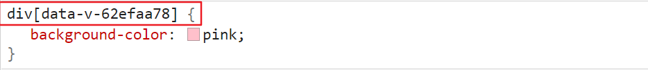

# day68

## Vue组件

### 组件的注册

> **注册组件有两种注册方式**:  分为“全局注册”和“局部注册”两种
>
> - 被全局注册的组件，可以在任意的组件模板范围中使用 通过`Vue.component()`
> - 被局部注册的组件，只能在当前注册的组件模板范围内使用 通过`components`

#### 局部注册

- 把独立的组件封装一个`.vue文件中`，推荐放到`components`文件夹

- 通过组件的`components`配置 局部注册组件

  ```jsx
  import 【别名】 from 'url'
  export default {
    // data methods filters computed watch……同级
    components: {
      // 组件名: 组件
        组件名:【别名】
      // 使用的时候：直接通过组件名去使用
    }
  }
  ```

- **注意点：注册的组件的名字不能和HTML内置的标签重名**

- 使用：局部注册的组件只能在当前组件中使用

  ```jsx
  <template>
      <!-- 组件注册好了，就跟使用html标签一样了 -->
      <组件名/>
  </template>
  ```

#### 全局注册组件

- 在`components`文件夹中创建一些新的组件

- 在`main.js`中通过`Vue.component()`全局注册组件

  ```jsx
  import 【别名】 from 'url'
  // 全局注册
  // Vue.component(名字, 组件)
  Vue.component('组件名', 【别名】)
  ```

- 使用：全局注册的组件 可以在任意的组件中去使用

  ```jsx
  <template>
      <!-- 组件注册好了，就跟使用html标签一样了 -->
      <组件名 />
  </template>
  ```

### 组件名的大小写

在进行组件的注册时，定义组件名的方式有两种：

- 注册使用短横线命名法，例如 cmpnt-header 和 cmpnt-main

  ```js
  Vue.component('cmpnt-button', CmpntButton)
  ```

  使用时 `<cmpnt-button> </cmpnt-button>`

- 注册使用大驼峰命名法，例如 CmpntHeader 和 CmpntMain

  ```jsx
  Vue.component('CmpntButton', CmpntButton)
  ```

  使用时 `<CmpntButton> </CmpntButton>` 和 `<Cmpnt-button> </Cmpnt-button>`  都可以

推荐**定义**组件名时, 用大驼峰命名法, 更加方便

全局注册

```jsx
Vue.component('CmpntButton', CmpntButton)
```

局部注册:

```jsx
components: {
  CmpntHeader,
  CmpntMain,
  CmpntFooter
}
```

**使用**时, 推荐遵循html5规范, 小写横杠隔开

```jsx
<cmpnt-header></cmpnt-header>
<cmpnt-main></cmpnt-main>
<cmpnt-footer></cmpnt-footer>
```

### 通过 name 注册组件

在注册组件期间，除了可以直接提供组件的注册名称之外，还可以把组件的 **name** 属性作为注册后组件的名称

```jsx
<template>
  <button>按钮组件</button>
</template>

<script>
export default {
  name: 'CmpntButton'
}
</script>

<style>

</style>
```

进行注册:

```jsx
import CmpntButton from './components/hm-button.vue'
Vue.component(CmpntButton.name, CmpntButton)  // 等价于 app.component('CmpntButton', CmpntButton)
```

### 组件的样式冲突  `scoped`

- 默认情况下，写在组件中的样式会`全局生效`，因此很容易造成多个组件之间的样式冲突。

- `全局样式`: 默认组件中的样式会作用到全局

- `局部样式`: 可以给组件加上 scoped 属性, 可以让样式只作用于当前组件

  ```jsx
  <style scoped>
  div {
    background-color: pink;
  }
  </style>
  ```

- 原理

  - 添加scoped后, 会给当前组件中所有元素, 添加上一个自定义属性

    

  - 添加scoped后,  每个style样式, 也会加上对应的属性选择器

    

### 组件通信

#### 组件通信 - 父传子 props 传值

- **父组件**通过给子组件加属性传值

  ```jsx
  <cmpnt-boy price="100" title="不错" :info="msg" />
  ```

- **子组件**中, 通过props属性接收

  ```jsx
  export default {
    props: ['price', 'title', 'info']//和data(){}同级
  }
  ```

#### 单向数据流

- 父组件的数据发生了改变，子组件会自动跟着变

- 子组件**不允许直接修改**父组件传递过来的`props`，`  props`是只读的

#### 组件通信 - 子传父

- 子组件可以通过 `this.$emit('事件名', 参数1, 参数2, ...)` 触发事件的同时传参的

  ```jsx
  this.$emit('sayPrice', 2)
  ```

- 父组件给子组件注册一个自定义事件

  ```jsx
  <my-product 
    ...
    @sayPrice="sayPrice">
  </my-product>
  ```

- 父组件并提供对应的函数接收参数

  ```js
  export default {
      methods: {
          sayPrice (num) {
              console.log(num)
          }
      },
  }
  ```

### props 校验

> **props 是父传子, 传递给子组件的数据, 为了提高 子组件被使用时 的稳定性, 可以进行props校验**, 验证传递的数据是否符合要求

- 默认的数组形式, 不会进行校验, 如果希望校验, 需要提供对象形式的 props

  ```jsx
  export default {
      props: {
          ...
      }
  }
  ```

- props 提供了多种数据验证方案，例如：

  - 基础的类型检查  Number
  - 多个可能的类型 [String, Number]
  - 必填项校验   required: true
  - 默认值 default: 100
  - 自定义验证函数

  **官网语法: [地址](https://cn.vuejs.org/v2/guide/components-props.html#Prop-%E9%AA%8C%E8%AF%81)**

  ```jsx
  export default{
    props: {
      // 基础的类型检查
      propA: Number,
      // 多个可能的类型
      propB: [String, Number],
      // 必填的字符串
      propC: {
        type: String,
        required: true
      },
      // 带有默认值的数字
      propD: {
        type: Number,
        default: 100
      },
      // -------------------------------------------------------------------------
      // 自定义验证函数
      propF: {
        validator: function (value) {
          // 这个值必须匹配下列字符串中的一个
          return ['success', 'warning', 'danger'].indexOf(value) !== -1
        }
      }
    }
  }
  ```

  

