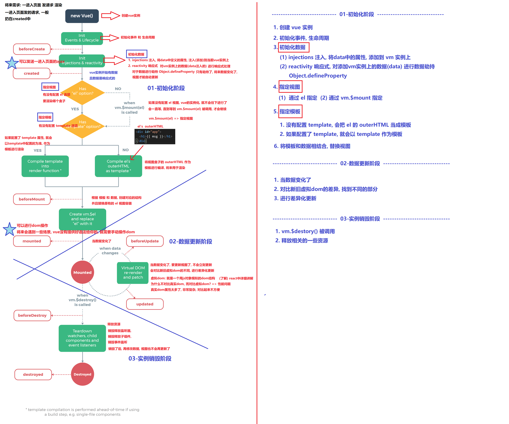

# day69

## 通用组件通讯方案-event-bus

```js
// 1. 创建事件总线   main.js
const bus = new Vue()
// 把bus挂载到了Vue的原型上, 保证所有的组件都能通过 this.bus访问到事件总线
Vue.prototype.bus = bus

// 2. 订阅事件 
bus.$on('事件名', 事件回调函数)
bus.$on('send', msg => {
  
})
// 1. 在created中订阅
// 2. 回调函数需要写成箭头函数

// 3. 发布事件
bus.$emit('事件名', 额外参数)
bus.$emit('send', 'hello')
```

## Vue实例的生命周期



