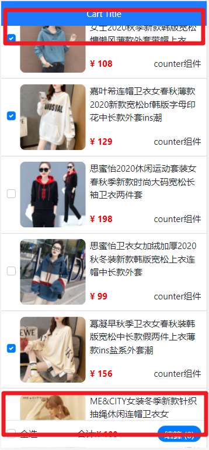
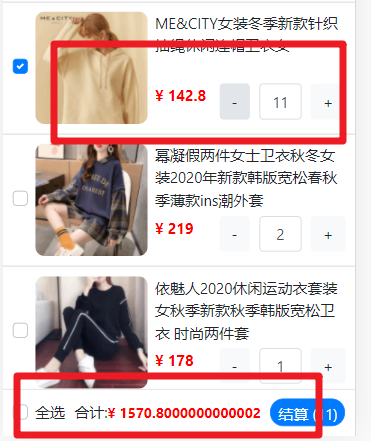

# sday70

## 购物车案例


### 初始化

```bash
vue create demo
```

- 理清目录

- 引入bootstrap样式

  ```js
  //main.js
  import './assets/css/bootstrap.css'
  ```

- 安装依赖

### cart-header组件封装


- 新建`components/CartHeader.vue`

  ```jsx
  <template>
    <div class="cart-header">我是标题</div>
  </template>
  
  <script>
  export default {
  
  }
  </script>
  
  <style lang="less" scoped>
    .cart-header {
      height: 45px;
      line-height: 45px;
      text-align: center;
      background-color: #1d7bff;
      color: #fff;
      position: fixed;
      top: 0;
      left: 0;
      width: 100%;
    }
  </style>
  ```

- **封装要求**

  - 允许用户自定义  **title 标题**
  - 允许用户自定义  bgclr **背景色**
  - 允许用户自定义  clr  **字体颜色**

  ```jsx
  //App.vue
  /* 通过属性传值传给子组件 */
  <cart-header :title="title" :bgclr="bgClr" :clr="clr"></cart-header>
  
  data() {
      return {
          title: "My Cart",
          bgClr: "#ffa0c4",
          clr: "royalblue",
      };
  },
  //PS:只有title:undefined时才会触发子组件props中的默认(default)选项
  //CartHeader.vue
  <div
      class="cart-header"
      :style="{
        backgroundColor: bgClr,
        color: clr,
      }"
  >
      {{ title }}
  </div>
  /* 子组件通过props接收，type为接收类型，default为默认值 */
  props: {
      title: {
          type: String,
          default: "Cart Title",
      },
      bgClr: {
          type: String,
          default: "#1d7bff",
      },
      clr: {
          type: String,
          default: "#fff",
      },
  },
  ```

### cart-footer组件封装

- 新建`components/CartFooter.vue`

  ```jsx
  <template>
    <!-- 底部 -->
    <div class="cart-footer">
      <!-- 全选 -->
      <div class="custom-control custom-checkbox">
        <input type="checkbox" class="custom-control-input" id="footerCheck">
        <label class="custom-control-label" for="footerCheck">全选</label>
      </div>
      <!-- 合计 -->
      <div>
        <span>合计:</span>
        <span class="price">¥ 100</span>
      </div>
      <!-- 按钮 -->
      <button type="button" class="footer-btn btn btn-primary">结算 (0)</button>
    </div>
  </template>
  
  <script>
  export default {
  
  }
  </script>
  
  <style lang="less" scoped>
  .cart-footer {
    position: fixed;
    bottom: 0;
    width: 100%;
    height: 50px;
    border-top: 1px solid #ccc;
    display: flex;
    justify-content: space-between;
    align-items: center;
    padding: 0 10px;
    background: #fff;
  
    .price {
      color: red;
      font-weight: bold;
      font-size: 15px;
    }
    .footer-btn {
      min-width: 80px;
      height: 30px;
      line-height: 30px;
      border-radius: 25px;
      padding: 0;
    }
  }
  </style>
  ```

### GoodsItem组件封装

- 新建`components/GoodsItem.vue`

  ```jsx
  <template>
    <div class="my-goods-item">
      <div class="left">
        <div class="custom-control custom-checkbox">
          <input type="checkbox" class="custom-control-input" id="input">
          <label class="custom-control-label" for="input">
            
          </label>
        </div>
      </div>
      <div class="right">
        <div class="top">商品名称</div>
        <div class="bottom">
          <span class="price">¥ 商品价格</span>
          <span>counter组件</span>
        </div>
      </div>
    </div>
  </template>
  
  <script>
  export default {
  }
  </script>
  
  <style lang="less" scoped>
  .my-goods-item {
    display: flex;
    padding: 10px;
    border-bottom: 1px solid #ccc;
    .left {
      img {
        width: 120px;
        height: 120px;
        margin-right: 8px;
        border-radius: 10px;
      }
      .custom-control-label::before,
      .custom-control-label::after {
        top: 50px;
      }
    }
    .right {
      flex: 1;
      display: flex;
      flex-direction: column;
      justify-content: space-between;
      .bottom {
        display: flex;
        justify-content: space-between;
        padding: 5px 0;
        .price {
          color: red;
          font-weight: bold;
        }
      }
    }
  }
  
  </style>
  ```

### 发送axios请求获取数据

- 安装 axios

  ```bash
  yarn add axios
  ```

- 在 `App.vue` created 中, 发送请求获取列表数据, 存到 goodsList 中

  ```jsx
  data () {
    return {
      goodslist: []
    }
  },
  // 发送请求
  async created () {
    const res = await axios({
      method: 'get',
      url: 'https://www.escook.cn/api/cart'
    })
    // console.log(res)
    const { status, list } = res.data
    if (status === 200) {
      this.goodslist = list
    }
  }
  ```

### 动态渲染商品列表

- 通过遍历组件实现商品列表渲染

  ```jsx
  <goods-item
      v-for="item in goodslist"
      :key="item.id"
      :goodsItem="item"
  ></goods-item>
  ```

- 样式Bug

  

  - 可在app.vue中进行样式修改

    ```jsx
    //scoped--限制样式的作用域只在App.vue
    <style scoped>
    #app {
      padding-top: 45px;
      padding-bottom: 50px;
    }
    </style>
    ```

- GoodsItem接受数据

  ```jsx
  <script>
  export default {
    props: {
      goods: Object
    }
  }
  </script>
  ```

- GoodsItem渲染数据

  ```jsx
  <template>
    <div class="my-goods-item">
      <div class="left">
        <div class="custom-control custom-checkbox">
          <input
            type="checkbox"
            class="custom-control-input"
            id="input"
            :checked="goodsItem.goods_state"
          />
          <label class="custom-control-label" for="input">
            
          </label>
        </div>
      </div>
      <div class="right">
        <div class="top">{{ goodsItem.goods_name }}</div>
        <div class="bottom">
          <span class="price">¥ {{ goodsItem.goods_price }}</span>
          <span>counter组件</span>
        </div>
      </div>
    </div>
  </template>
  ```

### 商品选中功能

- 图片前`checkbox`变化时触发事件

  ```jsx
  <input
    type="checkbox"
    class="custom-control-input"
    :id="goodsItem.id"
    :checked="goodsItem.goods_state"
    @change="changChoseType(goodsItem.id)"
  />
  ```
  - PS：注意`label`标签中`for`是根据`id`绑定的，需要和`goodsItem.id`绑定

    ```js
    <label class="custom-control-label" :for="goodsItem.id"></label>
    ```

-  `GoodsItem.vue`触发事件调用父组件对应方法

  ```jsx
  // 传入id来查询更改对象
  changChoseType(id) {
    this.$emit("changChoseType", id);
  },
  ```

- `app.vue` 接收参数, 进行处理

  ```jsx
  <goods-item
    v-for="item in goodslist"
    :key="item.id"
    :goodsItem="item"
    @changChoseType="changChoseType"
  ></goods-item>
  ```

  ```jsx
  methods: {
      changChoseType(id) {
        let goodState = this.goodslist.find((item) => item.id == id);
        goodState.goods_state = !goodState.goods_state;
      },
    },
  ```

### 商品全选功能

- **单项全部选中控制全选按钮**

  ```jsx
  //App.vue
  <cart-footer @checkAll="checkAll" :goodslist="goodslist"></cart-footer>
  //将各个单项数组传递给子组件
  ```

  - 子组件使用`computed`计算属性判断是否选中

  ```jsx
  //CartFooter.vue
  computed: {
    isAllCheck: {
      get() {
        return this.goodslist.every((item) => item.goods_state);
      },
      set(isAllCheck) {
        this.$emit("checkAll", isAllCheck);
      },
    },
  },
  ```

- **全选按钮控制各个单项**

  ```jsx
  //CartFooter.vue
  computed: {
    isAllCheck: {
      get() {
        return this.goodslist.every((item) => item.goods_state);
      },
      set(isAllCheck) {
        this.$emit("checkAll", isAllCheck);
      },
    },
  },
  ```

  - 通过`computed`中`set`来触发全选事件，将自身状态作为参数调用父组件方法

  ```jsx
  //App.vue
  methods: {
    checkAll(isAllCheck) {
      this.goodslist.forEach((item) => (item.goods_state = isAllCheck));
    },
  },
  ```

  - 将数据中`checkbox`的状态与全选按钮的状态同步

### 总价钱与总数量的显示

- 总数量

  ```jsx
  //CartFooter.vue
  <button type="button" class="footer-btn btn btn-primary">
    结算 ({{ goodsConut }})
  </button>
  
  computed: {
    goodsConut() {
      return this.goodslist
         // 过滤出所有被选中的项目  
        .filter((item) => item.goods_state)
         // 累加每个单个项目中的数量
        .reduce((sum, item) => (sum += item.goods_count), 0);
    }
  },
  ```

- 总价格

  ```jsx
  //CartFooter.vue
  <span class="price">¥ {{ account }}</span>
  
  computed: {
    account() {
      return this.goodslist
         // 过滤出所有被选中的项目
        .filter((item) => item.goods_state)
         // 累加每个单个项目中的数量*单价
        .reduce((sum, item) => (sum += item.goods_count * item.goods_price), 0);
  },
  ```

### CartCount组件封装

#### 基本结构

```jsx
<template>
  <div class="my-counter">
    <button type="button" class="btn btn-light">-</button>
    <input type="number" class="form-control inp" value="1">
    <button type="button" class="btn btn-light">+</button>
  </div>
</template>

<script>
export default {

}
</script>

<style lang="less" scoped>
.my-counter {
  display: flex;
  .inp {
    width: 45px;
    text-align: center;
    margin: 0 10px;
  }
}
</style>
```

- GoodsItem组件注册且使用

  ```jsx
  import MyCount from './MyCount'
  export default {
    components: {
      MyCount
    },
  }
  ```

- 渲染

  ```jsx
  <cart-count></cart-count>
  ```

#### 输入框值的处理

- 传入数量

  ```jsx
  <cart-count :goodsCount="goodsItem.goods_count"></cart-count>
  ```

  ```jsx
  // CartCount.vue
  <input type="number" class="form-control inp" :value="goodsCount" />
  
  
  <script>
  export default {
    props: {
      count: {
        type: Number,
        default: 1
      }
    }
  }
  </script>
  ```

#### 增减商品数量

- 增减（button）

  ```jsx
  // CartCount.vue
  <button type="button" class="btn btn-light" @click="addGoodsCount">+</button>
  <button type="button" class="btn btn-light" @click="subGoodsCount">-</button>
  
  methods: {
    // 通过点击触发上层组件以达到修改数据的目的  
    addGoodsCount() {
      this.$emit("addGoodsCount", this.goodsCount + 1);
    },
    subGoodsCount() {
      // 做一个负数判断，以确保输入框显示最小为1
      if (this.goodsCount <= 1) {
        return (this.goodsCount = 1);
      }
      this.$emit("addGoodsCount", this.goodsCount - 1);
    },
  },
  ```

  ```jsx
  // CartFooter.vue
  <cart-count
    :goodsCount="goodsItem.goods_count"
    @addGoodsCount="addGoodsCount"
    @subGoodsCount="subGoodsCount"
  ></cart-count>
  
  methods: {
    // 由于此项数据这个组件也不是直接来源，于是携带用于查找的id参数发送给更上层的组件
    addGoodsCount(goodsCnt) {
      this.$emit("addGoodsCount", goodsCnt, this.goodsItem.id);
    },
    subGoodsCount(goodsCnt) {
      this.$emit("subGoodsCount", goodsCnt, this.goodsItem.id);
    },
  },
  ```

  ```jsx
  // App.vue
  <goods-item
    v-for="item in goodslist"
    :key="item.id"
    :goodsItem="item"
    @changeChoseType="changeChoseType"
    @addGoodsCount="addGoodsCount"
    @subGoodsCount="subGoodsCount"
  ></goods-item>
  
  methods: {
    // 作为数据的直接来源，通过获得的修改数据和查找id找到对应对象修改数据即可
    addGoodsCount(cnt, id) {
      this.goodslist.find((item) => item.id == id).goods_count = cnt;
    },
    subGoodsCount(cnt, id) {
      this.goodslist.find((item) => item.id == id).goods_count = cnt;
    },
  },
  ```

- 修改（和上述加减类似）

  ```jsx
  // CartCount.vue
  <input
    type="number"
    class="form-control inp"
    :value="goodsCount"
    @change="changeInput"
  />
  
  methods: {
    changeInput(e) {
      // 非空,非负,首位非0,非小数
      if (
        e.target.value == "" ||
        e.target.value < 0 ||
        e.target.value.split("").splice(0, 1) == "0" ||
        e.target.value.split("").includes(".") == true
      ) {
        e.target.value = 1;
      }
      this.$emit("changeInput", +e.target.value);
    },
  },
  ```

  ```jsx
  // CartFooter.vue
  <cart-count
    :goodsCount="goodsItem.goods_count"
    @addGoodsCount="addGoodsCount"
    @subGoodsCount="subGoodsCount"
    @changeInput="changeInput"
  ></cart-count>
  
  methods: {
    changeInput(goodsCnt) {
      // 由于此项数据这个组件也不是直接来源，于是携带用于查找的id参数发送给更上层的组件
      this.$emit("changeInput", goodsCnt, this.goodsItem.id);
    },
  },
  ```

  ```jsx
  // App.vue
  <goods-item
    v-for="item in goodslist"
    :key="item.id"
    :goodsItem="item"
    @changeChoseType="changeChoseType"
    @addGoodsCount="addGoodsCount"
    @subGoodsCount="subGoodsCount"
    @changeInput="changeInput"
  ></goods-item>
  
  methods: {
    changeInput(cnt, id) {
      // 作为数据的直接来源，通过获得的修改数据和查找id找到对应对象修改数据即可
      this.goodslist.find((item) => item.id == id).goods_count = cnt;
    },
  },
  ```

### 数值优化

- 全局过滤器

  > 解决数据精度导致的Bug



```jsx
// main.js
Vue.filter("keepTwoDecimals", val => '¥' + val.toFixed(2))

// GoodItem.vue
<span class="price">
  {{ goodsItem.goods_price | keepTwoDecimals }}
</span>

// CartFooter.vue
<div>
  <span>合计:</span>
  <span class="price"> {{ account | keepTwoDecimals }}</span>
</div>
```

