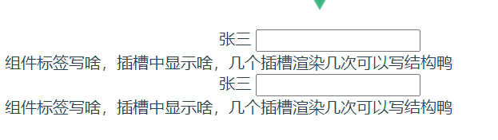
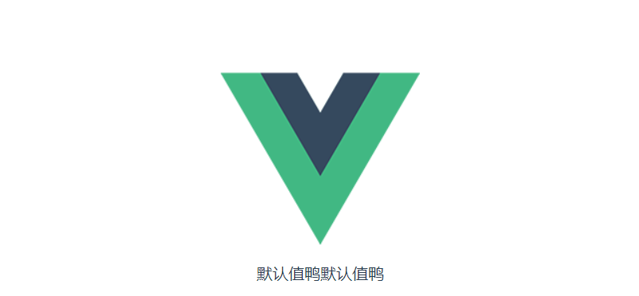

# sday71

## ref 和 $refs

>  利用 ref 和 $refs 可以用于获取 dom 元素, 或者组件实例
>
> 每个 vue 的组件实例上，都包含一个$refs 对象，里面存储着对应的DOM 元素或组件的引用。

1 给需要获取的 dom 元素或者组件, 添加 ref 属性

```jsx
<div>
  <div ref="box">我是div盒子</div>
  <jack ref="jack"></jack>
  <button @click="fn">按钮</button>
</div>
```

2 通过 `this.$refs.xxx` 获取, 拿到组件可以调用组件的方法

```jsx
import Jack from './jack.vue'
export default {
  methods: {
    fn () {
      console.log(this.$refs.box)
      console.log(this.$refs.jack)
      this.$refs.jack.sayHi()
    }
  },
  components: {
    Jack
  }
}
```

## $nextTick

**需求1: 点击按钮, 切换显示输入框**

```vue
<template>
  <div>
    <!-- 需求: 点击按钮, 切换显示输入框 -->
    <input type="text" v-if="isShowInput">
    <button @click="fn" v-else>点此搜索</button>
  </div>
</template>

<script>
export default {
  data () {
    return {
      isShowInput: false
    }
  },
  methods: {
    fn () {
      this.isShowInput = true
    }
  }
}
</script>
```

**需求2: 显示输入框的同时, 要获取焦点**

> 当文本框展示出来之后，如果希望它立即获得焦点，则可以为其添加 ref 引用，并调用原生 DOM 对象的.focus() 方法即可。
>
> 直接调用会报错, 因为 vue 是 异步dom更新的 (提升渲染效率),  `this.isShowInput = true` 执行完时, 实际的 dom 还没渲染出来

```jsx
<input ref="inp" type="text" v-if="isShowInput">

fn () {
  this.isShowInput = true
  this.$refs.inp.focus()
}
```

> 组件的 `$nextTick(callback)` 方法，会把 callback 回调推迟到下一个 DOM 更新周期之后执行。
>
> 通俗的理解是：**等组件的DOM 刷新之后，再执行 callback 回调函数**。从而能保证 callback 函数可以操作到最新的 DOM 元素。

```vue
<template>
  <div>
    <!-- 需求: 点击按钮, 切换显示输入框 -->
    <input ref="inp" type="text" v-if="isShowInput">
    <button @click="fn" v-else>点此搜索</button>
  </div>
</template>

<script>
export default {
  data () {
    return {
      isShowInput: false
    }
  },
  methods: {
    fn () {
      this.isShowInput = true
      this.$nextTick(() => {
        this.$refs.inp.focus()
      })
    }
  }
}
</script>
```

## dynamic 动态组件

### 动态组件的基本使用

> 什么是动态组件:   让多个组件使用同一个挂载点，并动态切换，这就是动态组件 

```vue
<template>
  <div>
    <h3>动态组件的演示</h3>
    <!-- 动态组件 => 多个组件使用同一个挂载点, 并可以动态的切换展示 -->
    <button @click="comName = 'my-swiper'">swiper</button>
    <button @click="comName = 'my-nav'">nav</button>
    
    <!-- 
      <my-nav></my-nav>
      <my-swiper></my-swiper> 
    -->
    <component :is="comName"></component>
  </div>
</template>

<script>
import MyNav from './my-nav.vue'
import MySwiper from './my-swiper.vue'
export default {
  data () {
    return {
      comName: 'my-nav'
    }
  },
  components: {
    MyNav,
    MySwiper
  }
}
</script>
```

### 使用 keep-alive 保持状态

> 默认情况下，切换动态组件时无法保持组件的状态。会将组件销毁, 将来显示时, 又会重新创建此时可以使用vue 内置的 `<keep-alive>` 组件保持动态组件的状态。使用 keep-alive 包裹动态组件时，会缓存不活动的组件实例，而不是销毁它们

```jsx
<keep-alive>
  <component :is="comName"></component>
</keep-alive>
```

## 插槽

> 插槽（Slot）是 vue 为组件的封装者提供的能力。
>
> 允许开发者在封装组件时，把不确定的、希望由用户指定的部分定义为插槽。
>
> **插槽作用: 用于实现组件的内容分发, 通过 slot 标签, 可以接收到写在组件标签内的内容**

```jsx
// App.vue
<son-cmpnt>
张三
<input type="text">
<tr>
	<td>组件标签写啥，插槽中显示啥，几个插槽渲染几次<td>
    <td>可以写结构鸭</td>
</tr>
</son-cmpnt>
```

```jsx
// SonCmpnt.vue
<template>
  <div>
    <slot></slot>
    <slot></slot>
  </div>
</template>
```



### 后备内容 (默认值)

> 封装组件时，可以为预留的 `<slot>` 插槽提供后备内容（默认内容）。
>
> 如果组件的使用者没有为插槽提供任何内容，则后备内容会生效。

```jsx
// App.vue
<template>
  <div id="app">
    
    <son-cmpnt>
      <!-- 张三
      <input type="text" />
      <tr>
        <td>组件标签写啥，插槽中显示啥，几个插槽渲染几次</td>
        <td></td>
        <td>可以写结构鸭</td>
      </tr> -->
    </son-cmpnt>
  </div>
</template>
```

```jsx
// SonCmpnt.vue
<template>
  <div>
    <slot>默认值鸭</slot>
    <slot>默认值鸭</slot>
  </div>
</template>
```



### 具名插槽

#### 插槽的分类:

- **默认插槽(匿名插槽)**
  - `<slot></slot>` 只要没有具体分发的内容, 都会给到默认插槽
  - `<slot name="default"></slot>` 是默认插槽完整的写法 和 `<slot></slot>` 完全等价

- **具名插槽: 具有名字的插槽 (配置了名字),  可以实现定向分发**
  - 一旦配置了名字, 只会接收对应的内容, 不是分发给他的, 就不要

#### 具名插槽的使用步骤

- 给插槽起名字 

  ```jsx
  <div class="header">
    <slot name="header"></slot>
  </div>
  <div class="content">
    <slot>这是后备内容</slot>
  </div>
  <div class="footer">
    <slot name="footer"></slot>
  </div>
  ```

- 需要使用 **template** 标签, 将内容包裹成一个整体

- 通过 v-slot:插槽名, 指定具体分发给谁

  ```jsx
  <my-dialog>
    <template v-slot:header>
      <h3>这是大标题</h3>
    </template>
  
    <template v-slot:default>
      <p>这是内容</p>
    </template>
  
    <template v-slot:footer>
      <button>确认</button>
      <button>取消</button>
    </template>
  </my-dialog>
  ```

#### 具名插槽的简写

> 跟 v-on 和 v-bind 一样，v-slot 也有缩写，即把参数之前的所有内容 (v-slot:) 替换为字符 #。
>
> 例如 v-slot:header 可以被简写为 #header

```jsx
<my-dialog>
  <template #header>
    <h3>这是大标题</h3>
  </template>

  <template #default>
    <p>这是内容</p>
  </template>

  <template #footer>
    <button>确认</button>
    <button>取消</button>
  </template>
</my-dialog>
```

### 作用域插槽

> 作用域插槽: **定义 slot 插槽的同时, 是可以传值的**, 将来在分发内容时, 可以使用

- 给 slot 标签, 以 添加属性的方式传值

  ```jsx
  <slot name="bottom" :yes="yes" :no="no" money="100"></slot>
  ```

- 所有添加的属性, 都会被收集到一个对象中

  ```jsx
  { yes: '确认', no: '取消', money: '100' }
  ```

- 在template中, 通过  `v-slot:插槽名= "obj"` 接收

  ```jsx
  <template #bottom="obj">
    <!-- {{ obj }} -->
    <button>{{ obj.yes }}</button>
    <button>{{ obj.no }}</button>
    <button>{{ obj.money }}</button>
  </template>
  ```

- 可以使用解构赋值简化数据的接收

  ```jsx
  <template #bottom="{ yes, no, money }">
    <button>{{ yes }}</button>
    <button>{{ no }}</button>
    <button>{{ money }}</button>
  </template>
  ```

## 自定义指令

### 自定义指令说明

https://www.vue3js.cn/docs/zh/guide/custom-directive.html

除了核心功能默认内置的指令 (`v-model` 和 `v-show`)，Vue 也允许注册自定义指令。 `v-xxx`  

注意，代码复用和抽象的主要形式是组件。

然而，有的情况下，你仍然需要对普通 DOM 元素进行底层操作，这时候就会用到自定义指令。

### 自定义指令 - 局部注册

例如需求:  当页面加载时，让元素将获得焦点 , (autofocus 在 safari 浏览器有兼容性)

```less
<template>
  <div>
    <h3>自定义指令</h3>
    <input ref="inp" type="text" v-focus>
  </div>
</template>

<script>
export default {
  mounted () {
    // this.$refs.inp.focus()
  },
  directives: {
    // 自定义一个局部指令
    focus: {
      inserted (el) {
        el.focus()
      }
    }
  }
}
</script>
```

### 自定义指令 - 全局注册

```jsx

// 注册全局自定义指令
Vue.directive('focus', {
  inserted (el) {
    el.focus()
  }
})
```

### 自定义指令 - 指令的值

在绑定指令时，可以通过“等号”的形式为指令绑定具体的参数值

需求: v-color="color" 给对应的颜色, 就能改对应的字体颜色

```jsx
<div v-color="color">我是内容</div>
```

实现:

```jsx
directives: {
  // 自定义一个局部指令
  color: {
    inserted (el, binding) {
      el.style.color = binding.value
    },
    // updated指令的值改变时触发, binding.value指令的值修改触发
    updated (el, binding) {
      el.style.color = binding.value
    }
  }
}
```