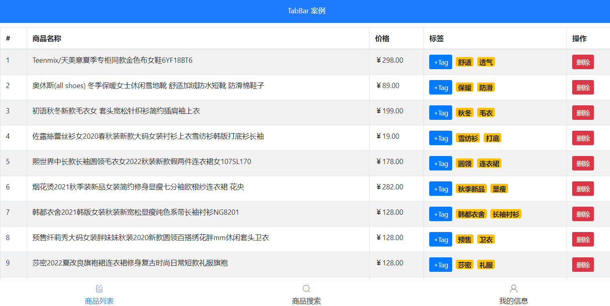

# sday72

## 案例tabbar



### 封装 tab-header 组件

- 创建 components/TabHeader.vue 组件

  ```jsx
  <template>
    <div class="my-header">我是标题</div>
  </template>
  
  <script>
  export default {};
  </script>
  
  <style lang="less" scoped>
  .my-header {
    height: 50px;
    line-height: 50px;
    text-align: center;
    font-size: 16px;
    background-color: royalblue;
    color: #fff;
    position: fixed;
    left: 0;
    top: 0;
    width: 100%;
  }
  </style>
  ```

- 在App.vue中局部注册组件

  ```jsx
  <script>
  import TabHeader from "./components/TabHeader.vue";
  export default {
    name: "App",
    components: { TabHeader },
  };
  </script>
  ```

- 在App.vue中使用组件

  ```jsx
  <template>
    <div id="app">
      <tab-header></tab-header>
    </div>
  </template>
  ```

#### tab-header组件-动态处理插槽和数据

- 封装的时候提供插槽和接受props

  ```jsx
  <template>
    <div class="tab-header" :style="{ backgroundColor: bgClr, color: clr }">
      <slot>我是标题</slot>
    </div>
  </template>
  
  <script>
  export default {
    name: "TabHeader",
    props: {
      bgClr: {
        type: String,
        default: "royalblue",
      },
      clr: {
        type: String,
        default: "#fff",
      },
    },
  };
  </script>
  ```

- 使用的时候传入插槽和props

  ```jsx
  <template>
    <div id="app">
      <tab-header :bgClr="bgClr" :clr="clr">Tab案例</tab-header>
    </div>
  </template>
  
  <script>
  import TabHeader from "./components/TabHeader.vue";
  export default {
    name: "App",
    components: { TabHeader },
    data() {
      return {
        bgClr: "#ffa0c4",
        clr: "#fff",
      };
    },
  };
  </script>
  ```

### 封装 tab-footer组件

- 创建 components/TabFooter.vue 组件

  ```jsx
  <template>
    <div class="tab-footer">
      <div class="tab-item current">
        <span class="iconfont icon-shangpinliebiao"></span>
        <span>商品列表</span>
      </div>
      <div class="tab-item">
        <span class="iconfont icon-sousuo"></span>
        <span>商品搜索</span>
      </div>
      <div class="tab-item">
        <span class="iconfont icon-user"></span>
        <span>用户中心</span>
      </div>
    </div>
  </template>
  
  <script>
  export default {};
  </script>
  
  <style lang="less" scoped>
  .tab-footer {
    position: fixed;
    left: 0;
    bottom: 0;
    width: 100%;
    height: 50px;
    border-top: 1px solid #ccc;
    background-color: #fff;
    display: flex;
    justify-content: space-around;
    align-items: center;
    .tab-item {
      display: flex;
      flex-direction: column;
      align-items: center;
      .iconfont {
        font-size: 18px;
      }
    }
    .current {
      color: #1d7bff;
    }
  }
  </style>
  ```

- 在App.vue中局部注册、使用组件

  ```jsx
  <template>
    <div id="app">
      <tab-header :bgClr="bgClr" :clr="clr">Tab案例</tab-header>
      <tab-footer></tab-footer>
    </div>
  </template>
  
  <script>
  import TabFooter from "./components/TabFooter.vue";
  import TabHeader from "./components/TabHeader.vue";
  export default {
    name: "App",
    components: { TabHeader, TabFooter },
    data() {
      return {
        bgClr: "#ffa0c4",
        clr: "#fff",
      };
    },
  };
  </script>
  ```

- 字体图标css引入

  ```js
  // main.js
  import './assets/fonts/iconfont.css'
  ```

#### 封装要求

- 用户通过名为 ` tabs` 的 prop 属性，为 tabbar 组件指定数据源
- 数据源的限制:  tabbar 的 item 项最少 2 个，最多 5 个
- 每个 tabbar 的 item 配置项，至少要包含如下两个属性：
  - icon -> 要展示的图标
  - text -> 显示的文本

##### 在App.vue中准备tabList数据

```jsx
data () {
  return {
    // tab栏的数据
    tabList: [
      { icon: 'icon-shangpinliebiao', title: '商品列表' },
      { icon: 'icon-sousuo', title: '商品搜索' },
      { icon: 'icon-user', title: '用户中心' }
    ]
  }
}
```

##### 将数据传递给组件

```jsx
<tab-footer :tabList="tabList"></tab-footer>
```

##### 渲染

```jsx
<div class="tab-item" v-for="item in tabList" :key="item.title">
  <span class="iconfont" :class="item.icon"></span>
  <span>{{ item.title }}</span>
</div>
```

#### TabFooter点击高亮

- 在TabFooter.vue中通过索引`index`来确认被触发的`tag`

  

- 在TabFooter.vue中点击事件，用以触发App.vue中的绑定的方法

  

- 在App.vue中设置变量来确定高亮的tag

  

- 在App.vue中通过方法修改`hightLight`值的方式修改高亮显示的tag

  

- 在App.vue中将事件绑定到组件上，并传递参数

  

- 在TabFooter.vue中通过传递参数和自身索引比较判断是否添加类名，以实现高亮

  

  

#### 组件中v-model

> v-model本质上是 value属性和input事件的一层包装，是一种语法糖

```jsx
// App.vue中
<tab-footer
  :tabList="tabList"
  @changeTag="changeTag"
  :highLight="highLight"
></tab-footer>
/* 等价于 */
<tab-footer :tabList="tabList" v-model="highLight"></tab-footer>
```

- 触发事件`changeTag`替换成了`input`，且参数`highLight`和`input`调用时传递参数相等
- 子组件调用时只调用`$emit("input", 参数)`即可
- 即实现了**子组件发送数据**和**父组件数据**的**“双向绑定”**

### TabMain中动态切换组件

- 通过`<component :is="changePage"></component>`可以实现动态的组件切换

- 给`tabList`添加`name`属性区别每个tag需要显示的页面

  

- 通过计算属性配合`highLight`确定`changePage`，实现对应的**tab**切换

  

- `<keep-alive></keep-alive>`为动态组件开启状态保持

### 三页面其一（商品列表页）

> 需要安装`axios`，以发送`AJAX`请求

- 在**vue**中最早可以在`created()`生命周期函数中发送`Ajax`请求

  ```jsx
  // GoodsList.vue
  created() {
    this.getGoodsList();
  },
  ```

- 通过`async await`关键字可以将**异步代码**，按照**同步代码书写方式**书写

  ```jsx
  // GoodsList.vue
  data() {
    return {
      // 商品列表数据
      goodsList: [],
    };
  },
  
  methods: {
    // 初始化商品的数据
    async getGoodsList() {
      // 发送ajax请求
      const res = await axios.get("https://www.escook.cn/api/goods");
      const { status, data } = res.data;
      if (status !== 0) return console.log("获取商品列表失败");
      // 请求成功
      this.goodsList = data;
      console.log(data);
    },
  },
  ```

#### 封装 table 组件

> 鉴于三个组件可能都需要`table`表格于是封装成复用性的组件
>
> 表格基于`bootstrap`绘制

```jsx
// GoodsList.vue
<common-table :data="goodsList"></common-table>

// CommonTable.vue (表格模版)
<template>
  <table class="table table-bordered table-stripped">
    <!-- 表格标题区域 -->
    <thead>
      <tr>
        <th>#</th>
        <th>商品名称</th>
        <th>价格</th>
        <th>标签</th>
        <th>操作</th>
      </tr>
    </thead>
    <!-- 表格主体区域 -->
    <tbody>
      <tr v-for="item in data" :key="item.id">
        <td>1</td>
        <td>商品</td>
        <td>998</td>
        <td>xxx</td>
        <td>xxx</td>
      </tr>
    </tbody>
  </table>
</template>

<script>
export default {
  name: "CommonTable",
  props: {
    data: {
      type: Array,
    },
  },
};
</script>
```

- 为了提高复用性，应该将部分标签改为`<slot></slot>`插槽，提高灵活性

  ```jsx
  // GoodsLsit.vue
  /* #等价于v-slot,用于将<template></template>中的内容显示在name相对的<slot></slot>中 */
  <template #thead>
    <th>#</th>
    <th>商品名称</th>
    <th>价格</th>
    <th>标签</th>
    <th>操作</th>
  </template>
  <template #tbody>
    <td>1</td>
    <td>商品</td>
    <td>998</td>
    <td>xxx</td>
    <td>xxx</td>
  </template>
  // CommonTable.vue
  <!-- 表格标题区域 -->
  <thead>
    <tr>
      <slot name="thead"></slot>
    </tr>
  </thead>
  <!-- 表格主体区域 -->
  <tbody>
    <tr v-for="item in data" :key="item.id">
      <slot name="tbody"></slot>
    </tr>
  </tbody>
  ```

- 通过作用域插槽解决表格的渲染

  ```jsx
  // CommonTable.vue
  /* 插槽中传递的数据是可以在组件中-展示-的 */
  <slot name="tbody" :item="item" :index="index"></slot>
  
  // GoodsLsit.vue
  <template #tbody="{ item, index }">
    <td>{{ index+1 }}</td>
    <td>{{ item.goods_name }}</td>
    <td>{{ item.goods_price }}</td>
    <td>{{ item.tags }}</td>
    <td><button class="btn btn-danger btn-sm">删除</button></td>
  </template>
  ```

  

- 细节优化，tag标签渲染

  > bootstrap徽章: https://v4.bootcss.com/docs/components/badge/

  ```jsx
  // CommonTable.vue
  <template #tbody="{ item, index }">
    <td>{{ index + 1 }}</td>
    <td>{{ item.goods_name }}</td>
    <td>¥ {{ item.goods_price.toFixed(2) }}</td>
    <td>
      <span
        v-for="tag in item.tags"
        :key="tag"
        class="badge badge-warning"
        >{{ tag }}</span
      >
    </td>
    <td>
      <button class="btn btn-danger btn-sm">删除</button>
    </td>
  </template>
  
  <style lang="less" scoped>
  .my-goods-list {
    .badge {
      margin-right: 5px;
    }
  }
  </style>
  ```

#### table功能

- 删除

  > 由于没有对应删除接口，因此暂定为在**goodsList** 中删除对应项

  ```jsx
  // GoodsList.vue
  <button class="btn btn-danger btn-sm" @click="del(item.id)">
    删除
  </button>
  
  del(id) {
    this.goodsList = this.goodsList.filter((item) => item.id !== id);
  },
  ```

- 控制**+tag**和**input**的显示和影藏

  ```jsx
  <td>
    <input
      v-if="item.inputVisible"
      class="tag-input form-control"
      type="text"
    />
    <button
      v-else
      @click="item.inputVisible = true"
      class="btn btn-primary btn-sm add-tag"
    >
      +Tag
    </button>
    <span
      v-for="tag in item.tags"
      :key="tag"
      class="badge badge-warning"
      >{{ tag }}</span
    >
  </td>
  ```

-  **input** 自动获取焦点

  ```jsx
  // GoodsList.vue 局部注册自定义指令
  directives: {
    focus: {
      // 指令的定义
      inserted: function (el) {
        el.focus()
      }
    }
  }
  
  // 使用时v-自定义指令
  <input
    v-if="item.inputVisible"
    class="tag-input form-control"
    type="text"
    v-focus
  />
  ```

- 文本失去焦点时自动隐藏

  ```jsx
  <input
    v-if="item.inputVisible"
    class="tag-input form-control"
    type="text"
    v-focus
    @blur="item.inputVisible = false"
  />
  ```

- 回车新增 **tag** 标签

  ```jsx
  // GoodsList.vue
  <input
    v-if="item.inputVisible"
    class="tag-input form-control"
    type="text"
    v-focus
    @blur="item.inputVisible = false"
    @keyup.enter="addTag(item, $event)"
  />
  
  addTag(arrOfTag, e) {
    if (e.target.value.trim() == "") return alert("输入为空");
    arrOfTag.tags.push(e.target.value);
    arrOfTag.inputVisible = false;
  },
  ```

- 按下**esc**键清空文本框内容

  ```jsx
  <input
    v-if="item.inputVisible"
    class="tag-input form-control"
    type="text"
    v-focus
    @blur="item.inputVisible = false"
    @keyup.enter="addTag(item, $event)"
    @keyup.esc="$event.target.value = ''"
  />
  ```

### END

