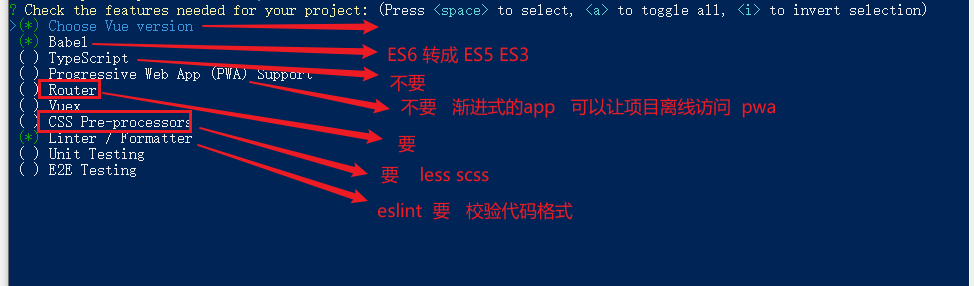
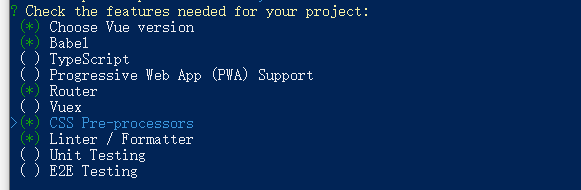

# 自媒体案例

## 介绍

> 目标: 实现一个典型的后台管理系统
>
> 用的技术: vue, vue-router, axios, token, localStorage, ElementUI, echarts, 富文本编辑器

新闻资讯类的 APP 的自媒体后台管理系统，主要功能有：

- 登录功能
- 欢迎页面
- 内容管理
- 素材管理
- 发布文章
- 评论管理
- 粉丝管理
- 个人设置

## 初始化

> 创建项目（vue-cli）
>
> 调整项目目录
>
> git 代码托管 （github, gitee）
>
> 引入第三方库 ElementUI

### 使用 vue-cli 创建项目

```bash
npm i @vue/cli -g
```

创建项目

```bash
vue create media
```

- 选项

  ```bash
  ? Please pick a preset:
    Default ([Vue 2] babel, eslint)
    Default (Vue 3 Preview) ([Vue 3] babel, eslint)
  > Manually select features
  ```

  

  

- 选择 Vue 版本

  

- 是否使用 history 模式

  

- 选择 css 预处理

- 选择 eslint（代码校验）的风格


- 选择校验时机

  

- 选择配置文件的升成方式

  

- 可保存配置，下次生成项目时可选则自定义保存的配置（本次选择为 N【no】）

  

- 等待安装，项目初始化完成

  

- 项目启动

  ```bash
  cd media
  yarn serve # or # npm run serve
  # 退出启动(退出正在运行的命令行)
  # ctrl+c -> 终止批处理操作吗(Y/N)?Y -> enter(回车键)
  # or #
  # ctrl+c -> ctrl+c
  ```

  

### gitee托管代码

#### 创建远程仓库


#### 关联本地仓库，并推送到远程

> https需要输入一次账号密码
>
> ssh需要配置

```bash
git remote add origin [自己仓库的地址]
git push -u origin master
```

> -u 表示将 push 命令, 和当成提交的仓库地址, 仓库分支进行关联
>
> 一旦进行关联了, 将来只需要 git push 即可


#### 可能出现的错误

- 密码 或者 用户名 输入错误, 就提交不上去了, 因为记住了错误的密码

- 解决方案：控制面板-》用户账户=》管理window凭据==》删除本地凭证，重新输入用户名，密码。

  

#### 使用 ssh

- 本地生成 公钥 和 私钥 (不需要再次生成)
- 公钥粘贴到 gitee 上

[生成/添加SSH公钥](https://gitee.com/help/articles/4181#article-header0)

### 调整初始化目录结构

> 删除初始化的一些默认文件
>
> 修改没删除的文件
>
> 新增我们需要的目录结构

#### 修改文件

> `src`目录下

- `router/index.js`

  ```js
  import Vue from "vue";
  import VueRouter from "vue-router";
  
  Vue.use(VueRouter);
  
  const routes = [];
  
  const router = new VueRouter({
    routes
  });
  
  export default router;
  ```

- `App.vue`

  ```vue
  <template>
    <div id="app">
      <router-view />
    </div>
  </template>
  ```

#### 删除文件

- `src/views/About.vue`

- `src/views/Home.vue`

- `src/components/HelloWorld.vue`

- `src/assets/logo.png`

#### 新增目录

- `src/api` 目录

  - 存储接口模块 (发送ajax请求接口的模块)

- `src/utils` 目录

  - 存储一些工具模块 (自己封装的方法)

- `src/styles` 目录

  - 新增base.less 文件，设置全局样式

    ```less
    * {
      margin: 0;
      padding: 0;
      list-style: none;
      box-sizing: border-box;
    }
    ```

  - 在 `main.js` 中加载全局样式 `import './styles/base.less'`


### Element UI 组件库

> UI组件库
>
> Element 是饿了么前端团队开发的基于 Vue.js 的PC端组件库，它提供的组件非常丰富，不仅功能强大，而且简单易用。Element 非常的流行，大多数基于 Vue.js 开发的后台管理系统都会使用到它。 
>
> 官网：https://element.eleme.cn/#/zh-CN

#### 项目中安装引入

- 安装 element-ui

  ```bash
  npm i element-ui
  ```

- `main.js` 中导入 element-ui  (完整导入, 只要完整导入, element-ui中所有的组件, 都可以直接用)

  ```js
  // 导入element-ui组件库
  import ElementUI from 'element-ui'
  import 'element-ui/lib/theme-chalk/index.css'
  
  Vue.use(ElementUI)
  ```

  