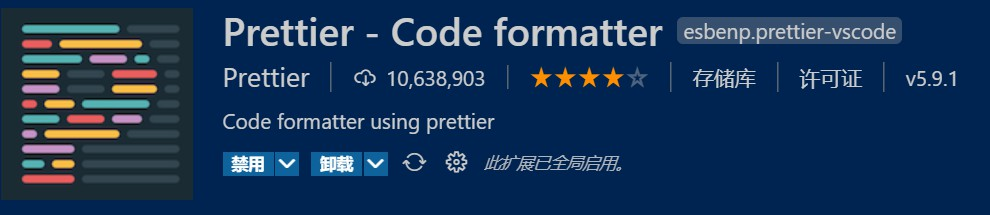
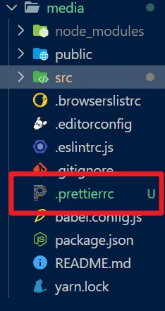
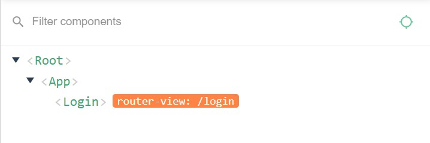

# 登录模块

\media\login.jpg)

> 目前提供一个测试账号：
>
> - 13911111111
>
> - 246810

## 注意事项

- 使用standard eslint标准会有严格的语法校验，例如**句末不加分号**，**一律使用单引号**，**缩进格式**等，需注意

- 使用**prettier**插件进行格式化

  

  ```
  插件优先读取 prettier configuration 文件 、.editorconfig 文件，
  VS Code settings.json 用于非项目文件，所以需要单独配置格式化规则文件用于项目的代码格式化
  ```

  

  ```js
  /* 配置文件不加注释 */
  {
    "printWidth": 300,
    "tabWidth": 2,
    "singleQuote": true,
    "semi": false,
    "endOfLine": "lf"
  }
  ```

## 创建组件并配置路由

> 在大项目中，通常会把组件放到文件夹中，这样可以更好的管理组件的目录结构
>
> ```js
> /* 类似以下结构 */
> views
> 	-- hero
>   	-- index.vue
> 		-- add.vue
> 		-- eidt.vue
> 	-- user
>   	-- index.vue
> 		-- add.vue
> 		-- edit.vue
> ```

### 创建views/Login/index.vue

```vue
/* 配合name属性使用，方便开发者工具预览 */
<template>
  <div class="login">LoginPage</div>
</template>

<script>
export default {
  name: 'Login'
}
</script>

<style>
</style>
```



### router/index.js

```diff
import Vue from 'vue'
import VueRouter from 'vue-router'
+import Login from '@/views/Login/index.vue'

Vue.use(VueRouter)

const routes = [
+{ path: '/login', name: 'login', component: Login }
]

const router = new VueRouter({
  routes
})

export default router
```

- vue中绝对路径**@**的使用
  - **@** 指代 src 目录

- **注意：**
  - @符号在style中使用的时候不一样，需要使用`~@`

## 页面布局

> element-ui 的 form表单: https://element.eleme.cn/#/zh-CN/component/form

- el-form 整个form表单

  - :model="form" =>  和 一个对象绑定, 用于收集表单数据, 以及将来的表单校验

- el-form-item 一个表单项, 用于包裹表单元素

- el-input 表单输入框元素

  - v-model="form.mobile"  =>  和 对象中的属性双向绑定

  ```vue
  /* views/Login/index.vue */
  <template>
    <div class="login-container">
      <div class="login-form-wrap">
        <div class="login-head">
          <div class="logo"></div>
        </div>
        <!--
          表单
          el-form: 表单组件
            必传的属性 model model需要保证是一个对象
            label-width: 指定label的宽度
        -->
        <el-form :model="form">
          <el-form-item>
            <el-input v-model="form.mobile" placeholder="请输入手机号"></el-input>
          </el-form-item>
          <el-form-item>
            <el-input v-model="form.code" placeholder="请输入验证码"></el-input>
          </el-form-item>
          <el-form-item>
            <el-checkbox v-model="form.isAgree">我已阅读并同意用户协议和隐私条款</el-checkbox>
          </el-form-item>
          <el-form-item>
            <el-button class="login-btn" type="primary" @click="onSubmit">登录</el-button>
          </el-form-item>
        </el-form>
      </div>
    </div>
  </template>
  ```

### 样式处理

```vue
/* views/Login/index.vue */
<style lang="less">
// 铺满整屏
.login-container {
  width: 100%;
  height: 100%;
  display: flex;
  justify-content: center;
  align-items: center;
  background: url("~@/assets/login_bg.jpg") no-repeat;
  background-size: cover;
  .login-form-wrap {
    width: 400px;
    padding: 30px 50px 10px;
    background-color: #fff;
    .login-head {
      display: flex;
      justify-content: center;
      .logo {
        width: 200px;
        height: 57px;
        background: url("~@/assets/logo_index.png") no-repeat;
        background-size: contain;
      }
    }
    .login-btn {
      width: 100%;
    }
  }
}
</style>
```

- 增加通用样式

  ```vue
  /* App.vue */
  <style>
  html,
  body,
  #app {
    height: 100%;
  }
  </style>
  ```

- 数据处理

  ```vue
  /* views/Login/index.vue */
  <script>
  export default {
    name: 'Login',
    data () {
      return {
        form: {
          mobile: '',
          code: '',
          isAgree: false
        }
      }
    },
    methods: {
      onSubmit () {
        console.log('submit!')
      }
    }
  }
  </script>
  ```

## 表单校验-基本使用

### 表单校验的基本使用

```jsx
1. 给el-form添加rules属性 通过rules提供规则  <el-form :rules="rules">
2. 在data中提供rules规则
3. 给每一个需要校验的el-form-item添加prop
```

- 需要通过 `rules` 属性传入约定的验证规则 

  ```vue
  <el-form class="login-form" :model="form" :rules="rules">
  ```

- 在 data 中准备 rules 规则

  ```jsx
  reles: {
    mobile: [
      { required: true, message: '请输入手机号', trigger: ['blur', 'change'] },
      { min: 5, max: 11, message: '长度在5到11个字符', trigger: ['blur', 'change'] }
    ],
    code: [
      { required: true, message: '请输入验证码', trigger: ['blur', 'change'] },
      { pattern: /^\d{6}$/, message: '请输入正确的验证码', trigger: ['blur', 'change'] }
    ]
  }  
  ```

- 将 Form-Item 的 `prop` 属性设置为需校验的字段名 

  ```vue
  <el-form-item prop="mobile">
    <el-input v-model="form.mobile"
              placeholder="请输入手机号"></el-input>
  </el-form-item>
  ```

### 正则校验

> 下面是常用内置的基本验证规则：其余校验规则参见 [async-validator](https://github.com/yiminghe/async-validator)

| 规则     | 说明                                                         |
| -------- | ------------------------------------------------------------ |
| required | 必须的，例如校验内容是否非空                                 |
| pattern  | 正则表达式，例如校验手机号码格式、校验邮箱格式               |
| range    | 使用 min 和 max 属性定义范围。对于字符串和数组类型，将根据长度进行比较，对于数字类型，数字不得小于 min，也不得大于 max。 |

```diff
reles: {
  mobile: [
    { required: true, message: '请输入手机号', trigger: ['blur', 'change'] },
    { min: 5, max: 11, message: '长度在5到11个字符', trigger: ['blur', 'change'] }
  ],
+  code: [
+    { required: true, message: '请输入验证码', trigger: ['blur', 'change'] },
+    { pattern: /^\d{6}$/, message: '请输入正确的验证码', trigger: ['blur', +'change'] }
+  ]
}  
```

```jsx
<el-form-item prop="code">
```

### 自定义校验

> 支持传入一个函数, 进行自定义校验的配置

```diff
reles: {
  mobile: [
    { required: true, message: '请输入手机号', trigger: ['blur', 'change'] },
    { min: 5, max: 11, message: '长度在5到11个字符', trigger: ['blur', 'change'] }
  ],
  code: [
    { required: true, message: '请输入验证码', trigger: ['blur', 'change'] },
    { pattern: /^\d{6}$/, message: '请输入正确的验证码', trigger: ['blur', 'change'] }
  ],
+  isAgree: [{
+    validator: (rule, value, callback) => {
+      value ? callback() : callback(new Error('请阅读隐私协议'))
+    },
+    trigger: 'change'
+  }]
}
```

```jsx
<el-form-item prop="isAgree">
```

### 登录时提交校验

> 每次点击按钮, 进行ajax登录前, 应该先对整个表单内容校验, 否则会发送很多无效的请求，一旦通过校验, 才发送请求

- 给form表单提供一个ref属性

  ```jsx
  <el-form :model="form"
            :rules="reles"
            ref="form">
  ```

- 登录的时候调用validate方法对整个表单进行校验

  ```diff
  methods: {
    onSubmit () {
  -    console.log('submit!')
  +    this.$ref.form.validate(valid => {
  +     if (!valid) return
  +      console.log('通过校验');
  +    })
    }
  }
  ```

## 基本登录功能

- 下载axios

  ```bash
  yarn add axios
  # or
  npm i axios
  ```

- 在Login.vue文件中引入axios

  ```jsx
  import axios from 'axios'
  ```

- 登陆的时候发送ajax请求

  ```diff
  onSubmit () {
    this.$refs.form.validate(async valid => {
      if (!valid) return
  -    console.log('通过校验');
  +    try {
  +      const res = await axios({
  +        url: 'http://api-toutiao-web.itheima.net/mp/v1_0/authorizations',
  +        method: 'POST',
  +        data: this.form
  +      })
  +      console.log(res)
  +      console.log('登陆成功')
  +    } catch (err) {
  +      console.log('登陆失败', err)
  +   }
    })
  }
  ```

### 登录消息提示

> element-ui中的提示,  参考：[Message 消息提示](

```diff
methods: {
  onSubmit () {
    this.$refs.form.validate(async valid => {
      if (!valid) return
      try {
        const res = await axios({
          url: 'http://api-toutiao-web.itheima.net/mp/v1_0/authorizations',
          method: 'POST',
          data: this.form
        })
        console.log(res)
-           alert('登陆成功')
-           this.$message({
-           message: '登陆成功',
-           type: 'success'
-         })
+        this.$message.success('登陆成功')
+        this.$router.push('/')
      } catch (err) {
-        alert('登陆失败', err)
+        this.$message.error('登陆失败')
      }
    })
  }
}
```

### axios的抽离封装

- 在utils中创建一个文件 request.js

  ```js
  import axios from 'axios'
  
  const instance = axios.create({
    baseURL: 'http://api-toutiao-web.itheima.net',
    timeout: 3000
  })
  export default instance
  ```

- 在main.js中导入对象，并且挂载原型上

  ```diff
  import Vue from 'vue'
  import App from './App.vue'
  import router from './router'
  import './style/base.less'
  
  // 导入element-ui组件库
  import ElementUI from 'element-ui'
  import 'element-ui/lib/theme-chalk/index.css'
  
  +import axios from '@/utils/request'
  +Vue.prototype.$axios = axios
  
  Vue.use(ElementUI)
  
  Vue.config.productionTip = false
  
  new Vue({
    router,
    render: h => h(App)
  }).$mount('#app')
  ```

- `index.vue`优化

  ```diff
  methods: {
    onSubmit() {
      this.$refs.form.validate(async valid => {
        if (!valid) return
        try {
  -       const res = await axios({
  -          url: 'http://api-toutiao-web.itheima.net/mp/v1_0/authorizations',
  -          method: 'POST',
  -          data: this.form
  -        })
  +        const res = await this.$axios.post('mp/v1_0/authorizations', this.form)
          console.log(res)
          this.$message.success('登陆成功')
          this.$router.push('/')
        } catch (err) {
          this.$message.error('登陆失败')
        }
      })
    }
  }
  ```

  