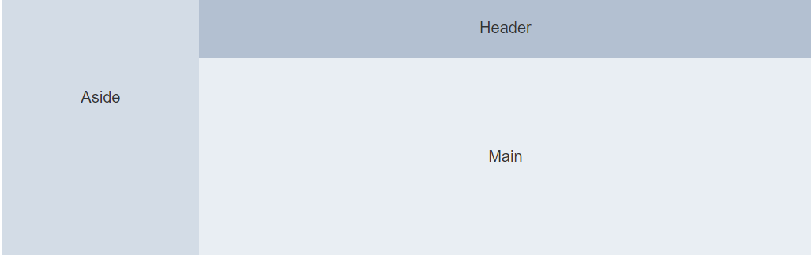
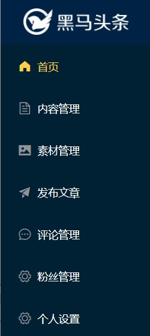
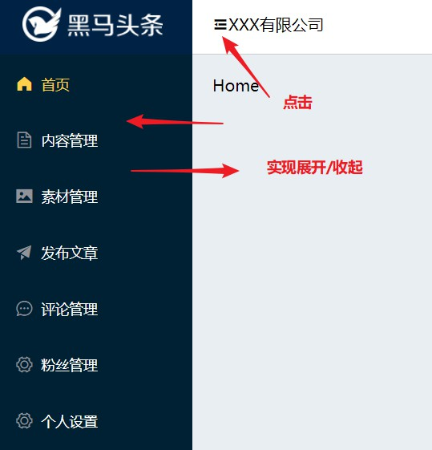

# Layout布局

## 创建 layout 组件并配置路由

### 创建src/views/Layout/index.vue

```vue
<template>
</template>

<script>
export default {
  name: 'Layout'
}
</script>

<style>
</style>
```

### 配置路由(src/router/index.js)

```diff
import Vue from 'vue'
import VueRouter from 'vue-router'
import Login from '@/views/Login/index.vue'
+import Layout from '@/views/Layout/index.vue'

Vue.use(VueRouter)

const routes = [
+  { path: '/', name: 'layout', component: Layout },
  { path: '/login', name: 'login', component: Login }
]

const router = new VueRouter({
  routes
})

export default router
```

## 布局容器 - 构建页面结构

> 使用 element-ui 布局容器, 可以很方便的进行布局容器的构建
>
> 参考文档: https://element.eleme.cn/#/zh-CN/component/container



```jsx
/* src/views/Layout/index.vue */
<template>
  <div class="layout-container">
    <el-container>
      <el-aside width="200px">Aside</el-aside>
      <el-container>
        <el-header>Header</el-header>
        <el-main>Main</el-main>
      </el-container>
    </el-container>
  </div>
</template>

<script>
export default {
	name: 'Layout'
}
</script>

<style lang="less">
.layout-container {
  width: 100%;
  height: 100%;
  .el-container {
    width: 100%;
    height: 100%;
  }
  .el-aside {
    background-color: #d3dce6;
  }
  .el-header {
    background-color: #b3c0d1;
  }
  .el-main {
    background-color: #e9eef3;
  }
}
</style>
```

### 侧边栏导航菜单

#### logo

- 结构

  ```diff
  <template>
    <div class="layout-container">
      <el-container>
        <el-aside width="200px">
  -      	 Aside
  +        <div class="logo"></div>
  +        <div>菜单区域</div>
        </el-aside>
        <el-container>
          <el-header>Header</el-header>
          <el-main>Main</el-main>
        </el-container>
      </el-container>
    </div>
  </template>
  ```

- 样式

  ```diff
  <style lang="less">
  .layout-container {
    width: 100%;
    height: 100%;
    .el-container {
      width: 100%;
      height: 100%;
    }
    .el-aside {
      background-color: #d3dce6;
  +    .logo {
  +      width: 100%;
  +      height: 60px;
  +      background: #002244 url(~@/assets/logo_admin.png) no-repeat center;
  +      background-size: 140px auto;
  +    }
    }
    .el-header {
      background-color: #b3c0d1;
    }
    .el-main {
      background-color: #e9eef3;
    }
  }
  </style>
  ```

#### 导航菜单

> 菜单区域, 用的是 elementUI 的菜单组件  https://element.eleme.cn/#/zh-CN/component/menu

- 结构

  > **el-menu** 整个菜单
  >
  > ​	**default-active** 配置默认高亮的项
  >
  > **el-submenu** 子菜单

  ```diff
  <el-aside width="200px">
     <div class="logo"></div>
  +  <el-menu background-color="#002033"
  +            text-color="#fff"
  +			 default-active="1"
  +            active-text-color="#ffd04b">
  +    <el-menu-item index="1">
  +      <i class="el-icon-s-home"></i>
  +      <span slot="title">首页</span>
  +    </el-menu-item>
  +    <el-menu-item index="2">
  +      <i class="el-icon-document"></i>
  +      <span slot="title">内容管理</span>
  +    </el-menu-item>
  +    <el-menu-item index="3">
  +      <i class="el-icon-picture"></i>
  +      <span slot="title">素材管理</span>
  +    </el-menu-item>
  +    <el-menu-item index="4">
  +      <i class="el-icon-s-promotion"></i>
  +      <span slot="title">发布文章</span>
  +    </el-menu-item>
  +    <el-menu-item index="5">
  +      <i class="el-icon-chat-dot-round"></i>
  +      <span slot="title">评论管理</span>
  +    </el-menu-item>
  +    <el-menu-item index="6">
  +      <i class="el-icon-setting"></i>
  +      <span slot="title">粉丝管理</span>
  +    </el-menu-item>
  +    <el-menu-item index="7">
  +      <i class="el-icon-setting"></i>
  +      <span slot="title">个人设置</span>
  +    </el-menu-item>
  +  </el-menu>
  </el-aside>
  ```

- 样式

  ```diff
  .el-aside {
  -  background-color: ##d3dce6;
  +  background-color: #002033;
  +  .el-menu {
  +    border-right: none;
  +  }
    .logo {
      width: 100%;
      height: 60px;
      background: #002244 url(~@/assets/logo_admin.png) no-repeat center;
      background-size: 140px auto;
    }
  }
  ```

  

### 创建组件并且配置子路由

- 创建子组件 `Layout/Home/index.vue` `Layout/Articles/index.vue`

- 在`router/index.js`中配置子路由

  ```diff
  import Vue from 'vue'
  import VueRouter from 'vue-router'
  import Login from '@/views/Login/index.vue'
  import Layout from '@/views/Layout/index.vue'
  +import Home from '@/views/Layout/Home/index.vue'
  +import Articles from '@/views/Layout/Articles/index.vue'
  
  Vue.use(VueRouter)
  
  const routes = [
    {
      path: '/',
      name: 'layout',
      component: Layout,
  +    children: [
  +      { path: '/', component: Home },
  +      { path: '/articles', component: Articles }
  +    ]
    },
    { path: '/login', name: 'login', component: Login }
  ]
  
  const router = new VueRouter({
    routes
  })
  
  export default router
  ```

- 在Layout.vue指定路由出口

  ```diff
  <el-main>
  -  Main
  +  <router-view></router-view>
  </el-main>
  ```

### 404页面的配置

- 创建组件 `views/NotFound/index.vue`

  ```vue
  <template>
    <div class="not-found">
      抱歉！页面无法访问…… <router-link to="/">返回首页</router-link>
    </div>
  </template>
  
  <script>
  export default {
    name: 'NotFound'
  }
  </script>
  
  <style lang="less" scoped>
  .not-found {
    width: 100%;
    height: 100%;
    background: url('~@/assets/404.png') center;
    background-size: cover;
  }
  </style>
  ```

- 配置路由

  ```diff
  import Vue from 'vue'
  import VueRouter from 'vue-router'
  import Login from '@/views/Login/index.vue'
  import Layout from '@/views/Layout/index.vue'
  import Home from '@/views/Layout/Home/index.vue'
  import Articles from '@/views/Layout/Articles/index.vue'
  +import NotFound from '@/views/NotFound/index.vue'
  
  Vue.use(VueRouter)
  
  const routes = [
    {
      path: '/',
      name: 'layout',
      component: Layout,
      children: [
        { path: '/', component: Home },
        { path: '/articles', component: Articles }
      ]
    },
    { path: '/login', name: 'login', component: Login },
  +  { path: '*', component: NotFound }
  ]
  
  const router = new VueRouter({
    routes
  })
  
  export default router
  ```

### 头部的结构和样式

- `src/views/Layout/index.vue`结构

  ```diff
  <el-header>
  -  Header
  +  <div class="left">
  +    <i class="el-icon-s-fold"></i>
  +    <span>XXX有限公司</span>
  +  </div>
  </el-header>
  ```

- 样式

  ```diff
  .el-header {
  -  background-color: #b3c0d1;
  +  display: flex;
  +  justify-content: space-between;
  +  align-items: center;
  +  border-bottom: 1px solid #ccc;
  }
  ```

- 右侧下拉菜单:  [el-dropdown组件](https://element.eleme.cn/#/zh-CN/component/dropdown)

  ```diff
  <el-header>
    <div class="left">
      <i class="el-icon-s-fold"></i>
      <span>XXX有限公司</span>
    </div>
  +  <el-dropdown>
  +    <div class="avatar-wrap">
  +      
  +      <span>用户昵称</span>
  +      <i class="el-icon-arrow-down el-icon--right"></i>
  +    </div>
  
  +    <el-dropdown-menu slot="dropdown">
  +      <el-dropdown-item>设置</el-dropdown-item>
  +      <el-dropdown-item>退出</el-dropdown-item>
  +    </el-dropdown-menu>
  +  </el-dropdown>
  </el-header>
  ```

- 右侧下拉菜单样式

  ```diff
  .el-header {
    display: flex;
    justify-content: space-between;
    align-items: center;
    border-bottom: 1px solid #ccc;
    .avatar-wrap {
      display: flex;
      align-items: center;
      cursor: pointer;
  +    .avatar {
  +      width: 30px;
  +      height: 30px;
  +      border-radius: 50%;
  +      margin-right: 10px;
  +    }
    }
  }
  ```

#### 实现展开折叠效果



- `src/views/Layout/index.vue`控制菜单折叠

  ```diff
  <el-menu background-color="#002033"
            text-color="#fff"
            default-active="1"
            active-text-color="#ffd04b"
  +          :collapse="isCollapse">
  ```

- 提供数据 isCollapse控制折叠

  ```diff
  <script>
  export default {
    name: 'Layout',
  +  data () {
  +    return {
  +      isCollapse: false
  +    }
  +  }
  }
  </script>
  ```

- 点击按钮，控制折叠状态

  ```diff
  <el-header>
    <div class="left">
      <i class="el-icon-s-fold"
  +        @click="isCollapse = !isCollapse"></i>
      <span>XXX有限公司</span>
    </div>
    <el-dropdown>
      <div class="avatar-wrap">
        
        <span>用户昵称</span>
        <i class="el-icon-arrow-down el-icon--right"></i>
      </div>
  
      <el-dropdown-menu slot="dropdown">
        <el-dropdown-item>设置</el-dropdown-item>
        <el-dropdown-item>退出</el-dropdown-item>
      </el-dropdown-menu>
    </el-dropdown>
  </el-header>
  ```

- 动态控制侧边栏的宽度

  ```diff
  <el-aside 
  - width="200px" 
  + :width="isCollapse ? '64px': '200px'">
  ```

- 动态的渲染头部的logo

  ```diff
  .logo {
    width: 100%;
    height: 60px;
    background: #002244 url(~@/assets/logo_admin.png) no-repeat center;
    background-size: 140px auto;
  +  &.minLogo {
  +    background-image: url(~@/assets/logo_admin_01.png);
  +    background-size: 36px auto;
  +  }
  }
  
  <div class="logo"
  + :class="{minLogo:isCollapse}"></div>
  ```

- 箭头方向转换

  ```diff
  <i 
  -	class="el-icon-s-fold"
  +    :class='isCollapse?"el-icon-s-unfold":"el-icon-s-fold"'
      @click="isCollapse = !isCollapse"></i>
  ```

- 切换的时候有过渡效果

  ```diff
  .el-aside {
    background-color: #002033;
    .el-menu {
      border-right: none;
    }
    .logo {
      width: 100%;
      height: 60px;
      background: #002244 url(~@/assets/logo_admin.png) no-repeat center;
      background-size: 140px auto;
      &.minLogo {
        background-image: url(~@/assets/logo_admin_01.png);
        background-size: 36px auto;
      }
    }
  +  transition: all .3s;
  }
  ```

## 在顶栏中展示当前登录用户

- `src/views/Layout/index.vue`在created钩子函数中，发送ajax请求

  ```jsx
  async create () {
    const res = await this.$axios({
      url: '/mp/v1_0/user/profile',
      method: 'GET',
      header: {
        Authorization: 'Bearer' + localStorage.getItem('token')
      }
    })
    this.user = res.data.data
  }
  ```

- 在data中提供一个空的user对象

  ```diff
  data () {
    return {
      isCollapse: false,
  +    user: {}
    }
  },
  ```

- 在模板中进行渲染

  ```diff
  
  <span>
  -  用户昵称
  +  {{user.name}}
  </span>
  ```

## 退出功能-native

> element-ui提供了很多的组件，但是并不是所有的组件都支持点击事件。有些组件能够注册上点击事件，比如`el-button`,也有很多组件无法注册点击事件，比如`dropdown`

- `src/views/Layout/index.vue`添加结构

  ```diff
  <el-dropdown-item 
  +  divided
  +  @click.native="logout">
  +  <span @click="logout">
      退出
  +  </span>
  </el-dropdown-item>
  ```

- `methods`添加完成退出功能

  ```jsx
  methods: {
    async logout () {
      try {
        await this.$confirm('你确定要退出系统吗?', '温馨提示', {
          type: 'warning'
        })
      } catch {
        return this.$message.info('取消')
      }
      // 1. 删除token
      localStorage.removeItem('token')
      // 2. 跳转到登录页面
      this.$router.push('/login')
      // 3. 成功的提示
      this.$message.success('退出成功')
    }
  }
  ```

## 导航守卫拦截未登录的用户

- 在`router/index.js`中，注册全局的前置导航守卫

  ```js
  /*
    守卫的逻辑
    1. 从缓存中获取token
    2. 判断是否有token
    3. 如果有token, 直接放走
    4. 如果没有token, 继续判断 去的 页面是否是 登录页或者是404页面
    5. 如果是，直接放走
    6. 否则，拦截到登录页面
  */
  // 白名单 : 不用登录就能访问
  const whiteList = ['/login', '/404']
  router.beforeEach((to, from, next) => {
    const token = localStorage.getItem('token')
    if (token || whiteList.includes(to.path)) {
      next()
    } else {
      next('/login')
    }
  })
  ```

## 配置请求拦截器和响应拦截器

```js
/* src/utils/request.js */
// 配置了请求拦截器
// 回调函数：会在所有的请求发送到服务器之前先执行。
/* 请求拦截器的作用：拦截所有的请求，统一的配置token */
instance.interceptors.request.use(
  function (config) {
    const token = localStorage.getItem('token')
    if (token) {
      config.headers.Authorization = 'Bearer ' + token
    }
    return config
  },
  function (error) {
    return Promise.reject(error)
  }
)

instance.interceptors.response.use(
  function (response) {
    return response.data
  },
  function (error) {
    return Promise.reject(error)
  }
)
```

## 封装存储管理

- 在**utils**中新增 `storage.js`

  ```js
  const TOKEN_NAME = 'demo-token'
  export function setToken(token) {
    localStorage.setItem(TOKEN_NAME, token)
  }
  
  export function getToken() {
    return localStorage.getItem(TOKEN_NAME)
  }
  
  export function removeToken() {
    localStorage.removeItem(TOKEN_NAME)
  }
  ```

  + 在登录功能成功的时候，调用setToken方法保存token
  + 在获取用户信息发送请求的时候，调用getToken()
  + 在退出的时候，需要调用removeToken()

