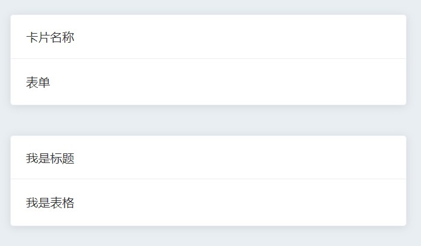
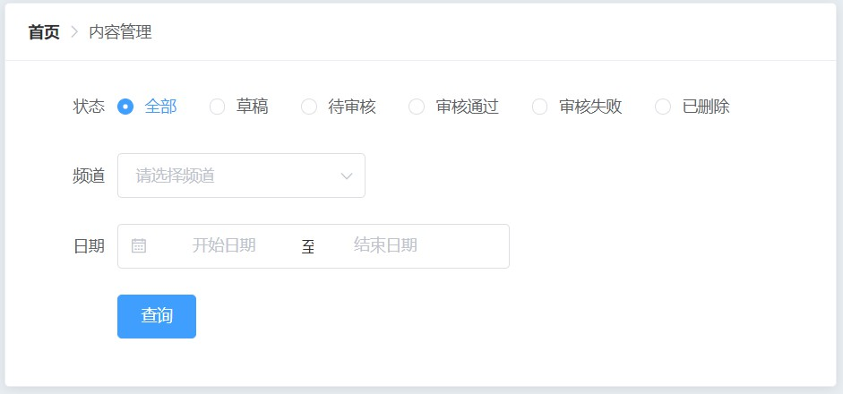

# 内容管理

## 布局-样式

### 卡片组件的基本使用

```diff
<template>
-  <div>articles</div>
+  <div class="articles">
+    <el-card>
+      <div slot="header">
+        <span>卡片名称</span>
+      </div>
+      <div>表单</div>
+    </el-card>
+    <el-card style="margin-top: 40px">
+      <div slot="header">
+        <span>我是标题</span>
+      </div>
+      <div>我是表格</div>
+    </el-card>
+  </div>
</template>
```



### [面包屑导航的基本使用](https://element.eleme.cn/#/zh-CN/component/breadcrumb)

```diff
<el-card>
-  <div slot="header">
-    <span>卡片名称</span>
-  </div>
+  <div slot="header">
+    <el-breadcrumb separator-class="el-icon-arrow-right">
+      <el-breadcrumb-item to="/">首页</el-breadcrumb-item>
+      <el-breadcrumb-item>内容管理</el-breadcrumb-item>
+    </el-breadcrumb>
+  </div>
  <div>表单</div>
</el-card>
```

### 页面布局-表单结构

- 结构

  ```diff
  <el-card>
    <div slot="header">
      <el-breadcrumb separator-class="el-icon-arrow-right">
        <el-breadcrumb-item to="/">首页</el-breadcrumb-item>
        <el-breadcrumb-item>内容管理</el-breadcrumb-item>
      </el-breadcrumb>
    </div>
  -  <div>表单</div>
  +  <el-form :model="form"
  +            label-width="80px">
  +    <el-form-item label="状态">
  +      <el-radio-group v-model="form.resource">
  +        <el-radio label="全部"></el-radio>
  +        <el-radio label="草稿"></el-radio>
  +        <el-radio label="待审核"></el-radio>
  +        <el-radio label="审核通过"></el-radio>
  +        <el-radio label="审核失败"></el-radio>
  +        <el-radio label="已删除"></el-radio>
  +      </el-radio-group>
  +    </el-form-item>
  +    <el-form-item label="频道">
  +      <el-select v-model="form.region"
  +                  placeholder="请选择频道">
  +        <el-option label="区域一"
  +                    value="shanghai"></el-option>
  +        <el-option label="区域二"
  +                    value="beijing"></el-option>
  +      </el-select>
  +    </el-form-item>
  +    <el-form-item label="日期">
  +      <el-date-picker v-model="form.date"
  +                      type="daterange"
  +                      range-separator="至"
  +                      start-placeholder="开始日期"
  +                      end-placeholder="结束日期">
  +      </el-date-picker>
  +    </el-form-item>
  +    <el-form-item>
  +      <el-button type="primary">查询</el-button>
  +    </el-form-item>
  +  </el-form>
  </el-card>
  ```

- 数据

  ```diff
  <script>
  export default {
    name: 'Articles',
  +  data () {
  +    return {
  +      form: {
  +        resource: '全部',
  +        region: '',
  +        date: ''
  +      }
  +    }
  +  }
  }
  </script>
  ```



## 发送请求获取文章列表

### 封装接口

- 创建 `src/api/article.js`, 添加一个方法 `getArticleList`

  ```js
  /* 封装和文章相关的请求 */
  import axios from '@/utils/request'
  
  // 获取文章列表
  export function getArticleList (params = {}) {
    return axios({
      method: 'get',
      url: '/mp/v1_0/articles',
      params
    })
  }
  ```

### 在组件中调用

- 导入

  ```jsx
  /* views/Layout/Articles/index.vue */
  <script>
  import { getArticleList } from '@/api/article'
  ...
  </script>
  ```

- 在**created**中调用

  ```jsx
  created () {
    getArticleList().then(res => {
      console.log(res)
      this.articles = res.data.results
      this.total = res.data.total_count
    }).catch(err => {
      console.log(err)
    })
  }
  ```

- 把返回的数据和总的条数保存到data中

  ```diff
  data () {
    return {
      form: {
        resource: '全部',
        region: '',
        date: '',
  +      articles: [],
  +      total: 0
      }
    }
  ```

## 表格数据-基本展示

```jsx
<el-card style="margin-top: 40px">
  <div slot="header">
    <span>我是标题</span>
  </div>
  <el-table :data="articles"
            style="width: 100%">
    <el-table-column label="封面"
                      prop="cover">
    </el-table-column>
    <el-table-column label="标题"
                      prop="title"></el-table-column>
    <el-table-column label="状态"
                      prop="status"></el-table-column>
    <el-table-column label="发布时间"
                      prop="pubdate"></el-table-column>
    <el-table-column label="操作"></el-table-column>
  </el-table>
</el-card>
```

## 表格的操作处理

```jsx
<el-table-column label="操作">
  <template v-slot="{ row }">
    <el-button type="primary" icon="el-icon-edit" size="small" circle @click="edit(row.id)"></el-button>
    <el-button type="danger" icon="el-icon-delete" circle size="small"></el-button>
  </template>
</el-table-column>
```

## 文章封面展示

> - 需要根据作用域插槽获取到图片的地址
>
> - 使用el-image组件
>   - 如果图片加载失败，显示加载失败
>   - 提供了fit可以防止图片失真
>   - 如果没有图片，显示加载失败，希望显示暂无图片，通过`error`的具名插槽

```jsx
<el-table-column
  label="封面">
  <template v-slot="scope">
    <el-image fit="cover" style="width: 180px; height: 100px" :src="scope.row.cover.images[0]">
      <template v-slot:error>
        
      </template>
    </el-image>
  </template>
</el-table-column>
```

## 文章状态显示

> 文章状态: 0-草稿，1-待审核，2-审核通过，3-审核失败，4-已删除

```jsx
<el-table-column label="状态">
  <template v-slot="scope">
    <el-tag v-if="scope.row.status === 0">草稿</el-tag>
    <el-tag v-else-if="scope.row.status === 1" type="info">待审核</el-tag>
    <el-tag v-else-if="scope.row.status === 2" type="success">审核通过</el-tag>
    <el-tag v-else-if="scope.row.status === 3" type="warning">审核失败</el-tag>
    <el-tag v-else type="danger">已删除</el-tag>
  </template>
</el-table-column>
```

## [数据分页](https://element.eleme.cn/#/zh-CN/component/pagination)

```jsx
<el-pagination
  background
  layout="total, sizes, prev, pager, next, jumper"
  :page-sizes="[10, 20, 30, 40, 50]"
  :total="total"
  :page-size="per_page"
  :current-page="page"
  @current-change="currentChange"
  @size-change="sizeChange"
>
</el-pagination>

methods: {
    //current-change, 当前页变化时触发
    currentChange (value) {
    this.page = value
    // 重新发送请求，获取数据
    this.getList()
  },
  getList () {
    getArticleList({
      page: this.page,
      per_page: this.per_page
    }).then(res => {
      this.articles = res.data.results
      this.total = res.data.total_count
    }).catch(err => {
      console.log(err)
    })
  }
},
```

## 数据筛选-筛选日期

### 调整日期组件

> value-format="yyyy-MM-dd" 可以指定拿到值的格式

```jsx
  <el-date-picker
    v-model="form.date"
    type="daterange"
    range-separator="至"
    start-placeholder="开始日期"
    end-placeholder="结束日期"
    value-format="yyyy-MM-dd"
  >
  </el-date-picker>
```

### 补充筛选条件

```jsx
getList () {
  // axios会默认忽略 值为 null或者undefined的参数
  // this.form.date = this.form.date || []
  const [begin, end] = this.form.date || []
  getArticleList({
    page: this.page,
    per_page: this.per_page,
    begin_pubdate: begin,
    end_pubdate: end
  }).then(res => {
    this.articles = res.data.results
    this.total = res.data.total_count
  }).catch(err => {
    console.log(err)
  })
},
```

### 点击按钮, 获取筛选条件,  并请求

```jsx
query () {
  this.page = 1
  this.getList()
}
```

## 数据筛选-筛选状态

### data中初始化数据

```jsx
form: {
	...
	status: null, // 文章的默认状态, 不传这个参数, 就是全部数据
}
```

### 绑定到视图

```jsx
<el-radio-group v-model="form.status">
  <el-radio :label="null">全部</el-radio>
  <el-radio :label="0">草稿</el-radio>
  <el-radio :label="1">待审核</el-radio>
  <el-radio :label="2">审核通过</el-radio>
  <el-radio :label="3">审核失败</el-radio>
  <el-radio :label="4">已删除</el-radio>
</el-radio-group>
```

### 补充参数到查询方法

```jsx
getList () {
  // axios会默认忽略 值为 null或者undefined的参数
  // this.form.date = this.form.date || []
  const [begin, end] = this.form.date || []
  getArticleList({
    page: this.page,
    per_page: this.per_page,
    begin_pubdate: begin,
    end_pubdate: end,
    status: this.form.status
  }).then(res => {
    this.articles = res.data.results
    this.total = res.data.total_count
  }).catch(err => {
    console.log(err)
  })
},
```

## 数据筛选-筛选频道

### 取回频道数据

```js
/*  api/article.js  */
// 获取频道列表
export function getChannelList () {
  return axios({
    method: 'get',
    url: '/mp/v1_0/channels'
  })
}
```

### 导入

```jsx
import { getArticleList, getChannelList } from '@/api/article'
```

### 准备数据

```jsx
channels: [], // 频道列表
```

### 在created中调用

```jsx
created () {
  this.getList()
  this.getChannels()
},
methods: {
  getChannels () {
    getChannelList().then(res => {
      console.log(res)
      this.channels = res.data.channels
    })
  }
}
```

### 绑定数据渲染

- 准备数据项

  ```jsx
  form: {
    channel_id: null,
    ...
  },
  ```

- 结构渲染

  ```jsx
  <el-form-item label="频道">
    <el-select v-model="form.channel_id" placeholder="请选择频道" clearable>
      <el-option v-for="item in channels" :key="item.id" :label="item.name" :value="item.id"></el-option>
    </el-select>
  </el-form-item>
  ```

- 补充参数

  ```jsx
  getList () {
    // axios会默认忽略 值为 null或者undefined的参数
    // this.form.date = this.form.date || []
    const [begin, end] = this.form.date || []
    getArticleList({
      page: this.page,
      per_page: this.per_page,
      begin_pubdate: begin,
      end_pubdate: end,
      status: this.form.status,
      channel_id: this.form.channel_id || null
    }).then(res => {
      this.articles = res.data.results
      this.total = res.data.total_count
    }).catch(err => {
      console.log(err)
    })
  },
  ```

## loading中的效果

### 准备 data 中的数据

```jsx
data () {
	return {
		loading: false
	}
}
```

### 给表格配置 v-loading

```jsx
<el-card v-loading="isLoading" element-loading-text="拼命加载中..." style="margin-top: 40px;">
```

### 发送请求前, 开启loading,  请求回来后, 关闭 loading

```jsx
getList () {
// axios会默认忽略 值为 null或者undefined的参数
// this.form.date = this.form.date || []
this.isLoading = true
const [begin, end] = this.form.date || []
getArticleList({
  page: this.page,
  per_page: this.per_page,
  begin_pubdate: begin,
  end_pubdate: end,
  status: this.form.status,
  channel_id: this.form.channel_id || null
}).then(res => {
  this.articles = res.data.results
  this.total = res.data.total_count
  this.isLoading = false
}).catch(err => {
  console.log(err)
  this.isLoading = false
})
```

### 按钮的loading效果

```jsx
<el-button type="primary" @click="query" :loading="isLoading">查询</el-button>
```

## [深度作用选择器](https://vue-loader.vuejs.org/zh/guide/scoped-css.html)

```scss
<style lang="less" scoped>
/*
  1. scoped会给所有的选择器添加一个属性选择器  p => p[data-v-xxxxx]
  2. scoped会给当前组件中所有的元素也添加一个属性  <p></p> ==> <p data-v-xxxxx></p>
  scpoed能够保证样式只能影响当前组件,,影响不到子组件
  组件一旦加了scoped属性，无法影响到子组件的样式，除了根元素。

  >>> 才能识别
*/
p {
  color: red;
}
.el-pagination {
  background-color: pink;
  ::v-deep {
    .number {
      background-color: green !important;
    }
    .active {
      background-color: red  !important;
    }
  }
}

</style>

```

## 删除文章

### 删除文章-注册事件

> 在列表中点击删除，弹出删除确认框
>
> 确认删除

```jsx
<template v-slot:default="obj">
  <!-- 默认插槽 -->
  <el-button size="mini" type="primary" icon="el-icon-edit" circle></el-button>
  <el-button @click="del(obj.row.id)"  size="mini" type="danger" icon="el-icon-delete" circle></el-button>
</template>
```

```js
del (id) {
  console.log(id)
}
```

### 删除文章-大数问题

JavaScript 能够准确表示的整数范围在`-2^53`到`2^53`之间（不含两个端点），

超过这个范围，无法精确表示这个值，这使得 JavaScript 不适合进行科学和金融方面的精确计算。

```jsx
Math.pow(2, 53) // 9007199254740992

9007199254740992  // 9007199254740992
9007199254740993  // 9007199254740992

Math.pow(2, 53) === Math.pow(2, 53) + 1
// true
```

上面代码中，超出 2 的 53 次方之后，一个数就不精确了。

axios 为了方便我们使用数据，它会在内部使用 `JSON.parse()` 把后端返回的数据转为 JavaScript 对象。

转换过程中, 如果有大数, 就会转换有问题, 丢失精度, 所以需要优化

### 删除文章-json-bigint 

[json-bigint](https://github.com/sidorares/json-bigint) 是一个第三方包，它可以帮我们很好的处理这个问题。

使用它的第一步就是把它安装到你的项目中。

```
yarn add json-bigint
```

- 简单示例

```js
import JSONbig from 'json-bigint'

const str = '{ "id": 1253585734669959168 }'
console.log(JSON.parse(str)) // 1253585734669959200  有问题

// 它会把超出 JS 安全整数范围的数字转为一种类型为 BigNumber 的对象
// BigNumber.toString() 就能得到原来正确的数据了
console.log(JSONbig.parse(str))

// 对于JSONbig 它在处理数据时，会自动识别其中的 大数， 并以数组的格式保存起来
console.log(JSONbig.parse(str).id.toString()) // 1253585734669959168
```

- stringify

```jsx
const str = '{ "id": 1253585734669959168 }'
const data = JSONbig.parse(str)
console.log(JSON.stringify(data))
console.log(JSONbig.stringify(data))
```

https://blog.csdn.net/weixin_44771007/article/details/106637714

axios默认采用的 JSON.parse 会有大数问题, 需要配置  **transformResponse**  

```jsx
const http = axios.create({
  baseURL: 'http://ttapi.research.itcast.cn', // 基础地址
  transformResponse: [function (data) {
    // 这里的data是字符串，在这个字符串的是没有丢失精度的，所以需要在这里先把精度调好
    console.log(data)
    
    // 后端返回数据可能不是 JSON 字符串，而JSONbig.parse()只能处理JSON字符串, try catch一下
    try {
      // 作用1：把json字符串转为js对象
      // 作用2：把里面的大数字做安全处理
      return JSONbig.parse(data)
    } catch (err) {
      return data
    }
  }]
})
```

### 删除文章-点击删除功能

- 封装一个删除接口

  ```jsx
  export function delArticle (id) {
    return axios({
      method: 'delete',
      url: `/mp/v1_0/articles/${id}`
    })
  }
  ```

- 调用接口并且删除

  ```jsx
  del (id) {
    // console.log(id.toString())
    this.$confirm('你确定要删除该文章吗', '温馨提示', { type: 'warning' }).then(() => {
      // 发送请求
      delArticle(id.toString()).then(res => {
        console.log(res)
        this.$message.success('删除成功')
        // 重新渲染
        this.getList()
      }).catch((err) => {
        console.log(err)
        this.$message.error('删除失败')
      })
    }).catch(() => {
      this.$message.info('操作取消')
    })
  }
  ```

  