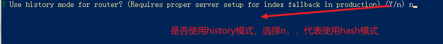
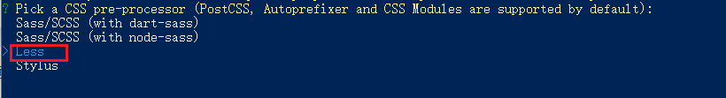

# day74

# 自媒体案例

## 介绍

> 目标: 实现一个典型的后台管理系统
>
> 用的技术: vue, vue-router, axios, token, localStorage, ElementUI, echarts, 富文本编辑器

新闻资讯类的 APP 的自媒体后台管理系统，主要功能有：

- 登录功能
- 欢迎页面
- 内容管理
- 素材管理
- 发布文章
- 评论管理
- 粉丝管理
- 个人设置

## 初始化

> 创建项目（vue-cli）
>
> 调整项目目录
>
> git 代码托管 （github, gitee）
>
> 引入第三方库 ElementUI

### 使用 vue-cli 创建项目

```bash
npm i @vue/cli -g
```

创建项目

```bash
vue create media
```

- 选项

  ```bash
  ? Please pick a preset:
    Default ([Vue 2] babel, eslint)
    Default (Vue 3 Preview) ([Vue 3] babel, eslint)
  > Manually select features
  ```

  

  

- 选择 Vue 版本

  

- 是否使用 history 模式

  

- 选择 css 预处理

- 选择 eslint（代码校验）的风格


- 选择校验时机

  

- 选择配置文件的升成方式

  

- 可保存配置，下次生成项目时可选则自定义保存的配置（本次选择为 N【no】）

  

- 等待安装，项目初始化完成

  

- 项目启动

  ```bash
  cd media
  yarn serve # or # npm run serve
  # 退出启动(退出正在运行的命令行)
  # ctrl+c -> 终止批处理操作吗(Y/N)?Y -> enter(回车键)
  # or #
  # ctrl+c -> ctrl+c
  ```

  

### gitee托管代码

