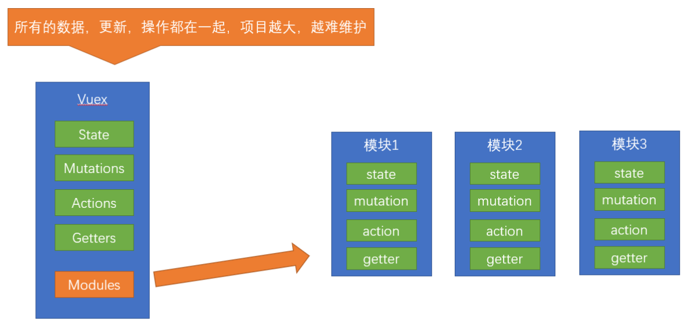
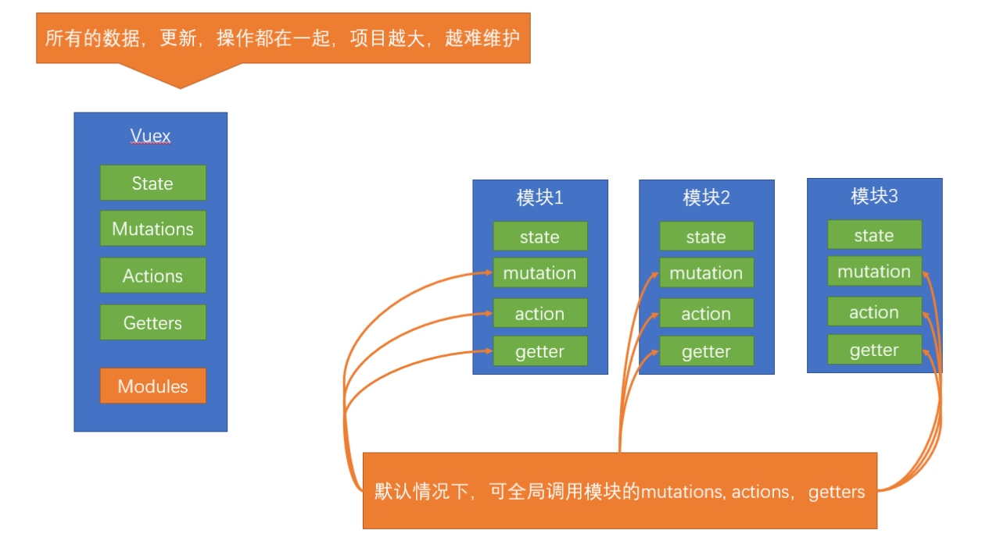
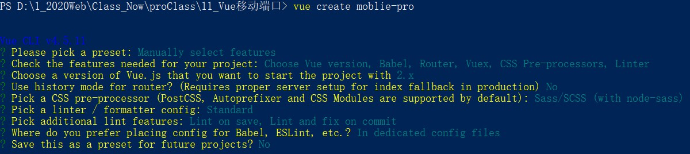
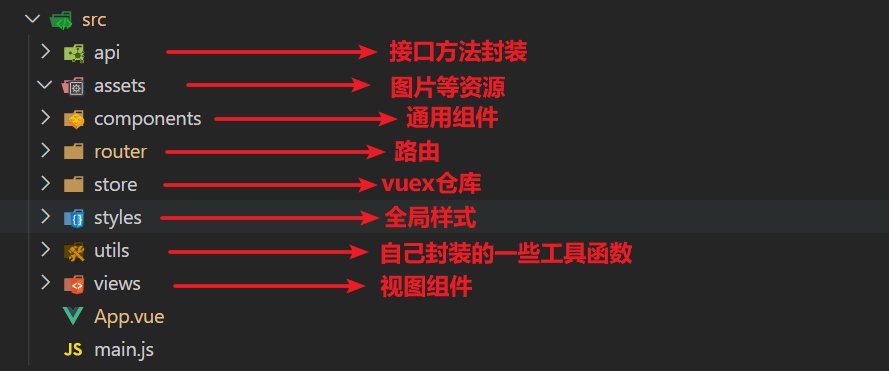
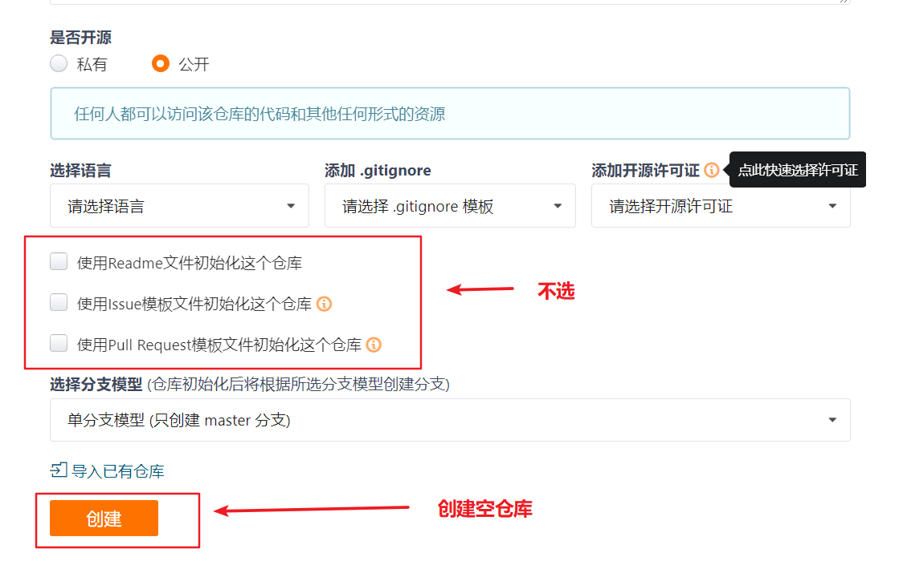
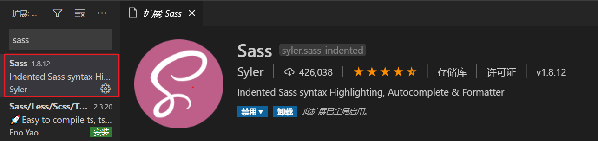
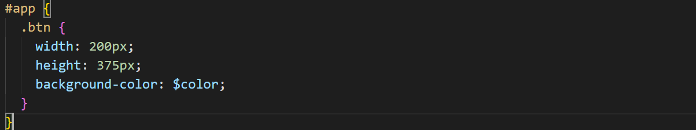
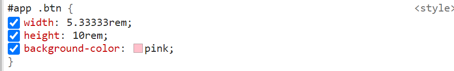

# day77

## vuex核心概念

### getters

> 基于**state**获取派生状态，**相当于计算属性**

```js
export default new Vuex.Store({
    state:{
        list:[1,2,3,4,5,6]
    },
    getters:{
        // 形式为函数，必须含有return
        listLength(state){
            return state.list.length
        }
    }
})
```

#### 使用

```vue
<template>
  <div id="app">
    <!-- 差值表达式 -->
	{{$state.getters.listLength}}
  </div>
</template>
```

```vue
<template>
  <div id="app">
	{{ listLength }}
  </div>
</template>
<script>
// 辅助函数
import { mapGetters } form 'vuex'
export default{
	computed:{
 	   ...mapGetters(['listLength'])
	}
}
</script>
```

### module

> 由于使用单一状态树，应用的所有状态会集中到一个比较大的对象。
>
> 当应用变得非常复杂时，store 对象就有可能变得相当臃肿。
>
> 由此，有了Vuex的模块化。



#### 模块抽离（例）

- **src/store/modules/userInfo.js(抽离)**

  ```js
  const state = {
    name: 'lily',
    age: 18,
    sex: 'female'
  }
  
  const mutations = {}
  
  const actions = {}
  
  const getters = {}
  
  // 导出
  export default {
    state,
    mutations,
    actions,
    getters
  }
  ```

- **src/store/index.js（挂载）**

  ```js
  import userInfo from './modules/userInfo'
  export default new Vuex.Store({
    ...
    modules: {
      userInfo
    }
  })
  ```

#### 命名空间namespace

> 默认情况下，模块内部的 action、mutation 和 getter 是注册在**全局命名空间**的



- **src/store/modules/userInfo.js**

  ```js
  export default {
    namespaced: true,// 开启命名空间
    state,
    mutations,
    actions,
    getters
  }
  ```

- **提交模块中的mutation**

  ```js
  全局的:   this.$store.commit('mutation函数名', 参数)
  
  模块中的: this.$store.commit('模块名/mutation函数名', 参数)
  ```

- **提交模块中的action**

  ```js
  全局的:   this.$store.dispatch('action函数名', 参数)
  
  模块中的: this.$store.dispatch('模块名/action函数名', 参数)
  ```

- **映射**

  ```js
  computed: {
    // 全局的
    ...mapState(['数据字段']),
    // 模块中的
    ...mapState('模块名', ['数据字段']),
  },
  methods: {
    // 全局的
    ...mapMutations(['方法名'])
    // 模块中的
    ...mapMutations('模块名', ['方法名'])
  }
  ```

## 移动端项目

### 目标

- 了解项目背景, 介绍项目, 介绍项目中的技术栈
- 创建项目
- 调整目录结构
- 代码托管 git
- 引入Vant   
- REM适配
- 封装axios

### 技术栈

- vuejs  核心vue包

- vuex  状态管理插件

- vue-router  路由插件

- axios  请求插件

- **sass - css 预处理器**

- **json-bigint 最大安全数值处理**

- **socket.io-client  即时通讯库  (websocket)**    

- **vant 移动组件库   (cube,   mint,  ....)**

- **amfe-flexible  rem适配**

- **vue-lazyload 图片懒加载**

### 项目创建

#### 前置

> 设置  sass 安装全局镜像源， sass 不像 less 那么好下载，默认sass的源地址在国外，可能会下不下来。
>
> **所以需要配置 sass 全局镜像源, 代码如下:**

**npm：**

```txt
npm config set sass_binary_site http://cdn.npm.taobao.org/dist/node-sass -g
```

**yarn：**

```
yarn config set sass_binary_site http://cdn.npm.taobao.org/dist/node-sass -g
```

[**参考博客**](https://www.jianshu.com/p/b37aa202da5c)



#### 目录结构



#### gitee做项目管理



### 引入 vant 组件库

#### [官方文档]( https://vant-contrib.gitee.io/vant/#/zh-CN/home)

+ 安装

  ```bash
  yarn add vant
  ```

+ 在`main.js`中

  ```js
  import Vant from 'vant'
  import 'vant/lib/index.css'
  
  Vue.use(Vant)
  ```

#### 按需导入 (推荐)  

> 减轻将来打包后的包的体积

+ 安装插件

  ```bash
  yarn add babel-plugin-import -D
  ```

+ 在` babel.config.js `中配置

  ```js
  module.exports = {
    presets: [
      '@vue/cli-plugin-babel/preset'
    ],
    plugins: [
      ['import', {
        libraryName: 'vant',
        libraryDirectory: 'es',
        style: true
      }, 'vant']
    ]
  }
  ```

+ 使用插件`main.js`中(例)

  ```js
  import { Button } from 'vant'
  Vue.use(Button)
  ```

### sass语法

> sass 有两种语法 => .sass(旧) 和 .scss(新)

**1 `.sass `语法 要求必须省略花括号和分号** (了解)  这种语法和 stylus 类似

```jsx
<style lang="sass">
#app
  .btn
    background-color: pink
</style>
```

**默认不高亮, 可以安装vscode插件**



**2 `.scss` 和 less 语法就非常相近**

```jsx
<style lang="scss">
$color: pink;
#app {
  .btn {
    background-color: $color;
  }
}
</style>
```

### REM 适配

> Vant 中的样式默认使用`px`作为单位，如果需要使用`rem`单位，官方推荐使用以下两个工具，来达到目标。

- [**postcss-pxtorem**](https://github.com/cuth/postcss-pxtorem) 是一款 postcss 插件，用于将单位转化为 rem   (写 px, 转 rem)
- [**lib-flexible**](https://github.com/amfe/lib-flexible) 用于设置 rem 基准值 (动态的设置 html font-size基准值)  

- 官方推荐方案:  [**rem 布局**](https://youzan.github.io/vant/#/zh-CN/advanced-usage#liu-lan-qi-gua-pei)

- 安装包

  ```bash
  # 把px单位自动转成rem单位
  yarn add postcss-pxtorem -D
  
  # 根据设置屏幕的宽度去调整rem的值（html标签上font-size的大小）
  # 默认计算方式是屏幕宽度的1/10，默认值是37.5
  yarn add amfe-flexible
  ```

-  新建配置文件 `postcss.config.js`

  ```js
  module.exports = {
    plugins: {
      'postcss-pxtorem': {
        rootValue: 37.5,
        propList: ['*']
      }
    }
  }
  ```

  - 编写的 px 会自动转成 rem

    

  - 实际运行效果

    

- 引入 (`main.js`)

  ```js
  // 根据的手机尺寸来调整rem的基准值：html标签上的font-size。
  import 'amfe-flexible'
  ```

### 封装 axios 请求函数

> axios 将来会有大量的配置, 如果堆在 main.js 中, 会不好维护, 且为了调用ajax方便，我们需要先对 axios进行二次封装
>
> 把 axios 封装成一个独立的模块，在需要的时候直接加载使用

- 安装包

  ```bash
  yarn add axios
  ```

- 创建 (`src/utils/http.js`)axios 实例, 进行基本配置初始化,  使用[自定义](http://www.axios-js.com/zh-cn/docs/#%E5%88%9B%E5%BB%BA%E5%AE%9E%E4%BE%8B)的方式

  ```js
  import axios from 'axios'
  
  const http = axios.create({
    baseURL: 'http://toutiao-app.itheima.net'
  })
  
  export default http
  ```

- 挂载到 vue 原型(`main.js`), 将来所有的组件中, 都可以 `this.$http `使用这个方法

  ```js
  Vue.prototype.$http = http
  ```

- 在组件中使用

  ```js
  this.$http.get('/').then(res => {
    console.log(res)
  })
  ```

  

