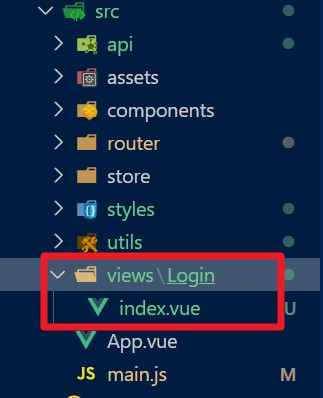
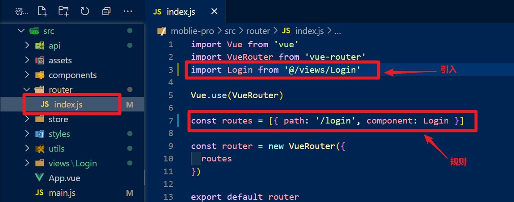
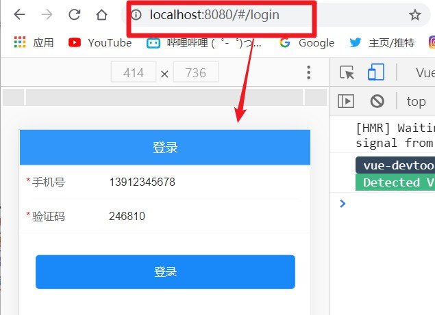
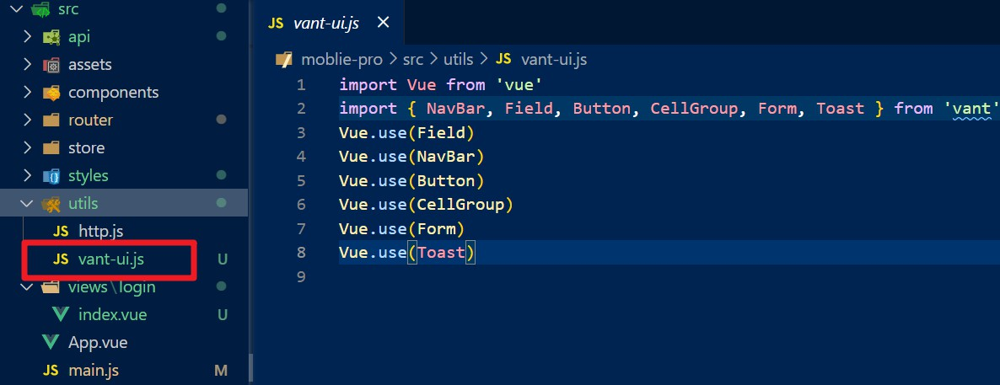
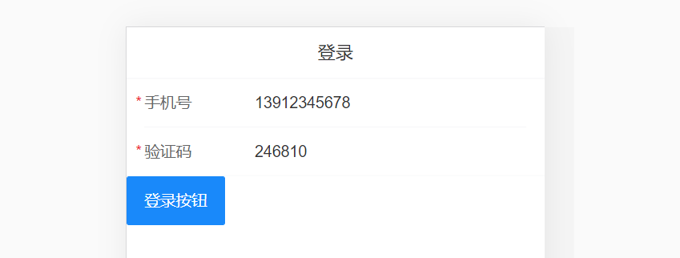
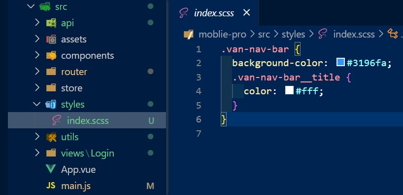
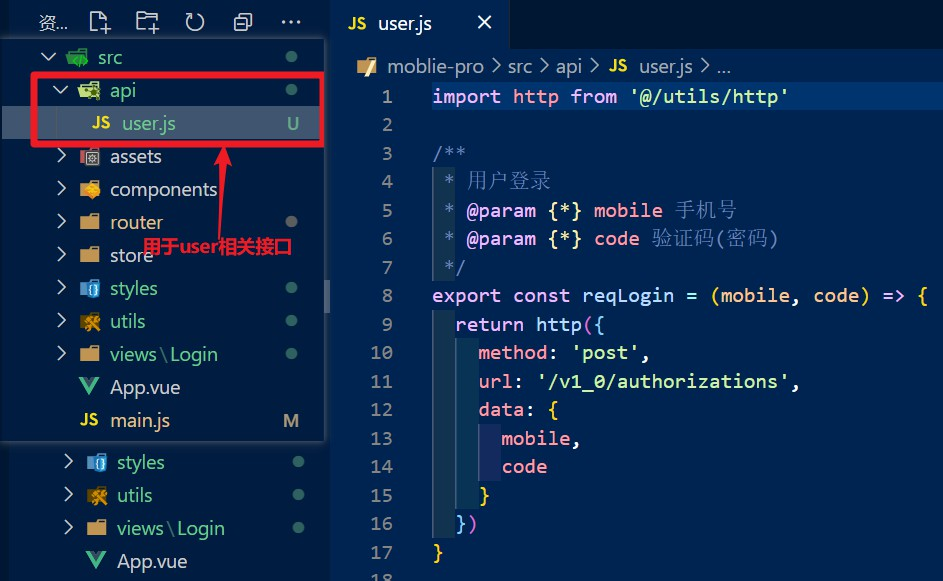
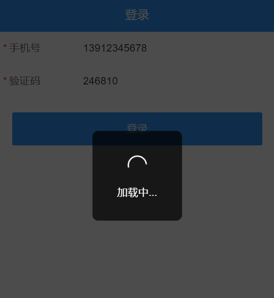

# day78

## 登录页面

### 页面路由

- 添加页面级组件

  > 通过**Login/index.vue**清晰目录结构

  

- 配置路由规则

  

  ```diff
  + import Login from '@/views/Login'
  + { path: '/login', component: Login }
  ```

- 预期效果

  

### 页面布局

#### **vant**组件

- [NavBar 导航栏](https://youzan.github.io/vant/#/zh-CN/nav-bar)
- [Field 输入框](https://youzan.github.io/vant/#/zh-CN/field)
- [Button 按钮](https://youzan.github.io/vant/#/zh-CN/button )

#### 按需导入组件，抽离导入代码为`js`文件



#### 导航栏

- 导入导航栏

  ```diff
  + import { NavBar } from 'vant'
  + Vue.use(NavBar)
  ```

- 使用导航栏(`src/views/Login/index.vue`)

  ```vue
  <template>
    <div>
      <!-- 导航条 -->
      <van-nav-bar title="登录" />
      ...
    </div>
  </template>
  ```

#### 输入框

- 导入输入框和cell-group容器

  ```diff
  + import { ... Field, CellGroup } from 'vant'
  + Vue.use(Field)
  + Vue.use(CellGroup)
  ```

- 使用输入框

  ```vue
  <template>
    <div>
      ...
      <van-cell-group>
        <van-field
          v-model="mobile"
          required
          label="手机号"
          placeholder="请输入手机号"
          :error-message="mobile_errmsg"
          @input="validate"
        />
        <van-field
          v-model="code"
          required
          label="验证码"
          placeholder="验证码(246810)"
          :error-message="code_errmsg"
          @input="validate"
        />
      </van-cell-group>
      ...
    </div>
  </template>
  <script>
  ...
  export default {
    name: 'Login',
    data() {
      return {
        mobile: '13912345678',
        code: '246810',
        ...
      }
    },
    ...
  </script>
  ```

#### 按钮

- 导入按钮

  ```diff
  + import { ... Button } from 'vant'
  + Vue.use(Button)
  ```

- 使用按钮

  ```vue
  <template>
    <div>
  	...
      <!-- 登录按钮 -->
      <div class="btn-wrap">
        <van-button type="info" @click="login">登录</van-button>
      </div>
    </div>
  </template>
  ```

#### 组件效果



#### 样式（scss）

- 公共样式

  

  ```scss
  .van-nav-bar {
    background-color: #3196fa;
    .van-nav-bar__title{
      color: #fff;
    }
  }
  ```

- 加载样式(`src/main.js`)

  ```js
  import '@/styles/index.scss'
  ```

- login组件样式

  ```vue
  <style lang="scss" scoped>
  .btn-wrap {
    padding: 20px;
    .van-button {
      width: 100%;
      color: #fff;
      border-radius: 5px;
    }
  }
  </style>
  ```

- 预期效果

  

### 页面功能

#### 登录api接口

- 新建接口文件，方便管理

  

  ```js
  import http from '@/utils/http' // 引入带基地址的axios方法
  
  /**
   * 用户登录
   * @param {*} mobile 手机号
   * @param {*} code 验证码(密码)
   */
  // 方法封装，传入手机号和验证码作为参数，返回Promise对象
  export const reqLogin = (mobile, code) => {
    return http({
      method: 'post',
      url: '/v1_0/authorizations',
      data: {
        mobile,
        code
      }
    })
  }
  ```

- 调用方法（`src/views/Login/index.vue`）

  ```vue
  <script>
  // 引入方法
  import { reqLogin } from '@/api/user.js'
  export default {
    name: 'Login',
    data() {
      return {
        ...
      }
    },
    methods: {
      ...
      // async-await 异步问题的同步解决方法
      async login() {
        ...
        try {
          await reqLogin(this.mobile, this.code)
          ...
        } catch (error) {
          ...
        }
      }
    }
  }
  </script>
  ```

#### 表单验证

> 有两种策略：
>
> - 直接去用ui组件中[form验证](https://youzan.github.io/vant/#/zh-CN/form#xiao-yan-gui-ze)
> - 收集到数据之后，自行验证 (原理: 利用 field 组件自带的属性 )

- 准备数据

  ```vue
  <script>
  ...
  export default {
    name: 'Login',
    data() {
      return {
        mobile: '13912345678',
        code: '246810',
        mobile_errmsg: '',
        code_errmsg: ''
      }
    },
    methods: {
      ...
  }
  </script>
  ```

- 封装验证方法

  ```vue
  <script>
  import { reqLogin } from '@/api/user.js'
  export default {
    name: 'Login',
    data() {
      return {
        mobile: '13912345678',
        code: '246810',
        mobile_errmsg: '',
        code_errmsg: ''
      }
    },
    methods: {
      validate() {
        if (this.mobile.trim().length === 0) {
          this.mobile_errmsg = '手机号不能为空'
          return false
        }
        if (!/^1[3-9]\d{9}$/.test(this.mobile)) {
          this.mobile_errmsg = '请输入合法的手机号'
          return false
        }
        this.mobile_errmsg = ''
  
        if (this.code.trim().length === 0) {
          this.code_errmsg = '请输入验证码'
          return false
        }
        if (!/^\d{6}$/.test(this.code)) {
          this.code_errmsg = '请输入正确的验证码'
          return false
        }
        this.code_errmsg = ''
  
        return true
      },
      ...
  }
  </script>
  ```

- 给表单添加**事件方法**，同步**错误信息**

  ```vue
  <template>
    <div>
      ...
      <!-- 输入框 -->
      <van-cell-group>
        <van-field
          ...
          :error-message="mobile_errmsg"
          @input="validate"
        />
        <van-field
          ...
          :error-message="code_errmsg"
          @input="validate"
        />
      </van-cell-group>
      ...
    </div>
  </template>
  ```

#### [toast组件](https://vant-contrib.gitee.io/vant/#/zh-CN/toast)

> 可实现loading效果



- 导入**toast**(`src/utils/vant-ui.js`)

  ```diff
  + import { ... Toast } from 'vant'
  + Vue.use(Toast)
  ```

- 使用**toast**

  ```vue
  <script>
  ...
  export default {
    name: 'Login',
    data() {
      ...
    },
    methods: {
      ...
      async login() {
        // 发送请求时也做一次表单认证
        if (!this.validate()) return
        // toast引入后自动挂载到Vue的prototype上，可以直接$toast使用
        this.$toast.loading({
          duration: 0, // 持续展示 toast,永远不会关闭
          overlay: true, // 整体添加一个遮罩
          message: '登录中...',
          forbidClick: true // 禁止点击
        })
        // 一个页面上只有一个toast, 它会把上面的Loading状态覆盖掉
        try {
          await reqLogin(this.mobile, this.code)
          // 发送成功后展示成功信息
          this.$toast.success('登录成功')
        } catch (error) {
          // 一旦有错误则显示登陆失败
          this.$toast.fail('登录失败')
        }
      }
    }
  }
  </script>
  ```

  

