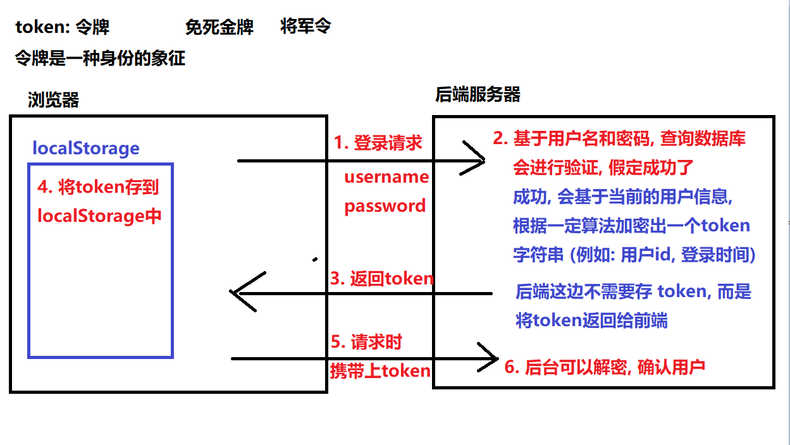
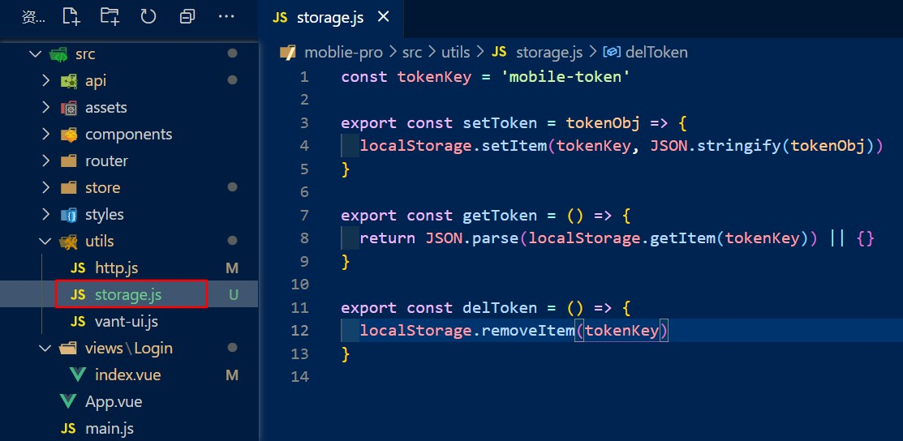
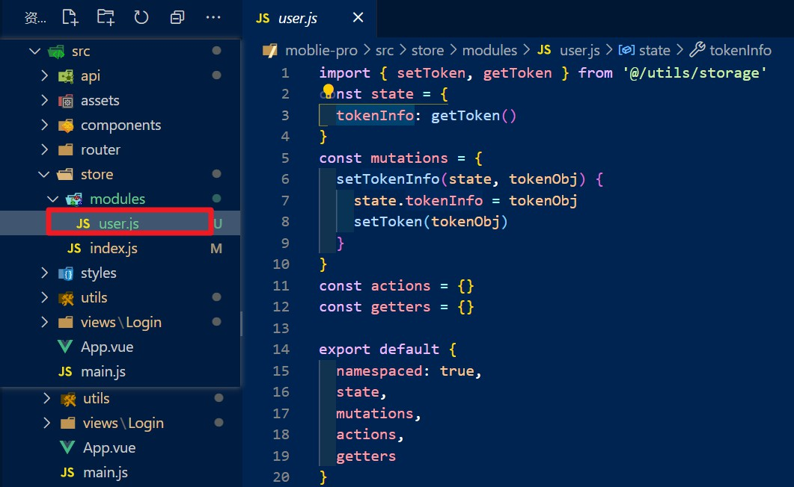
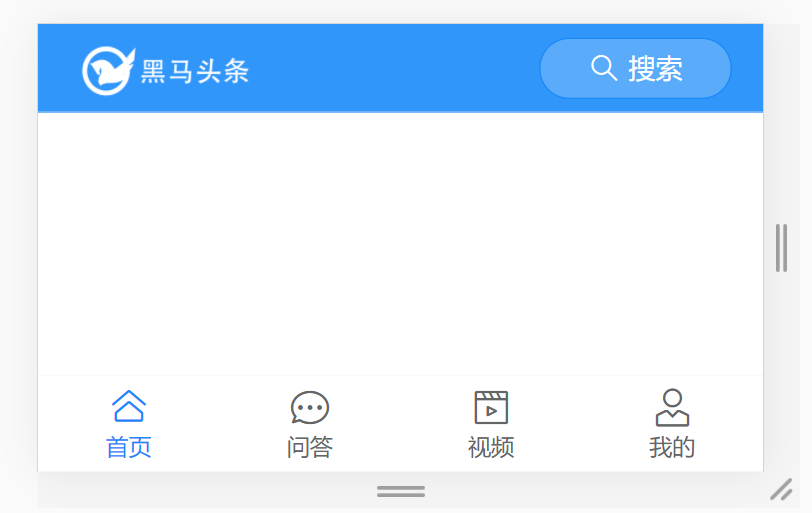
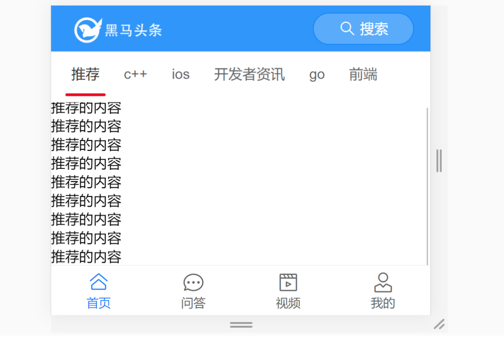

# day79

## Token处理

### 什么是token

> 一个“令牌”（一串很长的字符串，由后端生成的），用来请求需要权限的接口用的。
>
> - 用户登录后, 服务器会通过一定算法, 把用户信息加密成一个字符串, 并返回给前端
> - 前端需要将 token 字符串存到本地, 下次请求时需要携带
>
> 实际中: token 既 存到 vuex (响应式), 又存到localStorage(持久化 - 持久存储), 且两个存储需要同步



### 保存token

#### 封装方法将token存储到本地

- 新建工具文件`utils/storage.js`

  

- 导出三个方法`setToken,getToken,delToken`

  ```js
  const tokenKey = 'mobile-token'
  
  export const setToken = tokenObj => {
    localStorage.setItem(tokenKey, JSON.stringify(tokenObj))
  }
  
  export const getToken = () => {
    return JSON.parse(localStorage.getItem(tokenKey)) || {}
  }
  
  export const delToken = () => {
    localStorage.removeItem(tokenKey)
  }
  ```

#### token保存在 vuex 中

> 为了在任意组件之中都可以方便地使用token值，控制视图的展示,   一般也会把token保存在vuex中。
>
> (vuex 默认是无法持久化的,  刷新会丢失state状态,  需要往本地也会存一份)



- token一般存储到 user 用户模块, 所以新建 `modules/user.js` vuex的用户模块

  ```js
  import { setToken, getToken } from '@/utils/storage'
  // vuex 用户模块
  const state = {}
  const mutations = {}
  const getters = {}
  const actions = {}
  
  export default {
    namespaced: true,
    state,
    mutations,
    getters,
    actions
  }
  ```

- 在 `store/modules/user.js` 中, 提供state 和 mutation

  ```js
  const state = {
    tokenInfo: getToken()
  }
  const mutations = {
    setTokenInfo(state, tokenObj) {
      state.tokenInfo = tokenObj
      setToken(tokenObj)
    }
  }
  ```

- 挂载到全局的 modules 中 `store/index.js`

  ```js
  import Vue from 'vue'
  import Vuex from 'vuex'
  import user from './modules/user'
  
  Vue.use(Vuex)
  
  export default new Vuex.Store({
    state: {},
    mutations: {},
    actions: {},
    modules: {
      user
    }
  })
  ```

- 在发送请求后, 调用 mutation 保存数据`src/views/Login/index.vue`

  ```vue
  <script>
  import { reqLogin } from '@/api/user.js'
  import { mapMutations } from 'vuex'
  export default {
    ...
    methods: {
      ...mapMutations('user', ['setTokenInfo']),
      async login() {
        ...
        try {
          ...
          this.setTokenInfo(data)
          ...
        } catch (error) {
          ...
        }
      },
      ...
    }
  }
  </script>
  ```

### axios 请求拦截器 - 添加 token

> 通过 axios 请求拦截器, 统一配置,  统一携带 token

- `utils/http.js`中配置拦截器

  ```js
  ...
  import store from '@/store/index'
  ...
  http.interceptors.request.use(
    config => {
      const token = store.state.user.tokenInfo.token
      if (token) {
        config.headers.Authorization = `Bearer ${token}`
      }
      return config
    },
    error => {
      return Promise.reject(error)
    }
  )
  ...
  ```

## 首页整体路由和布局

> 登录成功后跳转到首页
>
> `src/views/Login/index.vue`
>
> ```js
> this.$router.push('/')
> ```

### 整体路由设计(约定路由规则)

| path          | 文件                     | 功能                     | 组件名       | 路由级别 |
| ------------- | ------------------------ | ------------------------ | ------------ | -------- |
| /login        | views/login/index.vue    | 登录页                   | Login        | 一级路由 |
| /             | views/layout/index.vue   | 布局                     | Layout       | 一级路由 |
| ├─ /          | views/home/index.vue     | 主页（不登陆也能访问的） | Home         | 二级路由 |
| ├─ /question  | views/question/index.vue | 问答                     | Question     | 二级路由 |
| ├─ /video     | views/video/index.vue    | 视频                     | Video        | 二级路由 |
| ├─ /user      | views/user/index.vue     | 个人中心                 | User         | 二级路由 |
| /userProfile  | views/user/profile.vue   | 编辑资料                 | UserProfile  | 一级路由 |
| /userChat     | views/user/chat.vue      | 小智同学                 | UserChat     | 一级路由 |
| /search       | views/search/index.vue   | 搜索中心                 | Search       | 一级路由 |
| /searchResult | views/search/result.vue  | 搜索结果                 | SearchResult | 一级路由 |
| /article      | views/article/index.vue  | 文章详情                 | Article      | 一级路由 |

### 配置layout路由

- 新建`src/views/Layout/index.vue`组件

  ```vue
  <template>
    <div class="layout-container">
      <!-- 头部区域 -->
      <header>
      </header>
      <!-- 中心内容区域 -->
      <main>
        <router-view></router-view>
      </main>
      <!-- 底部区域 -->
      <footer>
      </footer>
    </div>
  </template>
  
  <script>
  export default {
    name: 'Layout'
  }
  </script>
  
  <style lang="scss" scoped>
  </style>
  ```

- 配置路由规则`src/router/index.js`

  ```js
  import Layout from '@/views/Layout'
  const routes = [
    {
      path: '/',
      component: Layout,
      children: []
    }
  ]
  ```

### 实现 layout 布局组件



- [**van-nav-bar**](https://youzan.github.io/vant/#/zh-CN/nav-bar)  & [**van-tabbar**](https://youzan.github.io/vant/#/zh-CN/tabbar)

- 导入`src/utils/vant-ui.js`

  ```js
  import { ... Tabbar, TabbarItem } from 'vant'
  Vue.use(Tabbar)
  Vue.use(TabbarItem)
  ```

- 使用`src/views/Layout/index.vue`

  ```vue
  <template>
    <div class="layout-container">
      <!-- 头部区域 -->
      <header>
        <van-nav-bar fixed>
          <!-- logo -->
          <template #left>
            <div class="logo"></div>
          </template>
          <!-- search -->
          <template #right>
            <van-button
              @click="$router.push('/search')"
              class="search-btn"
              round
              type="info"
              size="small"
              icon="search"
            >
              搜索
            </van-button>
          </template>
        </van-nav-bar>
      </header>
      <!-- 中心内容区域 -->
      <main>
        <router-view></router-view>
      </main>
      <!-- 底部区域 -->
      <footer>
        <!-- 通过 route 可以开启路由模式, tabbar-item 指定 to 属性, 确定跳转的路由地址 -->
        <van-tabbar route>
          <van-tabbar-item to="/" icon="home-o">首页</van-tabbar-item>
          <van-tabbar-item to="/question" icon="chat-o">问答</van-tabbar-item>
          <van-tabbar-item to="/video" icon="video-o">视频</van-tabbar-item>
          <van-tabbar-item to="/user" icon="user-o">我的</van-tabbar-item>
        </van-tabbar>
      </footer>
    </div>
  </template>
  ```

- 覆盖默认样式

  ```vue
  <style lang="scss" scoped>
  .layout-container {
    padding-top: 46px;
    padding-bottom: 50px;
    // logo区域
    .logo {
      background: url('~@/assets/logo.png') no-repeat;
      background-size: cover;
      width: 100px;
      height: 30px;
    }
    // 搜索按钮
    .search-btn {
      background-color: #5babfb;
      width: 100px;
      font-size: 14px;
      .van-icon {
        color: #fff;
      }
    }
  }
  </style>
  ```

- 新建搜索的跳转页面组件及配置路由规则

  - `src/views/Search/index.vue`

  - `src/router/index.js`

    ```js
    import Search from '@/views/Search'
    
    const routes = [
      { path: '/search', component: Search }
    ]
    ```

### 配置二级路由

#### Home页面

- 新建`src/views/Layout/Home/index.vue`

  ```vue
  <template>
    <div class="home-container">
        
    </div>
  </template>
  
  <script>
  export default {
    name: 'HomeIndex',
  }
  </script>
  
  <style lang="scss" scoped>
  </style>
  ```

- 配置路由规则`src/router/index.js`

  ```js
  import HomeIndex from '@/views/Layout/Home'
  const routes = [
    {
      path: '/',
      component: Layout,
      children: [
        { path: '/', component: HomeIndex }
      ]
    }
  ]
  ```

##### 首页频道列表



- 使用[**tabs组件**](https://youzan.github.io/vant/#/zh-CN/tab) 来放置频道列表

- 导入组件`src/utils/vant-ui.js`

  ```js
  import { ... Tab, Tabs } from 'vant'
  
  Vue.use(Tab)
  Vue.use(Tabs)
  ```

- 基本使用 `src/views/Layout/Home/index.vue`

  ```vue
  <template>
    <div class="home-container">
      <van-tabs v-model="active">
        <van-tab v-for="item in channels" :key="item.id" :title="item.name">
          <div class="scroll-wrapper">
            <div v-for="num in 20" :key="num">{{ item.name }}的内容</div>
          </div>
        </van-tab>
      </van-tabs>
    </div>
  </template>
  ```

- 样式调整

  ```vue
  <style lang="scss" scoped>
  // 加了scoped后, 样式只会作用于当前组件模板内的内容, 不会向下渗透影响到子组件的元素
  // 如果希望向下渗透, 深度作用选择器
  // css  >>>,  less  /deep/,  sass  ::v-deep
  .home-container {
    height: 100vh;
    padding-top: 44px;
    padding-bottom: 50px;
    box-sizing: border-box;
    ::v-deep {
      .van-tabs {
        height: 100%;
        // 定位线的颜色
        .van-tabs__line {
          background-color: #3296fa;
        }
        // 定位的导航
        .van-tabs__wrap {
          position: fixed;
          left: 0;
          top: 46px;
          width: 100%;
        }
        // 内容部分
        .van-tabs__content {
          height: 100%;
          // 每个面板的容器
          .van-tab__pane {
            height: 100%;
            overflow: auto;
          }
        }
      }
    }
  }
  </style>
  ```

##### 发送请求获取数据

- 封装频道相关API`src/api/channels.js`

  ```js
  import http from '@/utils/http'
  
  /**
   * 获取用户频道
   */
  export const reqGetChannels = () => {
    return http({
      method: 'get',
      url: '/v1_0/user/channels'
    })
  }
  ```

- 调用接口`src/views/Layout/Home/index.vue`

  ```vue
  <script>
  import { reqGetChannels } from '@/api/channels.js'
  export default {
    name: 'HomeIndex',
    data() {
      return {
        active: 0,
        channels: []
      }
    },
    methods: {
      async loadChannels() {
        const {
          data: {
            data: { channels }
          }
        } = await reqGetChannels()
        this.channels = channels
      }
    },
    created() {
      this.loadChannels()
    }
  }
  </script>
  ```

- home页面效果图

  

